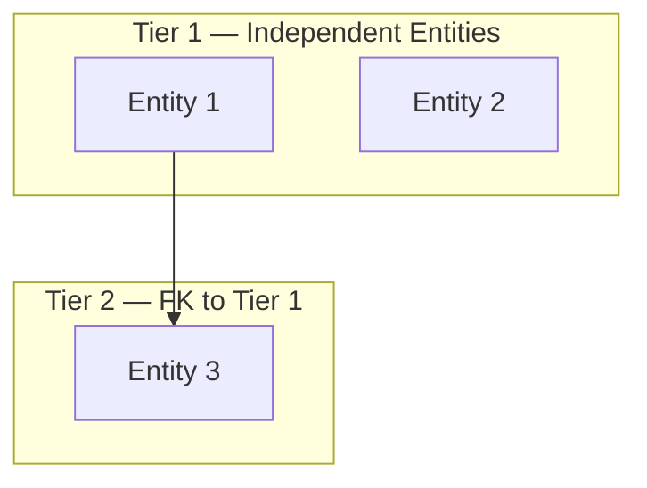
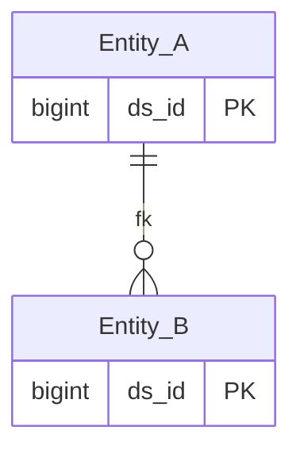

# {SOURCE} HLD — Overview

**Source system:** {SOURCE} ({mô tả ngắn 1 dòng})
**Mô tả:** {mô tả nghiệp vụ tổng quan — system làm gì, quản lý cái gì}

---

## Tổng quan Atomic Entities

| Tier | Atomic Entity | BCV Core Object | BCV Concept | table_type | Source Table(s) | Ghi chú |
|---|---|---|---|---|---|---|
| T1 | {Entity} | {Core Object} | {[Concept] Term} | {Fundamental/...} | {SOURCE}.{table} | {ghi chú nếu cần} |

**Tổng: {X} Atomic entities** ({a} Tier 1, {b} Tier 2, {c} Tier 3, {d} Tier 4)
*(Trong đó: {Y} shared entities extend source_table — không tạo mới)*

---

## Diagram Phân tầng Dependencies (Mermaid)

---

## Quyết định thiết kế chính

| # | Quyết định | Lý do |
|---|---|---|
| D-01 | {quyết định} | {lý do/ngữ cảnh} |

---

#### 7a. Bảng tổng quan Atomic entities

| Tier | BCV Core Object | BCV Concept | Category | Source Table | Mô tả bảng nguồn | Atomic Entity | BCV Term |
|---|---|---|---|---|---|---|---|
| T1 | {...} | {...} | {...} | {...} | {...} | {...} | {...} |

#### 7b. Diagram Atomic tổng (Mermaid)

#### 7c. Bảng Classification Value

| Source Table | Mô tả | BCV Term | Xử lý Atomic |
|---|---|---|---|
| {bảng danh mục} | {mô tả} | {BCV term} | Classification Value scheme `{SCHEME}` |

#### 7d. Junction Tables

| Source Table | Mô tả | Entity chính | Xử lý trên Atomic |
|---|---|---|---|
| {junction_table} | {mô tả} | {Atomic Entity cha} | Denormalize thành ARRAY trên entity cha (xem 3i SKILL_LLD) |

#### 7e. Điểm cần xác nhận

| # | Tier | Câu hỏi | Ảnh hưởng |
|---|---|---|---|
| 1 | T{N} | {câu hỏi còn open} | {ảnh hưởng/scope} |

#### 7f. Bảng ngoài scope

| Nhóm | Source Table | Mô tả bảng nguồn | Lý do ngoài scope |
|---|---|---|---|
| {Group từ danh sách chuẩn} | {table_name} | {mô tả 1 câu} | {Lý do quan hệ/cấu trúc} |

<!--
GRAIN: 1 dòng = 1 bảng nguồn. KHÔNG gộp `table1, table2`.
GROUP: dùng từ danh sách chuẩn (xem reference/group_classification.md).
-->
