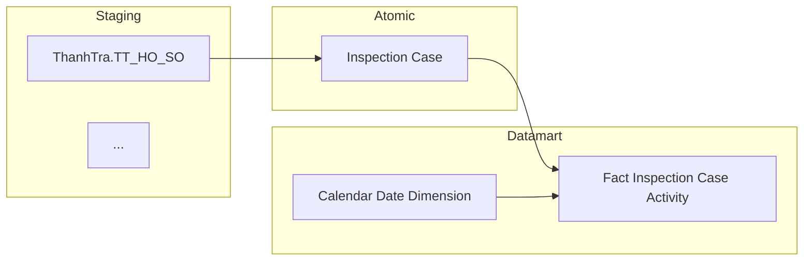
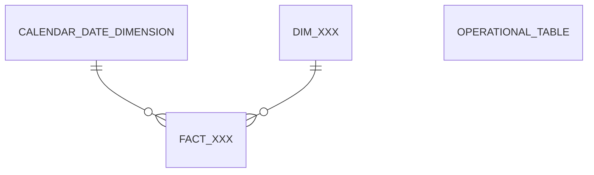

# Skill: Sinh tài liệu PTTK & TKCSLD — Gold/Datamart Layer

Đọc file này TRƯỚC KHI bắt đầu gen tài liệu cho bất kỳ module nào.

## Tài nguyên đi kèm

- **Scripts:**
  - `.claude/skills/datamart-gen-docs/scripts/build_docx.py` — Phase 3: convert MD → DOCX (python-docx + mmdc)
  - `.claude/skills/datamart-gen-docs/scripts/clean_description.py` — helper regex strip C.5
- **Reference:**
  - `reference/data_domain_mapping.md` — C.2: Data Domain → kiểu dữ liệu
  - `reference/column_rules.md` — C.4: quy tắc P/F Key, Nullable, Unique, ETL Rules
  - `reference/module_names_vi.md` — A.1: tên module tiếng Việt

## Điều kiện tiên quyết

- [ ] `Datamart/hld/DTM_{MODULE}_HLD.md` tồn tại và có Section 1 — Data Lineage
- [ ] `Datamart/hld/DTM_{MODULE}_Entities.csv` tồn tại
- [ ] `Datamart/lld/DTM_{MODULE}_Attributes.csv` tồn tại
- [ ] `Atomic/lld/atomic_attributes.csv` tồn tại — dùng để lookup `source_system` cho cột Hệ thống nguồn trong bảng Physical
- [ ] Python deps: `python -c "import docx"` OK — cài: `pip install python-docx`
- [ ] mmdc (chỉ cần cho Phase 3 DOCX): `npm install -g @mermaid-js/mermaid-cli`

---

## QUY TRÌNH (BẮT BUỘC)

```
[Per module]
Phase 1:   Claude gen 2 file Markdown cho từng module
Phase 2:   Người dùng review + phê duyệt (KHÔNG tự động)

[Sau khi tất cả module đã duyệt]
Phase 2.5: Merge Markdown các module → 2 file tổng
Phase 3:   Claude chạy build_docx.py → gen DOCX tổng
```

> **KHÔNG bỏ qua Phase nào. KHÔNG gen DOCX khi chưa có phê duyệt Markdown.**
>
> Phase 2.5 + Phase 3 chạy sau khi TẤT CẢ module cần ghép đã phê duyệt.
> Nếu chỉ cần DOCX riêng lẻ (không ghép), bỏ qua Phase 2.5 và chạy Phase 3 trực tiếp.

---

## PHASE 1 — GEN MARKDOWN

### Bước 1: Đọc input

```python
# Đọc 4 file theo thứ tự:
hld          = "Datamart/hld/DTM_{MODULE}_HLD.md"
ents         = "Datamart/hld/DTM_{MODULE}_Entities.csv"
attrs        = "Datamart/lld/DTM_{MODULE}_Attributes.csv"
atomic_attrs = "Atomic/lld/atomic_attributes.csv"   # lookup source_system cho bảng Physical

# Đọc rule transform tên (luôn dùng version mới nhất):
rule  = "system/rules/rule_transform_logical_name.csv"  # hoặc version mới nhất có trong project
```

Sau khi đọc:
- Từ `Entities.csv`: xây dict `{gold_entity → {gold_table, table_type, description, FKs}}`
- Từ `Attributes.csv`: xây dict `{gold_entity → [danh sách attributes]}`
- Từ `HLD.md`: xác định danh sách Cụm (Section 1), Staging sources, diagram mermaid từng cụm
- Từ `atomic_attrs`: xây dict `{(atomic_table, atomic_column) → source_system}` để lookup Hệ thống nguồn

### Bước 2: Gen `DTM_{MODULE}_PTTK.md`

Tuân thủ **PHẦN B** của instruction bên dưới. Thứ tự output:

```
## 3.2.X Luồng đồng bộ dữ liệu cho nhóm báo cáo [Tên module tiếng Việt]

### 3.2.X.1 Thông tin chung luồng đồng bộ
(danh sách gạch đầu dòng, không in đậm, chữ thường, viết hoa chữ cái đầu)

### 3.2.X.2 Luồng nghiệp vụ

#### 3.2.X.2.1 Nhóm thông tin [Tên nhóm 1]
(diagram mermaid + mục đích + mô tả luồng)

#### 3.2.X.2.2 Nhóm thông tin [Tên nhóm 2]
...
```

**Tra số thứ tự X:** Hỏi người dùng module này là số mấy trong tài liệu PTTK tổng (3.2.1, 3.2.2, ...) nếu chưa có thông tin. Default X=1.

### Bước 3: Gen `DTM_{MODULE}_TKCSLD.md`

Tuân thủ **PHẦN C** của instruction bên dưới. Thứ tự output:

```
# 3. KHO DỮ LIỆU (OLAP) — [Tên module tiếng Việt]

## 3.1 Mô hình dữ liệu mức High Level / Conceptual
### 3.1.1 Sơ đồ ERD
(mermaid erDiagram — chỉ tên thực thể + quan hệ)
### 3.1.2 Danh sách thực thể
(bảng 4 cột từ Entities.csv)

## 3.2 Mô hình dữ liệu mức Logic
### 3.2.1 Sơ đồ ERD
(mermaid erDiagram — alias logical, có trường gold_attribute)
### 3.2.2 Danh sách các bảng và thuộc tính
#### 3.2.2.1 Bảng [gold_entity]
(bảng 8 cột)
...

## 3.3 Mô hình dữ liệu mức vật lý
### 3.3.1 Sơ đồ ERD
(mermaid erDiagram — alias physical, có trường gold_column)
### 3.3.2 Danh sách bảng Dimension
#### 3.3.2.1 Bảng [gold_entity] ([gold_table])
(metadata + bảng 11 cột)
...
### 3.3.3 Danh sách bảng Detail Fact
...
### 3.3.4 Danh sách bảng tác nghiệp (Operational)
...
```

### Bước 4: Lưu file

```
docs/output/datamart/{MODULE}/DTM_{MODULE}_PTTK.md
docs/output/datamart/{MODULE}/DTM_{MODULE}_TKCSLD.md
```

Tạo thư mục nếu chưa có. Thông báo cho người dùng đường dẫn file và yêu cầu review.

---

## PHASE 2 — REVIEW (CHỜ NGƯỜI DÙNG)

Sau khi gen xong Phase 1:
1. Thông báo người dùng mở 2 file MD trong VS Code để review
2. **DỪNG** — không làm gì thêm cho đến khi người dùng phản hồi
3. Nếu có chỉnh sửa → cập nhật file MD → thông báo xong, tiếp tục chờ
4. Khi người dùng nói "phê duyệt", "approved", "OK rồi", "đồng ý" → chuyển Phase 3

**CHECKPOINT bắt buộc trước Phase 3:**
- [ ] Tên module tiếng Việt đúng
- [ ] Diagram PTTK: Staging/Atomic/Datamart subgraph đúng; **tất cả node** (Staging/Atomic/Datamart) dùng `ID["label"]` syntax — Staging: node ID không dấu chấm; Atomic: ID có `_`, label bỏ `_`; Datamart: ID = tên physical, label = tên logical từ Entities.csv
- [ ] TKCSLD: 3 ERD đúng tầng (Conceptual/Logic/Physical)
- [ ] Bảng thuộc tính: 8 cột (Logic), 12 cột (Physical)
- [ ] Cột Mô tả: thuần tiếng Việt, không còn tham chiếu nguồn
- [ ] ETL Rules = `etl_logic` từ Attributes.csv; nếu Generated → `ETL sinh tự động`

---

## PHASE 2.5 — MERGE MARKDOWN (khi cần file tổng)

Sau khi tất cả module đã phê duyệt, chạy `merge_md.py` để gộp thành file tổng:

```bash
# Gộp PTTK tổng (thứ tự module = thứ tự xuất hiện trong tài liệu)
python .claude/skills/datamart-gen-docs/scripts/merge_md.py \
  --modules TT FMS GSTT --type pttk

# Gộp TKCSLD tổng
python .claude/skills/datamart-gen-docs/scripts/merge_md.py \
  --modules TT FMS GSTT --type tkcsld

# Gộp cả 2 cùng lúc
python .claude/skills/datamart-gen-docs/scripts/merge_md.py \
  --modules TT FMS GSTT --type both
```

Output:
```
docs/output/datamart/DTM_ALL_PTTK.md
docs/output/datamart/DTM_ALL_TKCSLD.md
```

Tùy chỉnh tên output:
```bash
python merge_md.py --modules TT FMS --type both --output-name Datamart_v1
# → DTM_DATAMART_V1_PTTK.md, DTM_DATAMART_V1_TKCSLD.md
```

Script tự động:
- **PTTK**: renumber `3.2.X` liên tục (module 1 → 3.2.1, module 2 → 3.2.2, ...)
- **TKCSLD**: giữ nguyên cấu trúc từng module, chèn `\newpage` giữa các module

---

## PHASE 3 — GEN DOCX

**Trường hợp A — DOCX từng module riêng lẻ** (không cần ghép):

```bash
python .claude/skills/datamart-gen-docs/scripts/build_docx.py \
  --module {MODULE} --type pttk

python .claude/skills/datamart-gen-docs/scripts/build_docx.py \
  --module {MODULE} --type tkcsld
```

Input: `docs/output/datamart/{MODULE}/DTM_{MODULE}_{TYPE}.md`
Output: `docs/output/datamart/{MODULE}/DTM_{MODULE}_{TYPE}.docx`

**Trường hợp B — DOCX tổng** (sau Phase 2.5):

```bash
python .claude/skills/datamart-gen-docs/scripts/build_docx.py \
  --module ALL --type pttk

python .claude/skills/datamart-gen-docs/scripts/build_docx.py \
  --module ALL --type tkcsld
```

Input: `docs/output/datamart/DTM_ALL_{TYPE}.md`
Output: `docs/output/datamart/DTM_ALL_{TYPE}.docx`

Script sẽ:
1. Đọc file MD đã approved
2. Render mermaid block → PNG (dùng mmdc)
3. Build DOCX với python-docx (landscape A4, Times New Roman, bảng theo spec A.2)

**Nếu mmdc chưa cài:**
```bash
npm install -g @mermaid-js/mermaid-cli
# Kiểm tra: mmdc --version
```

---

## INSTRUCTION ĐẦY ĐỦ (PHẦN A–D)

*(Copy nguyên văn từ instruction gốc — Claude đọc và áp dụng khi gen Markdown)*

---

### PHẦN A — QUY ĐỊNH CHUNG

#### A.1 Input cần thiết

| File | Vai trò |
|---|---|
| `DTM_{MODULE}_HLD.md` | Nguồn chính cho PTTK — cấu trúc cụm, diagram, mô tả nghiệp vụ |
| `DTM_{MODULE}_Entities.csv` | Danh sách bảng — loại bảng, mô tả, quan hệ FK |
| `DTM_{MODULE}_Attributes.csv` | Chi tiết từng trường — tên logical, tên physical, kiểu dữ liệu, key, mô tả, nguồn |
| `rule_transform_logical_name_v<version>.csv` | Dictionary transform tên — luôn dùng file có version mới nhất |

**Tên module tiếng Việt:** xem `reference/module_names_vi.md`

#### A.2 Quy định định dạng tài liệu DOCX

*(Áp dụng bởi `build_docx.py` — Claude không cần xử lý phần này khi gen Markdown)*

| Thuộc tính | Giá trị |
|---|---|
| Khổ giấy | A4 ngang (Landscape) — w=16834, h=11909 DXA |
| Font | Times New Roman |
| Cỡ chữ thân | 24 half-pt (12pt) |
| Heading 1/2 | 26 half-pt (13pt), đậm |
| Heading 3/4/5 | 24 half-pt (12pt), đậm |
| Cỡ chữ bảng | 20 half-pt (10pt) |
| Border | SINGLE, size=1, color=#999999 |
| Header row | Shading #BDD7EE, đậm, căn giữa |
| Hàng chẵn | Shading #EEF4FB |
| Cell margin | top=60, bottom=60, left=100, right=100 DXA |

**Độ rộng cột (DXA, tổng = 13999):**

| Loại bảng | Phân bổ |
|---|---|
| 4 cột (danh sách thực thể) | 400 / 3500 / 2700 / 7399 |
| 8 cột (thuộc tính Logic) | 360 / 2000 / 1500 / 560 / 560 / 560 / 680 / 7779 |
| 12 cột (thuộc tính Physical) | 360 / 1300 / 1100 / 480 / 480 / 480 / 680 / 2200 / 900 / 1400 / 1200 / 3419 |

---

### PHẦN B — TÀI LIỆU PTTK: Mục 3.2 Phân hệ ETL

#### B.1 Cấu trúc output

```
3.2 Phân hệ ETL
  └─ 3.2.X Luồng đồng bộ dữ liệu cho nhóm báo cáo [Tên module tiếng Việt]
       └─ 3.2.X.1 Thông tin chung luồng đồng bộ
       └─ 3.2.X.2 Luồng nghiệp vụ
            └─ 3.2.X.2.1 Nhóm thông tin [Tên nhóm]
            └─ 3.2.X.2.2 Nhóm thông tin [Tên nhóm]
            └─ ...
```

**Quy tắc đánh số:** Mỗi module đánh số tăng dần (3.2.1, 3.2.2, ...). Nhóm thông tin đánh số tiếp theo.

#### B.2 Mục 3.2.X.1 — Thông tin chung luồng đồng bộ

Dùng **danh sách gạch đầu dòng**, KHÔNG dùng bảng. Toàn bộ text **chữ thường, KHÔNG in đậm**:

```
- Tên job:
- Nguồn dữ liệu (hệ thống nguồn): [tên hệ thống]
- Cách thức truy xuất đồng bộ dữ liệu:
- Tần suất đồng bộ dữ liệu:
- Dung lượng dữ liệu sẽ thực hiện đồng bộ:
- Thời gian lưu trữ dữ liệu:
- Thư mục lưu trữ dữ liệu trên kho dữ liệu:
```

- **Nguồn dữ liệu:** Liệt kê tên hệ thống nguồn (chỉ tên hệ thống, không tới mức bảng), lấy từ prefix tên bảng Bronze trong toàn bộ diagram của module. VD: `ThanhTra`, `IDS`, `FIMS`
- **Tất cả mục còn lại:** Để trống hoàn toàn (chỉ ghi tên label, không có giá trị)

#### B.3 Mục 3.2.X.2 — Luồng nghiệp vụ

**B.3.1 Xác định Nhóm thông tin**

- Lấy từ **Section 1 — Data Lineage** trong HLD. Mỗi Cụm = một Nhóm thông tin
- **Bỏ nhóm** nếu: chỉ reuse Gold từ cụm khác không có Bronze/Silver riêng, hoặc sau khi bỏ layer Báo cáo không còn nội dung mới
- **Tên nhóm:** Lấy tiêu đề cụm trong HLD, bỏ phần tên bảng trong ngoặc đơn

Ví dụ:
- HLD: `Cụm 1: Thống kê & Cơ cấu vụ việc Thanh tra/Kiểm tra (Fact Inspection Case Activity)`
- Tài liệu: `3.2.1.2.1 Nhóm thông tin Thống kê & Cơ cấu vụ việc Thanh tra/Kiểm tra`

**B.3.2 Diagram (flowchart)**

- 3 tầng: Staging → Atomic → Datamart
- Tên subgraph: `Staging`, `Atomic`, `Datamart` — KHÔNG ghi tên hệ thống hay `Datamart Mart`
- Tên bảng Staging: **dùng `ID["label"]` syntax** — node ID không dấu chấm, label hiển thị `source.table`
  - Đúng: `ThanhTra_TT_HO_SO["ThanhTra.TT_HO_SO"]`
  - Sai: `ThanhTra.TT_HO_SO` (dấu chấm trong node ID gây lỗi mermaid — parsed như CSS class)
  - Edge dùng node ID: `ThanhTra_TT_HO_SO --> inspection_case`
- Tên bảng **Atomic**: **dùng `ID["label"]` syntax** — node ID dùng `_` thay space, label bỏ dấu `_`
  - Đúng: `Fund_Management_Company["Fund Management Company"]`
  - Sai: `Fund_Management_Company` (mermaid render có dấu `_`, xấu)
  - Edge dùng node ID: `Fund_Management_Company --> fct_fnd_mgt_co_snpst`
- Tên bảng **Datamart**: **dùng `ID["label"]` syntax** — node ID là tên physical, label là tên logical đầy đủ
  - Đúng: `fct_fnd_mgt_co_snpst["Fact Fund Management Company Snapshot"]`
  - Sai: `fct_fnd_mgt_co_snpst` (tên physical viết tắt, không có nghĩa với người đọc)
  - Tên logical lấy từ `Entities.csv` cột `datamart_entity`
- **Tên subgraph luôn là**: `Staging`, `Atomic`, `Datamart` — KHÔNG thêm tên hệ thống kể cả khi có nhiều nguồn (VD sai: `Staging_FMS["Staging (FMS)"]`, VD đúng: `Staging`)
- Mũi tên nét liền `-->`, không label, không layer Báo cáo
- **Copy nguyên diagram từ HLD** — lấy nguyên mermaid flowchart từ HLD Section 1, chỉ đổi alias subgraph nếu HLD dùng tên khác (VD: `SRC` → `Staging`, `SIL` → `Atomic`, `GOLD` → `Datamart`). Không tự vẽ lại.
- **1 diagram / 1 bảng Gold (Fact hoặc Operational)**: Dimension KHÔNG tách diagram riêng — luôn gộp vào subgraph Datamart của diagram Fact/Operational mà nó phục vụ.
  - Nếu 1 Cụm HLD có N Fact và M Operational → tạo N+M diagram riêng
  - Mỗi diagram: copy nguyên phần Staging→Atomic từ HLD + chỉ giữ lại 1 bảng Gold trong subgraph Datamart (kèm Dimension liên quan)
  - Đúng: nhóm có 1 Fact + 1 Operational → 2 diagram riêng; nhóm có 3 Operational → 3 diagram riêng
  - Sai: tách Dimension thành diagram riêng; gộp nhiều Fact/Operational vào 1 diagram

```

```

**B.3.3 Mục đích**

1–2 câu tiếng Việt: bảng Gold nào / phục vụ Tab nào / loại thông tin gì.

Format: `**Mục đích:** [Nội dung]`

**B.3.4 Mô tả luồng**

Staging → Atomic — mỗi dòng mô tả 1 bảng Atomic, source nhắc ở cuối:
```
- **[Tên Atomic]:** Bảng lưu [ý nghĩa nghiệp vụ] lấy thông tin từ bảng [source.table_name]
```

Trường hợp nhiều source:
```
- **[Tên Atomic]:** Bảng lưu [ý nghĩa] lấy thông tin từ bảng [source 1], kết hợp [mô tả] từ các bảng [source 2], [source 3]
```

Bảng CV: `Classification Value (tên_scheme)` — mô tả: "Bảng code value lưu danh mục [ý nghĩa] lấy thông tin từ bảng [source]"

Atomic → Datamart — mỗi dòng mô tả 1 bảng Datamart, không nhắc nguồn Atomic:

| Loại bảng | Mở đầu mô tả |
|---|---|
| Fact | Bảng sự kiện tổng hợp thông tin... |
| Operational | Bảng tác nghiệp lưu danh sách... ở trạng thái mới nhất... |
| Classification Dimension | Bảng lưu danh mục thông tin phân loại (ví dụ: ...) |
| Calendar Date Dimension | Bảng lưu thông tin thời gian |
| Dimension khác | Bảng lưu thông tin [tên đối tượng]... |

---

### PHẦN C — TÀI LIỆU TKCSLD

#### C.1 Cấu trúc output

```
3. KHO DỮ LIỆU (OLAP) — [Tên module tiếng Việt]
  └─ 3.1 Mô hình dữ liệu mức High Level / Conceptual
       └─ 3.1.1 Sơ đồ ERD
       └─ 3.1.2 Danh sách thực thể
  └─ 3.2 Mô hình dữ liệu mức Logic
       └─ 3.2.1 Sơ đồ ERD
       └─ 3.2.2 Danh sách các bảng và thuộc tính
  └─ 3.3 Mô hình dữ liệu mức vật lý
       └─ 3.3.1 Sơ đồ ERD
       └─ 3.3.2 Danh sách bảng Dimension
       └─ 3.3.3 Danh sách bảng Detail Fact
       └─ 3.3.4 Danh sách bảng tác nghiệp (Operational)
```

#### C.2 Mapping Data Domain → Kiểu dữ liệu

Xem `reference/data_domain_mapping.md`. Lấy thẳng từ cột `data_type` trong Attributes.csv; chỉ fallback sang bảng mapping nếu `data_type` trống.

#### C.3 Cấu trúc cột file Attributes

| Cột | Dùng cho |
|---|---|
| `gold_entity` | Tên bảng logical (= `datamart_entity`) |
| `gold_table` | Tên bảng physical (= `datamart_table`) |
| `gold_attribute` | Tên trường logical (dùng cho bảng Logic) |
| `gold_column` | Tên trường physical (= `datamart_column`, dùng cho bảng Physical) |
| `data_type` | Kiểu dữ liệu |
| `nullable` | `true` → X, `false` → rỗng |
| `key` | Xác định P/F Key — xem C.4 |
| `description` | Mô tả trường (cần clean theo C.5) |
| `atomic_table` | Tên bảng Atomic nguồn — dùng để lookup `source_system` từ `atomic_attributes.csv` và xây `ATM.{atomic_table}` |
| `atomic_column` | Tên cột Atomic nguồn — dùng làm Source Field Name và lookup key |
| `source_entity` | `Generated` hoặc rỗng → ETL sinh tự động |
| `etl_logic` | ETL Rules (SQL logic đầy đủ) |

#### C.4 Quy tắc các cột bảng thuộc tính

Xem `reference/column_rules.md` để biết chi tiết. Tóm tắt:

| Cột | Quy tắc |
|---|---|
| P/F Key | PK→P, FK→F, BK/DD/rỗng→rỗng |
| Nullable | PK hoặc FK → rỗng; còn lại theo `nullable` (true=X, false=rỗng) |
| Unique | PK→X; còn lại→rỗng |
| Giá trị mặc định | Luôn để trống |
| Hệ thống nguồn | Lookup `(atomic_table, atomic_column)` → `source_system` từ `atomic_attributes.csv`; 3 trường kỹ thuật hoặc `source_entity=Generated`/rỗng → trống |
| Schema.Table | `ATM.{atomic_table}` (schema cố định `ATM` = Atomic); 3 trường kỹ thuật hoặc `atomic_table` trống → trống |
| Source Field Name | `atomic_column` từ `DTM_{MODULE}_Attributes.csv`; 3 trường kỹ thuật hoặc `atomic_column` trống → trống |
| ETL Rules | `etl_logic` từ `DTM_{MODULE}_Attributes.csv`; 3 trường kỹ thuật hoặc `source_entity=Generated`/rỗng → `ETL sinh tự động` |

**3 trường kỹ thuật:** `Effective Date`, `Expiry Date`, `Population Date`

#### C.5 Quy tắc mô tả trường (cột Mô tả)

Mô tả phải **thuần tiếng Việt, ngắn gọn, chỉ giữ ý nghĩa nghiệp vụ**. Bắt buộc loại bỏ:

| Loại nội dung cần bỏ | Pattern ví dụ |
|---|---|
| Tham chiếu nguồn | `— IDS.company_profiles.id`, `— FIMS.INVESTOR.name`, `ThanhTra.TT_HO_SO.NGAY_NHAN_HO_SO` |
| Open issue | `Xem O_QLCB_1`, `(Closed)`, `Xem O_NDTNN_3`, `xem O_TT_4` |
| Ghi chú kỹ thuật | `(PK Silver)`, `(BK nguồn)`, `(PK bảng tác nghiệp)` |
| PENDING | `PENDING (nguồn TTHC chưa có Silver)` → giữ tên trường, bỏ chú thích |
| Scheme reference | `Scheme: QLCB_OFFERING_TYPE_CATEGORY` |
| ETL note | `ETL lookup từ ...`, `ETL extract từ ...`, `ETL pick theo ...`, `ETL-derived từ ...`, `ETL join ...` |
| FK label | `FK lịch — `, `FK phân loại đối tượng — ` |

Ví dụ clean:
```
Trước: "FK lịch — ETL lookup từ Inspection Case.Received Date. ThanhTra.TT_HO_SO.NGAY_NHAN_HO_SO"
Sau:   "FK lịch ngày nhận hồ sơ"

Trước: "FK phân loại đối tượng — ETL-derived từ Inspection Decision Subject. 6 giá trị tạm thời — xem O_TT_4"
Sau:   "FK phân loại đối tượng"

Trước: "PK nguồn dùng làm degenerate key hồ sơ trên Fact. COUNT(DISTINCT) để đếm hồ sơ. ThanhTra.TT_HO_SO.ID"
Sau:   "Mã hồ sơ (degenerate key)"
```

#### C.6 Sơ đồ ERD theo từng tầng

**Tầng Conceptual (3.1.1)**
- Chỉ tên thực thể + quan hệ, không có trường
- Tên thực thể: UPPERCASE có `_` (VD: `CALENDAR_DATE_DIMENSION`)
- Bảng Operational: hiển thị độc lập, không có quan hệ với Fact



**Tầng Logic (3.2.1)**
- Tên thực thể: alias logical (VD: `CALENDAR_DATE_DIMENSION["Calendar Date Dimension"]`)
- Tên trường: `gold_attribute` với `_` thay space (VD: `Date_Dimension_Id`)
- Kiểu dữ liệu trong ERD: rút gọn (`string`, `int`, `float`, `date`, `timestamp`)
- Annotation: chỉ `PK` và `FK`
- Thứ tự field: `tên_trường kiểu [PK/FK]`

**Tầng Physical (3.3.1)**
- Tên thực thể: alias physical (VD: `CALENDAR_DATE_DIMENSION["cdr_dt_dim"]`)
- Tên trường: `gold_column`
- Thứ tự bảng: Dimension → Fact → Operational

**Quy tắc chung ERD:**
- Label quan hệ: `" "` (space)
- `boolean` → `string`, `decimal(...)` → `float` trong ERD
- BK không ghi annotation trong ERD

#### C.7 Bảng danh sách thực thể (3.1.2)

| STT | Thực thể | Tên bảng | Mô tả |
|---|---|---|---|

Lấy từ `gold_entity`, `gold_table`, `description` trong Entities.csv.

#### C.8 Bảng thuộc tính tầng Logic (3.2.2.X)

Heading: `#### 3.2.2.X Bảng [gold_entity]`

| STT | Tên trường | Kiểu dữ liệu và độ dài | Nullable | Unique | P/F Key | Mặc định | Mô tả |
|---|---|---|---|---|---|---|---|

Dùng `gold_attribute` cho tên trường.

#### C.9 Bảng thuộc tính tầng Physical (3.3.X.Y)

Heading: `#### 3.3.X.Y Bảng [gold_entity] ([gold_table])`

Theo sau heading là metadata bảng:
```
*Mô tả bảng:* [description từ Entities.csv]
*Đường dẫn trên kho dữ liệu:*
*Các trường Partition:*
*Thời gian lưu trữ:*
*Định dạng lưu trữ:*
```

| STT | Tên trường | Kiểu dữ liệu và độ dài | Nullable | Unique | P/F Key | Giá trị mặc định | Mô tả | Hệ thống nguồn | Schema.Table | Source Field Name | ETL Rules |
|---|---|---|---|---|---|---|---|---|---|---|---|

- Dùng `gold_column` (= `datamart_column`) cho tên trường
- **Hệ thống nguồn**: lookup `source_system` từ `atomic_attributes.csv` qua key `(atomic_table, atomic_column)`
- **Schema.Table**: `ATM.{atomic_table}` — schema `ATM` là cố định, `atomic_table` từ `DTM_{MODULE}_Attributes.csv`
- **Source Field Name**: `atomic_column` từ `DTM_{MODULE}_Attributes.csv`
- **ETL Rules**: `etl_logic` từ `DTM_{MODULE}_Attributes.csv`
- Thứ tự bảng: Dimension → Fact → Operational

---

### PHẦN D — CHECKLIST KIỂM TRA

#### D.1 PTTK — Checklist

- [ ] Tên module dùng tiếng Việt đầy đủ
- [ ] Mục 3.2.X.1: danh sách gạch đầu dòng, chữ thường, không in đậm, để trống các mục chưa có dữ liệu
- [ ] Nguồn dữ liệu trong 3.2.X.1 chỉ ghi tên hệ thống
- [ ] Diagram flowchart: subgraph `Staging`/`Atomic`/`Datamart`; tên bảng Staging dùng `ID["label"]` syntax (node ID không dấu chấm, VD: `FMS_SECURITIES["FMS.SECURITIES"]`)
- [ ] Diagram flowchart: node Atomic dùng `ID["label"]` syntax (ID dùng `_`, label bỏ `_`, VD: `Fund_Management_Company["Fund Management Company"]`)
- [ ] Diagram flowchart: node Datamart dùng `ID["label"]` syntax (ID = tên physical, label = tên logical từ Entities.csv, VD: `fct_fnd_mgt_co_snpst["Fact Fund Management Company Snapshot"]`)
- [ ] Mũi tên nét liền, không label, không layer Báo cáo
- [ ] Nhiều hệ thống nguồn → nhiều subgraph Staging riêng (VD: `Staging_FMS["Staging (FMS)"]`)
- [ ] Mỗi diagram chỉ có **1 bảng Gold** (Fact hoặc Operational) — nhóm N bảng Gold → N diagram riêng
- [ ] Đã bỏ nhóm chỉ reuse Datamart không có Staging/Atomic riêng
- [ ] Mô tả Staging→Atomic: tên Atomic in đậm đứng đầu, source ở cuối câu
- [ ] Bảng CV ghi đầy đủ `Classification Value (tên_scheme)`
- [ ] Mô tả Atomic→Datamart: chỉ mô tả ý nghĩa bảng Datamart
- [ ] Toàn bộ mô tả bằng tiếng Việt

#### D.2 TKCSLD — Checklist

- [ ] Đánh số đầu mục bắt đầu từ mục 3
- [ ] Conceptual ERD: chỉ tên thực thể + quan hệ, Operational độc lập
- [ ] Logic ERD: alias logical, tên trường dùng `_`, thứ tự `tên kiểu [ann]`
- [ ] Physical ERD: alias physical, thứ tự Dim→Fact→Operational
- [ ] Bảng Logic: dùng `gold_attribute`, 8 cột
- [ ] Bảng Physical: dùng `gold_column`, 12 cột (thêm Hệ thống nguồn, Schema.Table, Source Field Name, ETL Rules)
- [ ] Cột Mô tả: thuần tiếng Việt, đã loại bỏ tham chiếu nguồn, open issue, ghi chú kỹ thuật
- [ ] Schema.Table = `ATM.{atomic_table}` (prefix `ATM` cố định)
- [ ] ETL Rules = `etl_logic` từ Attributes.csv; Generated/rỗng → `ETL sinh tự động`
- [ ] Cột Giá trị mặc định: để trống hoàn toàn
- [ ] DD key → cột P/F Key để trống
- [ ] 3 trường kỹ thuật: Hệ thống nguồn/Schema.Table/Source Field Name trống, ETL Rules = `ETL sinh tự động`

#### D.3 Quy trình — Checklist

- [ ] Phase 1: Đã xuất 2 file Markdown đầy đủ
- [ ] Phase 2: Người dùng đã review và phê duyệt cả 2 file
- [ ] Phase 3: Chỉ gen DOCX sau khi có phê duyệt

---

## XỬ LÝ LỖI THƯỜNG GẶP

| Lỗi | Nguyên nhân | Fix |
|---|---|---|
| `FileNotFoundError: DTM_{MODULE}_HLD.md` | File chưa tạo | Báo người dùng — phải hoàn thành HLD trước. STOP. |
| `FileNotFoundError: DTM_{MODULE}_Attributes.csv` | File chưa có | Kiểm tra `Datamart/lld/` — đúng tên file? |
| Mô tả tiếng Việt bị vỡ encoding | CSV không UTF-8 BOM | Mở CSV và re-save với UTF-8 BOM |
| mmdc không tìm thấy | Chưa cài | `npm install -g @mermaid-js/mermaid-cli` |
| ERD quá phức tạp, mermaid báo lỗi | Quá nhiều bảng/trường | Tách ERD thành 2 diagram hoặc giảm bớt trường hiển thị |
| Diagram không render trong DOCX | mmdc lỗi | Xem stderr của build_docx.py; thử `mmdc -i test.mmd -o test.png` trực tiếp |
