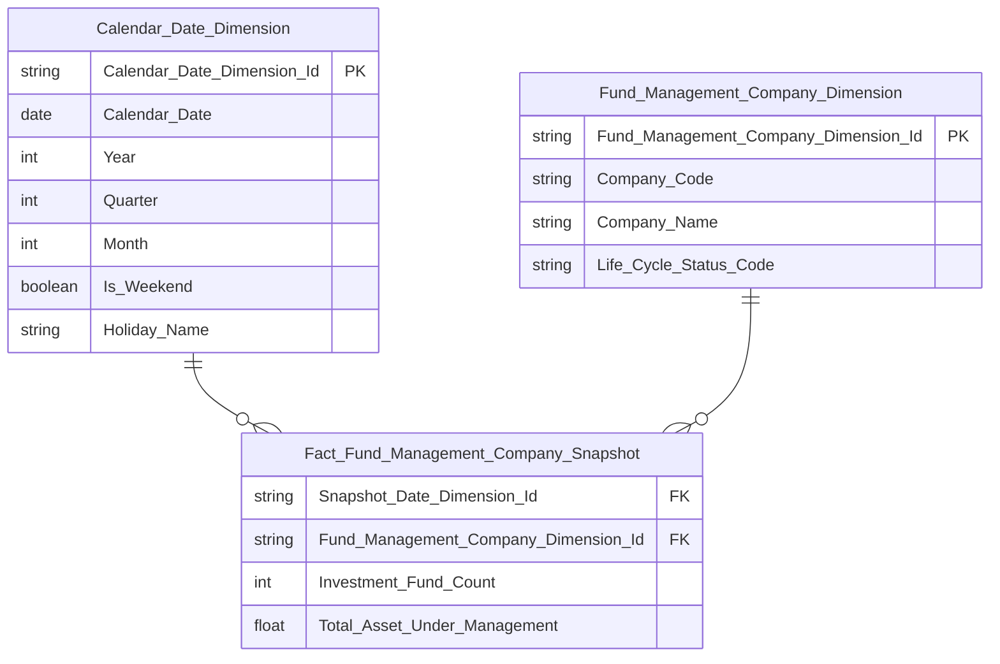
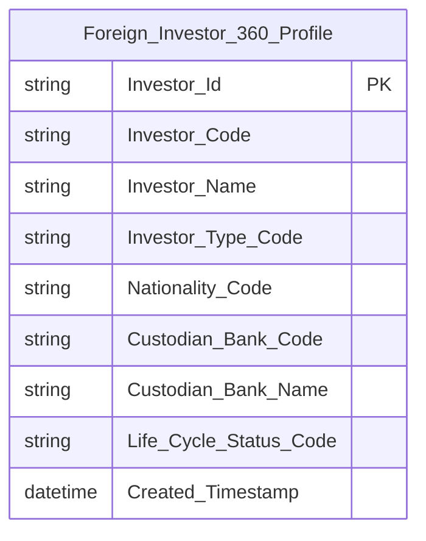

# erDiagram — Format đúng

## Ví dụ 1: Star Schema Fact Snapshot + 2 Dimension



**Đặc điểm đúng:**
- Mở bằng ` ```mermaid ` — có từ `mermaid`
- Types hợp lệ: `string`, `date`, `int`, `float`, `boolean`
- `PK` chỉ trên Dimension; `FK` chỉ trên Fact và có `||--o{` tương ứng
- Không có `BK` trong erDiagram (BK chỉ ghi trong Attributes CSV)
- Tên entity dùng underscore: `Fund_Management_Company_Dimension`
- Tên cột dùng Title_Case: `Snapshot_Date_Dimension_Id`
- Label quan hệ: `" "` (space)
- Không có `Effective_Date`, `Expiry_Date`, `Population_Date`

---

## Ví dụ 2: Bảng Tác nghiệp



**Đặc điểm đúng:**
- Bảng Tác nghiệp: có `PK`, không có `FK` (không join sang Dimension)
- Không có quan hệ `||--o{` vì Tác nghiệp độc lập
- Không có `BK` — chỉ `PK`, còn lại trống
