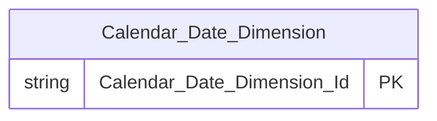

# erDiagram — Các pattern sai cần tránh

## SAI 1 — Thiếu từ `mermaid`

```
❌ Sai:
```erDiagram
    Calendar_Date_Dimension {
        string Calendar_Date_Dimension_Id PK
    }
```

✅ Đúng:

```

**Vấn đề:** ` ```erDiagram ` không có từ `mermaid` → render thành plain text trên mọi renderer (VS Code, GitHub, tài liệu Word).

---

## SAI 2 — Dùng type không hợp lệ

```
❌ Sai:
    Fact_FMS_Snapshot {
        decimal(23,2) Total_Asset_Under_Management
        timestamp Created_At
        nvarchar Company_Name
    }

✅ Đúng:
    Fact_FMS_Snapshot {
        float Total_Asset_Under_Management
        datetime Created_At
        string Company_Name
    }
```

**Vấn đề:** `decimal(...)`, `timestamp`, `nvarchar` không phải type hợp lệ của mermaid erDiagram — gây parse error hoặc render sai.

---

## SAI 3 — Dùng label BK, DD

```
❌ Sai:
    Fund_Management_Company_Dimension {
        string Fund_Management_Company_Dimension_Id PK
        string Company_Code BK
        string Company_Name
    }
    Fact_FMS_Snapshot {
        string Report_Date DD
        string Company_Dimension_Id FK
        int Fund_Count
    }

✅ Đúng:
    Fund_Management_Company_Dimension {
        string Fund_Management_Company_Dimension_Id PK
        string Company_Code
        string Company_Name
    }
    Fact_FMS_Snapshot {
        string Report_Date
        string Company_Dimension_Id FK
        int Fund_Count
    }
```

**Vấn đề:** `BK`, `DD` là label của Attributes CSV — không tồn tại trong erDiagram syntax. Chỉ `PK` và `FK` hợp lệ. Mọi label khác gây parse error toàn block.

---

## SAI 4 — FK trên Dimension hoặc thiếu quan hệ `||--o{`

```
❌ Sai — FK trên Dimension:
    Fund_Management_Company_Dimension {
        string Fund_Management_Company_Dimension_Id PK
        string Snapshot_Date_Dimension_Id FK
    }

❌ Sai — FK trên Fact nhưng không có quan hệ:
    Fact_FMS_Snapshot {
        string Snapshot_Date_Dimension_Id FK
        string Company_Dimension_Id FK
    }
    %% Thiếu dòng quan hệ ||--o{

✅ Đúng:
    Fact_FMS_Snapshot {
        string Snapshot_Date_Dimension_Id FK
        string Company_Dimension_Id FK
    }
    Calendar_Date_Dimension ||--o{ Fact_FMS_Snapshot : " "
    Fund_Management_Company_Dimension ||--o{ Fact_FMS_Snapshot : " "
```

**Vấn đề:** `FK` trên Dimension sai về mặt thiết kế. FK trên Fact mà thiếu `||--o{` → diagram không hiển thị quan hệ, mất thông tin.

---

## SAI 5 — Tên entity dùng dấu cách hoặc tên cột dùng snake_case

```
❌ Sai:
erDiagram
    Fund Management Company Dimension {
        string fund_management_company_dimension_id PK
        string company_code
    }

✅ Đúng:
erDiagram
    Fund_Management_Company_Dimension {
        string Fund_Management_Company_Dimension_Id PK
        string Company_Code
    }
```

**Vấn đề:** Tên entity có dấu cách → mermaid parse thành nhiều token → lỗi. Tên cột snake_case là physical name — HLD chỉ dùng tên logical (Title_Case_With_Underscore).
