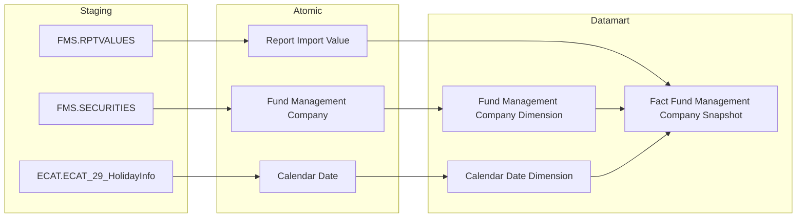
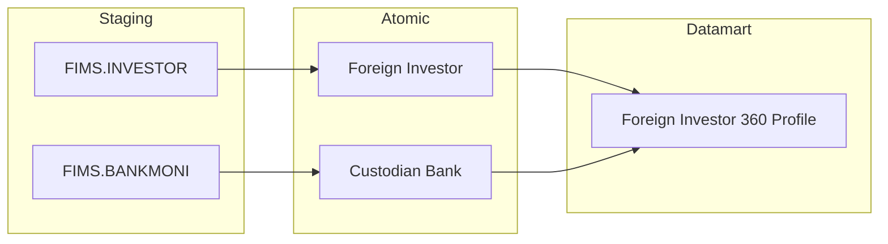
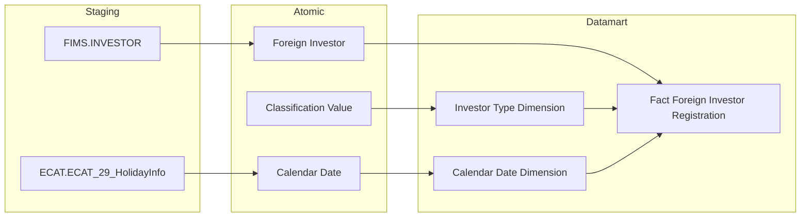

# Flowchart — Format đúng

## Ví dụ 1: Cụm Fact Snapshot — 2 nguồn, có Calendar Date

**Đặc điểm đúng:**
- 1 subgraph Staging duy nhất, gộp tất cả nguồn kể cả ECAT
- Node Staging: `FMS_RPTVALUES["FMS.RPTVALUES"]` — ID không dấu chấm, label có dấu chấm
- Node Atomic: `Report_Import_Value["Report Import Value"]` — ID dùng `_`, label bỏ `_`
- Node Datamart: `fct_fms_snpst["Fact Fund Management Company Snapshot"]` — ID physical, label logical
- Calendar Date đủ 3 tầng: Staging → Atomic → Datamart
- Dim link vào Fact: `fnd_mgt_co_dim --> fct_fms_snpst` (không ngược lại)

---

## Ví dụ 2: Cụm Tác nghiệp — không có Fact, không có Calendar Date

**Đặc điểm đúng:**
- Cụm Tác nghiệp: không có Fact → không cần Calendar Date Dimension
- Không có link `Dim --> Tác nghiệp` — Tác nghiệp lấy thẳng từ Atomic
- Subgraph label đúng: `SRC["Staging"]`, `SIL["Atomic"]`, `GOLD["Datamart"]`

---

## Ví dụ 3: Classification Dimension seed từ Classification Value

**Đặc điểm đúng:**
- `Classification_Value["Classification Value"]` chỉ trong subgraph Atomic — không có node trong Staging
- Không vẽ nguồn Staging cho Classification Value
