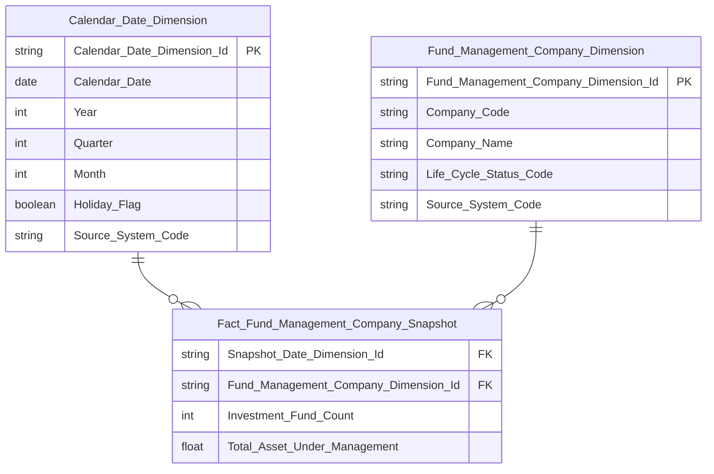

# erDiagram Rules — Star Schema

## Cú pháp bắt buộc

```
✅ Đúng:
```mermaid
erDiagram
    ...
```

❌ Sai:
```erDiagram
    ...
```
```

Thiếu `mermaid` → render thành plain text trên mọi renderer.

---

## Types hợp lệ

| Dùng | Không dùng |
|---|---|
| `int` | `decimal(23,2)` (có ngoặc gây lỗi cú pháp Mermaid) |
| `float` | `timestamp` |
| `decimal` | `nvarchar` |
| `string` | `bigint`, `smallint` |
| `varchar` | |
| `boolean` | |
| `date` | |
| `datetime` | |

> **Lưu ý kiểu số tài chính:** Dùng `decimal` (viết trần không kèm độ chính xác `(p,s)`) cho các trường tiền tệ, giá trị và tỷ lệ tài chính cần độ chính xác cao để bảo toàn ngữ nghĩa khi chuyển giao sang LLD/ClickHouse.


---

## Key Labels — chỉ 2 label hợp lệ: `PK` và `FK`

| Label | Dùng ở đâu | Điều kiện |
|---|---|---|
| `PK` | Dimension, Tác nghiệp | Surrogate key của entity |
| `FK` | **Chỉ** Fact entity block | Phải có `\|\|--o{` tương ứng |
| (trống) | Mọi attribute còn lại | Measure, Classification Value, date, boolean, DD, metadata |

❌ `BK`, `DD` — không bao giờ xuất hiện trong erDiagram.
❌ `FK` không được gắn cho Classification Value field, date field, hay measure.
❌ `FK` trên Dimension hoặc Tác nghiệp → parse error.

---

## Tên entity và tên cột

**Tên entity:** dùng underscore, không dấu cách.
```
✅ Fund_Management_Company_Snapshot
❌ Fund Management Company Snapshot
```

**Tên cột:** Title_Case_With_Underscore.
```
✅ Snapshot_Date_Dimension_Id
✅ Investment_Fund_Count
❌ snapshot_date_dimension_id   (snake_case — chỉ dùng ở physical layer)
❌ SnapshotDateDimensionId      (PascalCase — không dùng)
```

---

## Quan hệ FK

Mỗi `FK` trong Fact block **bắt buộc** có đường quan hệ tương ứng:
```
Calendar_Date_Dimension ||--o{ Fact_FMS_Snapshot : " "
```

Label quan hệ: `" "` (space) — không để trống, không viết text.

---

## Cấm Fact-to-Fact reference — mọi FK phải trỏ tới Dimension

**Rule cứng:** Trong Kimball star schema, **không tồn tại khái niệm FK trực tiếp giữa 2 Fact**. Nếu Fact con (grain mịn hơn) cần liên kết ngược lên định danh của 1 entity mà entity đó hiện đang là Fact (grain thô hơn, có measure riêng) — **không được** vẽ quan hệ `Fact_A ||--o{ Fact_B` hay đặt FK trên Fact_B trỏ thẳng `Fact_A_Id`. Thay vào đó: **tách thêm 1 Dimension chứa business key** của entity đó (chỉ chứa key + thuộc tính định danh, KHÔNG chứa measure — measure ở lại Fact gốc), rồi Fact con join tới Dimension mới này.

> ❌ **Sai (đã xảy ra thực tế — module TT, sửa lỗi FK cha lần 1):**
> ```
> Fact_Penalty_Decision ||--o{ Fact_Penalty_Decision_Subject_Behavior : " "
> Fact_Penalty_Decision_Subject_Behavior {
>     varchar Penalty_Decision_Code FK
> }
> ```
> Lý do sai: `Penalty Decision` đã là 1 Fact (có measure `Total_Fine_Amount`) — không thể vừa là Fact vừa đóng vai Dimension cho Fact khác join tới bằng quan hệ Fact-Fact.

> ✅ **Đúng (sửa lại lần 2):** tách `Penalty_Decision_Dimension` chỉ chứa `Penalty_Decision_Code` (không chứa `Total_Fine_Amount` — measure đó ở lại `Fact_Penalty_Decision`), rồi cả `Fact_Penalty_Decision` lẫn `Fact_Penalty_Decision_Subject_Behavior` đều join tới Dimension mới này:
> ```
> Penalty_Decision_Dimension ||--o{ Fact_Penalty_Decision : " "
> Penalty_Decision_Dimension ||--o{ Fact_Penalty_Decision_Subject_Behavior : " "
> Penalty_Decision_Dimension {
>     string Penalty_Decision_Dimension_Id PK
>     varchar Penalty_Decision_Code
>     string Source_System_Code
> }
> ```

**Self-check trước khi xuất file:** với mọi quan hệ trong erDiagram, vế bên trái của `||--o{` phải luôn là 1 Dimension hoặc Calendar Date Dimension — **không bao giờ** là 1 entity có tên bắt đầu bằng `Fact_`. Nếu phát hiện `Fact_X ||--o{ Fact_Y`, đây luôn là lỗi — dừng lại, đánh giá xem entity X có cần tách Dimension riêng không (xem quy trình BƯỚC 4B trong SKILL.md).

---

## Mọi entity xuất hiện trong quan hệ phải có block định nghĩa — kể cả khi ghi chú "kế thừa/reuse từ Nhóm khác"

**Rule cứng:** Trong **cùng 1 khối `erDiagram`**, mọi entity xuất hiện ở vế trái/phải của một quan hệ (`||--o{`, `}o--||`...) **bắt buộc phải có block `{ ... }` định nghĩa field** ngay trong khối đó — kể cả khi phần ghi chú bên dưới nói "kế thừa Fact từ Nhóm N", "cùng schema với Nhóm M", "không định nghĩa lại". Mermaid không tự nhớ block đã vẽ ở khối `erDiagram` khác (mỗi ```` ```mermaid ```` là 1 render độc lập) — thiếu block sẽ khiến entity đó hiển thị thành 1 node trống không có field nào, dù văn bản HLD mô tả đúng.

**Vì sao dễ xảy ra:** Khi 1 Nhóm sau reuse Dimension hoặc kế thừa Fact đã thiết kế ở Nhóm trước, việc "không định nghĩa lại" nghe hợp lý để tránh trùng lặp nội dung — nhưng erDiagram không phải văn xuôi, nó cần block field cho MỌI entity được vẽ quan hệ, bất kể mới hay cũ.

> ❌ **Sai (đã xảy ra thực tế — QLCB Nhóm 2/3/6):**
> - Nhóm 2 (`Fact Securities Offering Plan`): có quan hệ `Fact_Securities_Offering_Plan }o--|| Public_Company_Dimension` nhưng erDiagram không có block `Public_Company_Dimension { ... }` → render ra node rỗng.
> - Nhóm 3 (`Fact Securities Offering Result`): ghi chú "Cùng `Calendar_Date_Dimension`, `Offering_Method_Dimension`, `Public_Company_Dimension` với Nhóm 2 — không định nghĩa lại schema" nhưng cả 3 Dimension đều thiếu block, chỉ có block Fact → 3 node rỗng.
> - Nhóm 6 (`Fact Securities Offering Application`): ghi "Kế thừa Fact từ Nhóm 5, bổ sung FK mới" nhưng erDiagram chỉ có block `Offering_Method_Dimension`, không có block Fact → node Fact rỗng dù đây là entity chính của Star Schema.

> ✅ **Đúng:** Mỗi khối `erDiagram` tự đứng độc lập — lặp lại đầy đủ block field của MỌI entity xuất hiện trong quan hệ (Dimension reuse lẫn Fact kế thừa), dù nội dung field trùng 100% với khối đã vẽ ở Nhóm khác. Ghi chú "reuse/kế thừa từ Nhóm X" vẫn giữ để giải thích nguồn gốc logic, nhưng không thay thế cho việc lặp lại block.

**Self-check bắt buộc trước khi xuất file — với MỌI khối `erDiagram`:**
1. Liệt kê toàn bộ entity xuất hiện ở vế trái/phải các dòng quan hệ (`A ||--o{ B`, `A }o--|| B`...)
2. Liệt kê toàn bộ entity có block `{ ... }` trong cùng khối
3. Danh sách (1) phải là tập con của danh sách (2) — nếu có entity nào ở (1) mà không có ở (2) → bổ sung block trước khi xuất file

---

## Không thiết kế trường kỹ thuật ETL trong erDiagram

Các trường kỹ thuật sau do ETL framework tự quản lý — **không đưa vào khối Mermaid erDiagram** để giữ sơ đồ trực quan, tập trung vào cấu trúc nghiệp vụ (khóa và thuộc tính đo lường/phân tích):
- `Effective Date`, `Expiry Date`, `Population Date` (các trường audit cũ).
- Bộ 5 trường kỹ thuật mặc định SCD4A (`ds_rcrd_st`, `ds_rcrd_isrt_dt`, `ds_rcrd_udt_dt`, `ds_etl_pcs_tms`, `ds_snpst_dt`) — các trường này được **bắt buộc bổ sung ở tầng LLD** theo đúng đặc tả trong `phase1_attributes.md`, không cần vẽ trong erDiagram.
- `Snapshot Date` trên Fact Snapshot → thay bằng `FK Snapshot_Date_Dimension_Id → Calendar Date Dimension`.

---

## Quy tắc Role-Playing Date Dimension & Phân định Degenerate Date trên Fact

### 1. Chuẩn Role-Playing Date Dimension Key trên Fact table (Trục thời gian phân tích chính)

Trong mô hình hình sao (Star Schema), mọi khóa ngoại liên kết từ bảng Fact tới bảng `Calendar_Date_Dimension` đều là **Role-Playing Dimension Key**:
- **Fact Periodic Snapshot (`Fact_*_Snapshot` / `_snpst`):** Cột ngày snapshot kỳ bắt buộc đặt tên là `Snapshot_Date_Dimension_Id FK` (kiểu `string` hoặc `int`). Bắt buộc có quan hệ `Calendar_Date_Dimension ||--o{ Fact_<Name>_Snapshot : " "`.
- **Fact Event / Khác:** Cột ngày sự kiện bắt buộc đặt tên phản ánh vai trò nghiệp vụ: `<Role>_Date_Dimension_Id FK` (ví dụ: `Trade_Date_Dimension_Id FK`, `Issue_Date_Dimension_Id FK`, `Decision_Date_Dimension_Id FK`, `Submission_Date_Dimension_Id FK`, `Effective_Date_Dimension_Id FK`...). Bắt buộc có quan hệ `Calendar_Date_Dimension ||--o{ Fact_<Name> : " "`.
- ❌ **CẤM TUYỆT ĐỐI:** Cấm sử dụng `Calendar_Date_Dimension_Id` (hoặc `Calendar_Date_Dimension_Id FK`, `cdr_dt_dim_id`) trên bất kỳ Fact table nào. Cột `Calendar_Date_Dimension_Id` **chỉ duy nhất** là Primary Key của riêng bảng Dimension `Calendar_Date_Dimension`.

### 2. Phân định Role-Playing Date FK vs Degenerate Date Attribute

Để tránh nhầm lẫn biến tất cả trường ngày thành Dimension FK hoặc gán sai nhãn FK:

| Tiêu chí | Role-Playing Date Dimension FK | Degenerate Date Attribute |
|---|---|---|
| **Mục đích nghiệp vụ** | Trục thời gian phân tích chính; phục vụ cắt lát, lọc theo lịch, năm, quý, tháng, tuần, ngày nghỉ, ngày giao dịch. | Thuộc tính mô tả nghiệp vụ của sự kiện hoặc thực thể; phục vụ hiển thị chi tiết (drill-down / pass-through lookup). |
| **Bảng áp dụng** | Fact tables (`fct_*` / `_Snapshot`). | Fact tables, Dimension tables (`dim_*`), Operational tables (`opr_*`). |
| **Quan hệ Dimension** | Bắt buộc có quan hệ `Calendar_Date_Dimension \|\|--o{ Fact : " "`. | **Không có** quan hệ với Date Dimension. |
| **Tên Logical (HLD)** | Fact Snapshot: `Snapshot Date Dimension Id`<br>Fact Event: `<Role> Date Dimension Id` | `<Business Concept> Date` (Title Case With Spaces) |
| **Cú pháp erDiagram** | `string Snapshot_Date_Dimension_Id FK`<br>`string <Role>_Date_Dimension_Id FK` | `date <Business_Concept>_Date` (Title_Case_With_Underscore, **KHÔNG tag FK**) |
| **Tên Physical (LLD)** | Fact Snapshot: `snpst_dt_dim_id`<br>Fact Event: `<role>_dt_dim_id` | `<business_concept>_dt` |
| **Data Domain & Type** | Domain: `Surrogate Dimension Key`<br>Type: `string` (hoặc `int`) | Domain: `Date`<br>Type: `date` (hoặc `datetime`) |
| **Key Tagging** | Bắt buộc gắn tag **`FK`**. | **Tuyệt đối cấm tag `FK`** (để trống). |
| **Cấm kỵ tuyệt đối** | Cấm dùng generic `Calendar Date Dimension Id` / `cdr_dt_dim_id`. | Cấm gắn hậu tố `_Dimension_Id`, `_Dim_Id`, hoặc `_Id`. Cấm tạo Dimension ảo. |

### 3. Bảng ví dụ phân định thực tế (Reference Inventory)

| Ngữ cảnh nghiệp vụ | Khái niệm ngày | Phân loại chuẩn | Cú pháp erDiagram | Physical Column (LLD) | Giải thích kỹ thuật |
|---|---|---|---|---|---|
| Snapshot kỳ CTCK/NĐT | Ngày chốt kỳ snapshot | **Role-Playing Date FK** | `string Snapshot_Date_Dimension_Id FK` | `snpst_dt_dim_id` | Trục thời gian định kỳ chính của Fact Periodic Snapshot; join `Calendar_Date_Dimension`. |
| Khớp lệnh chứng khoán | Ngày diễn ra phiên khớp lệnh | **Role-Playing Date FK** | `string Trade_Date_Dimension_Id FK` | `trade_dt_dim_id` | Trục thời gian sự kiện giao dịch; phân tích theo phiên, tuần, tháng. |
| Cấp giấy phép / CCHN | Ngày ban hành chứng chỉ | **Role-Playing Date FK** | `string Issue_Date_Dimension_Id FK` | `issue_dt_dim_id` | Trục thời gian sự kiện cấp phép hành nghề. |
| Quyết định xử phạt | Ngày ra quyết định xử phạt | **Role-Playing Date FK** | `string Decision_Date_Dimension_Id FK` | `decision_dt_dim_id` | Trục thời gian sự kiện ban hành quyết định hành chính. |
| Nộp hồ sơ / báo cáo | Ngày tiếp nhận hồ sơ | **Role-Playing Date FK** | `string Submission_Date_Dimension_Id FK` | `submission_dt_dim_id` | Trục thời gian theo dõi tiến độ nộp báo cáo. |
| Hiệu lực văn bản / CCHN | Ngày bắt đầu có hiệu lực | **Role-Playing Date FK** | `string Effective_Date_Dimension_Id FK` | `effective_dt_dim_id` | Trục thời gian theo dõi thời hạn hiệu lực phân tích. |
| Hồ sơ người hành nghề | Ngày lập biên bản vi phạm | **Degenerate Date Attribute** | `date Violation_Record_Date` | `violation_record_dt` | Thuộc tính mô tả chi tiết của biên bản vi phạm, hiển thị pass-through (như trong `fct_practitioner_daily_snpst`). |
| Quyết định xử phạt | Ngày ký quyết định | **Degenerate Date Attribute** | `date Decision_Signed_Date` | `decision_signed_dt` | Mốc ngày ký văn bản hành chính; hiển thị trên báo cáo chi tiết. |
| Hồ sơ người hành nghề | Ngày cấp chứng chỉ lần đầu | **Degenerate Date Attribute** | `date First_License_Date` | `first_license_dt` | Mốc thời gian tích lũy thâm niên của cá nhân trên Dimension. |
| Hồ sơ cá nhân | Ngày sinh | **Degenerate Date Attribute** | `date Birth_Date` | `birth_dt` | Thuộc tính nhân thân trên bảng cá nhân/Operational. |
| Quá trình công tác | Ngày bắt đầu làm việc | **Degenerate Date Attribute** | `date Hire_Date` | `hire_dt` | Thuộc tính lịch sử công tác trên bảng Operational/History. |
| Quá trình công tác | Ngày chấm dứt hợp đồng | **Degenerate Date Attribute** | `date Termination_Date` | `termination_dt` | Thuộc tính lịch sử công tác trên bảng Operational/History. |

---


## Mỗi cột trong Fact phải trace được về KPI/mockup — không copy nguyên attribute entity nguồn

**Quy tắc:** Trước khi đưa 1 attribute từ Atomic entity vào Fact, tự hỏi: attribute này phục vụ **KPI nào** (đo lường/GROUP BY/filter hiển thị) hoặc **mockup nào** đang thiết kế? Nếu không trả lời được → loại khỏi Fact.

❌ **Sai — đưa nguyên attribute còn lại của entity nguồn vào Fact "cho đủ":**
```
Fact_Securities_Company_Service_Registration {
    int Registration_Date_Dimension_Id FK
    int Securities_Company_Dimension_Id FK
    int Service_Type_Dimension_Id FK
    string Registration_Document_Number   ← không KPI nào dùng
    date Valid_Dossier_Date               ← không KPI nào dùng
    string Provisional_Indicator          ← không KPI nào dùng
}
```

✅ **Đúng — chỉ giữ FK + attribute có KPI tham chiếu:**
```
Fact_Securities_Company_Service_Registration {
    int Registration_Date_Dimension_Id FK
    int Securities_Company_Dimension_Id FK
    int Service_Type_Dimension_Id FK
}
```

**Trường hợp đặc biệt — cột chỉ dùng làm điều kiện lọc ETL (SCD4A current-state):** Khi Atomic entity nguồn có cột kiểu `Record_Status_Code`/`Is_Draft_Indicator` + `End_Date`/`Termination_Date` dùng để xác định "bản ghi nào đang hiệu lực tại ngày D", và Fact populate theo SCD4A (ETL lọc sẵn `Effective_Date <= D AND (End_Date IS NULL OR End_Date > D) AND Status_Code = 'ACTIVE'`) — 2 cột này **cũng không đưa vào erDiagram**, dù có "dùng" cho công thức KPI dưới dạng điều kiện WHERE. Lý do: sau khi ETL đã lọc, mọi row trong Fact chắc chắn là bản ghi hiệu lực rồi — filter lại vô nghĩa. Chỉ ghi chú bằng text ngay trong phần mô tả Nhóm:

> **ETL filter khi populate Fact (không xuất hiện trong schema Fact đã build):** `Record_Status_Code = '1'` AND `Effective_Date <= D` AND `(End_Date IS NULL OR End_Date > D)`.

**Checklist trước khi chốt Star Schema của 1 Nhóm:** rà từng cột trong Fact block, đối chiếu ngược lại bảng KPI của Nhóm đó — cột nào không xuất hiện trong bất kỳ công thức KPI nào → loại, trừ khi là FK trục thời gian/dimension chính hoặc đã ghi chú rõ là ETL filter.

---

## Nhất quán toàn file HLD

**Quy tắc quan trọng:** Mỗi bảng Datamart phải có **số trường và tên trường giống hệt nhau** ở mọi erDiagram trong toàn file HLD.

Ví dụ: nếu `Fact_FMS_Snapshot` có 5 trường ở Section 2 Nhóm 1, thì ở Section 2 Nhóm 2 và Section 3 cũng phải đúng 5 trường đó — không thêm, không bớt.

---

## Calendar Date Dimension — schema chuẩn bắt buộc

```
Calendar_Date_Dimension {
    string Calendar_Date_Dimension_Id PK
    date Calendar_Date
    int Year
    int Quarter
    int Month
    boolean Holiday_Flag
    string Source_System_Code
}
```

- `Is_Trading_Day` **không** tồn tại trong Atomic `cdr_dt` — không thêm vào erDiagram.
- `Is_Weekend`, `Holiday_Name` chỉ dùng nếu module thực sự cần và Atomic có field tương ứng.
- `Source_System_Code` **bắt buộc** — Calendar Date là static dimension, không có SCD. Đây KHÔNG phải ngoại lệ của rule "mọi Dimension/Operational phải có `Source_System_Code`" bên dưới — Calendar Date Dimension chịu cùng ràng buộc và được Bước 5B mục #3 kiểm như mọi Dimension khác.

---

## `Source_System_Code` trong erDiagram Dimension và Operational

Mọi bảng `Dimension` và `Operational` **bắt buộc có** `Source_System_Code` (thêm cuối danh sách field):

```
    Any_Dimension {
        string Any_Dimension_Id PK
        ...
        string Source_System_Code
    }
```

❌ Không thêm `Source_System_Code` vào Fact — Fact không có driving table cố định.

---

## Ví dụ erDiagram đúng


