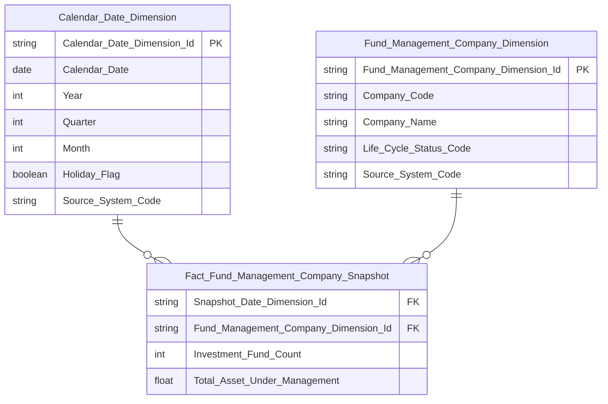

# erDiagram Rules — Star Schema

## Cú pháp bắt buộc

```
✅ Đúng:
```mermaid
erDiagram
    ...
```

❌ Sai:
```erDiagram
    ...
```
```

Thiếu `mermaid` → render thành plain text trên mọi renderer.

---

## Types hợp lệ

| Dùng | Không dùng |
|---|---|
| `int` | `decimal`, `decimal(23,2)` |
| `float` | `timestamp` |
| `string` | `nvarchar` |
| `varchar` | `bigint`, `smallint` |
| `boolean` | |
| `date` | |
| `datetime` | |

---

## Key Labels — chỉ 2 label hợp lệ: `PK` và `FK`

| Label | Dùng ở đâu | Điều kiện |
|---|---|---|
| `PK` | Dimension, Tác nghiệp | Surrogate key của entity |
| `FK` | **Chỉ** Fact entity block | Phải có `\|\|--o{` tương ứng |
| (trống) | Mọi attribute còn lại | Measure, Classification Value, date, boolean, DD, metadata |

❌ `NK`, `BK`, `DD` — không bao giờ xuất hiện trong erDiagram.
❌ `FK` không được gắn cho Classification Value field, date field, hay measure.
❌ `FK` trên Dimension hoặc Tác nghiệp → parse error.

---

## Tên entity và tên cột

**Tên entity:** dùng underscore, không dấu cách.
```
✅ Fund_Management_Company_Snapshot
❌ Fund Management Company Snapshot
```

**Tên cột:** Title_Case_With_Underscore.
```
✅ Snapshot_Date_Dimension_Id
✅ Investment_Fund_Count
❌ snapshot_date_dimension_id   (snake_case — chỉ dùng ở physical layer)
❌ SnapshotDateDimensionId      (PascalCase — không dùng)
```

---

## Quan hệ FK

Mỗi `FK` trong Fact block **bắt buộc** có đường quan hệ tương ứng:
```
Calendar_Date_Dimension ||--o{ Fact_FMS_Snapshot : " "
```

Label quan hệ: `" "` (space) — không để trống, không viết text.

---

## Không thiết kế trong erDiagram

Các trường sau do ETL tự quản lý — không đưa vào schema Datamart:
- `Effective Date`
- `Expiry Date`
- `Population Date`
- `Snapshot Date` → thay bằng `FK Snapshot_Date_Dimension_Id → Calendar Date Dimension`

---

## Mỗi cột trong Fact phải trace được về KPI/mockup — không copy nguyên attribute entity nguồn

**Quy tắc:** Trước khi đưa 1 attribute từ Atomic entity vào Fact, tự hỏi: attribute này phục vụ **KPI nào** (đo lường/GROUP BY/filter hiển thị) hoặc **mockup nào** đang thiết kế? Nếu không trả lời được → loại khỏi Fact.

❌ **Sai — đưa nguyên attribute còn lại của entity nguồn vào Fact "cho đủ":**
```
Fact_Securities_Company_Service_Registration {
    int Registration_Date_Dimension_Id FK
    int Securities_Company_Dimension_Id FK
    int Service_Type_Dimension_Id FK
    string Registration_Document_Number   ← không KPI nào dùng
    date Valid_Dossier_Date               ← không KPI nào dùng
    string Provisional_Indicator          ← không KPI nào dùng
}
```

✅ **Đúng — chỉ giữ FK + attribute có KPI tham chiếu:**
```
Fact_Securities_Company_Service_Registration {
    int Registration_Date_Dimension_Id FK
    int Securities_Company_Dimension_Id FK
    int Service_Type_Dimension_Id FK
}
```

**Trường hợp đặc biệt — cột chỉ dùng làm điều kiện lọc ETL (SCD4A current-state):** Khi Atomic entity nguồn có cột kiểu `Record_Status_Code`/`Is_Draft_Indicator` + `End_Date`/`Termination_Date` dùng để xác định "bản ghi nào đang hiệu lực tại ngày D", và Fact populate theo SCD4A (ETL lọc sẵn `Effective_Date <= D AND (End_Date IS NULL OR End_Date > D) AND Status_Code = 'ACTIVE'`) — 2 cột này **cũng không đưa vào erDiagram**, dù có "dùng" cho công thức KPI dưới dạng điều kiện WHERE. Lý do: sau khi ETL đã lọc, mọi row trong Fact chắc chắn là bản ghi hiệu lực rồi — filter lại vô nghĩa. Chỉ ghi chú bằng text ngay trong phần mô tả Nhóm:

> **ETL filter khi populate Fact (không xuất hiện trong schema Fact đã build):** `Record_Status_Code = '1'` AND `Effective_Date <= D` AND `(End_Date IS NULL OR End_Date > D)`.

**Checklist trước khi chốt Star Schema của 1 Nhóm:** rà từng cột trong Fact block, đối chiếu ngược lại bảng KPI của Nhóm đó — cột nào không xuất hiện trong bất kỳ công thức KPI nào → loại, trừ khi là FK trục thời gian/dimension chính hoặc đã ghi chú rõ là ETL filter.

---

## Nhất quán toàn file HLD

**Quy tắc quan trọng:** Mỗi bảng Datamart phải có **số trường và tên trường giống hệt nhau** ở mọi erDiagram trong toàn file HLD.

Ví dụ: nếu `Fact_FMS_Snapshot` có 5 trường ở Section 2 Nhóm 1, thì ở Section 2 Nhóm 2 và Section 3 cũng phải đúng 5 trường đó — không thêm, không bớt.

---

## Calendar Date Dimension — schema chuẩn bắt buộc

```
Calendar_Date_Dimension {
    string Calendar_Date_Dimension_Id PK
    date Calendar_Date
    int Year
    int Quarter
    int Month
    boolean Holiday_Flag
    string Source_System_Code
}
```

- `Is_Trading_Day` **không** tồn tại trong Atomic `cdr_dt` — không thêm vào erDiagram.
- `Is_Weekend`, `Holiday_Name` chỉ dùng nếu module thực sự cần và Atomic có field tương ứng.
- `Source_System_Code` bắt buộc — Calendar Date là static dimension, không có SCD.

---

## `Source_System_Code` trong erDiagram Dimension và Operational

Mọi bảng `Dimension` và `Operational` **bắt buộc có** `Source_System_Code` (thêm cuối danh sách field):

```
    Any_Dimension {
        string Any_Dimension_Id PK
        ...
        string Source_System_Code
    }
```

❌ Không thêm `Source_System_Code` vào Fact — Fact không có driving table cố định.

---

## Ví dụ erDiagram đúng


