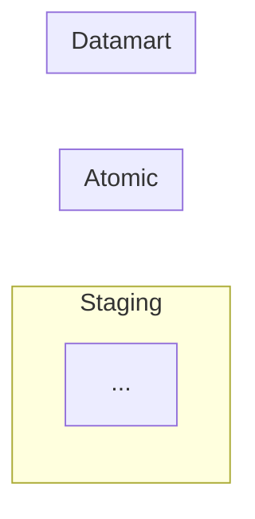
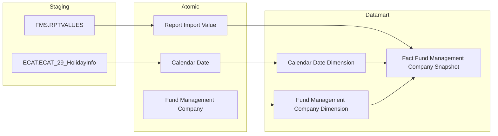

# Flowchart Rules — Data Lineage (Section 1)

## Mỗi Cụm chỉ 1 bảng Datamart (1 Fact hoặc 1 bảng Tác nghiệp)

**Rule cứng — bắt buộc tuyệt đối:** Mỗi Cụm trong Section 1 chỉ được vẽ **đúng 1 bảng ở subgraph Datamart** — 1 Fact duy nhất, hoặc 1 bảng Tác nghiệp duy nhất. Không được gộp nhiều Fact vào chung 1 Cụm/flowchart dù chúng dùng chung Atomic entity nguồn.

**Vì sao:** Khi nhiều Fact bắt nguồn từ cùng 1 entity Atomic cha (qua nhiều đường JOIN khác nhau), gộp chung 1 flowchart tạo ra nhiều node + nhiều edge chồng chéo — người đọc phải tự tách các luồng độc lập trong đầu thay vì đọc thẳng "bảng X đến từ đâu". Mỗi flowchart phải trả lời đúng 1 câu hỏi duy nhất.

**Cách xử lý khi 1 nhóm nghiệp vụ sinh nhiều Fact dùng chung Atomic entity cha:** Tách thành nhiều Cụm riêng biệt (VD: Cụm 1a, 1b, 1c), mỗi Cụm có flowchart độc lập chỉ chứa 1 Fact. Atomic entity cha được phép **lặp lại node** ở nhiều flowchart khác nhau — không dùng chung 1 flowchart để tránh lặp.

> ❌ **Sai (đã xảy ra thực tế — QLCB Cụm 1):** 1 flowchart chứa cả `Fact Securities Offering`, `Fact Securities Offering Plan`, `Fact Securities Offering Result` — 6 node Atomic, 6 node Datamart, ~20 edge trong cùng 1 sơ đồ vì cả 3 Fact đều bắt nguồn từ `Public Company Securities Offering` (entity cha) qua các đường khác nhau (trực tiếp / qua Plan / qua Result).
>
> ✅ **Đúng:** Tách thành 3 Cụm riêng:
> - Cụm 1a — Fact Securities Offering (grain: 1 hồ sơ)
> - Cụm 1b — Fact Securities Offering Plan (grain: 1 đợt × 1 loại hình kế hoạch)
> - Cụm 1c — Fact Securities Offering Result (grain: 1 đợt × 1 loại hình kết quả)
>
> Mỗi Cụm vẽ riêng node `Public Company Securities Offering` (lặp lại ở cả 3 flowchart) — chấp nhận trùng lặp node để đổi lấy flowchart đơn giản, dễ đọc.

**Ngoại lệ duy nhất:** Dimension không tính vào giới hạn "1 bảng/Cụm" — 1 Cụm/Fact vẫn được vẽ đầy đủ các Dimension liên quan (Calendar Date Dimension, Public Company Dimension...) trong cùng flowchart, vì Dimension luôn xuất hiện dưới dạng `Dim --> Fact`, không tạo thêm luồng độc lập cần tách.

---

## Cấu trúc bắt buộc



- Label subgraph: `SRC["Staging"]` / `SIL["Atomic"]` / `GOLD["Datamart"]` — KHÔNG đổi tên
- Bắt buộc 3 subgraph — không bỏ qua tầng Atomic dù source map thẳng
- Mũi tên nét liền `-->`, không label trên edge
- Không vẽ layer Báo cáo

---

## Subgraph Staging

**1 subgraph duy nhất** — gộp tất cả source tables từ mọi hệ thống, không chia block con.

Prefix table name thể hiện hệ thống nguồn:
```
FMS.RPTVALUES
QLRR.risk_indicator_value
ECAT.ECAT_29_HolidayInfo
```

**Node ID syntax — bắt buộc dùng `ID["label"]`:**
- Node ID: không được có dấu chấm (dấu chấm bị parse như CSS class selector)
- Label: hiển thị `source.table`

```
✅ Đúng:  FMS_RPTVALUES["FMS.RPTVALUES"]
❌ Sai:   FMS.RPTVALUES   (dấu chấm trong ID gây lỗi mermaid)
```

Các edge dùng node ID (không dùng label):
```
FMS_RPTVALUES --> rpt_impr_val
```

---

## Subgraph Atomic

**Node ID syntax — bắt buộc dùng `ID["label"]`:**
- Node ID: dùng `_` thay dấu cách
- Label: bỏ dấu `_`, hiển thị tên đầy đủ có cách

```
✅ Đúng:  Report_Import_Value["Report Import Value"]
❌ Sai:   Report_Import_Value   (mermaid render có dấu _)
```

---

## Subgraph Datamart

**Node ID syntax — bắt buộc dùng `ID["label"]`:**
- Node ID: tên physical (snake_case)
- Label: tên logical đầy đủ (lấy từ Entities.csv cột `datamart_entity`)

```
✅ Đúng:  fct_fms_snpst["Fact Fund Management Company Snapshot"]
❌ Sai:   fct_fms_snpst   (tên physical không có nghĩa với người đọc)
```

**Vị trí Dimension:** trong subgraph Datamart. Link vẽ `Dim --> Fact` (không phải `Fact --> Dim`).

---

## Quy tắc Calendar Date Dimension

**Bắt buộc** trong mọi Cụm có Fact — đủ 3 tầng:

```
Staging:  ECAT_ECAT_29_HolidayInfo["ECAT.ECAT_29_HolidayInfo"]
Atomic:   Calendar_Date["Calendar Date"]
Datamart: cdr_dt_dim["Calendar Date Dimension"]
```

Gộp `ECAT.ECAT_29_HolidayInfo` vào subgraph Staging chung — không tách riêng.

---

## Quy tắc Classification Dimension

Seed từ Classification Value — **chỉ vẽ trong subgraph Atomic:**

```
subgraph SIL["Atomic"]
    Classification_Value["Classification Value"]
    ...
end
subgraph GOLD["Datamart"]
    cl_dim["Classification Dimension"]
end
Classification_Value --> cl_dim
```

❌ Không vẽ node `cv` trong subgraph Staging.

---

## Quy tắc Tác nghiệp

Lineage chỉ vẽ: `Atomic entity → Bảng Tác nghiệp`.
❌ Không vẽ link `Dim → Tác nghiệp`.
❌ Cụm Tác nghiệp không có Fact → không cần Calendar Date Dimension.

---

## Ví dụ flowchart đầy đủ


