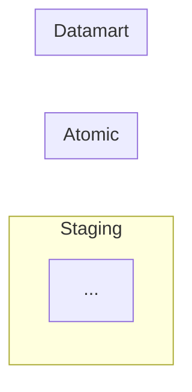
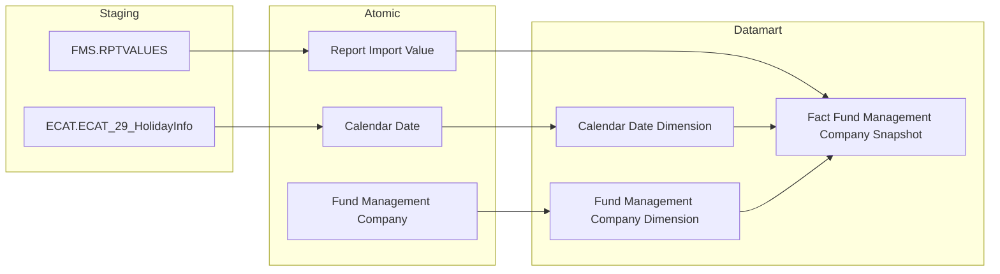

# Flowchart Rules — Data Lineage (Section 1)

## Cấu trúc bắt buộc



- Label subgraph: `SRC["Staging"]` / `SIL["Atomic"]` / `GOLD["Datamart"]` — KHÔNG đổi tên
- Bắt buộc 3 subgraph — không bỏ qua tầng Atomic dù source map thẳng
- Mũi tên nét liền `-->`, không label trên edge
- Không vẽ layer Báo cáo

---

## Subgraph Staging

**1 subgraph duy nhất** — gộp tất cả source tables từ mọi hệ thống, không chia block con.

Prefix table name thể hiện hệ thống nguồn:
```
FMS.RPTVALUES
QLRR.risk_indicator_value
ECAT.ECAT_29_HolidayInfo
```

**Node ID syntax — bắt buộc dùng `ID["label"]`:**
- Node ID: không được có dấu chấm (dấu chấm bị parse như CSS class selector)
- Label: hiển thị `source.table`

```
✅ Đúng:  FMS_RPTVALUES["FMS.RPTVALUES"]
❌ Sai:   FMS.RPTVALUES   (dấu chấm trong ID gây lỗi mermaid)
```

Các edge dùng node ID (không dùng label):
```
FMS_RPTVALUES --> rpt_impr_val
```

---

## Subgraph Atomic

**Node ID syntax — bắt buộc dùng `ID["label"]`:**
- Node ID: dùng `_` thay dấu cách
- Label: bỏ dấu `_`, hiển thị tên đầy đủ có cách

```
✅ Đúng:  Report_Import_Value["Report Import Value"]
❌ Sai:   Report_Import_Value   (mermaid render có dấu _)
```

---

## Subgraph Datamart

**Node ID syntax — bắt buộc dùng `ID["label"]`:**
- Node ID: tên physical (snake_case)
- Label: tên logical đầy đủ (lấy từ Entities.csv cột `datamart_entity`)

```
✅ Đúng:  fct_fms_snpst["Fact Fund Management Company Snapshot"]
❌ Sai:   fct_fms_snpst   (tên physical không có nghĩa với người đọc)
```

**Vị trí Dimension:** trong subgraph Datamart. Link vẽ `Dim --> Fact` (không phải `Fact --> Dim`).

---

## Quy tắc Calendar Date Dimension

**Bắt buộc** trong mọi Cụm có Fact — đủ 3 tầng:

```
Staging:  ECAT_ECAT_29_HolidayInfo["ECAT.ECAT_29_HolidayInfo"]
Atomic:   Calendar_Date["Calendar Date"]
Datamart: cdr_dt_dim["Calendar Date Dimension"]
```

Gộp `ECAT.ECAT_29_HolidayInfo` vào subgraph Staging chung — không tách riêng.

---

## Quy tắc Classification Dimension

Seed từ Classification Value — **chỉ vẽ trong subgraph Atomic:**

```
subgraph SIL["Atomic"]
    Classification_Value["Classification Value"]
    ...
end
subgraph GOLD["Datamart"]
    cls_dim["Classification Dimension"]
end
Classification_Value --> cls_dim
```

❌ Không vẽ node `cv` trong subgraph Staging.

---

## Quy tắc Tác nghiệp

Lineage chỉ vẽ: `Atomic entity → Bảng Tác nghiệp`.
❌ Không vẽ link `Dim → Tác nghiệp`.
❌ Cụm Tác nghiệp không có Fact → không cần Calendar Date Dimension.

---

## Ví dụ flowchart đầy đủ


