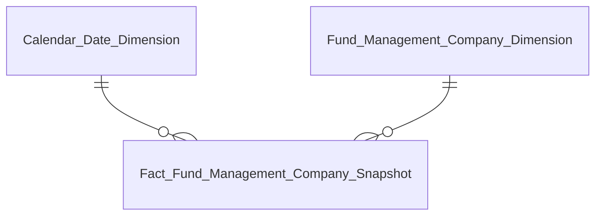

# Phase 2 — Entities Files Reference

## Nguồn sự thật: Section 3 + Section 4 HLD

Phase 2 sinh Entities **từ Section 3 và Section 4 của `DTM_{MODULE}_HLD.md`** — không cần Section 2, không cần erDiagram từng nhóm, không cần Attributes.csv.

### Mapping Section 3 → Entities.csv

| Cột Entities | Nguồn trong Section 3 |
|---|---|
| `datamart_entity` | Tên bảng trong bảng "Bảng Phân tích" / "Bảng Tác nghiệp" / "Bảng Dimension" |
| `table_type` | `fact` từ bảng Phân tích; `operational` từ bảng Tác nghiệp; `dim` từ bảng Dimension |
| `reuse_status` | Đọc từ **Section 4** — `new` / `reuse` / `partial` |
| `status` | Luôn `draft` |
| `description` | Ghép: cột Mô tả (hoặc Pattern) + " — grain " + cột Grain |
| `source_table` | Cột "Nguồn Atomic chính" → tra `atomic_attributes.yaml` lấy `atomic_table` vật lý; nhiều nguồn nối ` / ` |
| `FKs` | Đọc graph TB Section 3: mũi tên `DIM_X --> FACT_Y` → Dim nào join Fact nào |

### Rule trích xuất `FKs` từ graph TB

```
graph TB: DIM_DATE --> FACT_MKT   →   Calendar Date Dimension join Fact X
graph TB: DIM_CO --> FACT_NAV     →   Fund Management Company Dimension join Fact NAV
```

Quy tắc:
1. Tên FK attribute = `{Dim Entity Name} Id` — ví dụ Dim `Calendar Date Dimension` → FK = `Calendar Date Dimension Id`
2. Format: `{Dim Entity Name}.{FK Attribute Name}`, nhiều FK nối ` | `
3. `FKs` chỉ điền cho `fact` — **để trống** cho `dim` và `operational`

Ví dụ đầy đủ:
```
graph TB có: DIM_DATE --> FACT_MKT  và  DIM_CO --> FACT_MKT
→ FKs của "Fact Fund Management Company Snapshot" =
  "Calendar Date Dimension.Calendar Date Dimension Id | Fund Management Company Dimension.Fund Management Company Dimension Id"
```

### Rule trích xuất `source_table`

1. Đọc cột "Nguồn Atomic chính" → tên Atomic entity logical (VD: `Fund Management Company`)
2. Tra `DataModel/Atomic/dm_manifest.yaml` → tìm entry có `logical_name` khớp → lấy `physical_name` (VD: `fnd_mgt_co`)
   - Nếu có nhiều entry cùng `physical_name` (nhiều source table) → tra tất cả, lấy `physical_name` chung
3. Nhiều nguồn: nối ` / ` theo thứ tự driving table trước, join table sau
4. PENDING chưa xác định Atomic → để trống hoặc `TBD`

### Rule loại bảng PENDING toàn bộ khỏi Entities.csv

**Bắt buộc:** Fact/Dim/Operational **PENDING TOÀN BỘ** (không có bất kỳ KPI/Nhóm nào ở trạng thái READY trong Section 3/Section 2 HLD — 100% Gap Atomic hoặc chờ nguồn) → **KHÔNG đưa vào Entities.csv**.

**Lý do:** Nếu đưa vào CSV chính, `datamart-lld-design` Phase 1 (sinh Attributes) có thể xử lý nhầm như bảng đã sẵn sàng → map cột vào Atomic entity/attribute chưa tồn tại → sai lệch lan xuống Detail Mapping trước khi Atomic thực sự approved.

**Phân biệt quan trọng — chỉ loại khi PENDING 100%, không loại khi PENDING một phần:**

| Trường hợp | Xử lý |
|---|---|
| Fact/Dim có ít nhất 1 KPI/Nhóm READY (dù các KPI khác cùng bảng PENDING) | **Giữ trong Entities.csv** — phần READY cần Attributes thật để LLD thiết kế đúng |
| Fact/Dim PENDING toàn bộ (100% KPI/Nhóm dùng bảng đó đều PENDING, không có ngoại lệ) | **Loại khỏi Entities.csv** — liệt kê riêng trong Entities.md, không đưa vào CSV |

Ví dụ: `Fact Public Company Financial Summary Snapshot` có K_GSDC_46/47 READY dù K_GSDC_48/49 PENDING → **giữ trong CSV**. `Fact Public Company Financial Report Value` 100% PENDING (toàn bộ Nhóm dùng bảng này đều Gap Atomic) → **loại khỏi CSV**.

**Cách thể hiện trong Entities.md:** thêm mục "Bảng PENDING (không thiết kế trong Phase 2)" ở cuối file — bảng 3 cột `Datamart Entity | Lý do PENDING | Issue` (tham chiếu ID Open Issue ở Section 4/5 HLD). Không thêm bảng PENDING vào CSV, kể cả với `source_table = TBD`.

---

## Entities.csv

**Đường dẫn:** `Datamart/hld/DTM_{MODULE}_Entities.csv`

**Header:**
```
datamart_entity,table_type,reuse_status,status,description,source_table,FKs
```

### Quy tắc từng cột

| Cột | Quy tắc |
|---|---|
| `datamart_entity` | Tên logical đầy đủ — khớp với HLD và Attributes.csv |
| `table_type` | `fact` / `dim` / `operational` |
| `reuse_status` | `new` / `reuse` / `partial` — đọc từ Section 4 HLD; **bắt buộc có** |
| `status` | **`draft`** — toàn bộ rows khi Claude sinh; chỉ reviewer chuyển sang `ready` |
| `description` | 1 câu tiếng Việt ngắn gọn mô tả mục đích bảng + grain chính |
| `source_table` | Tên Atomic table(s) nguồn — `physical_name` từ `dm_manifest.yaml`; nhiều bảng nối bằng ` / ` |
| `FKs` | Chỉ điền cho `fact` — dạng `<Dim entity>.<FK field logical>` nối bằng ` \| ` |

### Giá trị `reuse_status`

| Giá trị | Nghĩa | LLD Phase 1 |
|---|---|---|
| `new` | Bảng mới hoàn toàn, chưa có trong master | Sinh file đầy đủ |
| `reuse` | Tái sử dụng toàn bộ — không thêm nguồn, không thêm cột | **Không sinh file** |
| `partial` | Tái sử dụng cấu trúc, thêm nguồn mới | Sinh file đầy đủ (toàn bộ cột) |

**Ví dụ:**
```csv
"datamart_entity","table_type","reuse_status","status","description","source_table","FKs"
"Calendar Date Dimension","dim","reuse","draft","Lịch ngày — năm/quý/tháng/ngày lễ phục vụ slicer","cdr_dt",""
"Fund Management Company Dimension","dim","new","draft","CTQLQ — SCD4A lưu current state, lịch sử ở bảng history riêng","fnd_mgt_co",""
"Fact Fund Management Company Snapshot","fact","new","draft","Thống kê thị trường CTQLQ — grain 1 snapshot toàn TT × 1 tháng","rpt_impr_val / fnd_mgt_co","Calendar Date Dimension.Snapshot Date Dimension Id | Fund Management Company Dimension.Fund Management Company Dimension Id"
"Foreign Investor 360 Profile","operational","partial","draft","Hồ sơ NĐT nước ngoài — 1 row per NĐT ở trạng thái hiện tại","frgn_ivsr",""
```

---

## Entities.md

**Đường dẫn:** `Datamart/hld/DTM_{MODULE}_Entities.md`

**Cấu trúc theo nhóm báo cáo** — mỗi nhóm gồm:
1. Tiêu đề nhóm (lấy từ Section 2 HLD)
2. erDiagram chỉ vẽ **relationship lines** — không vẽ attribute block
3. Bảng entity tóm tắt

### Format erDiagram trong Entities.md



Chỉ vẽ đường quan hệ — không có attribute block. Đây khác với erDiagram đầy đủ trong HLD.

### Bảng entity tóm tắt

| Datamart Entity | Loại | Reuse | Mô tả | Grain | KPI |
|---|---|---|---|---|---|
| Calendar Date Dimension | Dimension | reuse | Lịch ngày | 1 row / ngày | — |
| Fund Management Company Dimension | Dimension | new | CTQLQ (SCD4A) | 1 row / CTQLQ (current state) | — |
| Fact Fund Management Company Snapshot | Fact Snapshot | new | Thống kê thị trường | 1 snapshot / tháng | K_FMS_1, K_FMS_2 |

- Cột `Reuse`: hiển thị `reuse_status` để reviewer dễ nhận biết bảng nào cần thiết kế mới
- Cột `KPI`: liệt kê KPI ID từ HLD bảng KPI (Section 2) cho bảng Fact/Operational; để `—` cho Dimension
- Cột `Grain`: mô tả ngắn gọn tiếng Việt

---

## Thứ tự bảng trong output

Dimension → Fact → Operational (cùng thứ tự với Attributes.csv và TKCSLD).
