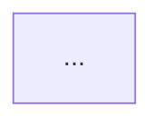
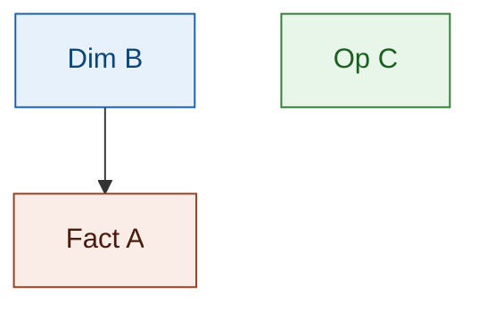

# Section Structure — DTM_{MODULE}_HLD.md

## Section cố định (bắt buộc, đúng thứ tự)

**Chuẩn duy nhất — 5 Section, không có biến thể:**

```
#### Section 1 — Data Lineage
#### Section 2 — Tổng quan báo cáo
#### Section 3 — Mô hình tổng thể
#### Section 4 — Reuse Analysis
#### Section 5 — Vấn đề mở
```

> **Chốt 5 Section (quyết định 2026-08-21) — thay thế hoàn toàn cấu trúc "mặc định 4 Section + biến thể 5 Section" trước đây.**
>
> Lý do: Bước 3 của `datamart-hld-design` đã bắt buộc **mọi** module chạy phân tích reuse 4 lớp và ghi kết quả (đã được human xác nhận tại GATE) vào Section 4 — nên Section 4 Reuse Analysis không bao giờ là tuỳ chọn. Giữ "4 Section" làm mặc định khiến chuẩn tự mâu thuẫn với chính quy trình của mình, và khiến `datamart-review` (vốn coi 5 Section là chuẩn) báo Critical giả/thật lẫn lộn.
>
> Thực tế 10/11 HLD hiện có đã dùng 5 Section. File chuẩn tham chiếu: `DTM_NHNCK_HLD.md`.
>
> - "Vấn đề mở" **luôn** là Section cuối cùng (Section 5). HLD nào đang để "Vấn đề mở" ở vị trí Section 4 → thiếu Section 4 Reuse Analysis, phải bổ sung và đẩy "Vấn đề mở" xuống Section 5.
> - Module chưa có bảng nào cần reuse (module đầu tiên, `datamart_model.yaml` rỗng) **vẫn phải có Section 4** — liệt kê đủ mọi bảng với `reuse_status = new`, không được bỏ Section.
> - Ngoại lệ đang tồn đọng: `DTM_VP_HLD.md` còn 4 Section, thiếu Section 4 — cần bổ sung khi chạm tới module VP.

---

## Section 1 — Data Lineage

Chia thành các **Cụm** — mỗi Cụm tổ chức theo **1 Fact**. Mỗi Cụm có:
- Tiêu đề: `##### Cụm N: [Tên nghiệp vụ] ([Tên Fact])`
- Flowchart 3 subgraph (xem `flowchart_rules.md`)

Nếu Atomic source trùng giữa các Cụm → vẫn vẽ lại đầy đủ trong từng Cụm.
Cụm Tác nghiệp (không có Fact) → không cần Calendar Date Dimension.

---

## Section 2 — Tổng quan báo cáo

### Hierarchy

```
### Tab [Tên tab]
#### Nhóm {STT} - [Tên nhóm]
```

**Quy tắc đặt tên từ cột "Dashboard/báo cáo" trong BA:**
- Cột BA format: `{Tên Tab}/ {Tên nhóm}`
- `### Tab` → lấy phần TRƯỚC dấu `/`
- `#### Nhóm` → `#### Nhóm {STT} - {phần SAU dấu /}` — STT lấy từ cột STT của BA, KHÔNG tự đánh số lại

| BA ghi | STT | → Tab | → Nhóm |
|---|---|---|---|
| `Dashboard Giám sát rủi ro/ Chỉ số rủi ro hệ thống` | 1 | `### Tab Dashboard Giám sát rủi ro` | `#### Nhóm 1 - Chỉ số rủi ro hệ thống` |
| `Dashboard Giám sát rủi ro/ Phân tích đóng góp rủi ro` | 2 | (đã có Tab) | `#### Nhóm 2 - Phân tích đóng góp rủi ro` |
| `Dashboard Sức khỏe thị trường và vĩ mô/ Chỉ số vĩ mô – tiền tệ` | 4 | `### Tab Dashboard Sức khỏe thị trường và vĩ mô` | `#### Nhóm 4 - Chỉ số vĩ mô – tiền tệ` |

> ⚠️ **KHÔNG tách header con `##### READY` / `##### PENDING` bên trong 1 Nhóm.** Mỗi Nhóm chỉ có **1 bảng KPI duy nhất**, chứa cả dòng READY lẫn dòng PENDING, phân biệt bằng cột `Trạng thái`. Đây áp dụng cho MỌI Nhóm — kể cả Nhóm 100% PENDING hoặc 100% READY vẫn dùng đúng 1 format bảng KPI này (không có "2 loại block" khác nhau về cấu trúc cột).

### Block Nhóm — thứ tự bắt buộc

```markdown
> Phân loại: **Phân tích** hoặc **Tác nghiệp**
> Atomic: `<Entity>` ← SOURCE.table — **READY** / **PENDING**

**Mockup:** <markdown table hoặc ASCII>

**Source:** `<Fact>` → `<Dim1>`, `<Dim2>` *(bỏ qua nếu toàn bộ Nhóm PENDING — chưa có Fact/Dim thật)*

**Bảng KPI:**

| KPI ID | Tên KPI | Đơn vị | Tính chất | Công thức | Ghi chú | Trạng thái |
|---|---|---|---|---|---|---|
| K_{MODULE}_N | ... | ... | Cơ sở / Phái sinh / Chiều | ... | *(để trống nếu KPI mới; "Reuse từ Nhóm X" nếu reuse)* | READY |
| K_{MODULE}_M | ... | — | Cơ sở / Phái sinh / Chiều | *(để trống hoặc ghi "TBD — chờ Atomic")* | **Lý do pending:** [...]. **Atomic cần bổ sung:** [...]. **Mart dự kiến:** [tên bảng] — grain: [...] | PENDING |

> ⚠️ **1 bảng KPI duy nhất cho cả Nhóm** — không tách theo trạng thái, không tách `*KPI mới:*` / `*KPI reuse:*` riêng biệt. Mọi dòng KPI của Nhóm (mới, reuse, READY, PENDING) nằm chung 1 bảng 7 cột.
> ⚠️ **Đơn vị/Công thức của dòng PENDING:** để trống hoặc ghi "TBD — chờ Atomic" — không bịa công thức khi chưa xác nhận nguồn.
> ⚠️ **Cột Ghi chú của dòng PENDING chứa toàn bộ nội dung trước đây nằm ở block PENDING riêng:** Lý do pending (bắt buộc), Atomic cần bổ sung (bắt buộc), Mart dự kiến — chỉ tên bảng + grain (bắt buộc). Viết súc tích, mỗi phần 1 câu.

**Star Schema:**

```mermaid
erDiagram
    ...
```

> Chỉ vẽ nếu Nhóm có ít nhất 1 dòng READY. Nhóm 100% PENDING → bỏ qua Star Schema/erDiagram hoàn toàn.

**Lineage Mart → Báo cáo:**



> Chỉ vẽ nếu Nhóm có ít nhất 1 dòng READY — cùng điều kiện với Star Schema.
>
> ⚠️ **Chỉ vẽ từ GOLD (Datamart) lên báo cáo** — KHÔNG vẽ Atomic entities (SIL layer) trong flowchart này. Node bắt đầu phải là bảng Fact/Dim/Operational thuộc GOLD layer.
>
> ⚠️ **Gộp 1 report node duy nhất cho toàn bộ Nhóm** — KHÔNG tách report node riêng theo từng Chiều/KPI/measure. Node báo cáo ghi dạng `"K_{MODULE}_N-M,X,Y: {Tên Nhóm ngắn gọn}"` (liệt kê dải/danh sách KPI ID trong cùng 1 node, chỉ liệt kê KPI READY — không đưa ID PENDING vào node báo cáo vì chưa có dữ liệu thật để lên báo cáo), không phải 1 node cho measure + 1 node riêng cho mỗi Chiều.

```
✅ Đúng:
subgraph RPT["Báo cáo — Nhóm 13"]
    R1["K_QLKD_46-50b,2814: Nguon von tang them trong ky"]
end
F1 --> R1

❌ Sai (tách report node theo từng Chiều/KPI):
subgraph RPT["Báo cáo — Nhóm 13"]
    R1["Nguồn vốn tăng thêm theo tháng (K_QLKD_47–50b)"]
    R2["Chiều hình thức tăng vốn (K_QLKD_46)"]
    R3["Chiều thời gian theo tháng (K_QLKD_2814)"]
end
F1 --> R1
D2 --> R2
D3 --> R3
```

**Bảng grain:**

| Tên bảng | Grain |
|---|---|
| ... | ... |
```

**Bảng grain** liệt kê TẤT CẢ bảng tham gia Star Schema (Fact + mọi Dimension). Bỏ qua nếu Nhóm 100% PENDING.

**Bảng mapping nguồn (Atomic Placeholder)** — chỉ thêm khi Nhóm có ít nhất 1 dòng PENDING, đặt ngay sau Bảng grain (hoặc ngay sau Bảng KPI nếu Nhóm 100% PENDING không có Bảng grain):

```markdown
**Bảng mapping nguồn (Atomic Placeholder):**

| Tên KPI | Bảng nguồn (BA) | Atomic entity dự kiến | Atomic table dự kiến |
|---|---|---|---|
| [Tên KPI] | [SOURCE.table từ cột Bảng nguồn BA] | [Tên logical entity Atomic] | [tên_vật_lý_dự_kiến] |
```

**Hướng dẫn điền Bảng mapping nguồn (Atomic Placeholder):**
- `Bảng nguồn (BA)`: chép trực tiếp từ cột **Bảng nguồn** của BA file (ví dụ: `MDDS.IDXInfor`, `QLRR.risk_indicator_value`)
- `Atomic entity dự kiến`: tên logical entity Atomic dự kiến sẽ được tạo (ví dụ: `Market Index Snapshot`)
- `Atomic table dự kiến`: tên vật lý snake_case dự kiến (ví dụ: `mdds_mkt_idx_snpst`) — có thể để `TBD` nếu chưa xác định
- Mỗi dòng = 1 Atomic entity riêng biệt (không gộp nhiều entity vào 1 dòng)
- Chỉ liệt kê các KPI đang PENDING trong bảng KPI chung ở trên — không lặp lại KPI READY
- Bảng này là **thông tin thiết kế tham chiếu** — khi Atomic bổ sung entity, người thiết kế tra bảng này để verify tên table thực tế rồi đổi cột Trạng thái dòng đó sang READY trong bảng KPI, không cần đọc lại BA

❌ KHÔNG thiết kế Star Schema, erDiagram, Lineage cho dòng/Nhóm PENDING.
❌ KHÔNG tạo Open Issue về grain/schema/logic cho KPI PENDING — chỉ issue xác nhận thiếu Atomic.

**Quy tắc đồng bộ khi 1 KPI chuyển PENDING → READY:**
- Đổi cột Trạng thái của dòng đó từ `PENDING` sang `READY` ngay trong bảng KPI hiện có — KHÔNG tạo dòng mới, KHÔNG tạo bảng mới.
- Điền đủ Đơn vị/Công thức thật, xóa nội dung "Lý do pending/Atomic cần bổ sung/Mart dự kiến" khỏi cột Ghi chú (thay bằng ghi chú nghiệp vụ thật nếu cần).
- Xóa dòng KPI đó khỏi Bảng mapping nguồn (Atomic Placeholder) nếu bảng đó chỉ còn KPI đã READY.
- Bổ sung Star Schema/Lineage/Bảng grain nếu Nhóm trước đó 100% PENDING (chưa có, giờ cần vẽ mới) hoặc mở rộng Star Schema hiện có nếu Nhóm đã có phần READY khác.

**Pattern: Nhóm lặp lại cùng cấu trúc KPI (VD: HĐTL VN30 / VN100 / TPCP):**
- Nhóm đầu tiên → khai sinh KPI ID mới đầy đủ
- Nhóm tiếp theo cùng cấu trúc → dòng KPI PENDING trong bảng chung, KHÔNG cấp ID mới
- Cột Ghi chú ghi "Mart dự kiến (reuse)" để rõ không tạo Fact mới
- Lý do pending và Atomic cần bổ sung ghi ngắn "xem Nhóm [tên nhóm đầu tiên]"

**Pattern: Nhóm READY reuse toàn bộ Fact/KPI từ Nhóm khác (VD: Data Explorer reuse Fact chấm điểm gốc):**
- **Bảng KPI vẫn bắt buộc đầy đủ** — liệt kê lại toàn bộ KPI_ID reuse với đủ 7 cột (KPI ID | Tên KPI | Đơn vị | Tính chất | Atomic Entity/Table/Attribute/Column | Ghi chú "Reuse từ Nhóm X" | Trạng thái). KHÔNG được thay bằng 1 dòng văn xuôi "KPI liên quan: liệt kê ID" — đây là căn cứ duy nhất để trace KPI Done trong BA → KPI_ID trong HLD ở Lớp 1 review.
- Chỉ **Star Schema / Lineage / Bảng grain** được phép rút gọn thành "giống Nhóm X" khi Fact/Dim dùng chung 100% với Nhóm gốc — không cần vẽ lại mermaid.
- Mockup/Source có thể refer ngắn gọn nếu giao diện Data Explorer chỉ là bảng dữ liệu thô (không có chart riêng).

---

## Section 3 — Mô hình tổng thể

### 3.1 graph TB



Hiển thị node + edge + màu phân loại (dim/fact/oper). Không thêm thông tin khác.
Node label không dùng `\n` — viết trên 1 dòng duy nhất.

### 3.2 Bảng Phân tích (chỉ liệt kê Fact)

| Bảng | Pattern | Grain | KPI | Trạng thái |
|---|---|---|---|---|

- `Pattern`: `Periodic Snapshot` hoặc `Event`
- `Grain`: mô tả ngắn 1 dòng đại diện cho gì
- `KPI`: liệt kê dải/danh sách KPI_ID kèm `(Nhóm N)` — gộp reuse cùng dòng nếu Fact dùng chung nhiều Nhóm
- `Trạng thái`: READY / READY (Atomic draft — chưa approved) / PENDING, kèm ghi chú ngắn gap nếu có

### 3.3 Bảng Tác nghiệp

Ghi "Không có." khi không có bảng Tác nghiệp.

| Bảng | Grain | KPI | Trạng thái |
|---|---|---|---|

Cùng quy tắc cột KPI/Trạng thái như 3.2. Áp dụng khi module có nhiều Operational table denormalized theo entity 360 (VD: NHNCK — Practitioner 360 Profile, Certificate History...).

### 3.4 Bảng Dimension (chỉ liệt kê Dimension)

*Tất cả Dimension áp dụng SCD Type 4A (trừ khi ghi chú khác, VD SCD2 khi kế thừa từ module khác).*

| Dimension | Loại | Mô tả | Scheme | Trạng thái |
|---|---|---|---|---|

- `Loại`: `Conformed` (dùng chung cross-module) / `Reference per module` / `SCD2` (nếu kế thừa thiết kế cũ)
- `Scheme`: liệt kê Classification Value scheme dùng trong Dimension này, `—` nếu không có

---

## Section 4 — Reuse Analysis

Kết quả phân tích reuse 4 lớp ở Bước 3 (`datamart-hld-design`), **sau khi đã được human xác nhận tại GATE**. Bắt buộc có ở mọi module.

| Datamart Entity | datamart_table | reuse_status | Ghi chú |
|---|---|---|---|
| Calendar Date Dimension | cdr_dt_dim | reuse | Conformed Dim toàn hệ thống |
| Branch Dimension | branch_dim | partial | Đã có nguồn FLEX; module này thêm nguồn NHNCK |
| Fact ATM Transaction | fct_atm_transaction | new | Chưa có trong `datamart_model.yaml` |

- Mỗi bảng Fact/Dim/Operational xuất hiện ở Section 3 phải có **đúng 1 dòng** ở đây.
- `reuse_status ∈ {reuse, partial, new}` — không tự gán, lấy đúng giá trị human đã xác nhận.
- Đây là **nguồn sự thật cho Phase 2** — cột `reuse_status` trong `Entities.csv` đọc trực tiếp từ Section này.

---

## Section 5 — Vấn đề mở

Luôn là Section cuối cùng.

| ID | Vấn đề | Giả định hiện tại | KPI liên quan | Trạng thái |
|---|---|---|---|---|
| O_{MODULE}_N | ... | ... | K_{MODULE}_... | Open / Confirmed / Closed |
