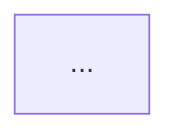
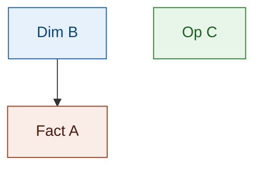

# Section Structure — DTM_{MODULE}_HLD.md

## Section cố định (bắt buộc, đúng thứ tự)

Mặc định 4 Section:

```
#### Section 1 — Data Lineage
#### Section 2 — Tổng quan báo cáo
#### Section 3 — Mô hình tổng thể
#### Section 4 — Vấn đề mở
```

**Biến thể 5 Section** — dùng khi module có nhiều KPI reuse xuyên suốt nhiều Nhóm/Fact (reuse ở cấp KPI/cột, gate rule theo "Loại dữ liệu", gap Atomic dùng chung nhiều Nhóm) đủ phức tạp để cần một Section tổng hợp riêng thay vì rải rác trong từng Nhóm ở Section 2:

```
#### Section 1 — Data Lineage
#### Section 2 — Tổng quan báo cáo
#### Section 3 — Mô hình tổng thể
#### Section 4 — Reuse Analysis
#### Section 5 — Vấn đề mở
```

Ví dụ áp dụng: `DTM_NHNCK_HLD.md` (file chuẩn tham chiếu), `DTM_GSDC_HLD.md`, `DTM_QLKD_HLD.md`. Khi dùng biến thể 5-section, "Vấn đề mở" luôn là Section cuối cùng (Section 5), không phải Section 4.

---

## Section 1 — Data Lineage

Chia thành các **Cụm** — mỗi Cụm tổ chức theo **1 Fact**. Mỗi Cụm có:
- Tiêu đề: `##### Cụm N: [Tên nghiệp vụ] ([Tên Fact])`
- Flowchart 3 subgraph (xem `flowchart_rules.md`)

Nếu Atomic source trùng giữa các Cụm → vẫn vẽ lại đầy đủ trong từng Cụm.
Cụm Tác nghiệp (không có Fact) → không cần Calendar Date Dimension.

---

## Section 2 — Tổng quan báo cáo

### Hierarchy

```
### Tab [Tên tab]
#### Nhóm {STT} - [Tên nhóm]
##### READY (chỉ hiện khi Nhóm có cả READY lẫn PENDING)
##### PENDING (chỉ hiện khi Nhóm có cả READY lẫn PENDING)
```

**Quy tắc đặt tên từ cột "Dashboard/báo cáo" trong BA:**
- Cột BA format: `{Tên Tab}/ {Tên nhóm}`
- `### Tab` → lấy phần TRƯỚC dấu `/`
- `#### Nhóm` → `#### Nhóm {STT} - {phần SAU dấu /}` — STT lấy từ cột STT của BA, KHÔNG tự đánh số lại

| BA ghi | STT | → Tab | → Nhóm |
|---|---|---|---|
| `Dashboard Giám sát rủi ro/ Chỉ số rủi ro hệ thống` | 1 | `### Tab Dashboard Giám sát rủi ro` | `#### Nhóm 1 - Chỉ số rủi ro hệ thống` |
| `Dashboard Giám sát rủi ro/ Phân tích đóng góp rủi ro` | 2 | (đã có Tab) | `#### Nhóm 2 - Phân tích đóng góp rủi ro` |
| `Dashboard Sức khỏe thị trường và vĩ mô/ Chỉ số vĩ mô – tiền tệ` | 4 | `### Tab Dashboard Sức khỏe thị trường và vĩ mô` | `#### Nhóm 4 - Chỉ số vĩ mô – tiền tệ` |

Nếu Nhóm chỉ có READY hoặc chỉ có PENDING → không cần header `##### READY` / `##### PENDING`.

### Block READY — thứ tự bắt buộc

```markdown
> Phân loại: **Phân tích** hoặc **Tác nghiệp**
> Atomic: `<Entity>` ← SOURCE.table — **READY**

**Mockup:** <markdown table hoặc ASCII>

**Source:** `<Fact>` → `<Dim1>`, `<Dim2>`

**Bảng KPI:**

| KPI ID | Tên KPI | Đơn vị | Tính chất | Công thức | Ghi chú |
|---|---|---|---|---|---|
| K_{MODULE}_N | ... | ... | Cơ sở / Phái sinh / Chiều | ... | *(để trống nếu KPI mới; điền "Reuse từ Nhóm X" nếu reuse)* |

> ⚠️ **1 bảng duy nhất cho cả KPI mới lẫn reuse** — KHÔNG tách thành `*KPI mới:*` / `*KPI reuse:*` riêng biệt.

**Star Schema:**

```mermaid
erDiagram
    ...
```

**Lineage Mart → Báo cáo:**



> ⚠️ **Chỉ vẽ từ GOLD (Datamart) lên báo cáo** — KHÔNG vẽ Atomic entities (SIL layer) trong flowchart này. Node bắt đầu phải là bảng Fact/Dim/Operational thuộc GOLD layer.
>
> ⚠️ **Gộp 1 report node duy nhất cho toàn bộ Nhóm** — KHÔNG tách report node riêng theo từng Chiều/KPI/measure. Node báo cáo ghi dạng `"K_{MODULE}_N-M,X,Y: {Tên Nhóm ngắn gọn}"` (liệt kê dải/danh sách KPI ID trong cùng 1 node), không phải 1 node cho measure + 1 node riêng cho mỗi Chiều.

```
✅ Đúng:
subgraph RPT["Báo cáo — Nhóm 13"]
    R1["K_QLKD_46-50b,2814: Nguon von tang them trong ky"]
end
F1 --> R1

❌ Sai (tách report node theo từng Chiều/KPI):
subgraph RPT["Báo cáo — Nhóm 13"]
    R1["Nguồn vốn tăng thêm theo tháng (K_QLKD_47–50b)"]
    R2["Chiều hình thức tăng vốn (K_QLKD_46)"]
    R3["Chiều thời gian theo tháng (K_QLKD_2814)"]
end
F1 --> R1
D2 --> R2
D3 --> R3
```

**Bảng grain:**

| Tên bảng | Grain |
|---|---|
| ... | ... |
```

**Bảng grain** liệt kê TẤT CẢ bảng tham gia Star Schema (Fact + mọi Dimension).

### Block PENDING — thứ tự bắt buộc

```markdown
**KPI liên quan:** K_{MODULE}_N (mới); K_{MODULE}_X, K_{MODULE}_Y (reuse từ Nhóm M)

**Lý do pending:** [Mô tả ngắn lý do Atomic chưa sẵn sàng]

**Atomic cần bổ sung:** [Tên entity Atomic cần thiết kế/hoàn thiện]

**Mart dự kiến:**
- [Tên bảng] — grain: [mô tả grain dự kiến]

**Bảng mapping nguồn (Atomic Placeholder):**

| Tên KPI | Bảng nguồn (BA) | Atomic entity dự kiến | Atomic table dự kiến |
|---|---|---|---|
| [Tên KPI] | [SOURCE.table từ cột Bảng nguồn BA] | [Tên logical entity Atomic] | [tên_vật_lý_dự_kiến] |

**Bảng KPI PENDING:**

| KPI ID | Tên KPI | Tính chất | Trạng thái |
|---|---|---|---|
| K_{MODULE}_N | ... | Cơ sở / Phái sinh / Chiều | PENDING |
| K_{MODULE}_X | ... (reuse từ Nhóm M) | Cơ sở / Phái sinh | PENDING |
```

> ⚠️ **KPI reuse trong PENDING thêm vào bảng 4 cột bình thường** — KHÔNG tách thành bảng reuse riêng. Cột Tên KPI ghi thêm "(reuse từ Nhóm M)" để phân biệt nguồn gốc.

**Hướng dẫn điền Bảng mapping nguồn (Atomic Placeholder):**
- `Bảng nguồn (BA)`: chép trực tiếp từ cột **Bảng nguồn** của BA file (ví dụ: `MDDS.IDXInfor`, `QLRR.risk_indicator_value`)
- `Atomic entity dự kiến`: tên logical entity Atomic dự kiến sẽ được tạo (ví dụ: `Market Index Snapshot`)
- `Atomic table dự kiến`: tên vật lý snake_case dự kiến (ví dụ: `mdds_mkt_idx_snpst`) — có thể để `TBD` nếu chưa xác định
- Mỗi dòng = 1 Atomic entity riêng biệt (không gộp nhiều entity vào 1 dòng)
- Bảng này là **thông tin thiết kế tham chiếu** — khi Atomic bổ sung entity, người thiết kế tra bảng này để verify tên table thực tế rồi chuyển block sang READY, không cần đọc lại BA

❌ Bảng KPI PENDING chỉ có **4 cột** — KHÔNG có Đơn vị, Công thức.
❌ KHÔNG thiết kế Star Schema, erDiagram, Lineage cho block PENDING.
❌ KHÔNG tạo Open Issue về grain/schema/logic cho bảng PENDING — chỉ issue xác nhận thiếu Atomic.

**Quy tắc "KPI liên quan" trong PENDING header:**
- Liệt kê đúng và đủ các ID thực sự xuất hiện trong bảng KPI bên dưới (cả mới lẫn reuse)
- Sau khi sửa bảng KPI → cập nhật dòng này ngay, không để lệch

**Pattern: Nhóm lặp lại cùng cấu trúc KPI (VD: HĐTL VN30 / VN100 / TPCP):**
- Nhóm đầu tiên → khai sinh KPI ID mới đầy đủ
- Nhóm tiếp theo cùng cấu trúc → block PENDING chỉ chứa bảng reuse, KHÔNG cấp ID mới
- Mart dự kiến ghi "(reuse)" để rõ không tạo Fact mới
- Lý do pending và Atomic cần bổ sung ghi ngắn "xem Nhóm [tên nhóm đầu tiên]"

**Pattern: Nhóm READY reuse toàn bộ Fact/KPI từ Nhóm khác (VD: Data Explorer reuse Fact chấm điểm gốc):**
- **Bảng KPI vẫn bắt buộc đầy đủ** — liệt kê lại toàn bộ KPI_ID reuse với đủ 6 cột (KPI ID | Tên KPI | Đơn vị | Tính chất | Atomic Entity/Table/Attribute/Column | Ghi chú "Reuse từ Nhóm X"). KHÔNG được thay bằng 1 dòng văn xuôi "KPI liên quan: liệt kê ID" — đây là căn cứ duy nhất để trace KPI Done trong BA → KPI_ID trong HLD ở Lớp 1 review.
- Chỉ **Star Schema / Lineage / Bảng grain** được phép rút gọn thành "giống Nhóm X" khi Fact/Dim dùng chung 100% với Nhóm gốc — không cần vẽ lại mermaid.
- Mockup/Source có thể refer ngắn gọn nếu giao diện Data Explorer chỉ là bảng dữ liệu thô (không có chart riêng).

---

## Section 3 — Mô hình tổng thể

### 3.1 graph TB



Hiển thị node + edge + màu phân loại (dim/fact/oper). Không thêm thông tin khác.
Node label không dùng `\n` — viết trên 1 dòng duy nhất.

### 3.2 Bảng Phân tích (chỉ liệt kê Fact)

| Bảng | Pattern | Grain | KPI | Trạng thái |
|---|---|---|---|---|

- `Pattern`: `Periodic Snapshot` hoặc `Event`
- `Grain`: mô tả ngắn 1 dòng đại diện cho gì
- `KPI`: liệt kê dải/danh sách KPI_ID kèm `(Nhóm N)` — gộp reuse cùng dòng nếu Fact dùng chung nhiều Nhóm
- `Trạng thái`: READY / READY (Atomic draft — chưa approved) / PENDING, kèm ghi chú ngắn gap nếu có

### 3.3 Bảng Tác nghiệp

Ghi "Không có." khi không có bảng Tác nghiệp.

| Bảng | Grain | KPI | Trạng thái |
|---|---|---|---|

Cùng quy tắc cột KPI/Trạng thái như 3.2. Áp dụng khi module có nhiều Operational table denormalized theo entity 360 (VD: NHNCK — Practitioner 360 Profile, Certificate History...).

### 3.4 Bảng Dimension (chỉ liệt kê Dimension)

*Tất cả Dimension áp dụng SCD Type 4A (trừ khi ghi chú khác, VD SCD2 khi kế thừa từ module khác).*

| Dimension | Loại | Mô tả | Scheme | Trạng thái |
|---|---|---|---|---|

- `Loại`: `Conformed` (dùng chung cross-module) / `Reference per module` / `SCD2` (nếu kế thừa thiết kế cũ)
- `Scheme`: liệt kê Classification Value scheme dùng trong Dimension này, `—` nếu không có

---

## Section 4 — Vấn đề mở

| ID | Vấn đề | Giả định hiện tại | KPI liên quan | Trạng thái |
|---|---|---|---|---|
| O_{MODULE}_N | ... | ... | K_{MODULE}_... | Open / Confirmed / Closed |
