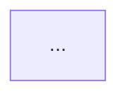
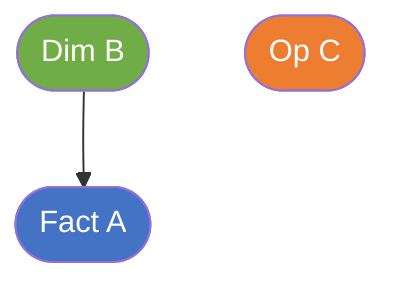

# Section Structure — DTM_{MODULE}_HLD.md

## 4 Section cố định (bắt buộc, đúng thứ tự)

```
#### Section 1 — Data Lineage
#### Section 2 — Tổng quan báo cáo
#### Section 3 — Mô hình tổng thể
#### Section 4 — Vấn đề mở
```

---

## Section 1 — Data Lineage

Chia thành các **Cụm** — mỗi Cụm tổ chức theo **1 Fact**. Mỗi Cụm có:
- Tiêu đề: `##### Cụm N: [Tên nghiệp vụ] ([Tên Fact])`
- Flowchart 3 subgraph (xem `flowchart_rules.md`)

Nếu Atomic source trùng giữa các Cụm → vẫn vẽ lại đầy đủ trong từng Cụm.
Cụm Tác nghiệp (không có Fact) → không cần Calendar Date Dimension.

---

## Section 2 — Tổng quan báo cáo

### Hierarchy

```
### Tab [Tên tab]
#### Nhóm [Tên nhóm]
##### READY (chỉ hiện khi Nhóm có cả READY lẫn PENDING)
##### PENDING (chỉ hiện khi Nhóm có cả READY lẫn PENDING)
```

Nếu Nhóm chỉ có READY hoặc chỉ có PENDING → không cần header `##### READY` / `##### PENDING`.

### Block READY — thứ tự bắt buộc

```markdown
> Phân loại: **Phân tích** hoặc **Tác nghiệp**
> Atomic: `<Entity>` ← SOURCE.table — **READY**

**Mockup:** <markdown table hoặc ASCII>

**Source:** `<Fact>` → `<Dim1>`, `<Dim2>`

**Bảng KPI:**

| KPI ID | Tên KPI | Đơn vị | Tính chất | Công thức | Ghi chú |
|---|---|---|---|---|---|
| K_{MODULE}_N | ... | ... | Cơ sở / Phái sinh / Chiều | ... | *(để trống nếu KPI mới; điền "Reuse từ Nhóm X" nếu reuse)* |

> ⚠️ **1 bảng duy nhất cho cả KPI mới lẫn reuse** — KHÔNG tách thành `*KPI mới:*` / `*KPI reuse:*` riêng biệt.

**Star Schema:**

```mermaid
erDiagram
    ...
```

**Lineage Mart → Báo cáo:**



> ⚠️ **Chỉ vẽ từ GOLD (Datamart) lên báo cáo** — KHÔNG vẽ Atomic entities (SIL layer) trong flowchart này. Node bắt đầu phải là bảng Fact/Dim/Operational thuộc GOLD layer.

**Bảng grain:**

| Tên bảng | Grain |
|---|---|
| ... | ... |
```

**Bảng grain** liệt kê TẤT CẢ bảng tham gia Star Schema (Fact + mọi Dimension).

### Block PENDING — thứ tự bắt buộc

```markdown
**KPI liên quan:** K_{MODULE}_N (mới); K_{MODULE}_X, K_{MODULE}_Y (reuse từ Nhóm M)

**Lý do pending:** [Mô tả ngắn lý do Atomic chưa sẵn sàng]

**Atomic cần bổ sung:** [Tên entity Atomic cần thiết kế/hoàn thiện]

**Mart dự kiến:**
- [Tên bảng] — grain: [mô tả grain dự kiến]

**Bảng KPI PENDING:**

| KPI ID | Tên KPI | Tính chất | Trạng thái |
|---|---|---|---|
| K_{MODULE}_N | ... | Cơ sở / Phái sinh / Chiều | PENDING |
| K_{MODULE}_X | ... (reuse từ Nhóm M) | Cơ sở / Phái sinh | PENDING |
```

> ⚠️ **KPI reuse trong PENDING thêm vào bảng 4 cột bình thường** — KHÔNG tách thành bảng reuse riêng. Cột Tên KPI ghi thêm "(reuse từ Nhóm M)" để phân biệt nguồn gốc.

❌ Bảng KPI PENDING chỉ có **4 cột** — KHÔNG có Đơn vị, Công thức.
❌ KHÔNG thiết kế Star Schema, erDiagram, Lineage cho block PENDING.
❌ KHÔNG tạo Open Issue về grain/schema/logic cho bảng PENDING — chỉ issue xác nhận thiếu Atomic.

**Quy tắc "KPI liên quan" trong PENDING header:**
- Liệt kê đúng và đủ các ID thực sự xuất hiện trong bảng KPI bên dưới (cả mới lẫn reuse)
- Sau khi sửa bảng KPI → cập nhật dòng này ngay, không để lệch

**Pattern: Nhóm lặp lại cùng cấu trúc KPI (VD: HĐTL VN30 / VN100 / TPCP):**
- Nhóm đầu tiên → khai sinh KPI ID mới đầy đủ
- Nhóm tiếp theo cùng cấu trúc → block PENDING chỉ chứa bảng reuse, KHÔNG cấp ID mới
- Mart dự kiến ghi "(reuse)" để rõ không tạo Fact mới
- Lý do pending và Atomic cần bổ sung ghi ngắn "xem Nhóm [tên nhóm đầu tiên]"

---

## Section 3 — Mô hình tổng thể

### 3.1 graph TB



Hiển thị node + edge + màu phân loại. Không thêm thông tin khác.
Node label không dùng `\n` — viết trên 1 dòng duy nhất.

### 3.2 Bảng Phân tích (chỉ liệt kê Fact)

| Tên bảng Datamart | Mô tả | Fact Pattern | Grain | Nguồn Atomic chính |
|---|---|---|---|---|

- `Fact Pattern`: `Fact Event` hoặc `Fact Snapshot`
- `Mô tả`: 1 câu ngắn mục đích nghiệp vụ

### 3.3 Bảng Tác nghiệp

Ghi "Không có" khi không có bảng Tác nghiệp.

| Tên bảng Datamart | Mô tả | Grain | Nguồn Atomic chính |
|---|---|---|---|

### 3.4 Bảng Dimension (chỉ liệt kê Dimension)

*Tất cả Dimension áp dụng SCD Type 4A.*

| Tên bảng Datamart | Mô tả | Grain | Nguồn Atomic chính | Conformed |
|---|---|---|---|---|

- `Conformed`: `Có` (dùng chung cross-module) hoặc `Không`

---

## Section 4 — Vấn đề mở

| ID | Vấn đề | Giả định hiện tại | KPI liên quan | Trạng thái |
|---|---|---|---|---|
| O_{MODULE}_N | ... | ... | K_{MODULE}_... | Open / Confirmed / Closed |
