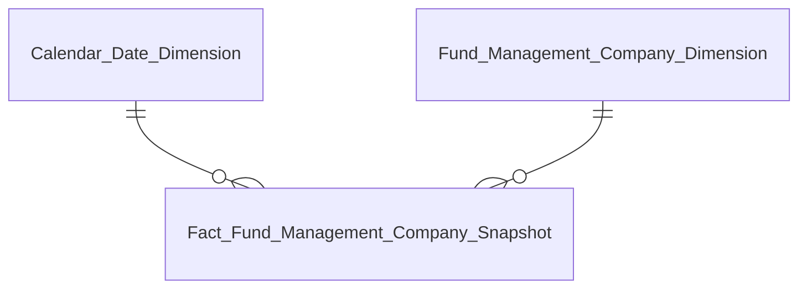

# Phase 2b — Entities Files Reference

## Entities.csv

**Đường dẫn:** `Datamart/hld/DTM_{MODULE}_Entities.csv`

**Header:**
```
datamart_entity,table_type,status,description,source_table,FKs
```

### Quy tắc từng cột

| Cột | Quy tắc |
|---|---|
| `datamart_entity` | Tên logical đầy đủ — khớp với HLD và Attributes.csv |
| `table_type` | `fact` / `dim` / `operational` |
| `status` | **`draft`** — toàn bộ rows khi Claude sinh; chỉ reviewer chuyển sang `ready` |
| `description` | 1 câu tiếng Việt ngắn gọn mô tả mục đích bảng + grain chính |
| `source_table` | Tên Atomic table(s) nguồn — dùng `atomic_table` từ Attributes.csv; nhiều bảng nối bằng ` / ` |
| `FKs` | Chỉ điền cho `fact` — dạng `<Dim entity>.<FK field logical>` nối bằng ` \| ` |

**Ví dụ:**
```csv
"datamart_entity","table_type","status","description","source_table","FKs"
"Calendar Date Dimension","dim","draft","Lịch ngày — năm/quý/tháng/ngày lễ phục vụ slicer","cdr_dt",""
"Fund Management Company Dimension","dim","draft","CTQLQ — SCD2 lưu lịch sử trạng thái và thông tin cơ bản","fnd_mgt_co",""
"Fact Fund Management Company Snapshot","fact","draft","Thống kê thị trường CTQLQ — grain 1 snapshot toàn TT × 1 tháng","rpt_impr_val / fnd_mgt_co","Calendar Date Dimension.Snapshot Date Dimension Id | Fund Management Company Dimension.Fund Management Company Dimension Id"
"Foreign Investor 360 Profile","operational","draft","Hồ sơ NĐT nước ngoài — 1 row per NĐT ở trạng thái hiện tại","frgn_ivsr",""
```

---

## Entities.md

**Đường dẫn:** `Datamart/hld/DTM_{MODULE}_Entities.md`

**Cấu trúc theo nhóm báo cáo** — mỗi nhóm gồm:
1. Tiêu đề nhóm (lấy từ Section 2 HLD)
2. erDiagram chỉ vẽ **relationship lines** — không vẽ attribute block
3. Bảng entity tóm tắt

### Format erDiagram trong Entities.md



Chỉ vẽ đường quan hệ — không có attribute block. Đây khác với erDiagram đầy đủ trong HLD.

### Bảng entity tóm tắt

| Datamart Entity | Loại | Mô tả | Grain | KPI |
|---|---|---|---|---|
| Calendar Date Dimension | Dimension | Lịch ngày | 1 row / ngày | — |
| Fund Management Company Dimension | Dimension | CTQLQ (SCD2) | 1 row / CTQLQ / version | — |
| Fact Fund Management Company Snapshot | Fact Snapshot | Thống kê thị trường | 1 snapshot / tháng | K_FMS_1, K_FMS_2 |

- Cột `KPI`: liệt kê KPI ID từ HLD bảng KPI (Section 2) cho bảng Fact/Operational; để `—` cho Dimension
- Cột `Grain`: mô tả ngắn gọn tiếng Việt

---

## Thứ tự bảng trong output

Dimension → Fact → Operational (cùng thứ tự với Attributes.csv và TKCSLD).
