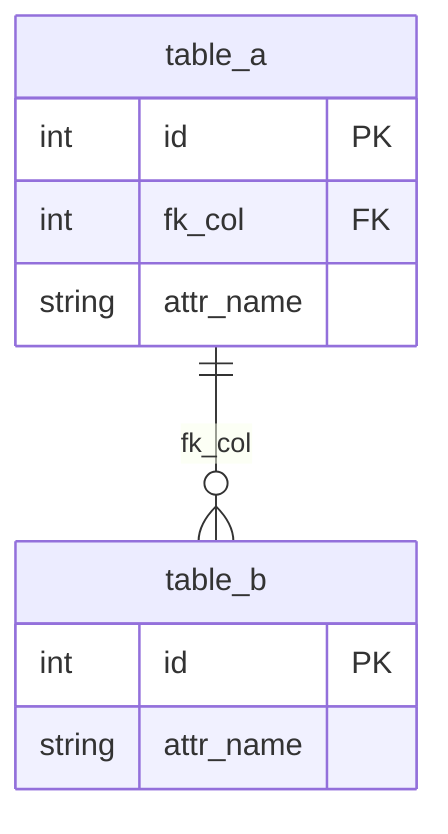
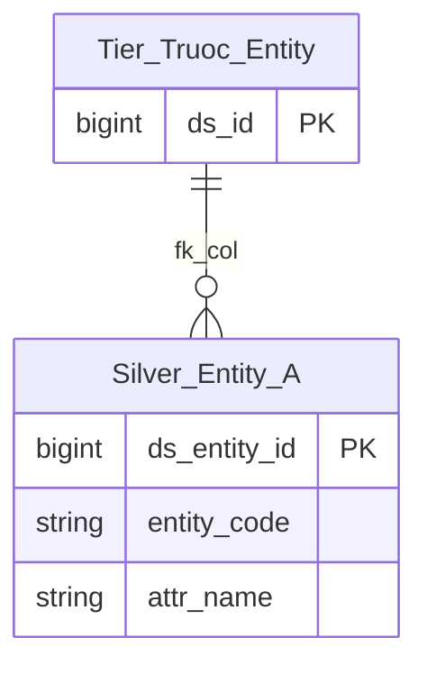

# {SOURCE} HLD — Tier {N}

**Source system:** {SOURCE} ({mô tả ngắn 1 dòng})
**Tier {N}:** {mô tả phạm vi Tier — entity nào FK đến entity nào ở Tier trước}

---

## 6a. Bảng tổng quan BCV Concept

| BCV Core Object | BCV Concept | Category | Source Table | Mô tả bảng nguồn | Silver Entity | table_type | BCV Term |
|---|---|---|---|---|---|---|---|
| {Core Object} | {[Concept] Term} | {Category} | {table_name} | {mô tả gốc từ CSDL nguồn} | {Silver Entity Name} | {Fundamental/Relative/Fact Append/Snapshot} | {(1) term candidate + BCV mô tả gì; (2) đánh giá cấu trúc trường nguồn nói gì; (3) lý do chọn term cuối} |

---

## 6b. Diagram Source (Mermaid)

> Replace `table_a`, `table_b`, `fk_col`, `attr_name` bằng tên bảng/cột thực tế. Mermaid identifier không hỗ trợ ký tự `<>`.

---

## 6c. Diagram Silver (Mermaid)

> Replace `Silver_Entity_A`, `Tier_Truoc_Entity`, `attr_name` bằng tên thực tế. Entity từ Tier trước hiện dạng node tham chiếu (chỉ tên + PK).

---

## 6d. Mục Danh mục & Tham chiếu (Reference Data)

| Source Field / Bảng | Mô tả | Scheme Code | source_type | Ghi chú |
|---|---|---|---|---|
| {table.column hoặc bảng danh mục} | {mô tả} | `{SOURCE}_{SCHEME_NAME}` | etl_derived / source_table / modeler_defined | {ghi chú nếu cần} |

---

## 6e. Bảng chờ thiết kế

| Source Table | Mô tả bảng nguồn | Lý do chưa thiết kế |
|---|---|---|
| {table} | {mô tả} | Chưa có thông tin cột |

*(Để trống nếu không có)*

---

## 6f. Điểm cần xác nhận

| # | Câu hỏi | Kết quả |
|---|---|---|
| T{N}-01 | {câu hỏi} | {kết quả/quyết định} |
