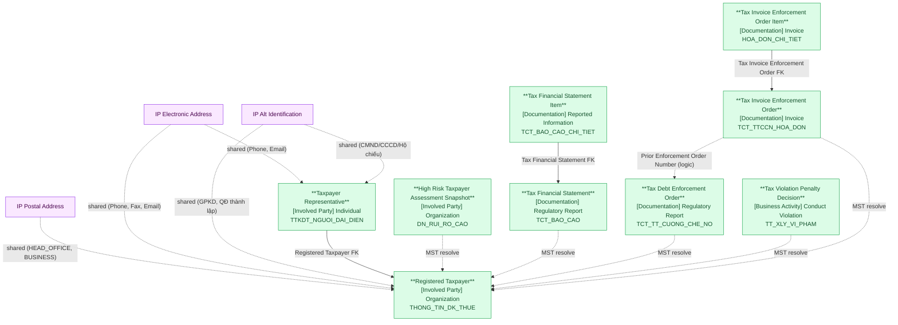

# DCST — HLD Overview: Toàn cảnh thiết kế Atomic Layer

> **Nguồn:** Hệ thống DCST — Dữ liệu Cơ quan Thuế từ Tổng cục Thuế (MySQL)
>
> **Phạm vi:** Đăng ký thuế, báo cáo tài chính, cưỡng chế nợ thuế, xử lý vi phạm thuế.
>
> **File chi tiết theo tầng:**
> - [DCST_HLD_Tier1.md](DCST_HLD_Tier1.md) — Registered Taxpayer (Main Entity)
> - [DCST_HLD_Tier2.md](DCST_HLD_Tier2.md) — Phụ thuộc Tier 1 (6 entities)
> - [DCST_HLD_Tier3.md](DCST_HLD_Tier3.md) — Phụ thuộc Tier 2 (2 entities)

---

## 7a. Bảng tổng quan Atomic Entities

| Tier | BCV Core Object | BCV Concept | Category | Source Table | Mô tả bảng nguồn | Atomic Entity | BCV Term |
|---|---|---|---|---|---|---|---|
| 1 | Involved Party | [Involved Party] Organization | Organization | THONG_TIN_DK_THUE | Thông tin đăng ký thuế của tổ chức/doanh nghiệp/hộ kinh doanh | Registered Taxpayer | Organization — *"Identifies an Involved Party that may stand alone in an operational or legal context."* |
| 2 | Involved Party | [Involved Party] Individual | Individual | TTKDT_NGUOI_DAI_DIEN | Thông tin người đại diện theo pháp luật của NNT | Taxpayer Representative | Individual — *"Identifies an Involved Party who is a natural person."* FK thực đến THONG_TIN_DK_THUE. |
| 2 | Involved Party | [Involved Party] Organization | Organization | DN_RUI_RO_CAO | Danh sách doanh nghiệp được đánh giá rủi ro cao theo năm | High Risk Taxpayer Assessment Snapshot | Organization — liên kết ngầm qua MST → Registered Taxpayer. |
| 2 | Documentation | [Documentation] Regulatory Report | Regulatory Report | TCT_BAO_CAO | Tờ khai / Báo cáo tài chính nộp lên cơ quan thuế | Tax Financial Statement | Regulatory Report — *"Identifies a Documentation Item that is a report submitted to meet a regulatory obligation."* |
| 2 | Documentation | [Documentation] Regulatory Report | Regulatory Report | TCT_TT_CUONG_CHE_NO | Thông tin quyết định cưỡng chế nợ thuế | Tax Debt Enforcement Order | Regulatory Report — văn bản hành chính cưỡng chế nợ thuế, nhiều hình thức. |
| 2 | Business Activity | [Business Activity] Conduct Violation | Conduct Violation | TT_XLY_VI_PHAM | Thông tin quyết định xử lý vi phạm thuế | Tax Violation Penalty Decision | Conduct Violation — *"Identifies a Business Activity that records a violation of conduct rules."* Pattern Activity Fact Append. |
| 2 | Documentation | [Documentation] Invoice | Invoice | TCT_TTCCN_HOA_DON | Thông tin cưỡng chế theo hình thức ngừng sử dụng hóa đơn | Tax Invoice Enforcement Order | Invoice — biện pháp leo thang, viện dẫn Tax Debt Enforcement Order. |
| 3 | Documentation | [Documentation] Reported Information | Reported Information | TCT_BAO_CAO_CHI_TIET | Chi tiết từng chỉ tiêu trong báo cáo tài chính | Tax Financial Statement Item | Reported Information — wide table, không pivot. 1 dòng = 1 chỉ tiêu trong 1 tờ khai. |
| 3 | Documentation | [Documentation] Invoice | Invoice | HOA_DON_CHI_TIET | Chi tiết từng hóa đơn trong quyết định ngừng sử dụng hóa đơn | Tax Invoice Enforcement Order Item | Invoice — entity con của Tax Invoice Enforcement Order. |

### Shared Entities (dùng chung — không riêng DCST)

| BCV Concept | Category | Source Tables | Atomic Entity | Ghi chú |
|---|---|---|---|---|
| [Location] Postal Address | Postal Address | THONG_TIN_DK_THUE | IP Postal Address | HEAD_OFFICE (DIA_CHI_TSC), BUSINESS (MOTA_DIACHI_KD + mã tỉnh/huyện/xã). Chỉ tách cho Registered Taxpayer. |
| [Location] Electronic Address | Electronic Address | THONG_TIN_DK_THUE, TTKDT_NGUOI_DAI_DIEN | IP Electronic Address | Phone/Fax/Email từ NNT; Phone/Email từ người đại diện. |
| [Involved Party] Alt Identification | Alternative Identification | THONG_TIN_DK_THUE, TTKDT_NGUOI_DAI_DIEN | IP Alt Identification | GPKD/QĐ thành lập (tổ chức), CMND/CCCD/Hộ chiếu (người đại diện). |

---

## 7b. Diagram Atomic Tổng (Mermaid)

---

## 7c. Bảng Classification Value

| Source Table | Mô tả | BCV Term | Xử lý Atomic |
|---|---|---|---|
| DANH_MUC + NHOM_DANH_MUC | Danh mục tham chiếu dùng chung trong DCST | Classification Value | Load theo NHOM_DANH_MUC.MA = Scheme Code. Không tạo Atomic entity. |
| THONG_TIN_DK_THUE.TRANG_THAI_HOAT_DONG | Trạng thái hoạt động của NNT | Classification Value | Scheme: TAXPAYER_ACTIVITY_STATUS. Giá trị cứng 00/01/03/04/05/06. |
| THONG_TIN_DK_THUE.LOAI_NGUNG_HOAT_DONG | Loại ngừng hoạt động | Classification Value | Scheme: TAXPAYER_CESSATION_TYPE. Giá trị cứng 1–9. |
| TCT_BAO_CAO.LOAI_TKHAI | Loại tờ khai thuế | Classification Value | Scheme: TAX_RETURN_TYPE. |
| TCT_BAO_CAO.KIEU_KY | Kiểu kỳ báo cáo | Classification Value | Scheme: REPORTING_PERIOD_TYPE. |
| TCT_BAO_CAO.TRANG_THAI_KT | Trạng thái kiểm toán BCTC | Classification Value | Scheme: AUDIT_STATUS. |
| TCT_TT_CUONG_CHE_NO.MA_HTCC / TCT_TTCCN_HOA_DON.MA_HTCC | Hình thức cưỡng chế thuế | Classification Value | Scheme: TAX_ENFORCEMENT_TYPE. Dùng chung 1 scheme cho cả 2 bảng. |
| HOA_DON_CHI_TIET.LOAI_HOA_DON | Loại hóa đơn | Classification Value | Scheme: INVOICE_TYPE. |

---

## 7d. Junction Tables

Không có junction table trong DCST — tất cả quan hệ là 1:N hoặc liên kết ngầm qua MST.

---

## 7e. Điểm cần xác nhận

| # | Tier | Câu hỏi | Ảnh hưởng |
|---|---|---|---|
| 1 | 1 | THONG_TIN_DK_THUE có bao gồm hộ kinh doanh cá thể? | Nếu có → grain "Organization" chưa chính xác; cân nhắc BCV "Individual" hoặc "Involved Party" chung. |
| 2 | 1 | `MA_SO_THUE` và `ID` trong THONG_TIN_DK_THUE có phải luôn cùng giá trị? | Ảnh hưởng BK: nếu khác nhau cần giữ cả 2 (Registered Taxpayer Code = ID, Organization Tax Identification Number = MA_SO_THUE). Thiết kế hiện tại đang giữ cả 2. |
| 3 | 2 | `Enforced Amount` (SO_TIEN_BI_CC) và `Tax Arrears Recovery Amount` (TRUY_THU_TIEN_THUE) — đơn vị tiền tệ? | Nếu xác nhận đơn vị → chuyển Currency Amount + currency code. |
| 4 | 2 | `TCT_TTCCN_HOA_DON.HIEU_LUC` — giá trị cụ thể là gì? | Nếu binary → chuyển Boolean. Hiện giữ Text. |
| 5 | 2 | DN_RUI_RO_CAO có nhiều dòng cho 1 MST (nhiều năm)? | Ảnh hưởng grain: nếu có → grain = (MST × năm), thêm composite BK. |
| 6 | 2 | `CAN_CU_QDSO` trong TCT_TTCCN_HOA_DON luôn match SO_QD trong TCT_TT_CUONG_CHE_NO? | Nếu ETL có thể resolve → bổ sung FK `Tax Debt Enforcement Order Id` (nullable) trên Tax Invoice Enforcement Order. |
| 7 | 3 | `HOATDONGLIENTUC` / `HOATDONGKHONGLIENTUC` — giá trị là gì? | Nếu binary → chuyển Boolean. Hiện giữ Text. |
| 8 | 3 | Số liệu VARCHAR trong TCT_BAO_CAO_CHI_TIET — cần tính toán ở Atomic không? | Nếu cần → xác nhận đơn vị tiền tệ và chuyển kiểu. |
| 9 | 3 | HOA_DON_CHI_TIET.SO_HOA_DON — có leading zero? | Nếu có → giữ Text, không ép NUMBER. |

---

## 7f. Bảng ngoài scope Atomic

| Nhóm | Source Table | Mô tả bảng nguồn | Lý do ngoài scope |
|---|---|---|---|
| System | GOI_TIN | Quản lý trạng thái truyền nhận gói tin | System operational table — không có giá trị nghiệp vụ. |
| Reference Data | DANH_MUC | Danh mục tham chiếu | Không có FK inbound từ bảng nghiệp vụ — xử lý thành Classification Value. |
| Reference Data | NHOM_DANH_MUC | Nhóm danh mục tham chiếu | Không có FK inbound từ bảng nghiệp vụ — xử lý thành Classification Value scheme. |
| Group B | THONG_TIN_CONG_TY | Thông tin công ty chứng khoán | Dữ liệu phát sinh từ nguồn gốc khác (SCMS). Thu thập tại source gốc. |
| Group B | UBCK_XU_PHAT | Quyết định xử phạt của UBCKNN | Dữ liệu phát sinh từ nguồn gốc khác (IDS/HT Thanh tra). |
| Group B | CONG_TY_KIEM_TOAN | Công ty kiểm toán | Thu thập tại source gốc. |
| Group B | KIEM_TOAN_VIEN | Kiểm toán viên | Thu thập tại source gốc. |
| Group B | UBCK_BAO_CAO | Báo cáo UBCKNN | Thu thập tại source gốc (FMS, IDS). |
| Group B | UBCK_BAO_CAO_CHI_TIET | Chi tiết báo cáo UBCKNN | Thu thập tại source gốc. |
| Group C (12 bảng) | (user, permission, log, config) | Quản trị hệ thống | Không có FK đến bảng Group A. Không có giá trị nghiệp vụ. |
