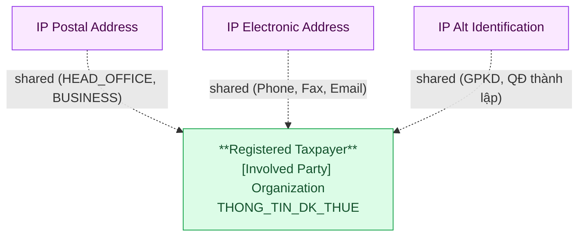

# DCST — HLD Tier 1: Main Entities (Registered Taxpayer)

> **Phụ thuộc:** Không phụ thuộc Tier nào — là nền tảng cho Tier 2 và Tier 3.
>
> **Thiết kế theo:** [DCST_HLD_Overview.md](DCST_HLD_Overview.md)

---

## 6a. Bảng tổng quan BCV Concept

| BCV Core Object | BCV Concept | Category | Source Table | Mô tả bảng nguồn | Atomic Entity | BCV Term |
|---|---|---|---|---|---|---|
| Involved Party | [Involved Party] Organization | Organization | THONG_TIN_DK_THUE | Thông tin đăng ký thuế của tổ chức/doanh nghiệp/hộ kinh doanh | Registered Taxpayer | Organization — *"Identifies an Involved Party that may stand alone in an operational or legal context."* Cấu trúc trường: mã số thuế, tên, vốn điều lệ, ngành nghề, trạng thái hoạt động, thông tin người đại diện (denormalized), địa chỉ. Xác nhận: bảng là IP chính của DCST, toàn bộ entity còn lại trong source liên kết về đây qua MST. |

---

## 6b. Diagram Source (Mermaid)

> Bảng độc lập — không FK vào bảng nghiệp vụ nào khác trong scope. Là điểm tham chiếu của tất cả bảng còn lại qua MST.

---

## 6c. Diagram Atomic (Mermaid)

---

## 6d. Danh mục & Tham chiếu

| Source Table | Mô tả | Scheme Code dự kiến | Ghi chú |
|---|---|---|---|
| THONG_TIN_DK_THUE.TRANG_THAI_HOAT_DONG | Trạng thái hoạt động của NNT | TAXPAYER_ACTIVITY_STATUS | Giá trị cứng trong bảng: 00/04 Đang HĐ; 01 Ngừng HĐ đã hoàn thành; 03 Ngừng HĐ chưa hoàn thành; 05 Ngừng KD có thời hạn; 06 Không HĐ tại địa chỉ đăng ký. |
| THONG_TIN_DK_THUE.LOAI_NGUNG_HOAT_DONG | Loại ngừng hoạt động | TAXPAYER_CESSATION_TYPE | Giá trị cứng 1–9: Giải thể, Phá sản, Chuyển đổi, Tổ chức lại, Thu hồi GP, Đóng theo ĐVCQ, Khác. |
| DANH_MUC + NHOM_DANH_MUC | Danh mục tham chiếu dùng chung trong DCST | Theo NHOM_DANH_MUC.MA | Load theo scheme code từ NHOM_DANH_MUC.MA. Không tạo Atomic entity. |

---

## 6e. Bảng chờ thiết kế

Không có bảng nào trong Tier 1 chưa đủ thông tin cột.

---

## 6f. Điểm cần xác nhận

| # | Câu hỏi | Ảnh hưởng |
|---|---|---|
| 1 | THONG_TIN_DK_THUE có bao gồm cả hộ kinh doanh cá thể (không phải tổ chức pháp nhân)? | Nếu có → grain "Organization" chưa chính xác; cần xem xét BCV term "Individual" hoặc dùng "Involved Party" chung. |
| 2 | Trường `MA_SO_THUE` và `ID` có phải luôn cùng giá trị không, hay `ID` là surrogate riêng? | Ảnh hưởng cách đặt BK: nếu khác nhau cần giữ cả 2 trường Registered Taxpayer Code (ID) và Organization Tax Identification Number (MA_SO_THUE). Thiết kế hiện tại đang giữ cả 2. |

---

## Entities trong Tier 1

### 1. Registered Taxpayer
**Source:** `THONG_TIN_DK_THUE` | **BCV Concept:** [Involved Party] Organization | **BCO:** Involved Party

**Grain:** 1 dòng = 1 tổ chức/doanh nghiệp/hộ kinh doanh đăng ký thuế tại Tổng cục Thuế.

**Attributes chính:** Registered Taxpayer Code (ID nguồn, BK), Organization Tax Identification Number (MA_SO_THUE — dùng để liên kết ngầm cho tất cả bảng Group B, C), Full Name, Charter Capital Amount/Currency Code, Foreign Charter Capital Amount/Currency Code, Business Line Code/Description, Business Commencement Date, Parent Organization Name/Address, Supervisory Authority Name, Supervisory Tax Authority Code, Legal Representative Name/Identification Number/Phone Number, Director Name/Phone Number, Activity Status Code/Name, Cessation fields (×5: Reason Description, Type Code, Date, Reason, Note, Notice Number), Temporary Suspension fields (×5: Start Date, End Date, Reason, Notice Number, Notice Date).

**Shared entities:**
- IP Postal Address: HEAD_OFFICE (DIA_CHI_TSC), BUSINESS (MOTA_DIACHI_KD + mã tỉnh/huyện/xã kinh doanh)
- IP Electronic Address: Phone, Fax, Email từ THONG_TIN_DK_THUE
- IP Alt Identification: GPKD, QĐ thành lập

**Lưu ý thiết kế:**
- Legal Representative Name/Phone/Identification Number được giữ **denormalized** trên Registered Taxpayer — đây là trường mô tả tổ chức, không phải Taxpayer Representative (bảng riêng TTKDT_NGUOI_DAI_DIEN).
- Director Name/Phone Number tương tự — giữ denormalized.
- `MA_SO_THUE` là trường liên kết ngầm của toàn bộ Tier 2 và Tier 3 → lưu thêm tại entity con dưới dạng `Registered Taxpayer Code` (Text, giá trị MST gốc) để ETL resolve khi không join được.

**Được FK từ:** Taxpayer Representative (FK thực), High Risk Taxpayer Assessment Snapshot / Tax Financial Statement / Tax Debt Enforcement Order / Tax Violation Penalty Decision / Tax Invoice Enforcement Order (MST resolve — tất cả Tier 2).

---

## Attribute Summary

| Atomic Entity | # Attributes | PK | Key FKs |
|---|---|---|---|
| Registered Taxpayer | ~35 | Registered Taxpayer Id | — |
