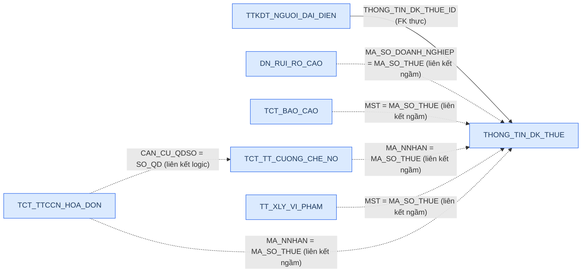
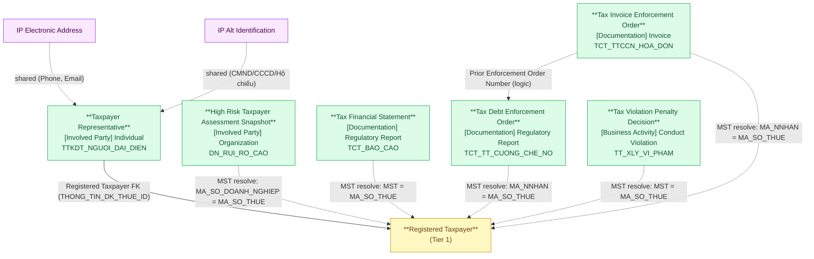

# DCST — HLD Tier 2: Phụ thuộc Registered Taxpayer

> **Phụ thuộc Tier 1:** Registered Taxpayer
>
> **Thiết kế theo:** [DCST_HLD_Overview.md](DCST_HLD_Overview.md)

---

## 6a. Bảng tổng quan BCV Concept

| BCV Core Object | BCV Concept | Category | Source Table | Mô tả bảng nguồn | Atomic Entity | BCV Term |
|---|---|---|---|---|---|---|
| Involved Party | [Involved Party] Individual | Individual | TTKDT_NGUOI_DAI_DIEN | Thông tin người đại diện theo pháp luật của NNT | Taxpayer Representative | Individual — *"Identifies an Involved Party who is a natural person."* Cấu trúc trường: tên người đại diện, chức vụ, FK thực đến THONG_TIN_DK_THUE. Xác nhận: grain 1 dòng = 1 người đại diện của 1 NNT. |
| Involved Party | [Involved Party] Organization | Organization | DN_RUI_RO_CAO | Danh sách doanh nghiệp được đánh giá rủi ro cao theo năm | High Risk Taxpayer Assessment Snapshot | Organization — cấu trúc trường: tên DN, MST, địa chỉ trụ sở, cơ quan thuế quản lý, năm đánh giá. Đây là entity đánh giá (assessment) về tổ chức, không phải tổ chức chính — tuy nhiên BCV không có "Assessment" riêng cho Involved Party. Dùng Organization vì nội dung mô tả thuộc tính tổ chức. Liên kết ngầm qua MST → Registered Taxpayer. |
| Documentation | [Documentation] Regulatory Report | Regulatory Report | TCT_BAO_CAO | Tờ khai / Báo cáo tài chính nộp lên cơ quan thuế | Tax Financial Statement | Regulatory Report — *"Identifies a Documentation Item that is a report submitted to meet a regulatory obligation."* Cấu trúc trường: MST, kỳ kê khai, mã tờ khai, ngày nộp, thông tin kiểm toán, thông tin NNT denormalized (snapshot tại thời điểm nộp). Liên kết ngầm qua MST → Registered Taxpayer. |
| Documentation | [Documentation] Regulatory Report | Regulatory Report | TCT_TT_CUONG_CHE_NO | Thông tin quyết định cưỡng chế nợ thuế | Tax Debt Enforcement Order | Regulatory Report — văn bản hành chính, cấu trúc trường: số/ngày QĐ, hình thức cưỡng chế, số tiền, ngày hiệu lực, thông tin tài sản/tài khoản bị cưỡng chế. Liên kết ngầm qua MA_NNHAN = MST → Registered Taxpayer. |
| Business Activity | [Business Activity] Conduct Violation | Conduct Violation | TT_XLY_VI_PHAM | Thông tin quyết định xử lý vi phạm thuế | Tax Violation Penalty Decision | Conduct Violation — *"Identifies a Business Activity that records a violation of conduct rules."* Cấu trúc trường: số QĐ xử lý, cơ quan ban hành, kỳ thanh tra, mô tả hành vi vi phạm, truy thu. Pattern Activity Fact Append. Liên kết ngầm qua MST → Registered Taxpayer. |
| Documentation | [Documentation] Invoice | Invoice | TCT_TTCCN_HOA_DON | Thông tin cưỡng chế theo hình thức ngừng sử dụng hóa đơn | Tax Invoice Enforcement Order | Invoice — cấu trúc trường: số/ngày QĐ, căn cứ QĐ trước (viện dẫn Tax Debt Enforcement Order), thông báo tiền nợ, thông tin NNT snapshot. Biện pháp leo thang từ Tax Debt Enforcement Order. Liên kết ngầm qua MA_NNHAN = MST → Registered Taxpayer. |

---

## 6b. Diagram Source (Mermaid)

---

## 6c. Diagram Atomic (Mermaid)

---

## 6d. Danh mục & Tham chiếu

| Source Table | Mô tả | Scheme Code dự kiến | Ghi chú |
|---|---|---|---|
| TCT_BAO_CAO.LOAI_TKHAI | Loại tờ khai thuế | TAX_RETURN_TYPE | Classify loại tờ khai (QT, tháng, quý...). |
| TCT_BAO_CAO.KIEU_KY | Kiểu kỳ báo cáo | REPORTING_PERIOD_TYPE | Phân biệt kỳ tháng/quý/năm. |
| TCT_BAO_CAO.TRANG_THAI_KT | Trạng thái kiểm toán | AUDIT_STATUS | Trạng thái kiểm toán BCTC. |
| TCT_TT_CUONG_CHE_NO.MA_HTCC / TCT_TTCCN_HOA_DON.MA_HTCC | Hình thức cưỡng chế thuế | TAX_ENFORCEMENT_TYPE | Dùng chung 1 scheme cho cả 2 bảng. |

---

## 6e. Bảng chờ thiết kế

Không có bảng nào trong Tier 2 chưa đủ thông tin cột.

---

## 6f. Điểm cần xác nhận

| # | Câu hỏi | Ảnh hưởng |
|---|---|---|
| 1 | `Enforced Amount` (TCT_TT_CUONG_CHE_NO.SO_TIEN_BI_CC) và `Tax Arrears Recovery Amount` (TT_XLY_VI_PHAM.TRUY_THU_TIEN_THUE) nguồn VARCHAR — đơn vị tiền tệ là gì? | Nếu xác nhận đơn vị → chuyển sang Currency Amount và thêm currency code. |
| 2 | `TCT_TTCCN_HOA_DON.HIEU_LUC` (Enforcement Status) — giá trị là gì? Còn hiệu lực / Hết hiệu lực hay dạng khác? | Nếu binary → chuyển sang Boolean. Hiện giữ Text. |
| 3 | `High Risk Taxpayer Assessment Snapshot` — DN_RUI_RO_CAO có nhiều dòng cho 1 MST (nhiều năm đánh giá)? Hay 1 dòng / 1 MST? | Ảnh hưởng grain: nếu nhiều năm thì grain = (MST × năm), không phải 1 MST. |
| 4 | Prior Enforcement Order Number trong TCT_TTCCN_HOA_DON.CAN_CU_QDSO có luôn match với SO_QD trong TCT_TT_CUONG_CHE_NO? | Nếu ETL có thể resolve → bổ sung FK `Tax Debt Enforcement Order Id` (nullable) trên Tax Invoice Enforcement Order. |

---

## Entities trong Tier 2

### 1. Taxpayer Representative
**Source:** `TTKDT_NGUOI_DAI_DIEN` | **BCV Concept:** [Involved Party] Individual | **BCO:** Involved Party

**Grain:** 1 dòng = 1 người đại diện theo pháp luật của 1 NNT.

**Attributes chính:** FK đến Registered Taxpayer (Id + Code), Representative Name, Position Title.

**Shared entities:** IP Electronic Address (Phone, Email từ TTKDT_NGUOI_DAI_DIEN), IP Alt Identification (CMND/CCCD/Hộ chiếu người đại diện).

---

### 2. High Risk Taxpayer Assessment Snapshot
**Source:** `DN_RUI_RO_CAO` | **BCV Concept:** [Involved Party] Organization | **BCO:** Involved Party

**Grain:** 1 dòng = 1 đánh giá rủi ro của 1 doanh nghiệp (theo năm). Liên kết ngầm qua MST → Registered Taxpayer.

**Attributes chính:** Registered Taxpayer Id/Code (nullable, ETL resolve), Organization Tax Identification Number (giữ giá trị gốc), Organization Full Name, Organization Head Office Address (denormalized), Supervisory Tax Authority Name, Risk Assessment Year.

**Lưu ý:** Không tách IP Postal Address — entity này không phải IP chính, địa chỉ là snapshot trong bảng đánh giá rủi ro.

---

### 3. Tax Financial Statement
**Source:** `TCT_BAO_CAO` | **BCV Concept:** [Documentation] Regulatory Report | **BCO:** Documentation

**Grain:** 1 dòng = 1 tờ khai / báo cáo tài chính nộp lên cơ quan thuế.

**Attributes chính:** Registered Taxpayer Id/Code (nullable, ETL resolve từ MST), Taxpayer Name/Address/Phone/Fax/Email (denormalized snapshot), Service Code/Name/Version, Service Provider Information, Tax Return Code/Name/Form Description/XML Version/Type Code, Amendment Count, Reporting Period Type Code/Period/Start-End Date/Start-End Month, Tax Authority Code/Name, Filing Date, Extension Reason Code/Reason, Signatory Name, Signing Date, Audit Status Code, Audit Firm Tax Identification Number/Name, Auditor Code/Name, Audited Financial Statement Indicator, Audit Opinion Code/Opinion, Audit Date, Created Date, Submission/Receipt/Acknowledged Date, Report Set Period, Filing Origin, Filing Entry Person, Filing Reference Id, Sending/Receiving Location.

**Lưu ý:** Thông tin địa chỉ/liên lạc NNT giữ **denormalized** — grain tờ khai, snapshot tại thời điểm nộp, không tách IP Postal Address / IP Electronic Address.

**Được FK từ:** Tax Financial Statement Item.

---

### 4. Tax Debt Enforcement Order
**Source:** `TCT_TT_CUONG_CHE_NO` | **BCV Concept:** [Documentation] Regulatory Report | **BCO:** Documentation

**Grain:** 1 dòng = 1 quyết định cưỡng chế nợ thuế đối với 1 NNT, theo 1 hình thức cưỡng chế.

**Attributes chính:** Registered Taxpayer Id/Code (nullable, ETL resolve từ MA_NNHAN), Taxpayer Name/Business Industry (snapshot), Tax Authority Code/Name, Supervisory Tax Authority Code/Name, Enforcement Type Code/Name, Electronic Transaction Code, Enforcement Order Number/Date, Enforced Amount (Text — chờ xác nhận đơn vị), Enforcement Effective Start/End Date, Enforcement Time, Enforcement Location, Taxpayer Account Number/Bank, Income Manager Name/Address, Seized Asset Description/Value, Asset Custodian Code/Name/Address.

**Lưu ý:** Enforcement Order Number được viện dẫn bởi Tax Invoice Enforcement Order (CAN_CU_QDSO) — liên kết logic, không có FK vật lý.

---

### 5. Tax Violation Penalty Decision
**Source:** `TT_XLY_VI_PHAM` | **BCV Concept:** [Business Activity] Conduct Violation | **BCO:** Business Activity

**Grain:** 1 dòng = 1 quyết định xử lý vi phạm thuế. Pattern Activity Fact Append.

**Attributes chính:** Registered Taxpayer Id/Code (nullable, ETL resolve từ MST), Taxpayer Name (snapshot), Order Number, Issuing Authority Name, Inspection Period, Violation Penalty Description, Administrative Violation Penalty Description, Tax Arrears Recovery Amount (Text — chờ xác nhận đơn vị).

---

### 6. Tax Invoice Enforcement Order
**Source:** `TCT_TTCCN_HOA_DON` | **BCV Concept:** [Documentation] Invoice | **BCO:** Documentation

**Grain:** 1 dòng = 1 quyết định cưỡng chế theo hình thức ngừng sử dụng hóa đơn. Biện pháp leo thang sau Tax Debt Enforcement Order.

**Attributes chính:** Registered Taxpayer Id/Code (nullable, ETL resolve từ MA_NNHAN), Taxpayer Name/Business Industry (snapshot), Supervisory Tax Authority Code/Name, Enforcement Type Code/Name, Electronic Transaction Code, Invoice Enforcement Order Number/Date, Enforcement Effective Start/End Date, Enforcement Status (Text), Prior Enforcement Order Number/Date (viện dẫn logic từ Tax Debt Enforcement Order), Notice Taxpayer Code/Name, Notice Code/Name, Notified Tax Debt Amount (Text), Debt Notice Date.

**Được FK từ:** Tax Invoice Enforcement Order Item.

---

## Attribute Summary

| Atomic Entity | # Attributes | PK | Key FKs |
|---|---|---|---|
| Taxpayer Representative | 8 | Taxpayer Representative Id | Registered Taxpayer |
| High Risk Taxpayer Assessment Snapshot | 11 | High Risk Taxpayer Assessment Snapshot Id | Registered Taxpayer (nullable, MST resolve) |
| Tax Financial Statement | ~57 | Tax Financial Statement Id | Registered Taxpayer (nullable, MST resolve) |
| Tax Debt Enforcement Order | 28 | Tax Debt Enforcement Order Id | Registered Taxpayer (nullable, MST resolve) |
| Tax Violation Penalty Decision | 10 | Tax Violation Penalty Decision Id | Registered Taxpayer (nullable, MST resolve) |
| Tax Invoice Enforcement Order | ~25 | Tax Invoice Enforcement Order Id | Registered Taxpayer (nullable, MST resolve) |
