# FIMS — HLD Overview: Toàn cảnh thiết kế Atomic Layer

> **Nguồn:** Hệ thống FIMS — Hệ thống quản lý giám sát nhà đầu tư nước ngoài (MySQL)
>
> **Phạm vi:** Quản lý giám sát nhà đầu tư nước ngoài — thành viên thị trường, nhà đầu tư, báo cáo định kỳ, vi phạm, ủy quyền CBTT.
>
> **File chi tiết theo tầng:**
> - [FIMS_HLD_Tier1.md](FIMS_HLD_Tier1.md) — Main Entities (10 entities)
> - [FIMS_HLD_Tier2.md](FIMS_HLD_Tier2.md) — Phụ thuộc Tier 1 (5 entities)
> - [FIMS_HLD_Tier3.md](FIMS_HLD_Tier3.md) — Phụ thuộc Tier 2 (3 entities)

---

## 7a. Bảng tổng quan Atomic Entities

| Tier | BCV Core Object | BCV Concept | Category | Source Table | Mô tả bảng nguồn | Atomic Entity | BCV Term |
|---|---|---|---|---|---|---|---|
| 1 | Involved Party | [Involved Party] Organization | Organization | STOCKEXCHANGE | Lưu danh sách đối tượng gửi báo cáo là Sở giao dịch chứng khoán | Stock Exchange | [Involved Party] Organization |
| 1 | Involved Party | [Involved Party] Organization | Organization | DEPOSITORYCENTER | Lưu danh sách đối tượng gửi báo cáo là Trung tâm lưu ký chứng khoán | Depository Center | [Involved Party] Organization |
| 1 | Involved Party | [Involved Party] Organization | Organization | FUNDCOMPANY | Lưu danh sách đối tượng gửi báo cáo là Công ty quản lý quỹ | Fund Management Company* | [Involved Party] Organization |
| 1 | Involved Party | [Involved Party] Organization | Organization | SECURITIESCOMPANY | Lưu danh sách đối tượng gửi báo cáo là Công ty chứng khoán | Securities Company | [Involved Party] Organization |
| 1 | Involved Party | [Involved Party] Organization | Organization | BANKMONI | Lưu danh sách đối tượng gửi báo cáo là Ngân hàng lưu ký giám sát | Custodian Bank* | [Involved Party] Organization |
| 1 | Involved Party | [Involved Party] Organization Unit | Organization Unit | BRANCHS | Lưu danh sách đối tượng gửi báo cáo là CN công ty QLQ | Fund Management Company Organization Unit | [Involved Party] Organization Unit |
| 1 | Involved Party | [Involved Party] Individual | Individual | INFODISCREPRES | Lưu danh sách đối tượng gửi báo cáo là người đại diện CBTT | Disclosure Representative | [Involved Party] Individual |
| 1 | Involved Party | [Involved Party] Individual | Individual | INVESTOR | Lưu danh sách danh mục nhà đầu tư | Foreign Investor | [Involved Party] Individual |
| 1 | Involved Party | [Involved Party] Individual | Individual | TLPROFILES | Lưu danh sách nhân sự đại diện CBTT | Disclosure Representative Key Person | [Involved Party] Individual |
| 1 | Location | [Location] Geographic Area | Geographic Area | NATIONAL | Danh sách quốc tịch/quốc gia — FK inbound từ nhiều bảng thành viên | Geographic Area | [Location] Geographic Area |
| 1 | Documentation | [Documentation] Regulatory Report | Regulatory Report | RPTTEMP | Lưu danh sách biểu mẫu báo cáo đầu vào | Report Template | [Documentation] Regulatory Report |
| 2 | Condition | [Condition] Reporting Period | Reporting Period | RPTPERIOD | Lưu danh sách kỳ báo cáo — RptId FK đến RPTTEMP | Reporting Period* | [Condition] Reporting Period |
| 2 | Documentation | [Documentation] Regulatory Report | Regulatory Report | RPTMEMBER | Lưu danh sách báo cáo của các thành viên thị trường | Member Regulatory Report | [Documentation] Regulatory Report |
| 2 | Business Activity | [Business Activity] Conduct Violation | Conduct Violation | VIOLT | Lưu danh sách vi phạm | Member Conduct Violation | [Business Activity] Conduct Violation |
| 2 | Arrangement | [Arrangement] Authorization | Authorization | AUTHOANNOUNCE | Lưu danh sách ủy quyền CBTT | Disclosure Authorization | [Arrangement] Authorization |
| 2 | Communication | [Communication] Corporate Action Announcement | Announcement | ANNOUNCE | Lưu danh sách các tin công bố của thành viên thị trường | Disclosure Announcement | [Communication] Corporate Action Announcement |
| 3 | Documentation | [Documentation] Reported Information | Reported Information | RPTVALUES | Bảng lưu giá trị của báo cáo | Member Report Value | [Documentation] Reported Information |
| 3 | Arrangement | [Arrangement] Securities Account | Account | SECURITIESACCOUNT | Lưu danh sách tài khoản giao dịch chứng khoán | Foreign Investor Securities Account | [Arrangement] Securities Account |
| 3 | Arrangement | [Arrangement] Financial Market Position | Portfolio | CATEGORIESSTOCK | Lưu danh sách danh mục chứng khoán của NĐT NN | Foreign Investor Stock Portfolio Snapshot | [Arrangement] Financial Market Position |

> *Entity dùng chung với FMS (thêm FIMS làm secondary source — Custodian Bank, Fund Management Company, Reporting Period).

### Shared Entities (dùng chung — không riêng FIMS)

| BCV Concept | Category | Source Tables | Atomic Entity | Ghi chú |
|---|---|---|---|---|
| [Location] Postal Address | Postal Address | STOCKEXCHANGE, DEPOSITORYCENTER, FUNDCOMPANY, SECURITIESCOMPANY, BANKMONI, BRANCHS, INFODISCREPRES, INVESTOR | IP Postal Address | HEAD_OFFICE (Address). INVESTOR thêm loại địa chỉ HOME/BUSINESS tùy ObjectType. |
| [Location] Electronic Address | Electronic Address | STOCKEXCHANGE, DEPOSITORYCENTER, FUNDCOMPANY, SECURITIESCOMPANY, BANKMONI, BRANCHS, INFODISCREPRES, INVESTOR, TLPROFILES | IP Electronic Address | Phone/Fax/Email/Website/Hotline từ tổ chức; Phone/Email từ nhân sự. |
| [Involved Party] Alt Identification | Alternative Identification | FUNDCOMPANY, SECURITIESCOMPANY, BANKMONI, BRANCHS, INFODISCREPRES, INVESTOR, TLPROFILES | IP Alt Identification | GPKD/QĐ thành lập (tổ chức — IdNo/IdDate/IdAdd + RegNo/RegDate/RegAdd); CCCD/Hộ chiếu (INVESTOR — IdNo/IdDate/IdAdd); Chứng chỉ CBTT (TLPROFILES — CertNo/CertDate/CertAdd). |

---

## 7b. Diagram Atomic Tổng (Mermaid)

```mermaid
graph TD
    classDef atomic fill:#dcfce7,stroke:#16a34a,color:#14532d
    classDef shared fill:#fae8ff,stroke:#9333ea,color:#4a044e
    classDef geo fill:#fef9c3,stroke:#ca8a04,color:#713f12

    %% Tier 1
    GEO["**Geographic Area**\nNATIONAL"]:::geo
    SE["**Stock Exchange**\nSTOCKEXCHANGE"]:::atomic
    DC["**Depository Center**\nDEPOSITORYCENTER"]:::atomic
    FC["**Fund Management Company**\nFUNDCOMPANY"]:::atomic
    SC["**Securities Company**\nSECURITIESCOMPANY"]:::atomic
    BK["**Custodian Bank**\nBANKMONI"]:::atomic
    BR["**Fund Management Company Organization Unit**\nBRANCHS"]:::atomic
    IDR["**Disclosure Representative**\nINFODISCREPRES"]:::atomic
    INV["**Foreign Investor**\nINVESTOR"]:::atomic
    TLP["**Disclosure Representative Key Person**\nTLPROFILES"]:::atomic
    RT["**Report Template**\nRPTTEMP"]:::atomic

    %% Shared
    ADDR["IP Postal Address"]:::shared
    EADDR["IP Electronic Address"]:::shared
    ALTID["IP Alt Identification"]:::shared

    %% Tier 2
    RP["**Reporting Period**\nRPTPERIOD"]:::atomic
    MRR["**Member Regulatory Report**\nRPTMEMBER"]:::atomic
    MCV["**Member Conduct Violation**\nVIOLT"]:::atomic
    DA["**Disclosure Authorization**\nAUTHOANNOUNCE"]:::atomic
    ANN["**Disclosure Announcement**\nANNOUNCE"]:::atomic

    %% Tier 3
    MRV["**Member Report Value**\nRPTVALUES"]:::atomic
    FISA["**Foreign Investor Securities Account**\nSECURITIESACCOUNT"]:::atomic
    FISP["**Foreign Investor Stock Portfolio Snapshot**\nCATEGORIESSTOCK"]:::atomic

    %% Geographic FK (T1)
    SE --> GEO
    DC --> GEO
    FC --> GEO
    SC --> GEO
    BK --> GEO
    BR --> GEO
    IDR --> GEO
    INV --> GEO
    TLP --> GEO

    %% BRANCHS FK (ETL resolve)
    BR -->|"FK parent (ETL resolve)"| FC

    %% Tier 2
    RP --> RT

    %% Shared entity links (T1)
    ADDR -.->|"HEAD_OFFICE"| SE
    ADDR -.->|"HEAD_OFFICE"| DC
    ADDR -.->|"HEAD_OFFICE"| FC
    ADDR -.->|"HEAD_OFFICE"| SC
    ADDR -.->|"HEAD_OFFICE"| BK
    ADDR -.->|"HEAD_OFFICE"| BR
    ADDR -.->|"HEAD_OFFICE"| IDR
    ADDR -.->|"HOME/BUSINESS"| INV
    EADDR -.->|"Phone/Fax/Email/Web"| SE
    EADDR -.->|"Phone/Fax/Email/Web"| FC
    EADDR -.->|"Phone/Fax/Email/Web"| SC
    EADDR -.->|"Phone/Fax/Email/Web"| BK
    EADDR -.->|"Phone/Fax/Email"| INV
    EADDR -.->|"Phone/Email"| TLP
    ALTID -.->|"GPKD/QĐ"| FC
    ALTID -.->|"GPKD/QĐ"| SC
    ALTID -.->|"GPKD/QĐ"| BK
    ALTID -.->|"CCCD/HC"| INV
    ALTID -.->|"Chứng chỉ CBTT"| TLP

    %% Key Person to orgs
    TLP -->|"nullable FK"| FC
    TLP -->|"nullable FK"| SC
    TLP -->|"nullable FK"| BK
    TLP -->|"nullable FK"| DC
    TLP -->|"nullable FK"| SE
    TLP -->|"nullable FK"| IDR

    %% Member Regulatory Report
    MRR --> RT
    MRR --> RP
    MRR -->|"nullable FK"| FC
    MRR -->|"nullable FK"| SC
    MRR -->|"nullable FK"| BK
    MRR -->|"nullable FK"| DC
    MRR -->|"nullable FK"| SE
    MRR -->|"nullable FK"| INV
    MRR -->|"nullable FK"| BR

    MCV -->|"nullable FK"| FC
    MCV -->|"nullable FK"| SC
    MCV -->|"nullable FK"| BK
    MCV -->|"nullable FK"| DC
    MCV -->|"nullable FK"| SE
    MCV -->|"nullable FK"| BR
    MCV -->|"nullable FK"| IDR

    DA --> IDR
    ANN -->|"InRepId"| IDR
    ANN -->|"Array: Foreign Investor Ids"| INV

    %% Tier 3
    MRV --> MRR
    MRV --> RP
    MRV --> RT
    FISA --> SC
    FISA --> INV
    FISP --> SC
    FISP --> INV
```

---

## 7c. Bảng Classification Value

| Source Table | Mô tả | BCV Term | Xử lý Atomic |
|---|---|---|---|
| STATUS | Tình trạng hoạt động thành viên thị trường | Classification Value | Scheme: FIMS_MEMBER_STATUS |
| REPORTTYPE | Loại báo cáo | Classification Value | Scheme: FIMS_REPORT_TYPE |
| BUSINESS | Nghiệp vụ kinh doanh | Classification Value | Scheme: FIMS_BUSINESS_TYPE. Array trên entity chính. |
| COMPANYTYPE | Loại hình doanh nghiệp | Classification Value | Scheme: FIMS_COMPANY_TYPE. Array trên entity chính. |
| JOBTYPE | Chức vụ nhân sự CBTT | Classification Value | Scheme: FIMS_JOB_TYPE. Array trên TLProfiles. |
| STOCKHOLDERTYPE | Loại cổ đông nhân sự | Classification Value | Scheme: FIMS_STOCKHOLDER_TYPE. Array trên TLProfiles. |
| INVESTORTYPE | Loại nhà đầu tư | Classification Value | Scheme: FIMS_INVESTOR_TYPE |
| DEGREE | Trình độ học vấn | Classification Value | Scheme: FIMS_DEGREE |
| SECURITIESTYPE | Loại chứng khoán | Classification Value | Scheme: FIMS_SECURITIES_TYPE |
| SECURITIES | Danh mục chứng khoán | Classification Value | Scheme: FIMS_SECURITIES_CODE |
| NATIONAL | Quốc tịch/quốc gia | [Location] Geographic Area | **Atomic entity** — FK inbound từ nhiều bảng thành viên. Đặt tên: Geographic Area. Không phải Classification Value. |
| ANNOUNCETYPE | Loại công bố thông tin | Classification Value | Scheme: FIMS_ANNOUNCE_TYPE |
| RELATEDPROPERTIES | Hình thức liên quan ủy quyền | Classification Value | Scheme: FIMS_RELATED_PROPERTIES |
| RELATIONSHIP | Quan hệ ủy quyền CBTT | Classification Value | Scheme: FIMS_RELATIONSHIP_TYPE. Chưa có cấu trúc cột. |
| SHEET | Sheet biểu mẫu báo cáo | Classification Value | Scheme: FIMS_REPORT_SHEET. Denormalized vào Member Report Value. |

---

## 7d. Junction Tables

| Source Table | Mô tả | Entity chính | Xử lý trên Atomic |
|---|---|---|---|
| FUNDCOMBUSINES | Nghiệp vụ KD của CTQLQ | Fund Management Company | `Business Type Codes: Array<Classification Value>` (FIMS_BUSINESS_TYPE) |
| FUNDCOMTYPE | Loại hình DN của CTQLQ | Fund Management Company | `Company Type Codes: Array<Classification Value>` (FIMS_COMPANY_TYPE) |
| SECCOMBUSINES | Nghiệp vụ KD của CTCK | Securities Company | `Business Type Codes: Array<Classification Value>` (FIMS_BUSINESS_TYPE) |
| SECCOMTYPE | Loại hình DN của CTCK | Securities Company | `Company Type Codes: Array<Classification Value>` (FIMS_COMPANY_TYPE) |
| BRANCHSBUSINES | Nghiệp vụ KD của CN CTQLQ | Fund Management Company Organization Unit | `Business Type Codes: Array<Classification Value>` (FIMS_BUSINESS_TYPE) |
| INDIREBUSINESS | Nghiệp vụ KD của người đại diện CBTT | Disclosure Representative | `Business Type Codes: Array<Classification Value>` (FIMS_BUSINESS_TYPE) |
| TLPROJOB | Chức vụ nhân sự CBTT | Disclosure Representative Key Person | `Job Type Codes: Array<Classification Value>` (FIMS_JOB_TYPE) |
| TLPROSTOCKH | Loại cổ đông của nhân sự | Disclosure Representative Key Person | `Stockholder Type Codes: Array<Classification Value>` (FIMS_STOCKHOLDER_TYPE) |
| ANNOUNCEINVES | NĐT NN liên quan đến tin công bố | Disclosure Announcement | `Foreign Investor Ids: Array<STRUCT<investor_id, investor_code>>` — InvesId → FK đến INVESTOR (đã xác nhận). |

---

## 7e. Điểm cần xác nhận

**Đã xác nhận (Tier 1 — đóng):**

| # | Tier | Câu hỏi | Kết quả xác nhận |
|---|---|---|---|
| 1 | 1 | `FUNDCOMPANY` (FIMS) và `SECURITIES` (FMS) — cùng entity? | ✓ Cùng entity. Dùng chung "Fund Management Company" — FIMS là secondary source. |
| 2 | 1 | `BANKMONI` (FIMS) và `BANKMONI` (FMS) — cùng entity? | ✓ Cùng entity. Dùng chung "Custodian Bank" — FIMS là secondary source. |
| 3 | 1 | `RPTPERIOD` — FK `RptId` đến `RPTTEMP` có tường minh không? | ✓ Đúng — RPTPERIOD.RptId → RPTTEMP. Chuyển RPTPERIOD sang Tier 2. |
| 4 | 1 | `NATIONAL` — Atomic entity [Location] Geographic Area hay Classification Value? | ✓ Atomic entity [Location] Geographic Area — FK inbound từ nhiều bảng thành viên. |
| 5 | 1 | `BRANCHS` không có FK tường minh đến `FUNDCOMPANY`. ETL có resolve được không? | ✓ ETL có thể resolve. Thiết kế FK pair đến Fund Management Company. |
| 6 | 1 | `TLPROFILES` có 6 FK nullable — giữ nhiều trường hay cần junction table? | ✓ Giữ nhiều FK nullable trên Atomic entity (1 nhân sự có thể gắn với nhiều tổ chức). |
| 7 | 1 | `INVESTOR.ObjectType = 1/2` — gộp hay tách entity? | ✓ Gộp — 1 entity "Foreign Investor" với ObjectType phân biệt cá nhân/tổ chức. |

**Đã xác nhận (Tier 2 — đóng):**

| # | Tier | Câu hỏi | Kết quả xác nhận |
|---|---|---|---|
| 8 | 2 | `RPTMEMBER.DepId`, `InId`, `BranId` — map đến DEPOSITORYCENTER, INVESTOR, BRANCHS không? | ✓ Đúng. Thêm 3 FK pair nullable: Depository Center, Foreign Investor, Fund Management Company Organization Unit — lưu ngữ cảnh nộp báo cáo. |
| 9 | 2 | `ANNOUNCE.InRepId` — FK đến INFODISCREPRES hay AUTHOANNOUNCE? | ✓ INFODISCREPRES trực tiếp. FK pair: Disclosure Representative Id + Disclosure Representative Code. |
| 10 | 2 | `ANNOUNCEINVES.InvesId` — FK đến INVESTOR hay INVESTORTYPE? | ✓ INVESTOR. ANNOUNCEINVES → denormalize thành `Foreign Investor Ids: Array<STRUCT<investor_id, investor_code>>` trên Disclosure Announcement. |

**Đã xác nhận (Tier 3 — đóng):**

| # | Tier | Câu hỏi | Kết quả xác nhận |
|---|---|---|---|
| 11 | 3 | `CATEGORIESSTOCK.Rate` — đơn vị là % hay đơn vị khác? | ✓ Tỷ lệ % sở hữu → data domain: Percentage. |
| 12 | 3 | `RPTVALUES` có 7 FK nullable đến thành viên — có cần map sang Atomic entity? | ✓ Không map. Khai thác qua join với RPTMEMBER. |

> Tất cả open questions đã được đóng.

---

---

## 7f. Bảng ngoài scope Atomic

| Nhóm | Source Table | Mô tả bảng nguồn | Lý do ngoài scope |
|---|---|---|---|
| System | USERS | Lưu danh sách người dùng trên hệ thống | Operational/system data — không có giá trị nghiệp vụ |
| System | USERSMENUS | Lưu danh sách quyền được phân cho người dùng | Operational/system data — không có giá trị nghiệp vụ |
| System | USERRPTO | Lưu danh sách phân quyền sử dụng báo cáo đầu ra | Operational/system data — không có giá trị nghiệp vụ |
| System | REFRESHTOKEN | Lưu danh sách các phiên làm việc của người dùng | Operational/system data — không có giá trị nghiệp vụ |
| System | GROUPS | Lưu danh sách nhóm người dùng | Operational/system data — không có giá trị nghiệp vụ |
| System | GROUPUSERS | Lưu danh sách người dùng được phân vào nhóm | Operational/system data — không có giá trị nghiệp vụ |
| System | GROUPROLES | Lưu danh sách quyền được phân cho nhóm | Operational/system data — không có giá trị nghiệp vụ |
| System | ROLES | Lưu danh sách nhóm quyền | Operational/system data — không có giá trị nghiệp vụ |
| System | MENUS | Lưu danh sách các quyền của hệ thống | Operational/system data — không có giá trị nghiệp vụ |
| System | CERTFCATE | Lưu danh sách chứng thư số | Operational/system data — không có giá trị nghiệp vụ |
| System | ERRORLOG | Lưu lịch sử lỗi hệ thống | Operational/system data — không có giá trị nghiệp vụ |
| System | USERSESSIONS | Lưu danh sách theo dõi tài khoản đang truy cập | Operational/system data — không có giá trị nghiệp vụ |
| System | NOTIFICATION | Lưu danh sách thông báo | Operational/system data — không có giá trị nghiệp vụ |
| System | EMAILSENTSYSTEM | Lưu danh sách trao đổi thông tin | Operational/system data — không có giá trị nghiệp vụ |
| System | SYSEMAIL | Lưu danh sách trao đổi thông tin gửi qua mail | Operational/system data — không có giá trị nghiệp vụ |
| System | SYSTEMINTEGRATIONCONFIG | Lưu danh sách cấu hình kết nối hệ thống | Operational/system data — không có giá trị nghiệp vụ |
| System | SYSTEMINTEGRATIONDATA | Lưu dữ liệu kết nối MSS | Operational/system data — không có giá trị nghiệp vụ |
| Config | SYSVAR | Bảng lưu danh sách tham số hệ thống | Operational/system data — không có giá trị nghiệp vụ |
| Config | PARAWARN | Lưu danh sách tham số cảnh báo | Operational/system data — không có giá trị nghiệp vụ |
| Config | CDTWARN | Lưu danh sách điều kiện cảnh báo | Operational/system data — không có giá trị nghiệp vụ |
| Config | CALENDAR | Lưu danh sách lịch hệ thống | Operational/system data — không có giá trị nghiệp vụ |
| Config | CALENDARMANAGERMENT | Lưu các thay đổi lịch hệ thống | Operational/system data — không có giá trị nghiệp vụ |
| Config | SELFSETPD | Lưu danh sách cấu hình kỳ báo cáo do cán bộ UB tự thiết lập | Operational/system data — không có giá trị nghiệp vụ |
| Config | RPTPDSHT | Bảng trung gian giữa SHEET và RPTPERIOD | Không có FK inbound từ bảng nghiệp vụ — xử lý thành Classification Value |
| Report Output | RPTTPOUT | Lưu danh sách biểu mẫu báo cáo đầu ra | Báo cáo đầu ra hệ thống — không phải báo cáo nghiệp vụ thành viên nộp |
| Report Output | SHEETOUT | Lưu danh sách sheet của báo cáo đầu ra | Không có FK inbound từ bảng nghiệp vụ |
| Report Output | RPTOUTMANAGEMENT | Lưu danh sách cấu hình gen file thống kê tự động | Operational/system data — không có giá trị nghiệp vụ |
| Report Output | RPTOUTFILESAVE | Lưu danh sách file thống kê đã được gen tự động | Operational/system data — không có giá trị nghiệp vụ |
| Report Output | RPTVALUESMANAGERMENT | Lưu quản lý các bảng lưu giá trị của báo cáo | Operational/system data — không có giá trị nghiệp vụ |
| Activity Log | RPTPROCESS | Lưu lịch sử xử lý báo cáo | Activity log tại nguồn — chỉ phục vụ vận hành hệ thống FIMS. UserId chỉ là system user, không map được sang Atomic entity. |
| Snapshot nguồn | INVESTORHIS | Lưu danh sách lịch sử của nhà đầu tư | Snapshot nguồn — cùng schema INVESTOR + IdOld. SCD2 xử lý tại ETL. |
| Snapshot nguồn | SECURITIESACCOUNTHIS | Lưu danh sách lịch sử tài khoản chứng khoán | Snapshot nguồn — cùng schema SECURITIESACCOUNT. |
| Snapshot nguồn | CATEGORIESSTOCKHIS | Lưu danh sách lịch sử sở hữu chứng khoán | Snapshot nguồn — cùng schema CATEGORIESSTOCK. |
| Snapshot nguồn | AUTHOANNOUNCEHIS | Lưu danh sách lịch sử ủy quyền CBTT | Snapshot nguồn — cùng schema AUTHOANNOUNCE + IdOld. |
| Snapshot nguồn | ANNOUNCEINVESHIS | Lưu lịch sử danh sách NĐT NN ủy quyền CBTT | Snapshot nguồn — cùng schema ANNOUNCEINVES. |
| Snapshot nguồn | RPTHTORY | Lưu lịch sử thay đổi biểu mẫu báo cáo đầu vào | Snapshot nguồn — lịch sử phiên bản biểu mẫu. |
| Snapshot nguồn | TPOUTHTORY | Lưu danh sách lịch sử thay đổi biểu mẫu báo cáo đầu ra | Snapshot nguồn. |
| Reference Data | DOCUMENT | Lưu danh sách tài liệu hệ thống | Không có FK inbound từ bảng nghiệp vụ — tài liệu hệ thống nội bộ. |
| Chưa thiết kế | RELATIONSHIP | Danh mục quan hệ ủy quyền CBTT | Chưa có cấu trúc cột đầy đủ — chỉ có 1 cột Id. |
