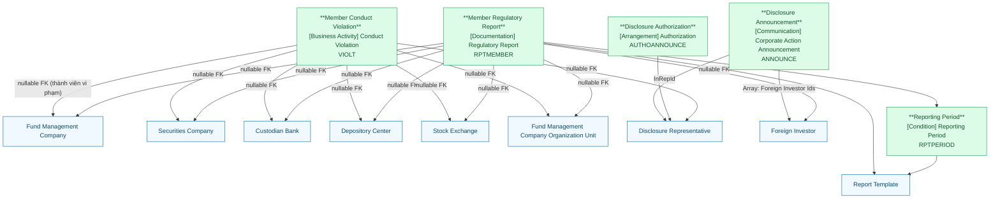

# FIMS — HLD Tier 2: Phụ thuộc Tier 1

> **Phạm vi Tier 2:** Các entity phụ thuộc Tier 1 — báo cáo thành viên, vi phạm, ủy quyền CBTT, công bố thông tin.

---

## 6a. Bảng BCV Concept

| BCV Core Object | BCV Concept | Category | Source Table | Mô tả bảng nguồn | Atomic Entity | BCV Term |
|---|---|---|---|---|---|---|
| Documentation | [Documentation] Regulatory Report | Regulatory Report | RPTMEMBER | Lưu danh sách báo cáo của các thành viên thị trường | Member Regulatory Report | Cấu trúc trường: RptId (FK biểu mẫu), PrdId (FK kỳ), FundId/SecId/BankId/DepId/InId/BranId (FK ngữ cảnh nộp — lưu thành viên nộp báo cáo cùng sở giao dịch/trung tâm lưu ký/chi nhánh liên quan), Status/DateSubmitted/DeadlineSend → 1 dòng = 1 lần nộp báo cáo của thành viên theo kỳ. BCV: [Documentation] Regulatory Report — báo cáo định kỳ nộp lên cơ quan quản lý. |
| Business Activity | [Business Activity] Conduct Violation | Conduct Violation | VIOLT | Lưu danh sách vi phạm | Member Conduct Violation | Cấu trúc trường: FundComId/SecComId/BankId/DepId/StockCenId/BranchId/InDiRepId (nullable FK đến thành viên vi phạm), Value/Status/YearValue/PeriodType → 1 dòng = 1 vi phạm ghi nhận. PrWId/CdtWId là trường kỹ thuật nội bộ — bỏ qua. BCV: [Business Activity] Conduct Violation — "Identifies a Business Activity that records a violation of conduct rules." Fact Append. |
| Arrangement | [Arrangement] Authorization | Authorization | AUTHOANNOUNCE | Lưu danh sách ủy quyền CBTT | Disclosure Authorization | Cấu trúc trường: InfoDiscRepresId (người đại diện), RelationshipId, RelatedPropertiesId, SDate/EDate → 1 dòng = 1 ủy quyền có hiệu lực từ/đến. AUTHOANNOUNCEHIS là audit log nguồn — ngoài scope Atomic. BCV: [Arrangement] — thỏa thuận ủy quyền giữa các bên. Relative (có lifecycle SDate/EDate). |
| Communication | [Communication] Corporate Action Announcement | Announcement | ANNOUNCE | Lưu danh sách các tin công bố của thành viên thị trường | Disclosure Announcement | Cấu trúc trường: InRepId → FK trực tiếp đến INFODISCREPRES (người đại diện CBTT), AnnounceTypeId, Name/DateAnnounce/Status/contentSummary → 1 dòng = 1 tin công bố. ANNOUNCEINVES là junction NĐT NN liên quan → denormalize thành Array<STRUCT> gắn vào entity này. BCV: [Communication] — "Identifies a Channel on which the Business Activity is carried out; for example an Announcement." Fact Append. |

---

## 6b. Diagram Source (Mermaid)

```mermaid
graph TD
    %% Tier 1 references
    FUNDCOMPANY["FUNDCOMPANY\n(Tier 1)"]
    SECURITIESCOMPANY["SECURITIESCOMPANY\n(Tier 1)"]
    BANKMONI["BANKMONI\n(Tier 1)"]
    DEPOSITORYCENTER["DEPOSITORYCENTER\n(Tier 1)"]
    STOCKEXCHANGE["STOCKEXCHANGE\n(Tier 1)"]
    BRANCHS["BRANCHS\n(Tier 1)"]
    INFODISCREPRES["INFODISCREPRES\n(Tier 1)"]
    RPTTEMP["RPTTEMP\n(Tier 1)"]

    %% Reference / danh mục
    ANNOUNCETYPE["ANNOUNCETYPE\n(danh mục)"]
    RELATEDPROPERTIES["RELATEDPROPERTIES\n(danh mục)"]
    RELATIONSHIP["RELATIONSHIP\n(danh mục)"]
    INVESTOR["INVESTOR\n(Tier 1)"]

    %% Tier 2 entities
    RPTPERIOD["RPTPERIOD"]
    RPTMEMBER["RPTMEMBER"]
    VIOLT["VIOLT"]
    AUTHOANNOUNCE["AUTHOANNOUNCE"]
    ANNOUNCE["ANNOUNCE"]
    ANNOUNCEINVES["ANNOUNCEINVES\n(junction → Array)"]

    RPTPERIOD --> RPTTEMP

    RPTMEMBER --> RPTTEMP
    RPTMEMBER --> RPTPERIOD
    RPTMEMBER -->|"FundId"| FUNDCOMPANY
    RPTMEMBER -->|"SecId"| SECURITIESCOMPANY
    RPTMEMBER -->|"BankId"| BANKMONI
    RPTMEMBER -->|"DepId"| DEPOSITORYCENTER
    RPTMEMBER -->|"StockId"| STOCKEXCHANGE
    RPTMEMBER -->|"InId"| INVESTOR
    RPTMEMBER -->|"BranId"| BRANCHS

    VIOLT --> FUNDCOMPANY
    VIOLT --> SECURITIESCOMPANY
    VIOLT --> BANKMONI
    VIOLT --> DEPOSITORYCENTER
    VIOLT --> STOCKEXCHANGE
    VIOLT --> INFODISCREPRES
    VIOLT --> BRANCHS

    AUTHOANNOUNCE --> INFODISCREPRES
    AUTHOANNOUNCE --> RELATIONSHIP
    AUTHOANNOUNCE --> RELATEDPROPERTIES

    ANNOUNCE -->|"InRepId"| INFODISCREPRES
    ANNOUNCE --> ANNOUNCETYPE
    ANNOUNCEINVES -->|"InvesId"| INVESTOR
    ANNOUNCEINVES -->|"AnnoId"| ANNOUNCE
```

---

## 6c. Diagram Atomic (Mermaid)

---

## 6d. Danh mục & Tham chiếu

| Source Table | Mô tả | BCV Term | Xử lý Atomic | Scheme Code |
|---|---|---|---|---|
| ANNOUNCETYPE | Danh mục loại công bố thông tin | Classification Value | Scheme: FIMS_ANNOUNCE_TYPE. | FIMS_ANNOUNCE_TYPE |
| RELATEDPROPERTIES | Danh mục hình thức liên quan (ủy quyền) | Classification Value | Scheme: FIMS_RELATED_PROPERTIES. | FIMS_RELATED_PROPERTIES |
| RELATIONSHIP | Danh mục quan hệ (ủy quyền) | Classification Value | Scheme: FIMS_RELATIONSHIP_TYPE. Bảng chỉ có 1 cột Id — xem 6f. | FIMS_RELATIONSHIP_TYPE |

**Junction table — denormalize thành Array:**

| Source Table | Bảng chính | Xử lý |
|---|---|---|
| ANNOUNCEINVES | Disclosure Announcement | `Foreign Investor Ids: Array<STRUCT<investor_id, investor_code>>` — NĐT NN liên quan đến tin công bố, gắn vào entity Disclosure Announcement. InvesId → FK đến INVESTOR (đã xác nhận). |

---

## 6e. Bảng chờ thiết kế

| Source Table | Mô tả | Lý do chưa thiết kế |
|---|---|---|
| RELATIONSHIP | Danh mục quan hệ (ủy quyền CBTT) | Chỉ có 1 cột `Id` trong FIMS_Columns.csv — thiếu thông tin cột `Name/Code`. Chưa thể xác định cấu trúc. |

---

## 6f. Điểm cần xác nhận

> Tất cả câu hỏi đã được xác nhận — không còn open question.

| # | Câu hỏi | Kết quả xác nhận |
|---|---|---|
| 1 | `RPTMEMBER` có FK đến `SECURITIESCOMPANY` (SecId) và `STOCKEXCHANGE` (StockId) — ý nghĩa là gì? | **Confirmed:** Các FK lưu ngữ cảnh nộp báo cáo — thành viên nộp ở sở giao dịch nào, qua công ty chứng khoán nào. Tất cả FundId/SecId/BankId/DepId/InId/BranId đều nullable FK (ngữ cảnh submission). |
| 2 | `RPTMEMBER` có `DepId`, `InId`, `BranId` không có FK tường minh — map đến entity nào? | **Confirmed:** DepId → Depository Center, InId → Foreign Investor, BranId → Fund Management Company Organization Unit. Thêm 3 FK pair nullable vào design. |
| 3 | `VIOLT` có `PrWId` (→ PARAWARN) và `CdtWId` (→ CDTWARN) — có cần FK? | **Confirmed:** Trường kỹ thuật nội bộ — bỏ qua. Không thêm FK. |
| 4 | `AUTHOANNOUNCEHIS` — HIS là lịch sử snapshot hay audit log? | **Confirmed:** Chỉ là audit log — ngoài scope Atomic. Giữ như 6e. |
| 5 | `ANNOUNCE.InRepId` — FK đến INFODISCREPRES hay AUTHOANNOUNCE? | **Confirmed:** → INFODISCREPRES trực tiếp. FK pair: Disclosure Representative Id + Disclosure Representative Code. |
| 6 | `ANNOUNCEINVES.InvesId` — FK đến INVESTOR hay INVESTORTYPE? | **Confirmed:** → INVESTOR. ANNOUNCEINVES là junction → denormalize thành `Foreign Investor Ids: Array<STRUCT<investor_id, investor_code>>` gắn vào Disclosure Announcement. |
