# FMS — HLD Overview: Toàn cảnh thiết kế Atomic Layer

> **Nguồn:** Thiết kế CSDL FMS — Phân hệ quản lý giám sát công ty chứng khoán và quỹ đầu tư chứng khoán (20/03/2026)
>
> **Phạm vi:** Tổng hợp toàn bộ thiết kế Atomic từ Tier 1 đến Tier 4.
>
> **File chi tiết theo tầng:**
> - [FMS_HLD_Tier1.md](FMS_HLD_Tier1.md) — Main Entities
> - [FMS_HLD_Tier2.md](FMS_HLD_Tier2.md) — Phụ thuộc Tier 1
> - [FMS_HLD_Tier3.md](FMS_HLD_Tier3.md) — Phụ thuộc Tier 2
> - [FMS_HLD_Tier4.md](FMS_HLD_Tier4.md) — Phụ thuộc Tier 3

---

## 7a. Bảng tổng quan Atomic Entities

| Tier | BCV Core Object | BCV Concept | Category | Source Table | Mô tả bảng nguồn | Atomic Entity | BCV Term |
|---|---|---|---|---|---|---|---|
| 1 | Involved Party | [Involved Party] Portfolio Fund Management Company | Involved Party | SECURITIES | Danh sách công ty QLQ trong nước | Fund Management Company | Portfolio Fund Management Company — *"Identifies a Fund Management Company that sets up the Portfolio."* |
| 1 | Involved Party | [Involved Party] Organization Unit | Involved Party | FORBRCH | Danh sách VPĐD/CN công ty QLQ NN tại VN | Foreign Fund Management Organization Unit | Organization Unit — *"A component or subdivision of an Organization established for the purpose of performing discrete functional responsibilities."* Hoạt động độc lập trong scope giám sát UBCKNN. |
| 1 | Involved Party | [Involved Party] Custodian | Involved Party | BANKMONI | Danh sách ngân hàng lưu ký giám sát (LKGS) | Custodian Bank | Custodian — *"Identifies an Organization that holds, safeguards and accounts for property committed to its care."* |
| 1 | Involved Party | [Involved Party] Mutual Fund Distributor | Involved Party | AGENCIES | Danh sách đại lý quỹ đầu tư | Fund Distribution Agent | Mutual Fund Distributor — *"Identifies a relationship whereby an Involved Party is responsible for the distribution of shares in, or units of, a Group which is a pool of investments."* |
| 1 | Involved Party | [Involved Party] | Involved Party | INVES | Danh sách nhà đầu tư ủy thác | Discretionary Investment Investor | Không có BCV term chính xác. Đặt theo ngữ cảnh FMS — NĐT giao tài sản cho QLQ quản lý. |
| 1 | Condition | [Condition] | Condition | RPTPERIOD | Kỳ báo cáo | Reporting Period | Không có BCV term chính xác. Gần nhất: Time Period (Common). |
| 1 | Condition | [Condition] | Condition | RATINGPD | Danh sách kỳ đánh giá xếp loại | Member Rating Period | Không có BCV term chính xác. Gần nhất: Arrangement Performance Criterion — nhưng không khớp. Đặt theo ngữ cảnh FMS. |
| 1 | Location | [Location] Postal Address | Location | SECURITIES, FORBRCH, BANKMONI, AGENCIES | — | IP Postal Address *(Shared)* | Postal Address |
| 1 | Location | [Location] Electronic Address | Location | SECURITIES, FORBRCH, BANKMONI | — | IP Electronic Address *(Shared)* | Electronic Address |
| 1 | Involved Party | [Involved Party] Alternative Identification | Involved Party | SECURITIES, FORBRCH, INVES | — | IP Alt Identification *(Shared)* | Alternative Identification |
| 2 | Involved Party | [Involved Party] Organization | Involved Party | FUNDS | Danh sách quỹ đầu tư chứng khoán | Investment Fund | Organization (id 10894) — *"Identifies an Involved Party that may stand alone in an operational or legal context."* FundCapital + DecisionDate + StopDate = pháp nhân. |
| 2 | Involved Party | [Involved Party] Organization Unit | Involved Party | BRANCHES | Danh sách CN/VPĐD công ty QLQ trong nước | Fund Management Company Organization Unit | Organization Unit (id 11192) — *"A component or subdivision of an Organization."* Có Address/GP riêng, FK đến tổ chức cha. |
| 2 | Involved Party | [Involved Party] Individual | Involved Party | TLProfiles | Danh sách nhân sự công ty QLQ | Fund Management Company Key Person | Individual (id 10902) — *"Identifies an Involved Party who is a natural person."* FullName + BirthDate + IdNo = thể nhân. |
| 2 | Involved Party | [Involved Party] Organization Unit | Involved Party | AGENCIESBRA | Danh sách CN/PGD của đại lý quỹ đầu tư | Fund Distribution Agent Organization Unit | Organization Unit (id 11192) — cùng pattern với BRANCHES. Name + Address + FK đến đại lý cha. |
| 2 | Arrangement | [Arrangement] Financial Portfolio Management Arrangement | Arrangement | INVESACC | Danh sách tài khoản nhà đầu tư ủy thác | Discretionary Investment Account | Financial Portfolio Management Arrangement — *"Identifies a service of managing of financial portfolio."* ContractNo + ActScale/AdScale + ManagerFee = hợp đồng dịch vụ. |
| 2 | Involved Party | [Involved Party] Involved Party Rating | Involved Party | RANK | Bảng xếp hạng theo kỳ đánh giá | Member Rating | Involved Party Rating (id 10360) — *"Identifies a relationship in which a Rating Scale applies to an Involved Party."* TotalScore/RankValue/RankClass = kết quả cụ thể gán cho từng QLQ theo kỳ. |
| 2 | Condition | [Condition] Criterion | Condition | RNKFACTOR | Bảng chấm điểm đánh giá xếp loại (nhân tố cha/con) | Rating Criterion | Criterion (id 8945) — *"Identifies a Condition that specifies a characteristic used as a basis of judgment."* Name + MaxScore + Weight = tiêu chí tĩnh, không gắn Arrangement. |
| 3 | Business Activity | [Business Activity] Conduct Violation | Business Activity | VIOLT | Danh sách vi phạm của công ty QLQ/quỹ đầu tư | Fund Management Conduct Violation | Conduct Violation — vi phạm pháp luật hoặc hành chính của công ty QLQ hoặc quỹ đầu tư. SecId/FndId nullable — thuộc về QLQ hoặc quỹ, không đồng thời cả hai. |
| 3 | Involved Party | [Involved Party] Involved Party Group Membership | Involved Party | MBFUND | Danh sách nhà đầu tư quỹ | Investment Fund Investor Membership | Involved Party Group Membership (id 10364) — *"Identifies a relationship in which an Involved Party is a member of a Group."* FndId + InvesId + Capital + Ratio = membership có attribute. |
| 3 | Involved Party | [Involved Party] Involved Party Role | Involved Party | REPRESENT | Danh sách ban đại diện/HĐQT quỹ đầu tư | Investment Fund Representative Board Member | Involved Party Role (id 10362) — *"Identifies a relationship in which an Involved Party performs a defined function."* FndId + TLId + IsChair + Status = cá nhân đảm nhận vai trò trong ban đại diện. |
| 3 | Involved Party | [Involved Party] Involved Party Role | Involved Party | STFFGBRCH | Danh sách nhân sự VPĐD/CN công ty QLQ NN | Foreign Fund Management Organization Unit Staff | Involved Party Role (id 10362) — cùng pattern với REPRESENT. FgBrId + TLId + FnType + Isr + Isp = cá nhân đảm nhận vai trò tại VPĐD/CN QLQ NN. |
| 3 | Communication | [Event] Communication | Event | RPTMEMBER | Báo cáo định kỳ của thành viên thị trường | Member Periodic Report | Communication (id 8956) — *"Identifies an Event that is a communication between Involved Parties."* DeadlineSend + DateSubmitted + Status = giao tiếp giữa thành viên và cơ quan quản lý. |
| 3 | Transaction | [Event] Transaction | Event | TRSFERINDER | Danh sách giao dịch chuyển nhượng cổ phần | Fund Management Company Share Transfer | Transaction (id 8954) — *"Identifies an Event that is a transaction between Involved Parties."* TransDate + Quantity + Price = giao dịch tài chính cụ thể. |
| 4 | Transaction | [Event] Transaction | Event | TRANSFERMBF | Danh sách giao dịch chứng chỉ quỹ | Investment Fund Certificate Transfer | Transaction (id 8954) — cùng pattern với TRSFERINDER. TransDate + Quantity + Price + TransType = giao dịch CCQ. |
| 4 | Business Activity | [Event] Business Activity | Event | MBCHANGE | Lịch sử thay đổi vốn góp nhà đầu tư quỹ | Investment Fund Investor Capital Change Log | Business Activity (id 8958) — OldCapital/NewCapital/ChangeDate/Reason là dữ liệu nghiệp vụ định kiểu rõ ràng, không phải blob. Reclassified từ "Audit Log nguồn". |
| 4 | Business Activity | [Event] Business Activity | Event | RPTMBHS | Lịch sử báo cáo thành viên | Member Periodic Report Status Log | Business Activity (id 8958) — *"Identifies an Event that is a business activity."* Status + ContentSummary + Note = sự kiện thay đổi trạng thái báo cáo, không lưu Old/New value. |
| 4 | Documentation | [Resource Item] Documentation | Resource Item | RPTVALUES | Báo cáo giá trị — lưu dữ liệu import | Report Import Value | Documentation (id 11050) — *"Identifies a Resource Item that is a document."* Values + SheetId + TgtId = nội dung tài liệu báo cáo được import. |

---

## 7b. Diagram Atomic Tổng

```mermaid
graph TD
    classDef atomic fill:#dcfce7,stroke:#16a34a,color:#14532d
    classDef shared fill:#fae8ff,stroke:#9333ea,color:#4a044e

    %% Shared Entities
    ADDR["IP Postal Address"]:::shared
    EADDR["IP Electronic Address"]:::shared
    ALTID["IP Alt Identification"]:::shared

    %% Tier 1
    FMC["**Fund Management Company**"]:::atomic
    FGOU["**Foreign Fund Management Organization Unit**"]:::atomic
    BNK["**Custodian Bank**"]:::atomic
    FDA["**Fund Distribution Agent**"]:::atomic
    DII["**Discretionary Investment Investor**"]:::atomic
    RPD["**Reporting Period**"]:::atomic
    MRP["**Member Rating Period**"]:::atomic

    %% Tier 2
    FUND["**Investment Fund**"]:::atomic
    FMCOU["**Fund Management Company Organization Unit**"]:::atomic
    KP["**Fund Management Company Key Person**"]:::atomic
    FDAOU["**Fund Distribution Agent Organization Unit**"]:::atomic
    IACC["**Discretionary Investment Account**"]:::atomic
    RATING["**Member Rating**"]:::atomic
    RC["**Rating Criterion**"]:::atomic

    %% Tier 3
    MBF["**Investment Fund Investor Membership**"]:::atomic
    REP["**Investment Fund Representative Board Member**"]:::atomic
    STF["**Foreign Fund Management Organization Unit Staff**"]:::atomic
    RPT["**Member Periodic Report**"]:::atomic
    TRF["**Fund Management Company\nShare Transfer**"]:::atomic
    VIO["**Fund Management Conduct Violation**"]:::atomic

    %% Tier 4
    TRCF["**Investment Fund Certificate Transfer**"]:::atomic
    RLOG["**Member Periodic Report Status Log**"]:::atomic
    CHG["**Investment Fund Investor\nCapital Change Log**"]:::atomic
    RIV["**Report Import Value**"]:::atomic

    %% Tier 1 — Shared
    FMC --> ADDR
    FMC --> EADDR
    FMC --> ALTID
    FGOU --> ADDR
    FGOU --> EADDR
    FGOU --> ALTID
    BNK --> ADDR
    BNK --> EADDR
    FDA --> ADDR
    DII --> ALTID

    %% Tier 2 — FK đến Tier 1
    FUND -->|FK| FMC
    FMCOU -->|FK| FMC
    FMCOU -->|FK người đại diện| KP
    FMCOU -->|self-FK cha/con| FMCOU
    FMCOU --> ADDR
    FMCOU --> EADDR
    FMCOU --> ALTID
    KP -->|FK| FMC
    KP --> ALTID
    FDAOU -->|FK| FDA
    FDAOU --> ADDR
    IACC -->|FK| DII
    RATING -->|FK| FMC
    RATING -->|FK| MRP
    RC -->|self-FK cha| RC

    %% Tier 3 — FK đến Tier 1/2
    MBF -->|FK| FUND
    MBF -->|FK| DII
    REP -->|FK| FUND
    REP -->|FK| KP
    STF -->|FK| FGOU
    STF -->|FK| KP
    RPT -->|FK nullable| FMC
    RPT -->|FK nullable| FUND
    RPT -->|FK nullable| BNK
    RPT -->|FK nullable| FGOU
    RPT -->|FK| RPD
    TRF -->|FK| FMC
    VIO -->|FK nullable| FMC
    VIO -->|FK nullable| FUND

    %% Tier 4 — FK đến Tier 2/3
    TRCF -->|FK| FUND
    TRCF -->|FK| MBF
    RLOG -->|FK| RPT
    CHG -->|FK| MBF
    RIV -->|FK nullable| FMC
    RIV -->|FK nullable| FUND
    RIV -->|FK nullable| BNK
    RIV -->|FK nullable| FGOU
    RIV -->|FK| RPD
```

---

## 7c. Bảng Classification Value

| Source Table | Mô tả | BCV Term | Xử lý Atomic |
|---|---|---|---|
| STATUS | Danh sách trạng thái hoạt động | — | → Classification Value |
| AGENCYTYPE | Danh sách loại đại lý | — | → Classification Value |
| NATIONAL | Danh sách quốc gia/quốc tịch | [Location] Geographic Area | → **Atomic entity `Geographic Area`** (shared, status=approved). Cùng entity với FIMS.NATIONAL và SCMS.DM_QUOC_TICH. Type = `COUNTRY`. |
| STOCKHOLDERTYPE | Danh sách loại hình NĐT/cổ đông | — | → Classification Value |
| JOBTYPE | Danh sách loại chức vụ | — | → Classification Value. Scheme: `FMS_JOB_TYPE` |
| BUSINESS | Danh mục ngành nghề kinh doanh | — | → Classification Value. Scheme: `FMS_BUSINESS_TYPE`. Denormalize thành ARRAY trên entity cha (xem 7d). |

---

## 7d. Junction Tables

| Source Table | Mô tả | Entity chính | Xử lý trên Atomic |
|---|---|---|---|
| SECBUSINES | Ngành nghề kinh doanh của công ty QLQ | Fund Management Company | → `business_type_codes ARRAY<STRING>` |
| FGBUSINESS | Ngành nghề kinh doanh VPĐD/CN QLQ NN tại VN | Foreign Fund Management Organization Unit | → `business_type_codes ARRAY<STRING>` |
| AGENFUNDS | Bảng trung gian Map đại lý và quỹ đầu tư | Investment Fund | → `distribution_agents ARRAY<STRUCT<agent_id BIGINT, agent_code STRING>>` |
| FNDSBMN | Bảng trung gian FUNDS & BANKMONI | Investment Fund | → `custodian_banks ARRAY<STRUCT<bank_id BIGINT, bank_code STRING>>` |

---

## 7e. Điểm cần xác nhận

| # | Tier | Câu hỏi | Ảnh hưởng |
|---|---|---|---|
| 1 | T1 | SECURITIES.Dorf (1=Trong nước, 0=Nước ngoài) — nếu Dorf=0 tồn tại, có cần phân luồng ETL? | Entity Fund Management Company |
| ~~2~~ | T1 | ~~RPTPERIOD — cần bổ sung column detail~~ | ✅ Đã có cột đầy đủ — thiết kế hoàn tất. |
| 3 | T2 | INVESACC.AccPlace (nơi lưu ký) — có phải FK đến BANKMONI không? | Nếu có → thêm FK từ Discretionary Investment Account đến Custodian Bank |
| 4 | T2 | BRANCHES.BrIdowner — giá trị là Id nguồn hay text? | Ảnh hưởng thiết kế self-FK surrogate trên Atomic |
| 5 | T2 | TLProfiles — nhân sự có thể thuộc nhiều công ty QLQ qua thời gian không? | Nếu có → grain cần review, có thể cần tách role khỏi entity |
| ~~6~~ | T2 | ~~PARVALUE — không có bảng nào FK đến.~~ | ✅ Xác nhận orphan — loại khỏi scope Atomic. |
| 7 | T3 | TRSFERINDER — không có FK bên nhận/bên chuyển nhượng. Giao dịch này có liên quan đến INVES không? | Nếu có → thêm FK đến Discretionary Investment Investor |
| 8 | T3 | RPTMEMBER — mỗi bản ghi chỉ thuộc 1 loại thành viên (SecId hoặc FndId hoặc BkMId hoặc FrBrId). Xác nhận logic nullable này. | Ảnh hưởng thiết kế FK nullable và kiểm tra data quality |
| ~~9~~ | T3 | ~~STFFGBRCH — TLId trỏ đến TLProfiles. Có dùng chung không?~~ | ✅ Xác nhận: dùng chung TLProfiles — không cần entity nhân sự riêng cho QLQ NN. |
| 10 | T4 | TRANSFERMBF — FK đến cả FUNDS và MBFUND, MBFUND đã chứa FndId. FK đến FUNDS có cần thiết trên Atomic không? | Nếu không → bỏ FK redundant đến Investment Fund |
| 11 | T4 | RPTVALUES.RptId và SheetId — sau khi có cột RPTTEMP và SHEET, xác nhận đây là FK đến Atomic entity hay Classification Value | Ảnh hưởng thiết kế FK của Report Import Value |

---

## 7f. Bảng ngoài scope

| Nhóm | Source Table | Mô tả bảng nguồn | Lý do ngoài scope |
|---|---|---|---|
| Isolated | PARAWARN | Danh sách tham số cảnh báo | Không FK đến/từ bảng nghiệp vụ nào |
| Isolated | PARVALUE | Danh sách mệnh giá cổ phần | Không có bảng nào FK đến — xác nhận orphan, loại khỏi scope. |
| Isolated | CALENDAR | Lịch làm việc và lịch nghỉ | Không FK đến bảng nghiệp vụ nào |
| Isolated | CERTFCATE | Chứng thư số của thành viên thị trường | Không FK đến bảng nghiệp vụ nào |
| Isolated | SYSVAR | Danh sách tham số hệ thống | Không FK đến bảng nghiệp vụ nào |
| Hệ thống / Phân quyền | USERS | Quản lý người dùng hệ thống | Hạ tầng IT |
| Hệ thống / Phân quyền | ROLES | Nhóm quyền chức năng | Hạ tầng IT |
| Hệ thống / Phân quyền | MENUS | Danh mục quyền chức năng | Hạ tầng IT |
| Hệ thống / Phân quyền | ROLESMENUS | Phân quyền menu theo nhóm quyền | Hạ tầng IT |
| Hệ thống / Phân quyền | USERSMENUS | Phân quyền chức năng cho người dùng | Hạ tầng IT |
| Hệ thống / Phân quyền | USERSESSIONS | Quản lý tài khoản đang truy cập | Hạ tầng IT |
| Hệ thống / Phân quyền | REFRESHTOKEN | Phiên làm việc (Token đăng nhập) | Hạ tầng IT |
| Hệ thống / Phân quyền | DTSCOPE | Phân quyền dữ liệu — phạm vi | Hạ tầng IT |
| Hệ thống / Phân quyền | DTSCBMN | Phân quyền dữ liệu ngân hàng LKGS cho chuyên viên | Hạ tầng IT |
| Hệ thống / Phân quyền | DTSCFND | Phân quyền dữ liệu QĐT cho chuyên viên | Hạ tầng IT |
| Hệ thống / Phân quyền | DTSCFR | Phân quyền dữ liệu VPĐD/CN QLQ NN cho chuyên viên | Hạ tầng IT |
| Hệ thống / Phân quyền | NOTIFICATION | Thông báo hệ thống | Hạ tầng IT |
| Hệ thống / Phân quyền | SYSEMAIL | Nội dung trao đổi thông tin | Hạ tầng IT |
| Hệ thống / Phân quyền | TABSINFO | Thiết lập hiển thị dữ liệu | Cấu hình UI |
| Hệ thống / Phân quyền | SECURITIESREPORT | Thiết lập hiển thị báo cáo công ty QLQ | Cấu hình UI |
| Audit Log nguồn | SECHISTORY | Lịch sử thông tin công ty QLQ | Audit Log — PrevValue/ValueChange/Action/DateChange |
| Audit Log nguồn | TLPRHISTORY | Lịch sử nhân sự | Audit Log — cùng pattern SECHISTORY |
| Audit Log nguồn | FUNDHISTORY | Lịch sử quỹ đầu tư | Audit Log — cùng pattern SECHISTORY |
| Audit Log nguồn | FGBRBUP | Lịch sử thay đổi VPĐD/CN QLQ NN | Audit Log — cùng pattern SECHISTORY |
| ~~Audit Log nguồn~~ | ~~MBCHANGE~~ | ~~Lịch sử thay đổi vốn góp nhà đầu tư quỹ~~ | ✅ Reclassified — trong scope Atomic (Tier 4). Xem Investment Fund Investor Capital Change Log. |
| Snapshot nguồn | SECBUP | Chi tiết lịch sử công ty QLQ (bản ghi trước/sau) | Snapshot — IsBefore + SecData (blob) |
| Snapshot nguồn | TLPROBUP | Chi tiết lịch sử nhân sự (bản ghi trước/sau) | Snapshot — IsBefore + TLData (blob) |
| Snapshot nguồn | BRCHBUP | Lịch sử chi tiết CN/VPĐD công ty QLQ trong nước | Snapshot — FK đến SECHISTORY (Audit Log) |
| Snapshot nguồn | FNDBUP | Bản ghi chi tiết lịch sử quỹ đầu tư | Chưa có cột — dự kiến Snapshot pattern |
| Chưa có cột | RPTTEMP | Danh sách biểu mẫu báo cáo đầu vào | Chưa có thông tin cột — RPTVALUES FK đến |
| Chưa có cột | RPTTPOUT | Danh sách biểu mẫu báo cáo đầu ra | Chưa có thông tin cột |
| Chưa có cột | SHEET | Danh sách sheet báo cáo đầu vào | Chưa có thông tin cột — RPTVALUES FK đến |
| Chưa có cột | SHEETOUT | Danh sách sheet báo cáo đầu ra | Chưa có thông tin cột |
| Chưa có cột | RPTPDSHT | Bảng trung gian SHEETS và RPTPERIOD | Chưa có thông tin cột |
| Chưa có cột | RPTHTORY | Lịch sử thay đổi báo cáo đầu vào | Chưa có thông tin cột |
| Chưa có cột | RPTPROCESS | Lịch sử xử lý báo cáo thành viên | Chưa có thông tin cột |
| Chưa có cột | SELFSETPD | Thành viên tự thiết lập gửi báo cáo | Chưa có thông tin cột |
| Chưa có cột | STTRGTOUT | Cấu hình lấy dữ liệu báo cáo đầu ra | Chưa có thông tin cột |
| Chưa có cột | TOTSTTG | Cấu hình dữ liệu đầu ra với ô dữ liệu | Chưa có thông tin cột |
| Chưa có cột | TPOUTHTORY | Lịch sử thay đổi báo cáo đầu ra | Chưa có thông tin cột |
| Chưa có cột | USERRPTO | Phân quyền người dùng UBCK với báo cáo đầu ra | Chưa có thông tin cột |
| Chưa có cột | STAKE | Danh sách các bên liên quan | Chưa có thông tin cột |
| Chờ thiết kế | RNKGRFTOR | Bảng trung gian Ranks và RNKFACTOR | Trong scope nghiệp vụ, chưa có thông tin cột |
| Chờ thiết kế | RNKFACTHISTORY | Lưu kết quả các lần lưu bảng tổng hợp đánh giá | Trong scope nghiệp vụ, chưa có thông tin cột |
