# GSGD HLD — Tier 3

**Source system:** GSGD (Giám sát Giao dịch)  
**Tier 3:** Các entity phụ thuộc Tier 2 — FK đến entity Tier 2.

---

## 6a. Bảng tổng quan BCV Concept

| BCV Core Object | BCV Concept | Category | Source Table | Mô tả bảng nguồn | Atomic Entity | table_type | BCV Term |
|---|---|---|---|---|---|---|---|
| Documentation | [Documentation] Regulatory Report | — | abnormal_report_file | File đính kèm báo cáo bất thường | Abnormal Trading Report File Attachment | Relative | File đính kèm báo cáo bất thường (file_name, file_path, file_size, file_type, digital_signature). FK → abnormal_report (T1). Tương tự Case Document Attachment nhưng FK đến Abnormal Trading Report. |
| Documentation | [Documentation] Reported Information | — | compliance_report_data | Dữ liệu chi tiết báo cáo tổng hợp | Market Surveillance Compliance Report Row Data | Fact Append | Dữ liệu chi tiết từng dòng trong báo cáo tuân thủ (row_data dạng JSON/text). FK → compliance_report_master (T2). Grain: 1 dòng = 1 row × 1 kỳ báo cáo. Insert-only khi báo cáo được tạo. |
| Business Activity | [Business Activity] Audit Investigation | — | analysis_execution_log | Thông tin trạng thái phân tích quy trình của từng biểu mẫu | Market Surveillance Analysis Execution Log | Fact Append | Log thực thi phân tích từng biểu mẫu trong vụ việc (analysis_name, workflow_type, start_time, end_time, status, path, file_name). FK → case_file (T1) — không phải T2 entity. Grain: 1 dòng = 1 lần chạy phân tích 1 biểu mẫu. Append-only. |
| Business Activity | [Business Activity] Audit Investigation | — | analysis_suspicious_account_code | Thông tin tài khoản nghi vấn của từng biểu mẫu | Market Surveillance Analysis Suspicious Account Snapshot | Fact Append | Snapshot thông tin tài khoản nghi vấn theo từng biểu mẫu phân tích (account_code, account_name, identity_number, contact_address). FK → case_file (T1) + report_template_id. Grain: 1 dòng = 1 TK nghi vấn × 1 biểu mẫu × 1 vụ việc. Không phải entity Involved Party — đây là snapshot tại thời điểm phân tích. |
| Business Activity | [Business Activity] Audit Investigation | — | analysis_suspicious_account | Phân tích tài khoản nghi vấn | Market Surveillance Suspicious Account Analysis Result | Fact Append | Kết quả phân tích tài khoản nghi vấn trong vụ việc (workflow_type, result_type: phân tích/kiểm tra, account_code, analysis_date). FK → case_file (T1). Grain: 1 dòng = 1 kết quả phân tích × 1 TK × 1 ngày. |
| Business Activity | [Business Activity] Audit Investigation | — | analysis_account_relationship | Phân tích mối quan hệ giữa các tài khoản nghi vấn | Market Surveillance Account Relationship Analysis Result | Fact Append | Kết quả phân tích quan hệ giữa các TK nghi vấn (workflow_type, result_type, relationship_id → account_relationship T2, analysis_date). FK → case_file (T1) + account_relationship (T2). |
| Business Activity | [Business Activity] Audit Investigation | — | analysis_account_group | Phân tích nhóm tài khoản | Market Surveillance Account Group Analysis Result | Fact Append | Kết quả phân tích nhóm tài khoản nghi vấn (workflow_type, result_type, group_code, group_name, analysis_date). FK → case_file (T1). Grain: 1 dòng = 1 kết quả nhóm × 1 ngày phân tích. |
| Business Activity | [Business Activity] Audit Investigation | — | analysis_account_group_member | Lịch sử thay đổi nhóm tài khoản trong phân tích | Market Surveillance Account Group Member Analysis Result | Fact Append | Thành viên nhóm tài khoản trong kết quả phân tích (workflow_type, result_type, account_code, relationship_id, analysis_date). FK → case_file (T1). Grain: 1 dòng = 1 TK trong 1 nhóm phân tích × 1 ngày. |
| Documentation | [Documentation] Reported Information | — | analysis_report | Báo cáo kết quả phân tích vụ việc | Market Surveillance Analysis Report | Fact Append | Báo cáo output của quá trình phân tích vụ việc (report_type, report_date, report_data JSON/XML, report_file_path). FK → case_file (T1). Cột `analysis_execution_log` là ID kỹ thuật tham chiếu lần chạy phân tích — giữ denormalized. Grain: 1 dòng = 1 báo cáo × 1 vụ việc. Soft-delete (`deleted` flag) → lọc deleted = false khi load Atomic. |

---

## 6b. Diagram Source (Mermaid)

```mermaid
erDiagram
    case_file {
        bigint id PK
        string case_file_code
    }

    account_relationship {
        bigint id PK
        string relationship_value
    }

    abnormal_report {
        bigint id PK
        string report_code
    }

    compliance_report_master {
        bigint id PK
        bigint template_id FK
    }

    abnormal_report_file {
        bigint id PK
        bigint report_id FK
        string file_name
        string file_path
        string digital_signature
    }

    compliance_report_data {
        bigint id PK
        bigint report_master_id FK
        string row_data
    }

    analysis_execution_log {
        bigint id PK
        bigint case_file_id FK
        bigint report_template_id FK
        string workflow_type
        datetime start_time
        datetime end_time
        string status
        string file_name
    }

    analysis_suspicious_account_code {
        bigint id PK
        bigint template_id FK
        bigint case_file_id FK
        string workflow_type
        string account_code
        string account_name
        string identity_number
    }

    analysis_suspicious_account {
        bigint id PK
        bigint case_file_id FK
        string workflow_type
        string result_type
        string account_code
        date analysis_date
    }

    analysis_account_relationship {
        bigint id PK
        bigint case_file_id FK
        string workflow_type
        string result_type
        bigint relationship_id FK
        date analysis_date
    }

    analysis_account_group {
        bigint id PK
        bigint case_file_id FK
        string workflow_type
        string result_type
        string group_code
        string group_name
        date analysis_date
    }

    analysis_account_group_member {
        bigint id PK
        bigint case_file_id FK
        string workflow_type
        string result_type
        bigint account_group_id FK
        string account_code
        bigint relationship_id FK
        date analysis_date
    }

    abnormal_report_file ||--o{ abnormal_report : "report_id"
    compliance_report_data ||--o{ compliance_report_master : "report_master_id"
    analysis_execution_log ||--o{ case_file : "case_file_id"
    analysis_suspicious_account_code ||--o{ case_file : "case_file_id"
    analysis_suspicious_account ||--o{ case_file : "case_file_id"
    analysis_account_relationship ||--o{ case_file : "case_file_id"
    analysis_account_relationship ||--o{ account_relationship : "relationship_id"
    analysis_account_group ||--o{ case_file : "case_file_id"
    analysis_account_group_member ||--o{ case_file : "case_file_id"
    analysis_account_group_member ||--o{ account_relationship : "relationship_id"

    analysis_report {
        bigint id PK
        bigint case_file_id FK
        string report_type
        date report_date
        string report_data
        string report_file_path
        bigint analysis_execution_log
        datetime created_at
        string created_by_name
        boolean deleted
    }

    analysis_report ||--o{ case_file : "case_file_id"
```

---

## 6c. Diagram Atomic (Mermaid)

```mermaid
erDiagram
    AbnormalTradingReport["Abnormal Trading Report (T1)"] {
        bigint abnormal_trading_report_id PK
    }

    MarketSurveillanceComplianceReportInstance["Market Surveillance Compliance Report Instance (T2)"] {
        bigint market_surveillance_compliance_report_instance_id PK
    }

    MarketSurveillanceCase["Market Surveillance Case (T1)"] {
        bigint market_surveillance_case_id PK
    }

    InvestorAccountRelationship["Investor Account Relationship (T2)"] {
        bigint investor_account_relationship_id PK
    }

    AccountInvestorGroup["Account Investor Group (T1)"] {
        bigint account_investor_group_id PK
    }

    AbnormalTradingReportFileAttachment["Abnormal Trading Report File Attachment"] {
        bigint abnormal_trading_report_file_attachment_id PK
        bigint abnormal_trading_report_id FK
        string file_name
        string file_path
        string digital_signature
    }

    MarketSurveillanceComplianceReportRowData["Market Surveillance Compliance Report Row Data"] {
        bigint market_surveillance_compliance_report_row_data_id PK
        bigint market_surveillance_compliance_report_instance_id FK
        string row_data
    }

    MarketSurveillanceAnalysisExecutionLog["Market Surveillance Analysis Execution Log"] {
        bigint market_surveillance_analysis_execution_log_id PK
        bigint market_surveillance_case_id FK
        string analysis_name
        string workflow_type_code
        timestamp start_time
        timestamp end_time
        string execution_status_code
        string file_path
        string file_name
    }

    MarketSurveillanceAnalysisSuspiciousAccountSnapshot["Market Surveillance Analysis Suspicious Account Snapshot"] {
        bigint market_surveillance_analysis_suspicious_account_snapshot_id PK
        bigint market_surveillance_case_id FK
        string workflow_type_code
        string account_code
        string account_name
        string identity_number
        string contact_address
        string domestic_foreign_flag
        string account_status_code
    }

    MarketSurveillanceSuspiciousAccountAnalysisResult["Market Surveillance Suspicious Account Analysis Result"] {
        bigint market_surveillance_suspicious_account_analysis_result_id PK
        bigint market_surveillance_case_id FK
        string workflow_type_code
        string result_type_code
        string account_code
        date analysis_date
    }

    MarketSurveillanceAccountRelationshipAnalysisResult["Market Surveillance Account Relationship Analysis Result"] {
        bigint market_surveillance_account_relationship_analysis_result_id PK
        bigint market_surveillance_case_id FK
        bigint investor_account_relationship_id FK
        string workflow_type_code
        string result_type_code
        date analysis_date
    }

    MarketSurveillanceAccountGroupAnalysisResult["Market Surveillance Account Group Analysis Result"] {
        bigint market_surveillance_account_group_analysis_result_id PK
        bigint market_surveillance_case_id FK
        string workflow_type_code
        string result_type_code
        string group_code
        string group_name
        date analysis_date
    }

    MarketSurveillanceAccountGroupMemberAnalysisResult["Market Surveillance Account Group Member Analysis Result"] {
        bigint market_surveillance_account_group_member_analysis_result_id PK
        bigint market_surveillance_case_id FK
        bigint account_investor_group_id FK
        string account_investor_group_code
        string workflow_type_code
        string result_type_code
        string account_code
        bigint investor_account_relationship_id FK
        date analysis_date
    }

    AbnormalTradingReportFileAttachment ||--o{ AbnormalTradingReport : "abnormal_trading_report_id"
    MarketSurveillanceComplianceReportRowData ||--o{ MarketSurveillanceComplianceReportInstance : "compliance_report_instance_id"
    MarketSurveillanceAnalysisExecutionLog ||--o{ MarketSurveillanceCase : "market_surveillance_case_id"
    MarketSurveillanceAnalysisSuspiciousAccountSnapshot ||--o{ MarketSurveillanceCase : "market_surveillance_case_id"
    MarketSurveillanceSuspiciousAccountAnalysisResult ||--o{ MarketSurveillanceCase : "market_surveillance_case_id"
    MarketSurveillanceAccountRelationshipAnalysisResult ||--o{ MarketSurveillanceCase : "market_surveillance_case_id"
    MarketSurveillanceAccountRelationshipAnalysisResult ||--o{ InvestorAccountRelationship : "investor_account_relationship_id"
    MarketSurveillanceAccountGroupAnalysisResult ||--o{ MarketSurveillanceCase : "market_surveillance_case_id"
    MarketSurveillanceAccountGroupMemberAnalysisResult ||--o{ MarketSurveillanceCase : "market_surveillance_case_id"
    MarketSurveillanceAccountGroupMemberAnalysisResult ||--o{ AccountInvestorGroup : "account_investor_group_id"
    MarketSurveillanceAccountGroupMemberAnalysisResult ||--o{ InvestorAccountRelationship : "investor_account_relationship_id"

    MarketSurveillanceAnalysisReport["Market Surveillance Analysis Report"] {
        bigint market_surveillance_analysis_report_id PK
        bigint market_surveillance_case_id FK
        string market_surveillance_case_code
        string report_type_code
        date report_date
        string report_data
        string report_file_path
        bigint analysis_execution_log_id
    }

    MarketSurveillanceAnalysisReport ||--o{ MarketSurveillanceCase : "market_surveillance_case_id"
```

---

## 6d. Danh mục & Tham chiếu (Reference Data)

| Source Table | Mô tả | BCV Term | Xử lý Atomic | Scheme Code |
|---|---|---|---|---|
| category_item (ANALYSIS_REPORT_TYPE) | Loại báo cáo phân tích | Classification | Classification Value | `GSGD_ANALYSIS_REPORT_TYPE` |
| category_item (EXECUTION_STATUS) | Trạng thái phân tích: Active / Inactive | Classification | Classification Value | `GSGD_EXECUTION_STATUS` |
| category_item (RESULT_TYPE) | Loại kết quả: Kết quả phân tích / Kết quả kiểm tra | Classification | Classification Value | `GSGD_RESULT_TYPE` |
| category_item (TEMPLATE_TYPE) | Loại biểu mẫu: Báo cáo tổng hợp / Báo cáo phân tích | Classification | Classification Value | `GSGD_TEMPLATE_TYPE` |

---

## 6e. Bảng chờ thiết kế

Không có bảng nghiệp vụ Tier 3 nào chưa có cấu trúc cột.

---

## 6f. Điểm cần xác nhận

| # | Câu hỏi | Ảnh hưởng |
|---|---|---|
| 1 | `analysis_execution_log` FK trực tiếp → case_file (T1), không qua T2 entity. Việc đặt vào Tier 3 có phù hợp? | Đặt vào Tier 2 cũng được (FK duy nhất là case_file T1). Lý do để Tier 3: về ngữ nghĩa, execution log sinh ra từ workflow step (T2) — dù không có FK tường minh. Đề xuất: **chuyển Tier 2** nếu muốn đơn giản. Ghi nhận để thống nhất. |
| 2 | `compliance_report_data.row_data` là dạng JSON blob — không có cấu trúc cột tường minh. Có cần thiết kế entity Atomic không? | Nếu row_data hoàn toàn không có schema ổn định → cân nhắc đưa vào Bronze only, không thiết kế Atomic. Đề xuất: **giữ Atomic entity** với row_data dạng Text (raw JSON), tránh parse. Cần xác nhận với business. |
| 3 | ~~`analysis_account_group_member.account_group_id` FK suy luận → account_group (T1) nhưng không có FK tường minh. Có cần FK này trên Atomic?~~ **✅ RESOLVED:** FK suy luận được xác nhận đúng → thêm `account_investor_group_id FK` + `account_investor_group_code` (denormalized) vào `Market Surveillance Account Group Member Analysis Result`. | — |
