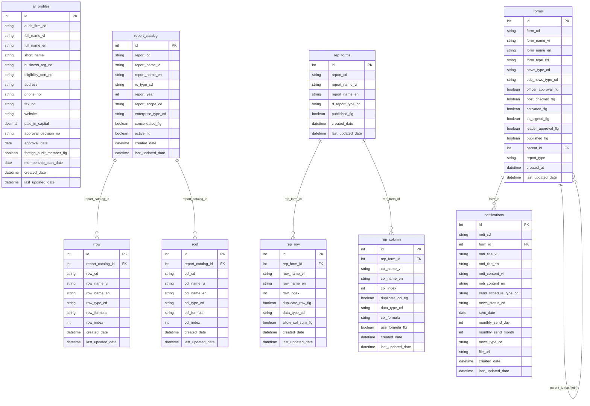
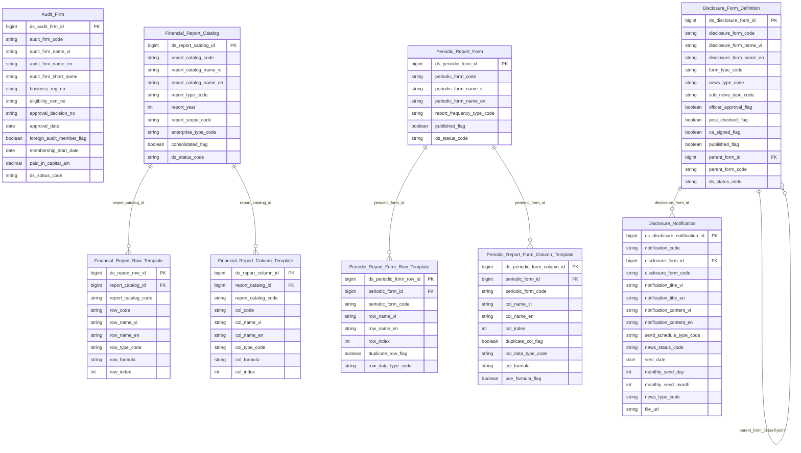

# IDS HLD — Tier 1

**Source system:** IDS (Hệ thống Công bố Thông tin — Information Disclosure System)  
**Mô tả:** Hệ thống quản lý công bố thông tin công ty đại chúng, cổ đông giao dịch, công ty kiểm toán và báo cáo tài chính. Quản lý vòng đời nộp/duyệt hồ sơ và thông báo.  
**Tier 1:** Các entity độc lập — không FK đến bảng nghiệp vụ khác trong scope IDS.

---

## 6a. Bảng tổng quan BCV Concept

| BCV Core Object | BCV Concept | Category | Source Table | Mô tả bảng nguồn | Atomic Entity | table_type | BCV Term |
|---|---|---|---|---|---|---|---|
| Involved Party | [Involved Party] Organization | Involved Party | af_profiles | Thông tin hồ sơ công ty kiểm toán — mã, tên, GPKD, vốn, ngày chấp thuận, thành viên hãng quốc tế | Audit Firm | Fundamental | BCV: Organization — tổ chức pháp nhân có lifecycle. af_profiles lưu thông tin pháp lý gốc của công ty kiểm toán (approval_date, paid_in_capital, foreign_audit_member_flg). Đã có Audit Firm (SCMS.CT_KIEM_TOAN) trong atomic_entities → **bổ sung IDS.af_profiles vào source_table** cùng entity, không tạo mới. Cùng grain (1 công ty kiểm toán), cùng BCV Organization. |
| Condition | [Condition] | Condition | report_catalog | Danh mục báo cáo tài chính — mã báo cáo, loại (i/o), năm, scope hợp nhất/mẹ, loại hình doanh nghiệp | Financial Report Catalog | Fundamental | BCV: Condition — xác định khung khai báo/nghĩa vụ báo cáo. report_catalog có active_flg và lifecycle. Là master entity được FK từ rrow, rcol, data. Grain: 1 biểu mẫu BCTC. |
| Condition | [Condition] | Condition | rrow | Định nghĩa hàng trong biểu mẫu BCTC — mã hàng, tên, công thức, thứ tự | Financial Report Row Template | Fundamental | BCV: Condition — định nghĩa cấu trúc/quy tắc biểu mẫu. FK → report_catalog (Tier 1). Grain: 1 hàng × 1 biểu mẫu. |
| Condition | [Condition] | Condition | rcol | Định nghĩa cột trong biểu mẫu BCTC — mã cột, tên, công thức, thứ tự | Financial Report Column Template | Fundamental | BCV: Condition — định nghĩa cấu trúc cột biểu mẫu. FK → report_catalog (Tier 1). Grain: 1 cột × 1 biểu mẫu. |
| Condition | [Condition] | Condition | rep_forms | Biểu mẫu báo cáo định kỳ (thường niên/quý/tháng) cho công ty đại chúng nộp CBTT | Periodic Report Form | Fundamental | BCV: Condition — xác định nghĩa vụ nộp báo cáo. rep_forms có published_flg, lifecycle. Là master entity FK từ rep_row, rep_column, data_values. Phân biệt với Financial Report Catalog: Financial Report Catalog cho BCTC cấu trúc (rrow/rcol); rep_forms cho biểu mẫu tự do (data_values). |
| Condition | [Condition] | Condition | rep_row | Định nghĩa hàng trong biểu mẫu báo cáo định kỳ | Periodic Report Form Row Template | Fundamental | BCV: Condition — cấu trúc hàng biểu mẫu. FK → rep_forms (Tier 1). Grain: 1 hàng × 1 biểu mẫu. |
| Condition | [Condition] | Condition | rep_column | Định nghĩa cột trong biểu mẫu báo cáo định kỳ | Periodic Report Form Column Template | Fundamental | BCV: Condition — cấu trúc cột biểu mẫu. FK → rep_forms (Tier 1). Grain: 1 cột × 1 biểu mẫu. |
| Communication | [Communication] Notification | Communication | notifications | Instance thông báo CBTT gửi đi — tiêu đề, nội dung, ngày gửi, lịch định kỳ, trạng thái gửi, file đính kèm | Disclosure Notification | Fact Append | BCV: Notification — instance thông báo đã gửi đi. notifications có sent_date, news_status_cd (trạng thái tin), form_id (FK nghiệp vụ). Grain: 1 lần gửi thông báo. **Chốt T1-01:** notifications là instance gửi đi (Fact Append), không phải template. |
| Condition | [Condition] | Condition | forms | Định nghĩa loại hồ sơ/tin CBTT — loại form, quy trình duyệt, nghiệp vụ liên quan, phòng ban kiểm soát | Disclosure Form Definition | Fundamental | BCV: Condition — định nghĩa khung hồ sơ/tin CBTT. forms có activated_flg, published_flg, lifecycle. Là master entity FK từ company_data, fields, form_fields, data_values, notifications. **Chốt T1-02:** forms là config nghiệp vụ có giá trị lưu trữ độc lập (nhiều loại hồ sơ/tin), không phải pure system table. |

---

## 6b. Diagram Source (Mermaid)

---

## 6c. Diagram Atomic (Mermaid)

---

## 6d. Danh mục & Tham chiếu (Reference Data)

| Source Field / Bảng | Mô tả | Scheme Code | source_type | Ghi chú |
|---|---|---|---|---|
| lookup_values (toàn bộ lookup_group) | Tất cả danh mục tra cứu trong IDS | Mỗi lookup_group = 1 scheme (xem chi tiết các Tier) | source_table: lookup_values | |
| categories — industry_cd | Ngành nghề 2 cấp của công ty đại chúng | `IDS_INDUSTRY_CATEGORY` | source_table: categories | Self-referencing (parent_id). Classification Value — chỉ có code + name. |
| countries — country_cd | Danh mục quốc gia | *(shared: Geographic Area COUNTRY)* | source_table: IDS.countries | Map vào shared entity Geographic Area. |
| provinces — province_cd | Danh mục tỉnh/thành phố | *(shared: Geographic Area PROVINCE)* | source_table: IDS.provinces | Map vào shared entity Geographic Area. |
| report_catalog.rc_type_cd | Loại báo cáo (i=input, o=output) | `IDS_REPORT_CATALOG_TYPE` | etl_derived | |
| report_catalog.report_scope_cd | Scope báo cáo (hợp nhất/mẹ) | `IDS_REPORT_SCOPE` | etl_derived | |
| report_catalog.enterprise_type_cd | Loại hình doanh nghiệp (ck/bh/td/dn) | `IDS_ENTERPRISE_TYPE` | etl_derived | Dùng chung nhiều bảng |
| rrow.row_type_cd | Kiểu giá trị hàng (value/formula/description) | `IDS_REPORT_ROW_TYPE` | etl_derived | |
| rep_forms.rf_report_type_cd | Loại báo cáo định kỳ (tháng/quý/năm…) | `IDS_PERIODIC_REPORT_FREQUENCY` | etl_derived | |
| notifications.send_schedule_type_cd | Lịch gửi định kỳ | `IDS_NOTIFICATION_SEND_SCHEDULE` | etl_derived | |
| notifications.news_status_cd | Trạng thái tin thông báo | `IDS_NEWS_STATUS` | etl_derived | |
| notifications.news_type_cd | Loại tin gốc | `IDS_NEWS_TYPE` | etl_derived | Dùng chung với forms.news_type_cd |
| forms.form_type_cd | Loại form (hồ sơ/CBTT) | `IDS_FORM_TYPE` | etl_derived | |
| forms.sub_news_type_cd | Loại tin con | `IDS_SUB_NEWS_TYPE` | etl_derived | |

---

## 6e. Bảng chờ thiết kế

*(Không có)*

---

## 6f. Điểm cần xác nhận

| # | Câu hỏi | Kết quả |
|---|---|---|
| T1-01 | `notifications` là template hay instance gửi đi? | **Instance gửi đi** — Fact Append. Grain: 1 lần gửi thông báo. |
| T1-02 | `forms` có phải pure system config? | **Không** — có giá trị nghiệp vụ (activated_flg, published_flg, FK từ company_data). → Disclosure Form Definition (Fundamental). |
| T1-03 | `report_catalog` vs `rep_forms` — có gộp không? | **Không gộp** — cấu trúc khác nhau, data khác nhau (rrow/rcol/data vs rep_row/rep_column/data_values). |
| T1-04 | `categories` (ngành nghề) có phải Atomic entity? | **Không** — Classification Value (scheme `IDS_INDUSTRY_CATEGORY`). Không có FK inbound từ bảng nghiệp vụ ngoài company_profiles (denormalize thành code trên Public Company). |
| T1-05 | `Audit Firm` (IDS.af_profiles) có tạo entity mới hay gộp? | **Gộp** — bổ sung IDS.af_profiles vào source_table của entity Audit Firm đã approved (SCMS.CT_KIEM_TOAN). Cùng grain, cùng BCV Organization. |
