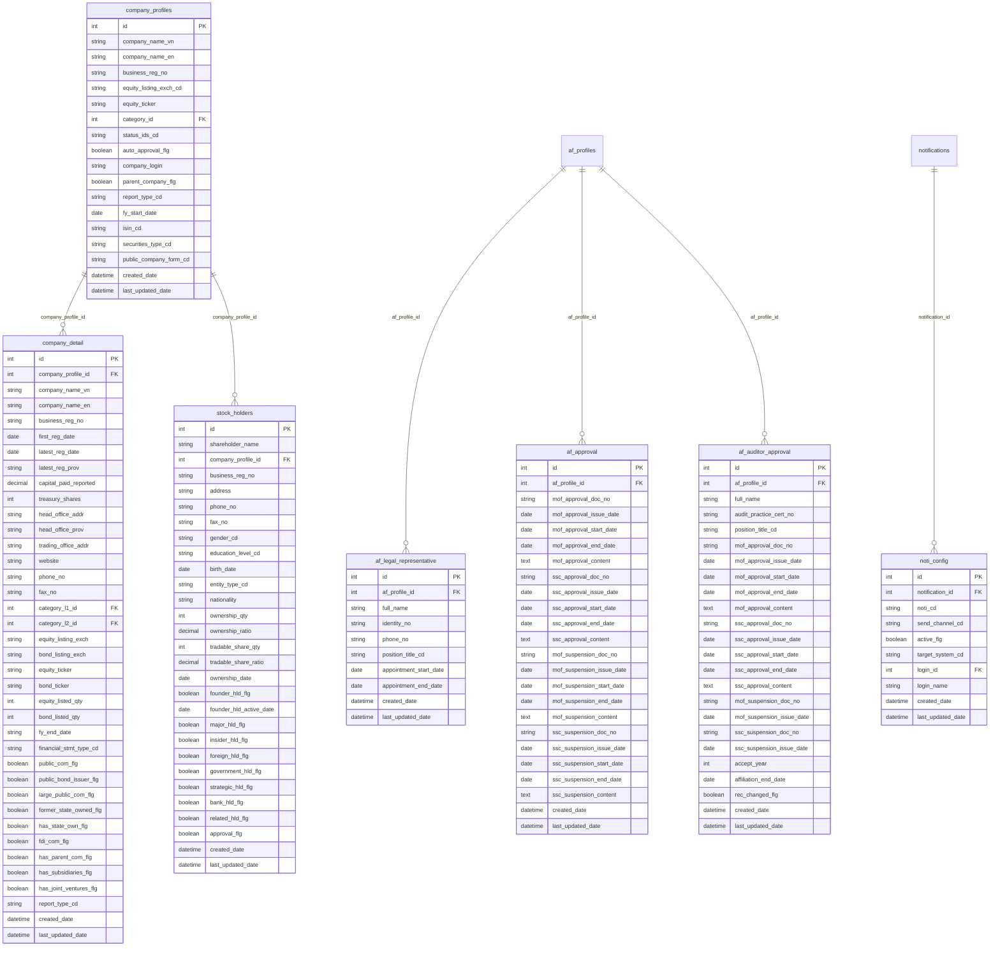
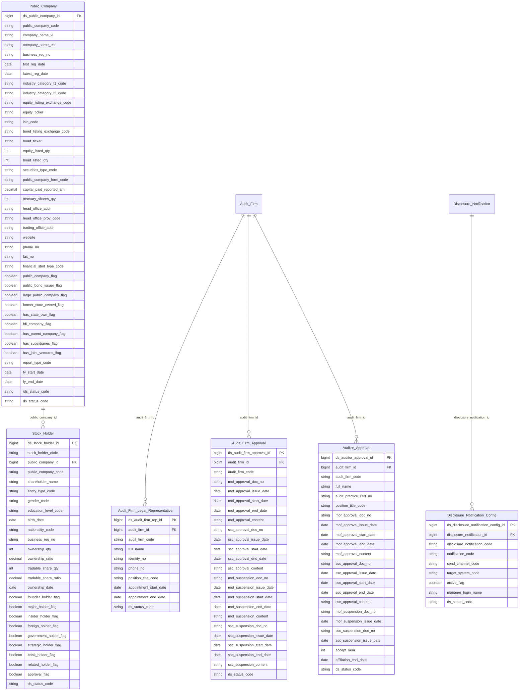

# IDS HLD — Tier 2

**Source system:** IDS (Hệ thống Công bố Thông tin)  
**Tier 2:** Entity có FK đến Tier 1 (Audit Firm, Disclosure Form Definition). Gồm: Public Company (entity trung tâm), Stock Holder (+ shared IP entities), và các entity phụ thuộc Audit Firm.

---

## 6a. Bảng tổng quan BCV Concept

| BCV Core Object | BCV Concept | Category | Source Table | Mô tả bảng nguồn | Atomic Entity | table_type | BCV Term |
|---|---|---|---|---|---|---|---|
| Involved Party | [Involved Party] Organization | Involved Party | company_profiles + company_detail | Công ty đại chúng — thông tin pháp lý cơ bản (company_profiles) và thông tin chi tiết nghiệp vụ (company_detail). Gộp vì 1-1 và cùng grain | Public Company | Fundamental | BCV: Organization — pháp nhân tham gia thị trường chứng khoán với tư cách công ty đại chúng. **Gộp 2 bảng:** company_profiles (trạng thái IDS, ticker) và company_detail (địa chỉ, vốn, cờ trạng thái chi tiết). Quan hệ 1-1 qua company_profile_id. Đã có Public Company (ThanhTra.DM_CONG_TY_DC) → **bổ sung IDS.company_profiles, IDS.company_detail vào source_table**. |
| Involved Party | [Involved Party] Individual | Involved Party | stock_holders | Cổ đông giao dịch — cá nhân hoặc tổ chức nắm giữ cổ phần công ty đại chúng. Grain: 1 cổ đông × 1 công ty (company_profile_id là FK bắt buộc) | Stock Holder | Fundamental | BCV: Individual/Organization — cổ đông có thể là cá nhân hoặc tổ chức (entity_type_cd). Grain: cổ đông × công ty. FK → Public Company. **Chốt T2-02:** Tạo entity mới Stock Holder, không gộp vào shared Involved Party vì grain là cổ đông-per-công ty (company_profile_id bắt buộc). |
| Involved Party | [Involved Party] Postal Address | Involved Party | stock_holders + company_detail | Địa chỉ bưu chính — trích từ stock_holders (cổ đông) và company_detail (trụ sở chính + văn phòng giao dịch công ty đại chúng) | Involved Party Postal Address | Relative | BCV: Postal Address — địa chỉ vật lý của Involved Party. **Shared entity** đã có. Bổ sung IDS.stock_holders và IDS.company_detail vào source_table theo SKILL_LLD. |
| Involved Party | [Involved Party] Electronic Address | Involved Party | stock_holders + company_detail + af_legal_representative | Địa chỉ điện tử — trích từ stock_holders (cổ đông), company_detail (công ty đại chúng), af_legal_representative (người đại diện pháp luật kiểm toán) | Involved Party Electronic Address | Relative | BCV: Electronic Address — liên hệ điện tử của Involved Party. **Shared entity** đã có. Bổ sung IDS.stock_holders, IDS.company_detail, IDS.af_legal_representative vào source_table theo SKILL_LLD. |
| Involved Party | [Involved Party] Alternative Identification | Involved Party | af_legal_representative | Giấy tờ định danh người đại diện pháp luật kiểm toán (identity_no — CMND/hộ chiếu) | Involved Party Alternative Identification | Relative | BCV: Alternative Identification. **Shared entity** đã có. Bổ sung IDS.af_legal_representative vào source_table theo SKILL_LLD (grain = IP, có identity_no). |
| Involved Party | [Involved Party] Involved Party Role | Involved Party | af_legal_representative | Người đại diện pháp luật của công ty kiểm toán — tên, chức vụ, ngày bổ nhiệm/kết thúc | Audit Firm Legal Representative | Fundamental | BCV: Involved Party Role — vai trò người đại diện trong tổ chức. FK → Audit Firm (Tier 1). Grain: 1 người đại diện × 1 công ty kiểm toán × 1 nhiệm kỳ. |
| Documentation | [Documentation] Government Registration Document | Documentation | af_approval | Quyết định chấp thuận/đình chỉ công ty kiểm toán từ BTC và UBCKNN. Lưu số văn bản, ngày, nội dung của cả 2 cơ quan | Audit Firm Approval | Fundamental | BCV: Government Registration Document — văn bản pháp lý nhà nước chấp thuận hoạt động. FK → Audit Firm (Tier 1). Grain: 1 hồ sơ chấp thuận per công ty kiểm toán. **Chốt T2-03:** Gộp BTC + SSC vào cùng 1 entity vì cùng grain. |
| Documentation | [Documentation] Government Registration Document | Documentation | af_auditor_approval | Quyết định chấp thuận/đình chỉ kiểm toán viên từ BTC và UBCKNN. Lưu chứng chỉ hành nghề, năm chấp thuận, ngày kết thúc liên kết với công ty | Auditor Approval | Fundamental | BCV: Government Registration Document — tương tự af_approval nhưng cho cá nhân kiểm toán viên. FK → Audit Firm (Tier 1). Grain: 1 kiểm toán viên × 1 công ty kiểm toán. |
| Condition | [Condition] Criterion | Condition | noti_config | Cấu hình thông báo — kênh gửi (email/sms/push), hệ thống nhận, người quản lý, liên kết với instance thông báo | Disclosure Notification Config | Fundamental | BCV: Condition Criterion — quy tắc/cấu hình kích hoạt thông báo. FK → Disclosure Notification (Tier 1). Grain: 1 cấu hình kênh per thông báo. |

---

## 6b. Diagram Source (Mermaid)

---

## 6c. Diagram Atomic (Mermaid)

---

## 6d. Danh mục & Tham chiếu (Reference Data)

| Source Field / Bảng | Mô tả | Scheme Code | source_type | Ghi chú |
|---|---|---|---|---|
| company_profiles.equity_listing_exch_cd | Sàn niêm yết cổ phiếu (HNX/HOSE/UPCoM) | `IDS_EQUITY_LISTING_EXCH` | etl_derived | |
| company_profiles.status_ids_cd | Trạng thái niêm yết IDS | `IDS_COMPANY_STATUS` | etl_derived | |
| company_profiles.securities_type_cd | Loại chứng khoán phát hành | `IDS_SECURITIES_TYPE` | etl_derived | |
| company_profiles.public_company_form_cd | Hình thức trở thành công ty đại chúng (IPO/trực tiếp) | `IDS_PUBLIC_COMPANY_FORM` | etl_derived | |
| company_detail.financial_stmt_type_cd | Loại BCTC (IFRS/VAS…) | `IDS_FINANCIAL_STMT_TYPE` | etl_derived | |
| company_detail.report_type_cd | Loại báo cáo (bh/td/ck/dn) | `IDS_ENTERPRISE_TYPE` | etl_derived | Dùng chung với report_catalog.enterprise_type_cd |
| stock_holders.entity_type_cd | Loại hình cổ đông (cá nhân/tổ chức) | `IDS_ENTITY_TYPE` | etl_derived | |
| stock_holders.gender_cd | Giới tính | `IDS_GENDER` | etl_derived | |
| stock_holders.education_level_cd | Trình độ học vấn | `IDS_EDUCATION_LEVEL` | etl_derived | |
| af_legal_representative.position_title_cd | Chức vụ người đại diện kiểm toán | `IDS_AF_POSITION_TITLE` | source_table: lookup_values (af_position_title) | |
| af_auditor_approval.position_title_cd | Chức vụ kiểm toán viên | `IDS_AF_POSITION_TITLE` | source_table: lookup_values (af_position_title) | Dùng chung scheme với af_legal_representative |
| noti_config.send_channel_cd | Kênh gửi thông báo (email/sms/push) | `IDS_NOTIFICATION_SEND_CHANNEL` | etl_derived | |
| noti_config.target_system_cd | Hệ thống nhận thông báo | `IDS_NOTIFICATION_TARGET_SYSTEM` | etl_derived | |

---

## 6e. Bảng chờ thiết kế

*(Không có bảng nào trong Tier 2 chưa thiết kế)*

---

## 6f. Điểm cần xác nhận

| # | Câu hỏi | Kết quả |
|---|---|---|
| T2-01 | `company_profiles` và `company_detail` có phải gộp không? | **Gộp** — quan hệ 1-1 qua company_profile_id, cùng grain (1 công ty). Extend source_table của entity Public Company đã có. |
| T2-02 | `stock_holders` có map vào shared Involved Party không? | **Tạo entity mới Stock Holder** — grain là cổ đông × công ty (company_profile_id bắt buộc), không phải IP toàn cục. Tuy nhiên stock_holders.address → Involved Party Postal Address (shared); phone_no/fax_no → Involved Party Electronic Address (shared). |
| T2-03 | `af_approval` — gộp BTC + SSC hay tách entity riêng? | **Gộp** — cùng grain (1 hồ sơ per công ty kiểm toán), cùng nguồn af_approval. Lưu song song thông tin BTC và SSC trong 1 entity. |
| T2-04 | `af_auditor_approval.rec_changed_flg` có lưu trên Atomic không? | **Không** — cờ kỹ thuật ETL. SCD2 Atomic tự track lịch sử. Skip. |
| T2-05 | `af_legal_representative.identity_no` loại giấy tờ gì? | **Pending** — nguồn không phân biệt CMND/CCCD/Hộ chiếu. LLD tạm dùng scheme `IP_ALT_ID_TYPE=NATIONAL_ID` làm default. Cần profile data nguồn hoặc hỏi thêm để xác định. |
| T2-06 | Bổ sung shared entity mapping ngoài HLD Tier 2 ban đầu | **Đồng ý** — theo SKILL_LLD bắt buộc tách mọi trường địa chỉ/liên lạc/giấy tờ khi grain = Involved Party. Bổ sung: `company_detail → IP Postal+Electronic`, `af_legal_representative → IP Electronic+Alt Identification`. |
| T2-07 | Public Company merge company_profiles + company_detail — xử lý trường trùng giá trị 1-1 như thế nào? | **Map từ company_profiles làm primary**. Các cột company_detail trùng nội dung (company_name_vn/en, business_reg_no, equity_ticker, report_type_cd, audit fields) document trong pending_design.csv với reason "Đã capture qua company_profiles (1-1)". |
