# IDS HLD — Tier 3

**Source system:** IDS (Hệ thống Công bố Thông tin)  
**Tier 3:** Entity có FK đến Tier 2 (Public Company, Stock Holder, Audit Firm Approval, Auditor Approval). Gồm các entity phụ thuộc công ty đại chúng, cổ đông, và công ty kiểm toán.

---

## 6a. Bảng tổng quan BCV Concept

| BCV Core Object | BCV Concept | Category | Source Table | Mô tả bảng nguồn | Atomic Entity | table_type | BCV Term |
|---|---|---|---|---|---|---|---|
| Involved Party | [Involved Party] Individual | Involved Party | legal_representative | Người đại diện pháp luật và người CBTT của công ty đại chúng — tên, chức vụ, CMND, ngày bổ nhiệm, vai trò (0=đại diện pháp luật, 1=người CBTT) | Public Company Legal Representative | Fundamental | BCV: Individual — cá nhân đảm nhận vai trò pháp lý trong tổ chức. FK → Public Company (Tier 2). Grain: 1 người × 1 vai trò × 1 nhiệm kỳ. representative_role phân biệt 2 loại vai trò trong cùng entity (gộp hợp lý vì cùng cấu trúc). |
| Involved Party | [Involved Party] Involved Party Relationship | Involved Party | company_relationship | Công ty mẹ/con/liên kết của công ty đại chúng — tên, MST, vốn, tỷ lệ sở hữu, thời hạn hiệu lực | Public Company Related Entity | Fundamental | BCV: Involved Party Relationship — quan hệ pháp lý giữa 2 pháp nhân. FK → Public Company (Tier 2). Grain: 1 quan hệ × 1 công ty liên quan. relationship_type_cd (mẹ/con/liên doanh) phân biệt. |
| Arrangement | [Arrangement] | Arrangement | state_capital | Thông tin sở hữu nhà nước trong công ty đại chúng — tên đại diện, số cổ phiếu, tỷ lệ sở hữu | Public Company State Capital | Fundamental | BCV: Arrangement — cấu trúc sở hữu đặc biệt (state capital). FK → Public Company (Tier 2). Grain: 1 bản ghi sở hữu nhà nước per công ty. |
| Condition | [Condition] Criterion | Condition | foreign_owner_limit | Giới hạn tỷ lệ sở hữu nước ngoài của công ty đại chúng — max_owner_rate, from_date, to_date | Public Company Foreign Ownership Limit | Fundamental | BCV: Condition Criterion — quy tắc/ràng buộc áp dụng cho công ty. FK → Public Company (Tier 2). Grain: 1 quy định sở hữu × 1 khoảng thời gian. |
| Involved Party | [Involved Party] Alternative Identification | Involved Party | identity | Giấy tờ tùy thân của cổ đông — loại giấy tờ, số, ngày cấp, nơi cấp. FK → stock_holders | Involved Party Alternative Identification | Fundamental | BCV: Alternative Identification — giấy tờ xác thực nhân thân. **Shared entity** đã có. IDS.identity bổ sung nguồn vào source_table của entity Involved Party Alternative Identification đã approved. Grain: 1 loại giấy tờ × 1 Involved Party. **Chốt T3-01:** Map vào shared entity (user xác nhận). |
| Arrangement | [Arrangement] Securities Account | Arrangement | account_numbers | Tài khoản giao dịch chứng khoán của cổ đông tại CTCK — số tài khoản, mã CTCK, ngày mở, trạng thái | Stock Holder Trading Account | Fundamental | BCV: Securities Account — tài khoản giao dịch. FK → Stock Holder (Tier 2). Grain: 1 tài khoản per cổ đông × CTCK. |
| Involved Party | [Involved Party] Involved Party Relationship | Involved Party | holder_relationship | Quan hệ giữa các cổ đông giao dịch — loại quan hệ, thời hạn, trạng thái | Stock Holder Relationship | Fundamental | BCV: Involved Party Relationship — quan hệ giữa 2 Involved Party. FK → Stock Holder × 2 (stock_holder_id + related_holder_id). Grain: 1 quan hệ × khoảng thời gian. |
| Condition | [Condition] | Condition | stock_controls | Hạn chế chuyển nhượng cổ phiếu của cổ đông — số lượng bị hạn chế, thời gian áp dụng, loại hạn chế | Stock Control | Fundamental | BCV: Condition — ràng buộc/hạn chế áp dụng lên tài sản chứng khoán. FK → Stock Holder (Tier 2). Grain: 1 lần hạn chế × 1 cổ đông. |
| Business Activity | [Business Activity] Conduct Violation | Business Activity | af_warning | Nhắc nhở từ BTC hoặc UBCKNN đến công ty kiểm toán hoặc kiểm toán viên — số văn bản, ngày, nội dung, thời hạn | Audit Firm Warning | Fact Append | BCV: Conduct Violation — hành động nhắc nhở/cảnh báo vi phạm. FK nullable → Audit Firm Approval (Tier 2) hoặc Auditor Approval (Tier 2) theo đối tượng. Grain: 1 lần nhắc nhở. |
| Business Activity | [Business Activity] Conduct Violation | Business Activity | af_sanctions | Xử phạt hành chính đối với công ty kiểm toán hoặc kiểm toán viên — quyết định xử phạt, nội dung, file đính kèm | Audit Firm Sanction | Fact Append | BCV: Conduct Violation — quyết định xử phạt hành chính. FK nullable → Audit Firm Approval (Tier 2) hoặc Auditor Approval (Tier 2). Grain: 1 quyết định xử phạt. |

---

## Bảng bị loại khỏi scope Atomic

| Source Table | Lý do |
|---|---|
| company_data | Bảng trung gian (intermediate linking table) — lưu forms thuộc company_profiles. Không có business lifecycle độc lập. Drop. |
| noti_config_apply | Junction giữa noti_config và company_profiles — pure linking table không có business attribute. Drop. |

---

## 6b. Diagram Source (Mermaid)

```mermaid
erDiagram
    legal_representative {
        int id PK
        int company_profile_id FK
        string name
        string position_title
        date appointment_date
        string phone_no
        string email
        string identity_no
        date issue_date
        string issue_place
        int representative_role
        datetime created_date
        datetime last_updated_date
    }

    company_relationship {
        int id PK
        int company_profile_id FK
        string relationship_type_cd
        string full_name_vi
        string full_name_en
        string business_reg_no
        decimal paid_in_capital
        int owned_share_qty
        decimal ownership_ratio
        date effective_from_date
        date effective_to_date
        datetime created_date
        datetime last_updated_date
    }

    state_capital {
        int id PK
        int company_profile_id FK
        string state_rep_name_vi
        string state_rep_name_en
        int owned_share_qty
        decimal ownership_ratio
        datetime created_date
        datetime last_updated_date
    }

    foreign_owner_limit {
        int id PK
        int company_profile_id FK
        decimal max_owner_rate
        date from_date
        date to_date
        datetime created_date
        datetime last_updated_date
    }

    identity {
        int id PK
        int stock_holder_id FK
        string identity_type_cd
        string identity_no
        date identity_issued_date
        string identity_issued_place
        boolean primary_flg
        datetime created_date
        datetime last_updated_date
    }

    account_numbers {
        int id PK
        int stock_holder_id FK
        string trading_account_no
        string sec_company_cd
        date account_open_date
        boolean active_flg
        boolean primary_account_flg
        datetime created_date
        datetime last_updated_date
    }

    holder_relationship {
        int id PK
        int stock_holder_id FK
        int related_holder_id FK
        string relationship_type_cd
        date effective_date
        date end_date
        boolean active_flg
        datetime created_date
        datetime last_updated_date
    }

    stock_controls {
        int id PK
        int stock_holder_id FK
        int restricted_share_qty
        date restriction_start_date
        date restriction_end_date
        string restriction_type_cd
        datetime created_date
        datetime last_updated_date
    }

    af_warning {
        int id PK
        int af_approval_id FK
        int af_auditor_approval_id FK
        string warning_target_type_cd
        string warning_source_type_cd
        string warning_doc_no
        date warning_issue_date
        date warning_start_date
        date warning_end_date
        text warning_content
        datetime created_date
        datetime last_updated_date
    }

    af_sanctions {
        int id PK
        int af_approval_id FK
        int af_auditor_approval_id FK
        string sanction_target_type_cd
        string sanction_authority_cd
        string decision_no
        date decision_date
        text sanction_content
        string attachment_file_url
        datetime created_date
        datetime last_updated_date
    }

    company_profiles ||--o{ legal_representative : "company_profile_id"
    company_profiles ||--o{ company_relationship : "company_profile_id"
    company_profiles ||--o{ state_capital : "company_profile_id"
    company_profiles ||--o{ foreign_owner_limit : "company_profile_id"
    stock_holders ||--o{ identity : "stock_holder_id"
    stock_holders ||--o{ account_numbers : "stock_holder_id"
    stock_holders ||--o{ holder_relationship : "stock_holder_id"
    stock_holders ||--o{ stock_controls : "stock_holder_id"
    af_approval ||--o{ af_warning : "af_approval_id"
    af_auditor_approval ||--o{ af_warning : "af_auditor_approval_id"
    af_approval ||--o{ af_sanctions : "af_approval_id"
    af_auditor_approval ||--o{ af_sanctions : "af_auditor_approval_id"
```

---

## 6c. Diagram Atomic (Mermaid)

```mermaid
erDiagram
    Public_Company_Legal_Representative {
        bigint ds_public_company_rep_id PK
        bigint public_company_id FK
        string public_company_code
        string full_name
        string position_title
        date appointment_date
        string identity_no
        string phone_no
        string email
        string representative_role_code
        string ds_status_code
    }

    Public_Company_Related_Entity {
        bigint ds_public_company_relation_id PK
        bigint public_company_id FK
        string public_company_code
        string relationship_type_code
        string related_entity_name_vi
        string related_entity_name_en
        string related_entity_business_reg_no
        decimal paid_in_capital_am
        int owned_share_qty
        decimal ownership_ratio
        date effective_from_date
        date effective_to_date
        string ds_status_code
    }

    Public_Company_State_Capital {
        bigint ds_state_capital_id PK
        bigint public_company_id FK
        string public_company_code
        string state_rep_name_vi
        string state_rep_name_en
        int owned_share_qty
        decimal ownership_ratio
        string ds_status_code
    }

    Public_Company_Foreign_Ownership_Limit {
        bigint ds_foreign_owner_limit_id PK
        bigint public_company_id FK
        string public_company_code
        decimal max_owner_rate
        date from_date
        date to_date
        string ds_status_code
    }

    Stock_Holder_Trading_Account {
        bigint ds_trading_account_id PK
        bigint stock_holder_id FK
        string stock_holder_code
        string trading_account_no
        string sec_company_code
        date account_open_date
        boolean active_flag
        boolean primary_account_flag
        string ds_status_code
    }

    Stock_Holder_Relationship {
        bigint ds_holder_relationship_id PK
        bigint stock_holder_id FK
        string stock_holder_code
        bigint related_holder_id FK
        string related_holder_code
        string relationship_type_code
        date effective_date
        date end_date
        string ds_status_code
    }

    Stock_Control {
        bigint ds_stock_control_id PK
        bigint stock_holder_id FK
        string stock_holder_code
        int restricted_share_qty
        date restriction_start_date
        date restriction_end_date
        string restriction_type_code
        string ds_status_code
    }

    Audit_Firm_Warning {
        bigint ds_audit_firm_warning_id PK
        bigint audit_firm_approval_id FK
        string audit_firm_approval_code
        bigint auditor_approval_id FK
        string auditor_approval_code
        string warning_target_type_code
        string warning_source_type_code
        string warning_doc_no
        date warning_issue_date
        date warning_start_date
        date warning_end_date
        string warning_content
    }

    Audit_Firm_Sanction {
        bigint ds_audit_firm_sanction_id PK
        bigint audit_firm_approval_id FK
        string audit_firm_approval_code
        bigint auditor_approval_id FK
        string auditor_approval_code
        string sanction_target_type_code
        string sanction_authority_code
        string decision_no
        date decision_date
        string sanction_content
        string attachment_file_url
    }

    Public_Company ||--o{ Public_Company_Legal_Representative : "public_company_id"
    Public_Company ||--o{ Public_Company_Related_Entity : "public_company_id"
    Public_Company ||--o{ Public_Company_State_Capital : "public_company_id"
    Public_Company ||--o{ Public_Company_Foreign_Ownership_Limit : "public_company_id"
    Stock_Holder ||--o{ Stock_Holder_Trading_Account : "stock_holder_id"
    Stock_Holder ||--o{ Stock_Holder_Relationship : "stock_holder_id"
    Stock_Holder ||--o{ Stock_Control : "stock_holder_id"
    Audit_Firm_Approval ||--o{ Audit_Firm_Warning : "audit_firm_approval_id"
    Auditor_Approval ||--o{ Audit_Firm_Warning : "auditor_approval_id"
    Audit_Firm_Approval ||--o{ Audit_Firm_Sanction : "audit_firm_approval_id"
    Auditor_Approval ||--o{ Audit_Firm_Sanction : "auditor_approval_id"
```

*(Lưu ý: identity → shared Involved Party Alternative Identification, không hiển thị trong diagram riêng của Tier 3)*

---

## 6d. Danh mục & Tham chiếu (Reference Data)

| Source Field / Bảng | Mô tả | Scheme Code | source_type | Ghi chú |
|---|---|---|---|---|
| legal_representative.representative_role | Vai trò (0=đại diện pháp luật, 1=người CBTT) | `IDS_REPRESENTATIVE_ROLE` | etl_derived | |
| company_relationship.relationship_type_cd | Loại quan hệ công ty (mẹ/con/liên doanh) | `IDS_COMPANY_RELATIONSHIP_TYPE` | source_table: lookup_values (company_relationship_type) | |
| identity.identity_type_cd | Loại giấy tờ (CMND/CCCD/Hộ chiếu/ĐKDN) | `IDS_IDENTITY_TYPE` | source_table: lookup_values (identity_type) | |
| stock_controls.restriction_type_cd | Loại hạn chế chuyển nhượng | `IDS_STOCK_RESTRICTION_TYPE` | source_table: lookup_values (restriction_type) | |
| holder_relationship.relationship_type_cd | Loại quan hệ cổ đông | `IDS_HOLDER_RELATIONSHIP_TYPE` | source_table: lookup_values (relationship_type) | |
| af_warning.warning_target_type_cd | Đối tượng nhắc nhở (công ty KT / KTV) | `IDS_WARNING_TARGET_TYPE` | source_table: lookup_values (warning_target_type) | |
| af_warning.warning_source_type_cd | Cơ quan nhắc nhở (BTC / UBCK) | `IDS_WARNING_SOURCE_TYPE` | source_table: lookup_values (warning_source_type) | |
| af_sanctions.sanction_target_type_cd | Đối tượng xử phạt | `IDS_SANCTION_TARGET_TYPE` | source_table: lookup_values (sanction_target_type) | |
| af_sanctions.sanction_authority_cd | Cơ quan xử phạt (BTC / UBCK) | `IDS_SANCTION_AUTHORITY` | source_table: lookup_values (sanction_authority) | |

---

## 6e. Bảng chờ thiết kế

*(Không có)*

---

## 6f. Điểm cần xác nhận

| # | Câu hỏi | Kết quả |
|---|---|---|
| T3-01 | `identity` có map vào shared Involved Party Alternative Identification không? | **Có** — user xác nhận. IDS.identity → extend source_table của shared entity Involved Party Alternative Identification. Không tạo entity riêng. |
| T3-02 | `company_data` — bảng trung gian có đưa lên Atomic không? | **Không** — user xác nhận bảng trung gian, drop khỏi scope. Cascade: report_approval, report_extensions, data, data_values cũng drop. |
| T3-03 | `af_warning` / `af_sanctions` — FK nullable vào af_approval hoặc af_auditor_approval? | **Cặp FK nullable** — audit_firm_approval_id (nullable khi đối tượng là KTV) và auditor_approval_id (nullable khi đối tượng là công ty KT). warning_target_type_code phân biệt. |
