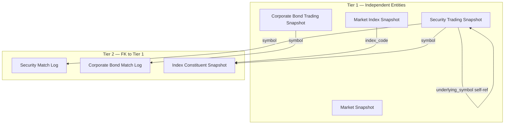
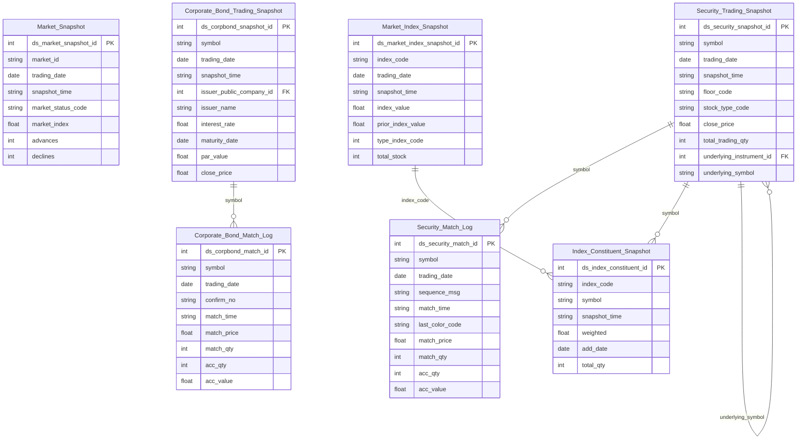

# MDDS HLD — Overview

**Source system:** MDDS (Market Data Distribution System — hệ thống phân phối dữ liệu thị trường chứng khoán real-time)
**Mô tả:** MDDS là hệ thống nhận và phân phối dữ liệu thị trường chứng khoán real-time từ các sàn HOSE, HNX, UPCOM, và thị trường trái phiếu doanh nghiệp HNX. Dữ liệu gồm snapshot trạng thái thị trường/chỉ số/bảng giá và tick-by-tick match log, phát sinh liên tục trong ngày giao dịch theo broadcast từ sàn.

---

## Tổng quan Atomic Entities

| Tier | Atomic Entity | BCV Core Object | BCV Concept | table_type | Source Table(s) | Ghi chú |
|---|---|---|---|---|---|---|
| T1 | Market Snapshot | Group | `[Group] Share Index` | Fact Snapshot | MDDS.MarketInfor | Snapshot tổng hợp toàn sàn (grain: sàn × thời điểm) |
| T1 | Market Index Snapshot | Group | `[Group] Share Index` | Fact Snapshot | MDDS.IDXInfor | Snapshot chỉ số (grain: mã chỉ số × thời điểm) |
| T1 | Security Trading Snapshot | Product | `[Product] Financial Market Instrument` | Fact Snapshot | MDDS.StockInfor | Snapshot bảng giá đa loại instrument (grain: symbol × thời điểm) |
| T1 | Corporate Bond Trading Snapshot | Product | `[Product] Debt Instrument` | Fact Snapshot | MDDS.CorpBondInfor | Snapshot bảng giá TPDN (grain: symbol × thời điểm) |
| T2 | Security Match Log | Transaction | `[Transaction] Sell Transaction` | Fact Append | MDDS.TransLog | Tick-by-tick match log cổ phiếu (grain: symbol × ngày × sequenceMsg) |
| T2 | Corporate Bond Match Log | Transaction | `[Transaction] Sell Transaction` | Fact Append | MDDS.CorpBondMatch | Tick-by-tick match log TPDN (grain: symbol × ngày × ConfirmNo) |
| T2 | Index Constituent Snapshot | Group | `[Group] Share Index` | Fact Snapshot | MDDS.CSIDXInfor | Thành phần rổ chỉ số có attribute (Weighted, AddDate) — grain: (IndexCode × Symbol × ngày) |

**Tổng: 7 Atomic entities** (4 Tier 1, 3 Tier 2)

---

## Diagram Phân tầng Dependencies (Mermaid)

---

## Quyết định thiết kế chính

| # | Quyết định | Lý do |
|---|---|---|
| D-01 | Tách CorpBondInfor thành entity riêng (Corporate Bond Trading Snapshot) thay vì gộp với StockInfor | Schema khác biệt đáng kể: CorpBondInfor có BOND_PERIOD, INTEREST_RATE, coupon fields, PT_* Outright order book. Cơ chế giao dịch chủ yếu thỏa thuận Outright, không phải lệnh khớp thông thường. |
| D-02 | CSIDXInfor là entity độc lập (Index Constituent Snapshot) thay vì denormalize | Có attribute nghiệp vụ riêng: Weighted (tỷ trọng) và AddDate (ngày vào rổ) — không phải pure junction (2 FK không có attribute). |
| D-03 | MarketInfor và IDXInfor là 2 entity riêng biệt dù cùng BCV Term `[Group] Share Index` | Grain khác nhau: MarketInfor theo sàn (tổng hợp), IDXInfor theo mã chỉ số (chi tiết từng chỉ số). Cấu trúc trường khác nhau — IDXInfor có OHLC, TypeIndex, TotalStock. |
| D-04 | Tất cả entity MDDS đều là Snapshot hoặc Fact Append — không có Fundamental/Relative | MDDS là hệ thống market data real-time. Dữ liệu không có lifecycle LIVE/UNAUTH như T24. Không có entity master data — chỉ có snapshot và event log. |
| D-05 | StockInfor.underlyingSymbol → self-reference lưu dạng code (denormalized), không tạo FK surrogate | Snapshot entity không có surrogate ổn định qua thời gian (grain theo timestamp). Self-join sẽ không ổn định cho Snapshot. |

---

## 7a. Bảng tổng quan Atomic entities

| Tier | BCV Core Object | BCV Concept | Category | Source Table | Mô tả bảng nguồn | Atomic Entity | BCV Term |
|---|---|---|---|---|---|---|---|
| T1 | Group | `[Group] Share Index` | Group | MDDS.MarketInfor | Snapshot trạng thái tổng hợp toàn sàn hoặc chỉ số tổng hợp (HOSE/HNX/UPCOM) tại mỗi thời điểm: điểm chỉ số, tổng KL/GT, số mã tăng/giảm/trần/sàn, trạng thái phiên | Market Snapshot | Share Index (id=10128) — "management group that is used to group shares"; grain theo sàn (marketId), không phải theo mã chỉ số riêng lẻ; phù hợp hơn Consumer Price Index (không đúng domain). |
| T1 | Group | `[Group] Share Index` | Group | MDDS.IDXInfor | Snapshot thông tin đầy đủ của một chỉ số (VN30, VNINDEX...) tại thời điểm phát sinh: giá trị chỉ số, OHLC, thống kê mã trong rổ | Market Index Snapshot | Share Index (id=10128) — chỉ số chứng khoán = nhóm cổ phiếu tạo thành rổ; grain theo IndexCode. |
| T1 | Product | `[Product] Financial Market Instrument` | Product | MDDS.StockInfor | Snapshot trạng thái giao dịch của một mã chứng khoán (cổ phiếu, CCQ, chứng quyền, phái sinh) tại thời điểm có thay đổi lệnh/khớp lệnh: giá, sổ lệnh 3 bước, tổng tích lũy, NĐTNN, đặc thù derivative/warrant | Security Trading Snapshot | Financial Market Instrument (id=12059) — "any financial instrument... includes stocks, bonds..." — bao quát đúng: StockInfor chứa đa loại instrument (equity, CCQ, derivative, warrant); không dùng Equity Instrument (quá hẹp). |
| T1 | Product | `[Product] Debt Instrument` | Product | MDDS.CorpBondInfor | Snapshot trạng thái giao dịch trái phiếu doanh nghiệp HNX: giá, order book thỏa thuận Outright (PT_*), đặc thù bond (kỳ hạn, lãi suất, mệnh giá, ngày phát hành/đáo hạn) | Corporate Bond Trading Snapshot | Debt Instrument (id=12299) — sub-type của Financial Market Instrument; đặc thù repayment principal at maturity — đúng với TPDN có kỳ hạn và coupon. FloorCode=06, StockType=12 cố định. |
| T2 | Transaction | `[Transaction] Sell Transaction` | Transaction | MDDS.TransLog | Log tick-by-tick từng lần khớp lệnh của một mã chứng khoán: giá khớp, KL khớp, chiều chủ động, tích lũy KL/GT, tổng mua/bán chủ động | Security Match Log | Sell Transaction (id=13149) — Financial Market Transaction; TransLog ghi cả buy/sell/ATO/ATC → dùng concept bao quát Financial Market Transaction; entity đặt tên Security Match Log phản ánh domain. |
| T2 | Transaction | `[Transaction] Sell Transaction` | Transaction | MDDS.CorpBondMatch | Log tick-by-tick từng lần khớp lệnh trái phiếu doanh nghiệp: giá khớp, KL khớp, chiều chủ động, tích lũy. Dùng ConfirmNoCorpBond làm số thứ tự | Corporate Bond Match Log | Sell Transaction (id=13149) — cùng concept Financial Market Transaction với TransLog; tách entity riêng vì FK đến CorpBondInfor (Debt Instrument), không phải StockInfor. |
| T2 | Group | `[Group] Share Index` | Group | MDDS.CSIDXInfor | Thành phần (constituent) của từng chỉ số thị trường: mã chứng khoán thuộc rổ nào, tỷ trọng (Weighted), ngày vào rổ (AddDate), tổng KL khớp trong ngày | Index Constituent Snapshot | Share Index (id=10128) — mô tả quan hệ thành phần của Share Index; junction có attribute nghiệp vụ (Weighted, AddDate) → entity độc lập, không denormalize. |

## 7b. Diagram Atomic tổng (Mermaid)

> Kiểu `timestamp`/`bigint`/`decimal` không được Mermaid erDiagram hỗ trợ — dùng `string`/`int`/`float` trong diagram. Kiểu dữ liệu thực tế ghi nhận tại LLD.

## 7c. Bảng Classification Value

| Source Table | Mô tả | BCV Term | Xử lý Atomic |
|---|---|---|---|
| MDDS.MarketInfor (marketId) | ID/mã sàn giao dịch và chỉ số tổng hợp | — | Classification Value scheme `MDDS_MARKET_ID` |
| MDDS.MarketInfor (marketStatus) | Trạng thái phiên giao dịch tổng hợp: ATO, Continuous, ATC, Closed | — | Classification Value scheme `MDDS_MARKET_STATUS` |
| MDDS.IDXInfor (TypeIndex) | Loại chỉ số: 0=Toàn thị trường, 1=Bảng giao dịch, 2=Phức hợp, 3=Ngành, 4=Top ranking | — | Classification Value scheme `MDDS_INDEX_TYPE` |
| MDDS.StockInfor (FloorCode) | Mã sàn giao dịch: 02=HNX, 04=UPCOM, 10=HOSE, 03=FDS, 06=Corp Bond | — | Classification Value scheme `MDDS_FLOOR_CODE` |
| MDDS.StockInfor (StockType) | Loại chứng khoán — phân loại theo sàn (HNX: BO/ST/MF/FU/OP/EF; HOSE: B/S/U/E/D/W) | — | Classification Value scheme `MDDS_STOCK_TYPE` — cần parse kết hợp FloorCode |
| MDDS.StockInfor (tradingSessionID) | Mã phiên giao dịch (ATO, Continuous, ATC...) | — | Classification Value scheme `MDDS_TRADING_SESSION` |
| MDDS.StockInfor (CoveredWarrantType) | Loại chứng quyền — chỉ áp dụng StockType=W | — | Classification Value scheme `MDDS_COVERED_WARRANT_TYPE` |
| MDDS.TransLog (lastColor) | Chiều giao dịch chủ động: B, S, O, C | — | Classification Value scheme `MDDS_MATCH_DIRECTION` |
| MDDS.CorpBondInfor (PERIOD_UNIT) | Đơn vị kỳ hạn: 1=Ngày, 2=Tuần, 3=Tháng, 4=Năm | — | Classification Value scheme `MDDS_PERIOD_UNIT` |
| MDDS.CorpBondInfor (INTEREST_TYPE) | Loại hình lãi suất: 1=Coupon, 2=Zero Coupon | — | Classification Value scheme `MDDS_BOND_INTEREST_TYPE` |
| MDDS.CorpBondInfor (INTERESTRATE_TYPE) | Loại lãi suất: 1=Cố định, 2=Thả nổi | — | Classification Value scheme `MDDS_INTEREST_RATE_TYPE` |
| MDDS.CorpBondInfor (INTEREST_COUPON_TYPE) | Kiểu coupon: 1=Standard, 2=Long Coupon, 3=Short Coupon, 4=Khác | — | Classification Value scheme `MDDS_COUPON_TYPE` |
| MDDS.CorpBondInfor (INTEREST_PAYMENT_TYPE) | Phương thức trả lãi: 1=Định kỳ cuối kỳ, 2=Định kỳ đầu kỳ | — | Classification Value scheme `MDDS_INTEREST_PAYMENT_TYPE` |
| MDDS.CorpBondInfor (securityTradingStatus) | Trạng thái trái phiếu: 0=Bình thường, 1=Tạm ngừng nghỉ lễ, 2=Ngừng GD, 10=Tạm ngừng GD, 11=Hạn chế GD, 25=GD đặc biệt | — | Classification Value scheme `MDDS_SECURITY_TRADING_STATUS` |
| MDDS.CorpBondInfor (tradSesStatus) | Trạng thái phiên TPDN: 1=Đang nhận lệnh, 2=Tạm dừng, 13=Kết thúc nhận lệnh, 90=Chờ nhận lệnh, 97=Đóng cửa | — | Classification Value scheme `MDDS_TRAD_SES_STATUS` |

## 7d. Junction Tables

*(Không có pure junction table trong MDDS — CSIDXInfor có attribute nghiệp vụ riêng (Weighted, AddDate) → đã thiết kế thành entity Index Constituent Snapshot)*

## 7e. Điểm cần xác nhận

| # | Tier | Câu hỏi | Ảnh hưởng |
|---|---|---|---|
| 1 | T1 | **[Đóng]** StockInfor.underlyingSymbol → self-reference: thêm cặp `underlying_instrument_id` (FK surrogate, dùng join) + `underlying_symbol` (code, denormalized). Áp dụng quy tắc Id + Code. | Đã cập nhật diagram Tier 1 và Overview. Xử lý join logic tại LLD. |
| 2 | T1 | **[Đóng]** StockInfor.Status pipe-separated: parse thành cột riêng lẻ theo FloorCode tại Atomic. | HNX/UPCOM: listing_status_code, adjust_qty_flag, reference_status_code, adjust_rate_flag, dividend_rate_flag. HOSE: delist_flag, suspension_flag, halt_resume_flag, split_flag, benefit_flag, meeting_flag, notice_flag, odd_lot_halt_flag. Cột null khi không áp dụng. |
| 3 | T1 | **[Đóng]** CorpBondInfor.IssuerName là mã tổ chức phát hành → map đến `Public Company` (IDS). Thêm cặp `issuer_public_company_id` (FK) + `issuer_name` (denormalized). | Join key cần xác nhận tại LLD (IssuerName vs mã IDS). |
| 4 | T2 | **[Đóng]** CSIDXInfor.TradingDate format HHmmss là timestamp (ngày + giờ) → BK của Index Constituent Snapshot = (index_code, symbol, snapshot_time). | Đã cập nhật diagram Tier 2 và Overview. |
| 5 | T2 | Security_Match_Log BK: (symbol, trading_date, sequence_msg) — sequenceMsg reset mỗi ngày, đủ unique không? | Cần xác nhận với team ETL: sequenceMsg unique trong phạm vi (symbol, trading_date) hay chỉ trong trading_date? |
| 6 | T2 | Index_Constituent_Snapshot: có nên tách Constituent Master (AddDate, Weighted) vs Daily Stats (TotalQtty)? | Giữ 1 entity Snapshot daily — đơn giản hơn. Tách chỉ khi có yêu cầu SCD tracking. |
| 7 | T2 | TransLog.lastColor semantics: B=Mua chủ động trong MDDS là chiều đối ứng (ngược thông thường). | Giữ nguyên giá trị nguồn, document semantics rõ ràng trong description cột tại LLD. |

## 7f. Bảng ngoài scope

| Nhóm | Source Table | Mô tả bảng nguồn | Lý do ngoài scope |
|---|---|---|---|

<!--
GRAIN: 1 dòng = 1 bảng nguồn. KHÔNG gộp `table1, table2`.
GROUP: dùng từ danh sách chuẩn (xem reference/group_classification.md).
-->
