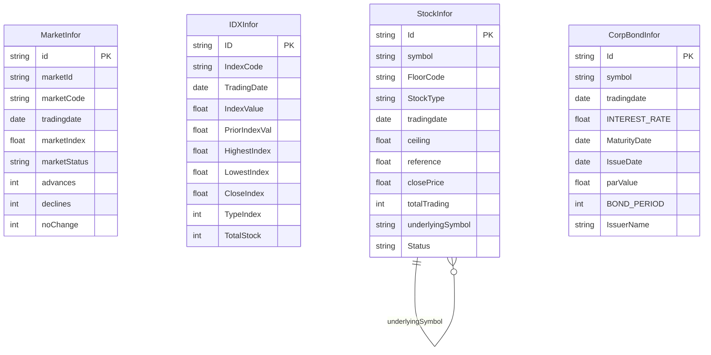
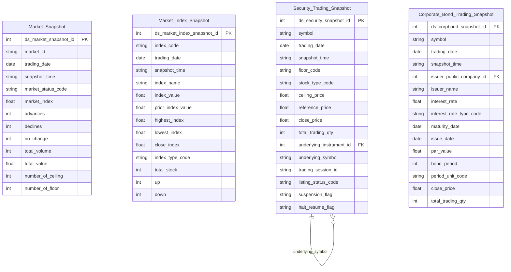

# MDDS HLD — Tier 1

**Source system:** MDDS (Market Data Distribution System — hệ thống phân phối dữ liệu thị trường chứng khoán real-time)
**Tier 1:** Các entity độc lập không FK đến bảng nghiệp vụ khác trong MDDS. Gồm snapshot trạng thái thị trường, chỉ số, và bảng giá chứng khoán theo từng loại thị trường.

---

## 6a. Bảng tổng quan BCV Concept

| BCV Core Object | BCV Concept | Category | Source Table | Mô tả bảng nguồn | Atomic Entity | table_type | BCV Term |
|---|---|---|---|---|---|---|---|
| Group | `[Group] Share Index` | Group | MarketInfor | Snapshot trạng thái tổng hợp toàn sàn (HOSE/HNX/UPCOM) hoặc chỉ số tổng hợp tại mỗi thời điểm phát sinh: điểm chỉ số, tổng KL/GT, số mã tăng/giảm/trần/sàn, trạng thái phiên | Market Snapshot | Fact Snapshot | **(1)** Term candidate: `Share Index` (id=10128) — "management group that is used to group shares" — mô tả nhóm cổ phiếu tạo thành chỉ số sàn. `Consumer Price Index` (id=10241) không phù hợp domain. **(2)** Cấu trúc trường: MarketInfor chứa marketIndex, totalVolume, advances/declines/noChange, numberOfCe/Fl, PT_TOTAL_* — đây là **snapshot tổng hợp trạng thái toàn sàn giao dịch** tại một thời điểm, grain theo sàn (marketId/FloorCode). Không phải instrument cụ thể, không phải chỉ số riêng lẻ. **(3)** Chọn `[Group] Share Index` — gần nhất về mặt BCV: MarketInfor đại diện cho "nhóm" (sàn) tổng hợp trạng thái các chứng khoán. Grain là sàn (tổng hợp), phân biệt với IDXInfor (grain theo mã chỉ số). |
| Group | `[Group] Share Index` | Group | IDXInfor | Snapshot thông tin đầy đủ của một chỉ số thị trường (VNINDEX, VN30, HNX30...) tại thời điểm phát sinh: giá trị chỉ số, OHLC, tổng KL/GT lệnh thường và thỏa thuận, thống kê mã trong rổ | Market Index Snapshot | Fact Snapshot | **(1)** Term candidate: `Share Index` (id=10128) — "management group that is used to group shares; for example the FTSE 100" — mô tả đúng bản chất chỉ số thị trường chứng khoán. **(2)** Cấu trúc trường: IDXInfor có IndexCode (BK), IndexName, IndexValue, OHLC (HighestIndex/LowestIndex/CloseIndex), TotalStock, TypeIndex, Up/Down/NoChange/Ceiling/Floor — đây là snapshot trạng thái của **một chỉ số cụ thể** (rổ cổ phiếu tạo thành chỉ số). **(3)** Chọn `[Group] Share Index` — đúng khái niệm: chỉ số là nhóm cổ phiếu được đo lường tổng hợp. Grain theo IndexCode phân biệt với MarketInfor (grain theo sàn). |
| Product | `[Product] Financial Market Instrument` | Product | StockInfor | Snapshot trạng thái giao dịch của một mã chứng khoán (cổ phiếu, CCQ, chứng quyền, phái sinh) tại thời điểm có thay đổi lệnh/khớp lệnh: giá tham chiếu/trần/sàn, sổ lệnh 3 bước, giá khớp, tổng KL/GT tích lũy, thông tin NĐTNN, đặc thù phái sinh và chứng quyền | Security Trading Snapshot | Fact Snapshot | **(1)** Term candidate: `Financial Market Instrument` (id=12059, Product) — "any financial instrument... includes currencies, commodities, stocks, bonds... a catalogue of available financial instruments". Cũng xem xét `Equity Instrument` (id=12196) — nhưng StockInfor chứa cả phái sinh, chứng quyền, CCQ. **(2)** Cấu trúc trường: symbol (BK) + FloorCode + StockType phân loại loại chứng khoán; các trường giá (ceiling/floor/reference/closePrice), sổ lệnh (bidPrice/bidVol/offerPrice/offerVol 1-3), tích lũy (totalTrading/totalTradingValue), NĐTNN (foreignBuy/Sell/Room), đặc thù phái sinh (openInterest, firstTradingDate, underlyingSymbol), chứng quyền (ExercisePrice, ExerciseRatio, MaturityDate). Nhiều loại instrument trên cùng một bảng. **(3)** Chọn `[Product] Financial Market Instrument` — term bao quát đúng: StockInfor là snapshot catalogue instrument đa dạng trên tất cả sàn. Không dùng Equity Instrument (quá hẹp — loại trừ derivative, warrant, bond). |
| Product | `[Product] Debt Instrument` | Product | CorpBondInfor | Snapshot trạng thái giao dịch của một mã trái phiếu doanh nghiệp niêm yết trên HNX (FloorCode=06): giá trần/sàn/tham chiếu, sổ lệnh thỏa thuận Outright (PT_Best*, PT_Total*, PT_Max/Min), đặc thù TPDN (kỳ hạn, lãi suất, phương thức trả lãi, ngày phát hành/đáo hạn, mệnh giá) | Corporate Bond Trading Snapshot | Fact Snapshot | **(1)** Term candidate: `Debt Instrument` (id=12299, Product) — "Financial Market Instrument that obliges the issuer to repay the principal at maturity. Debt Instrument includes bonds, notes, mortgages..." — mô tả đúng trái phiếu doanh nghiệp. Cũng là sub-type của `Financial Market Instrument`. **(2)** Cấu trúc trường: CorpBondInfor có BOND_PERIOD, INTEREST_RATE, INTEREST_TYPE, INTERESTRATE_TYPE, MaturityDate, IssueDate, parValue, PERIOD_REMAIN — đặc thù hoàn toàn của debt instrument; PT_* fields là order book thỏa thuận Outright đặc thù TPDN. Tách biệt StockInfor vì schema khác biệt đáng kể. **(3)** Chọn `[Product] Debt Instrument` — chính xác hơn Financial Market Instrument vì CorpBondInfor chỉ chứa TPDN (FloorCode=06 cố định, StockType=12 cố định). |

---

## 6b. Diagram Source (Mermaid)

> Tier 1 không có FK cross-table ngoại trừ self-reference của StockInfor (underlyingSymbol → symbol cho phái sinh/chứng quyền). Ký hiệu BK (business key) ghi chú trong bảng 6a — Mermaid erDiagram chỉ hỗ trợ PK/FK/UK.

---

## 6c. Diagram Atomic (Mermaid)

> Kiểu `timestamp` và `bigint` không được Mermaid erDiagram hỗ trợ — dùng `string` cho timestamp, `int` cho bigint trong diagram. Kiểu thực tế ghi nhận tại LLD.

---

## 6d. Mục Danh mục & Tham chiếu (Reference Data)

| Source Field / Bảng | Mô tả | Scheme Code | source_type | Ghi chú |
|---|---|---|---|---|
| MarketInfor.marketId | ID sàn/chỉ số tổng hợp: 10=HOSE, 02=HNX, 04=UPCOM, 06=Corp Bond, VN30, HNX30... | `MDDS_MARKET_ID` | source_table | Values phân biệt sàn và chỉ số tổng hợp |
| MarketInfor.marketStatus | Trạng thái phiên giao dịch tổng hợp sàn: ATO, Continuous, ATC, Closed... | `MDDS_MARKET_STATUS` | source_table | |
| IDXInfor.TypeIndex | Loại chỉ số: 0=Toàn thị trường, 1=Bảng giao dịch, 2=Phức hợp/Khác, 3=Ngành, 4=Top ranking | `MDDS_INDEX_TYPE` | source_table | |
| IDXInfor.CurrentStatus | Trạng thái chỉ số (=1 bình thường) | `MDDS_INDEX_STATUS` | source_table | Cần profile thêm giá trị |
| StockInfor.FloorCode | Mã sàn giao dịch: 02=HNX, 04=UPCOM, 10=HOSE, 03=FDS (phái sinh), 06=Corp Bond | `MDDS_FLOOR_CODE` | source_table | Dùng chung với CorpBondInfor.FloorCode |
| StockInfor.StockType | Loại chứng khoán theo sàn: HNX: BO/ST/MF/FU/OP/EF; HOSE: B/S/U/E/D/W. Parse kết hợp FloorCode | `MDDS_STOCK_TYPE` | source_table | Khác nhau theo FloorCode — cần ETL parse |
| StockInfor.tradingSessionID | Mã phiên giao dịch (ATO, Continuous, ATC...) | `MDDS_TRADING_SESSION` | source_table | Dùng chung với CorpBondInfor.tradingSessionID |
| StockInfor.CoveredWarrantType | Loại chứng quyền | `MDDS_COVERED_WARRANT_TYPE` | source_table | Chỉ áp dụng khi StockType=W |
| StockInfor.Status (HNX/UPCOM — field LISTING_STATUS) | Trạng thái niêm yết — parse từ pipe-separated theo vị trí | `MDDS_LISTING_STATUS` | source_table | |
| StockInfor.Status (HOSE — field DELIST_ALPH) | Cờ hủy niêm yết — parse từ pipe-separated theo vị trí | `MDDS_DELIST_FLAG` | source_table | |
| StockInfor.Status (HOSE — field SUSPENSION_ALPH) | Cờ đình chỉ giao dịch — parse từ pipe-separated theo vị trí | `MDDS_SUSPENSION_FLAG` | source_table | |
| StockInfor.Status (HOSE — field HALT_RESUME_FLAG_ALPH) | Cờ tạm ngừng/tiếp tục giao dịch | `MDDS_HALT_RESUME_FLAG` | source_table | |
| CorpBondInfor.PERIOD_UNIT | Đơn vị kỳ hạn: 1=Ngày, 2=Tuần, 3=Tháng, 4=Năm | `MDDS_PERIOD_UNIT` | source_table | Dùng chung với INTEREST_PERIOD_UNIT |
| CorpBondInfor.INTEREST_TYPE | Loại hình lãi suất: 1=Coupon, 2=Zero Coupon | `MDDS_BOND_INTEREST_TYPE` | source_table | |
| CorpBondInfor.INTERESTRATE_TYPE | Loại lãi suất: 1=Cố định, 2=Thả nổi | `MDDS_INTEREST_RATE_TYPE` | source_table | |
| CorpBondInfor.INTEREST_COUPON_TYPE | Kiểu coupon: 1=Standard, 2=Long Coupon, 3=Short Coupon, 4=Khác | `MDDS_COUPON_TYPE` | source_table | |
| CorpBondInfor.INTEREST_PAYMENT_TYPE | Phương thức trả lãi: 1=Định kỳ cuối kỳ, 2=Định kỳ đầu kỳ | `MDDS_INTEREST_PAYMENT_TYPE` | source_table | |
| CorpBondInfor.securityTradingStatus | Trạng thái trái phiếu: 0=Bình thường, 1=Tạm ngừng nghỉ lễ, 2=Ngừng GD, 10=Tạm ngừng GD, 11=Hạn chế GD, 25=GD đặc biệt | `MDDS_SECURITY_TRADING_STATUS` | source_table | |
| CorpBondInfor.tradSesStatus | Trạng thái phiên TPDN: 1=Đang nhận lệnh, 2=Tạm dừng, 13=Kết thúc nhận lệnh, 90=Chờ nhận lệnh, 97=Đóng cửa | `MDDS_TRAD_SES_STATUS` | source_table | Khác với tradingSessionID cổ phiếu |

---

## 6e. Bảng chờ thiết kế

*(Để trống — tất cả bảng Tier 1 đã có cột và được thiết kế)*

---

## 6f. Điểm cần xác nhận

| # | Câu hỏi | Kết quả |
|---|---|---|
| T1-01 | MarketInfor và IDXInfor cùng dùng BCV Term `[Group] Share Index` nhưng grain khác nhau (MarketInfor theo sàn, IDXInfor theo mã chỉ số). Có nên tách 2 prefix khác nhau hay cùng prefix "Market"? | **Đóng.** Cùng prefix "Market" vì đều mô tả thị trường/chỉ số → `Market Snapshot` và `Market Index Snapshot`. |
| T1-02 | StockInfor.underlyingSymbol → self-reference: cần FK surrogate + code song hành theo quy tắc Id + Code. | **Đóng.** Thêm cặp `underlying_instrument_id` (bigint FK, nullable — dùng join) + `underlying_symbol` (string code, denormalized, lưu dư thừa). Grain Security Trading Snapshot là (symbol × thời điểm) — underlying_instrument_id sẽ join đến snapshot cùng ngày của underlying. |
| T1-03 | StockInfor.Status là chuỗi pipe-separated khác nhau theo FloorCode. | **Đóng.** Parse thành các cột riêng lẻ tại Atomic. HNX/UPCOM: LISTING_STATUS, ADJUST_QTTY_FLAG, REFERENCE_STATUS, ADJUST_RATE_FLAG, DIVIDEND_RATE_FLAG. HOSE: DELIST_FLAG, SUSPENSION_FLAG, HALT_RESUME_FLAG, SPLIT_FLAG, BENEFIT_FLAG, MEETING_FLAG, NOTICE_FLAG, ODD_LOT_HALT_FLAG. ETL parse theo FloorCode, cột null khi không áp dụng. |
| T1-04 | CorpBondInfor.IssuerName: mã hay tên tổ chức phát hành? Có FK đến Involved Party không? | **Đóng.** IssuerName là mã tổ chức phát hành trái phiếu doanh nghiệp → map đến entity `Public Company` (IDS.company_profiles). Trên Atomic: cặp `issuer_public_company_id` (bigint FK → Public Company) + `issuer_name` (string, denormalized). Xử lý tại LLD — join key cần xác nhận (mã IssuerName vs mã IDS). |
| T1-05 | CSIDXInfor.TradingDate có ghi chú "(định dạng HHmmss theo tài liệu nguồn — cần xác nhận lại)". | **Đóng.** Ghi chú xác nhận: TradingDate dạng HHmmss là timestamp ngày + giờ — trường này thực chất là `snapshot_time` (timestamp), không phải `trading_date` (date). Xử lý tại LLD Tier 2 của CSIDXInfor. |
