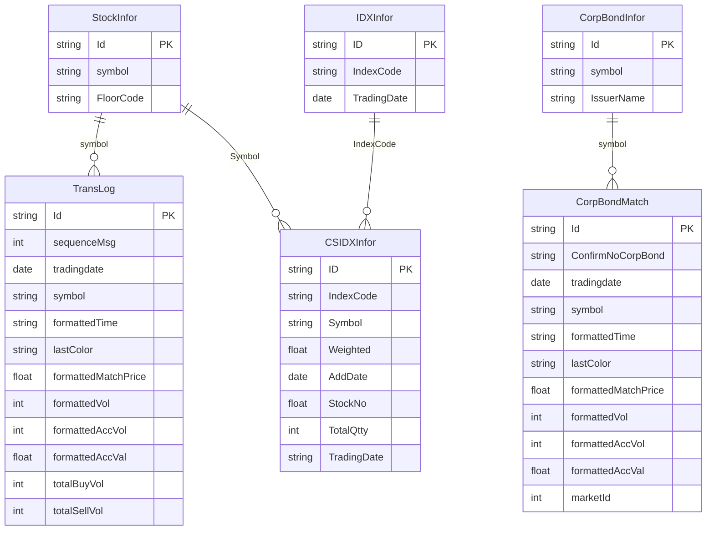
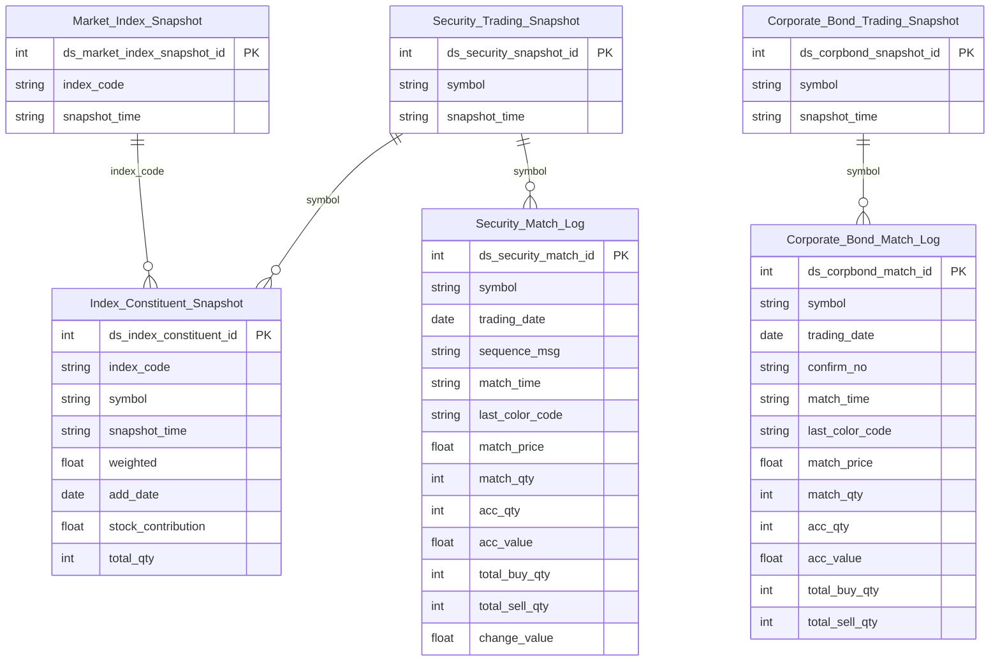

# MDDS HLD — Tier 2

**Source system:** MDDS (Market Data Distribution System — hệ thống phân phối dữ liệu thị trường chứng khoán real-time)
**Tier 2:** Entity phụ thuộc Tier 1 — FK suy luận đến entity Tier 1 qua symbol/IndexCode. Gồm: tick-by-tick match log chứng khoán, tick-by-tick match log TPDN, và snapshot thành phần rổ chỉ số.

---

## 6a. Bảng tổng quan BCV Concept

| BCV Core Object | BCV Concept | Category | Source Table | Mô tả bảng nguồn | Atomic Entity | table_type | BCV Term |
|---|---|---|---|---|---|---|---|
| Transaction | `[Transaction] Sell Transaction` | Transaction | TransLog | Log từng lần khớp lệnh (tick-by-tick) của một mã chứng khoán theo thứ tự thời gian trong ngày: giá khớp, khối lượng khớp, chiều chủ động (B/S/ATO/ATC), thay đổi so với tham chiếu, tích lũy KL/GT, tổng mua/bán chủ động. Insert-only, sequenceMsg tăng đơn điệu. | Security Match Log | Fact Append | **(1)** Term candidate: `Sell Transaction` (id=13149) — "Financial Market Transaction where the object of the trade is to sell an amount of a specified Financial Market Instrument"; cũng xem `Financial Market Transaction` (bao quát hơn). **(2)** Cấu trúc trường: TransLog có formattedMatchPrice, formattedVol, lastColor (B/S/O/C — chiều giao dịch), formattedAccVol/formattedAccVal (tích lũy), totalBuyVol/totalSellVol — đây là **bản ghi từng lần khớp lệnh** (execution/match), không phải order. Một occurrence = một lần khớp thực tế trên sàn. **(3)** Chọn `[Transaction] Sell Transaction` — Financial Market Transaction phù hợp nhất: đây là transaction khớp lệnh trên sàn chứng khoán. `Sell Transaction` là sub-type cụ thể nhưng TransLog chứa cả buy/sell/ATO/ATC → dùng concept bao quát hơn là `[Transaction] Financial Market Transaction`. Đặt tên entity phản ánh domain: **Security Match Log**. |
| Transaction | `[Transaction] Sell Transaction` | Transaction | CorpBondMatch | Log từng lần khớp lệnh của một mã trái phiếu doanh nghiệp theo thứ tự thời gian: giá khớp, khối lượng khớp, chiều chủ động, tổng tích lũy. Dùng ConfirmNoCorpBond thay sequenceMsg. Domain TPDN tách biệt cổ phiếu. | Corporate Bond Match Log | Fact Append | **(1)** Term candidate: Tương tự TransLog — `[Transaction] Sell Transaction` / Financial Market Transaction. **(2)** Cấu trúc trường: CorpBondMatch có cùng pattern với TransLog nhưng có thêm marketId (luôn=06) và dùng ConfirmNoCorpBond. Đặc thù TPDN: giá thường tính theo % mệnh giá. **(3)** Chọn `[Transaction] Sell Transaction` — cùng concept với TransLog. Tách entity riêng vì domain TPDN: CorpBondMatch FK đến CorpBondInfor (Debt Instrument), không FK đến StockInfor. Prefix "Corporate Bond" nhất quán với CorpBondInfor → Tier 1. |
| Group | `[Group] Share Index` | Group | CSIDXInfor | Thành phần (constituent) của từng chỉ số thị trường: mã chứng khoán thuộc rổ nào, tỷ trọng (Weighted), ngày thêm vào rổ (AddDate), tổng KL khớp trong ngày. Grain = (IndexCode, Symbol, snapshot_time). Có attribute nghiệp vụ riêng (Weighted, AddDate) → không denormalize. | Index Constituent Snapshot | Snapshot | **(1)** Term candidate: `Share Index` (id=10128) — CSIDXInfor mô tả **thành phần của Share Index** (rổ cổ phiếu tạo nên chỉ số). **(2)** Cấu trúc trường: CSIDXInfor có IndexCode (FK → IDXInfor), Symbol (FK → StockInfor), Weighted (tỷ trọng %), AddDate (ngày vào rổ), StockNo (đóng góp vào chỉ số), TotalQtty (KL khớp trong ngày), TradingDate (thực chất là timestamp — format HHmmss). Đây là junction entity **có attribute nghiệp vụ** → không denormalize. **(3)** Chọn `[Group] Share Index` — entity này mô tả **quan hệ thành phần của Share Index**. BK = (index_code, symbol, snapshot_time) vì TradingDate là timestamp. |

---

## 6b. Diagram Source (Mermaid)

> Entity Tier 1 (StockInfor, IDXInfor, CorpBondInfor) hiển thị dạng node tham chiếu — chỉ tên + key fields. CSIDXInfor.TradingDate kiểu `string` vì thực chất là timestamp dạng HHmmss.

---

## 6c. Diagram Atomic (Mermaid)

> Entity Tier 1 (Market_Index_Snapshot, Security_Trading_Snapshot, Corporate_Bond_Trading_Snapshot) hiển thị dạng node tham chiếu — chỉ tên + PK + key fields. Kiểu `timestamp`/`bigint` thay bằng `string`/`int` trong diagram — kiểu thực tế ghi nhận tại LLD.

---

## 6d. Mục Danh mục & Tham chiếu (Reference Data)

| Source Field / Bảng | Mô tả | Scheme Code | source_type | Ghi chú |
|---|---|---|---|---|
| TransLog.lastColor | Chiều giao dịch chủ động: B=Mua chủ động, S=Bán chủ động, O=ATO, C=ATC | `MDDS_MATCH_DIRECTION` | source_table | Lưu ý: B/S trong MDDS là chiều đối ứng — ngược hiển thị thông thường. Cần document rõ trong LLD. |
| CorpBondMatch.lastColor | Chiều giao dịch chủ động TPDN (cùng giá trị với TransLog.lastColor) | `MDDS_MATCH_DIRECTION` | source_table | Dùng chung scheme với TransLog.lastColor |

---

## 6e. Bảng chờ thiết kế

*(Để trống — tất cả bảng Tier 2 đã có cột và được thiết kế)*

---

## 6f. Điểm cần xác nhận

| # | Câu hỏi | Kết quả |
|---|---|---|
| T2-01 | Security_Match_Log BK: (symbol, trading_date, sequence_msg) — sequenceMsg reset mỗi ngày, đủ unique chưa? | Cần xác nhận với team ETL: sequenceMsg unique trong phạm vi (symbol, trading_date) hay chỉ trong trading_date. |
| T2-02 | Index_Constituent_Snapshot grain: (IndexCode, Symbol, TradingDate). TradingDate format HHmmss. | **Đóng.** TradingDate là timestamp → BK = (index_code, symbol, snapshot_time TIMESTAMP). Đã cập nhật diagram. |
| T2-03 | Index_Constituent_Snapshot: có nên tách Constituent Master (AddDate, Weighted) vs Daily Stats (TotalQtty)? | Giữ 1 entity Snapshot daily — đơn giản hơn. Tách chỉ khi có yêu cầu SCD tracking cho thành phần rổ. |
| T2-04 | TransLog.lastColor semantics: B=Mua chủ động trong MDDS là chiều đối ứng (ngược thông thường). | Giữ nguyên giá trị nguồn, document semantics rõ ràng trong description cột tại LLD. |
