# NHNCK — HLD Overview: Toàn cảnh thiết kế Atomic Layer

> **Nguồn:** Hệ thống NHNCK — Phân hệ Quản lý giám sát người hành nghề chứng khoán (`qlnhn`, MySQL Server)
>
> **Phạm vi:** Đăng ký, cấp/thu hồi chứng chỉ hành nghề, đào tạo, thi sát hạch, vi phạm.
>
> **File chi tiết theo tầng:**
> - [NHNCK_HLD_Tier1.md](NHNCK_HLD_Tier1.md) — Reference Data: Regulatory Authority Organization Unit, Securities Organization Reference, License Decision Document, Regulatory Authority Officer
> - [NHNCK_HLD_Tier2.md](NHNCK_HLD_Tier2.md) — Securities Practitioner, Professional Training Class, License Certificate Group Document, Qualification Examination Assessment
> - [NHNCK_HLD_Tier3.md](NHNCK_HLD_Tier3.md) — License Certificate Document, License Application, Employment Status, Related Party, Conduct Violation, Organization Employment Report, Identity Verification Record, Training Class Enrollment, Examination Assessment Result, Examination Assessment Fee, License Certificate Group Member
> - [NHNCK_HLD_Tier4.md](NHNCK_HLD_Tier4.md) — License Application sub-entities (×5), License Certificate Document logs (×2)

---

## 7a. Bảng tổng quan Atomic Entities

| Tier | BCV Core Object | BCV Concept | Category | Source Table | Mô tả bảng nguồn | Atomic Entity | BCV Term |
|---|---|---|---|---|---|---|---|
| 1 | Involved Party | [Involved Party] Organization | Organization | Units | Danh mục đơn vị thuộc UBCKNN | Regulatory Authority Organization Unit | Organization — cấu trúc cây self-referencing. Cùng Atomic entity với Departments. |
| 1 | Involved Party | [Involved Party] Organization | Organization | Departments | Danh mục phòng ban thuộc UBCKNN | Regulatory Authority Organization Unit | Organization — cùng Atomic entity với Units, tách attr file theo nguồn. |
| 1 | Involved Party | [Involved Party] Organization | Organization | Organizations | Thông tin các tổ chức tham gia TTCK (CTCK, QLQ, Ngân hàng...) | Securities Organization Reference | Organization — entity nghiệp vụ phong phú, FK từ nhiều bảng. |
| 1 | Documentation | [Documentation] Gov. Registration Document | Government Registration Document | Decisions | Danh mục các quyết định hành chính do UBCKNN ban hành | Securities Practitioner License Decision Document | Government Registration Document — được FK từ Certificate Document (×2), Certificate Group Document, Conduct Violation, Examination Assessment. |
| 1 | Involved Party | [Involved Party] Individual | Individual | Users | Thông tin cán bộ/chuyên viên UBCKNN có tài khoản trong hệ thống NHNCK | Regulatory Authority Officer | Individual — FK từ nhiều bảng (AssigneeId, CreatedBy, UpdatedBy, VerifyBy). |
| 2 | Involved Party | [Involved Party] Individual | Individual | Professionals, ProfessionalHistories | Thông tin người hành nghề chứng khoán | Securities Practitioner | Individual — master entity người hành nghề. Không FK đến bảng nghiệp vụ Tier 1. Attribute cá nhân chi tiết lấy từ bản mới nhất ProfessionalHistories. |
| 2 | Event | [Event] Training Course | Training Course | SpecializationCourses | Danh mục khóa học chuyên môn bổ sung kiến thức | Securities Practitioner Professional Training Class | Training Course — master entity khóa học, không gắn với người cụ thể. |
| 2 | Documentation | [Documentation] Gov. Registration Document | Government Registration Document | CertificateRecordGroups | Nhóm quyết định cấp/thu hồi/hủy chứng chỉ | Securities Practitioner License Certificate Group Document | Government Registration Document — FK đến Decision + Officer (Tier 1). |
| 2 | Communication | [Communication] Assessment | Assessment | ExamSessions | Danh mục các đợt thi sát hạch cấp CCHN | Securities Practitioner Qualification Examination Assessment | Assessment — FK đến Decision + Officer (Tier 1). |
| 3 | Documentation | [Documentation] Gov. Registration Document | Government Registration Document | CertificateRecords | Chứng chỉ hành nghề được cấp cho người hành nghề | Securities Practitioner License Certificate Document | Government Registration Document — FK đến Practitioner (Tier 2), Decision ×2 (Tier 1), Officer (Tier 1). |
| 3 | Documentation | Junction (rich) | Junction | CertificateRecordGroupMembers | Thành viên trong nhóm chứng chỉ — junction có thêm ApplicationId | Securities Practitioner License Certificate Group Member | Junction rich — FK đến Certificate Group (Tier 2), Certificate Document (Tier 3), License Application (Tier 3, nullable). |
| 3 | Documentation | [Documentation] Gov. Registration Document | Government Registration Document | Applications | Hồ sơ đăng ký chứng chỉ hành nghề chứng khoán | Securities Practitioner License Application | Government Registration Document — FK đến Practitioner (Tier 2), Certificate Document (Tier 3), Examination Assessment (Tier 2), Officer ×3 (Tier 1). |
| 3 | Involved Party | [Involved Party] Individual Employment Status | Employment Status | ProfessionalWorkHistories | Lịch sử làm việc của người hành nghề tại các tổ chức | Securities Practitioner Employment Status | Individual Employment Status — FK đến Practitioner (Tier 2), Organization (Tier 1), Certificate Document (Tier 3). |
| 3 | Involved Party | [Involved Party] Involved Party Relationship | Relationship | ProfessionalRelationships | Quan hệ thân nhân của người hành nghề | Securities Practitioner Related Party | Involved Party Relationship — FK đến Practitioner (Tier 2). |
| 3 | Business Activity | [Business Activity] Conduct Violation | Conduct Violation | Violations | Vi phạm của người hành nghề kèm quyết định xử lý | Securities Practitioner Conduct Violation | Conduct Violation — FK đến Practitioner (Tier 2), Decision (Tier 1), Officer (Tier 1). |
| 3 | Documentation | [Documentation] Employer Registration | Employer Registration | OrganizationReports | Báo cáo của tổ chức về tình trạng làm việc của người hành nghề | Securities Practitioner Organization Employment Report | Employer Registration — FK đến Practitioner (Tier 2), Organization (Tier 1), self-ref. |
| 3 | Communication | [Communication] Verification | Verification | IdentityInfoC06s | Lịch sử kiểm tra xác thực danh tính với hệ thống C06 | Securities Practitioner Identity Verification Record | Verification — FK đến Practitioner (Tier 2). |
| 3 | Business Activity | [Business Activity] Business Activity | Business Activity | SpecializationCourseDetails | Chi tiết người tham gia khóa học + kết quả | Securities Practitioner Professional Training Class Enrollment | Business Activity — FK đến Training Class (Tier 2) + Practitioner (Tier 2). |
| 3 | Communication | [Communication] Assessment | Assessment | ExamDetails | Kết quả thi sát hạch của từng thí sinh | Securities Practitioner Qualification Examination Assessment Result | Assessment — FK đến Examination Assessment (Tier 2), Practitioner (Tier 2), License Application (Tier 3, nullable). |
| 3 | Condition | [Condition] Financial Charge | Financial Charge | ExamSessionFees | Biểu phí thi quy định cho từng loại chứng chỉ trong từng đợt thi | Securities Practitioner Qualification Examination Assessment Fee | Financial Charge — biểu phí quy định (Condition), khác với License Application Fee (Transaction). |
| 4 | Documentation | [Documentation] Education Certificate | Education Certificate | ApplicationSpecializations | Chứng chỉ/chuyên môn đào tạo đính kèm hồ sơ | Securities Practitioner License Application Education Certificate Document | Education Certificate — FK đến License Application (Tier 3), Officer (Tier 1). |
| 4 | Documentation | [Documentation] Supporting Documentation | Supporting Documentation | ApplicationDocuments | Tài liệu vật lý đính kèm hồ sơ | Securities Practitioner License Application Document Attachment | Supporting Documentation — FK đến License Application (Tier 3). |
| 4 | Business Activity | ETL Pattern — Activity Log | Activity Log | ApplicationLogs | Nhật ký thay đổi trạng thái/nội dung hồ sơ | Securities Practitioner License Application Processing Activity Log | Activity Log Pattern — FK đến License Application (Tier 3). |
| 4 | Transaction | [Event] Transaction | Transaction | ApplicationFees | Phí thực tế phát sinh cho hồ sơ | Securities Practitioner License Application Fee | Transaction — phí thực tế từng hồ sơ, khác với Examination Assessment Fee (Condition). |
| 4 | Business Activity | [Business Activity] Approval Activity | Approval Activity | VerifyApplicationStatuses | Yêu cầu phê duyệt hồ sơ tại 1 cấp (LĐCM/LĐUB) | Securities Practitioner License Application Verification Status | Approval Activity — FK đến License Application (Tier 3), Officer (Tier 1). FK ngược từ License Application (InfoVerifyId). |
| 4 | Business Activity | ETL Pattern — Activity Log | Activity Log | CertificateRecordStatusHistories | Lịch sử thay đổi trạng thái chứng chỉ | Securities Practitioner License Certificate Document Status History | Activity Log Pattern — FK đến Certificate Document (Tier 3). |
| 4 | Business Activity | ETL Pattern — Activity Log | Activity Log | CertificateRecordLogs | Nhật ký hoạt động trên chứng chỉ | Securities Practitioner License Certificate Document Activity Log | Activity Log Pattern — FK đến Certificate Document (Tier 3). |

---

## 7b. Diagram Atomic Tổng (Mermaid)

```mermaid
graph TD
    classDef atomic fill:#dcfce7,stroke:#16a34a,color:#14532d
    classDef shared fill:#fae8ff,stroke:#9333ea,color:#4a044e
    classDef pattern fill:#e2e8f0,stroke:#64748b,color:#1e293b

    %% Tier 1
    ORGUNIT["**Regulatory Authority Organization Unit**"]:::atomic
    SECORG["**Securities Organization Reference**"]:::atomic
    DECISION["**Securities Practitioner License Decision Document**"]:::atomic
    OFFICER["**Regulatory Authority Officer**"]:::atomic

    %% Shared
    ADDR["IP Postal Address"]:::shared
    EADDR["IP Electronic Address"]:::shared
    ALTID["IP Alt Identification"]:::shared

    %% Tier 2
    PRAC["**Securities Practitioner**"]:::atomic
    TRAINCLASS["**Professional Training Class**"]:::atomic
    CERTGRP["**License Certificate Group Document**"]:::atomic
    EXAM["**Qualification Examination Assessment**"]:::atomic

    %% Tier 3
    CERTDOC["**License Certificate Document**"]:::atomic
    CERTMEM["**License Certificate Group Member**"]:::atomic
    APP["**License Application**"]:::atomic
    EMPST["**Employment Status**"]:::atomic
    RELP["**Related Party**"]:::atomic
    VIO["**Conduct Violation**"]:::atomic
    EMPRPT["**Organization Employment Report**"]:::atomic
    IDVERIFY["**Identity Verification Record**"]:::atomic
    ENROLL["**Training Class Enrollment**"]:::atomic
    EXAMRES["**Examination Assessment Result**"]:::atomic
    EXAMFEE["**Examination Assessment Fee**"]:::atomic

    %% Tier 4
    APPTRAIN["**License Application\nEducation Certificate Document**"]:::atomic
    APPDOC["**License Application\nDocument Attachment**"]:::atomic
    APPLOG["**License Application\nProcessing Activity Log**"]:::pattern
    APPFEE["**License Application Fee**"]:::atomic
    VERIFY["**License Application\nVerification Status**"]:::atomic
    CERTSTATH["**Certificate Document\nStatus History**"]:::pattern
    CERTLOG["**Certificate Document\nActivity Log**"]:::pattern

    %% Tier 1
    ORGUNIT -->|self-ref| ORGUNIT
    OFFICER -->|Organization Unit FK| ORGUNIT
    OFFICER -->|Department Organization Unit FK| ORGUNIT
    DECISION -->|Created By Officer FK| OFFICER
    SECORG -->|self-ref| SECORG
    SECORG -->|Created By Officer FK| OFFICER
    ADDR -.->|shared| SECORG
    EADDR -.->|shared| SECORG
    ALTID -.->|shared| SECORG

    %% Tier 2
    ADDR -.->|shared| PRAC
    EADDR -.->|shared| PRAC
    ALTID -.->|shared| PRAC
    CERTGRP -->|Decision FK| DECISION
    CERTGRP -->|Created By Officer FK| OFFICER
    EXAM -->|Decision FK| DECISION
    EXAM -->|Created By Officer FK| OFFICER
    EXAM -->|Updated By Officer FK| OFFICER

    %% Tier 3
    CERTDOC -->|Practitioner FK| PRAC
    CERTDOC -->|Issuance Decision FK| DECISION
    CERTDOC -->|Revocation Decision FK| DECISION
    CERTDOC -->|Created By Officer FK| OFFICER
    CERTMEM -->|Certificate Group FK| CERTGRP
    CERTMEM -->|Certificate Document FK| CERTDOC
    CERTMEM -->|License Application FK| APP
    APP -->|Practitioner FK| PRAC
    APP -->|Certificate Document FK| CERTDOC
    APP -->|Examination Assessment FK| EXAM
    APP -->|Assignee Officer FK| OFFICER
    EMPST -->|Practitioner FK| PRAC
    EMPST -->|Organization FK| SECORG
    EMPST -->|Certificate Document FK| CERTDOC
    RELP -->|Practitioner FK| PRAC
    VIO -->|Practitioner FK| PRAC
    VIO -->|Decision FK| DECISION
    VIO -->|Created By Officer FK| OFFICER
    EMPRPT -->|Practitioner FK| PRAC
    EMPRPT -->|Organization FK| SECORG
    EMPRPT -->|self-ref| EMPRPT
    IDVERIFY -->|Practitioner FK| PRAC
    ENROLL -->|Training Class FK| TRAINCLASS
    ENROLL -->|Practitioner FK| PRAC
    EXAMRES -->|Examination Assessment FK| EXAM
    EXAMRES -->|Practitioner FK| PRAC
    EXAMRES -->|License Application FK| APP
    EXAMFEE -->|Examination Assessment FK| EXAM

    %% Tier 4
    APPTRAIN -->|License Application FK| APP
    APPTRAIN -->|Appraised By Officer FK| OFFICER
    APPDOC -->|License Application FK| APP
    APPLOG -.->|Activity of| APP
    APPFEE -->|License Application FK| APP
    VERIFY -->|License Application FK| APP
    VERIFY -->|Verified By Officer FK| OFFICER
    CERTSTATH -.->|History of| CERTDOC
    CERTLOG -.->|Activity of| CERTDOC
```

---

## 7c. Bảng Classification Value

| Source Table | Mô tả | BCV Term | Xử lý Atomic |
|---|---|---|---|
| EducationLevels | Danh mục trình độ học vấn | Classification Value | Scheme: EDUCATION_LEVEL. |
| ApplicationStatuses | Định nghĩa trạng thái hồ sơ | Classification Value | Scheme: APPLICATION_STATUS. |
| Certificates | Danh mục loại chứng chỉ hành nghề | Classification Value | Scheme: CERTIFICATE_TYPE. |
| Specializations | Danh mục chuyên môn | Classification Value | Scheme: SPECIALIZATION. |
| Documents | Danh mục loại tài liệu hồ sơ | Classification Value | Scheme: DOCUMENT_TYPE. |
| ApplicationSources | Hình thức nộp hồ sơ | Classification Value | Scheme: APPLICATION_SOURCE. |
| Positions | Danh mục chức vụ | Classification Value | Scheme: POSITION. BCV: Employment Position Type — reference data set, không phải entity. |

---

## 7d. Junction Tables

| Source Table | Mô tả | Entity chính | Xử lý trên Atomic |
|---|---|---|---|
| CertificateRecordGroupMembers | Junction giữa CertificateRecords và CertificateRecordGroups — có thêm ApplicationId | Securities Practitioner License Certificate Group Member | Rich junction (có attribute ApplicationId ngoài 2 FK chính) → tạo Atomic entity riêng với surrogate key. Không denormalize. |

Không có pure junction table trong NHNCK.

---

## 7e. Điểm cần xác nhận

| # | Tier | Câu hỏi | Ảnh hưởng |
|---|---|---|---|
| 1 | 1 | `Decisions.CreatedBy` là FK thực hay audit field kỹ thuật? | Nếu audit field → không ảnh hưởng dependency. |
| 2 | 1 | `Organizations` có bao gồm cả UBCKNN không? | Nếu có → cần xem xét quan hệ với Regulatory Authority Organization Unit. |
| 3 | 2 | `Professionals` có FK đến bảng nghiệp vụ Tier 1 nào ngoài shared entities không? | Nếu có → phải chuyển sang Tier 3. |
| 4 | 2 | `SpecializationCourses` có FK đến bảng nào ngoài danh mục không? | Nếu có → điều chỉnh Tier. |
| 5 | 3 | `CertificateRecordGroupMembers.ApplicationId` nullable hay NOT NULL? | Nếu NOT NULL → cần xem lại grain và dependency. |
| 6 | 3 | `Applications.CertificateRecordId` và `PreviousCertificateRecordId` đều nullable? | Ảnh hưởng FK design: hồ sơ mới chưa có CCHN → nullable là đúng. |
| 7 | 3 | `ExamDetails.ApplicationId` nullable — có trường hợp thi không có hồ sơ đăng ký không? | Xác nhận business rule. |
| 8 | 4 | `VerifyApplicationStatuses` ↔ `Applications.InfoVerifyId` — FK 2 chiều có cần giữ không? | Nếu không cần → xóa InfoVerifyId trên Application, resolve qua ETL. |
| 9 | 4 | `ApplicationFees.FeeAmount` — có currency code đi kèm không? | Nếu luôn VND → không cần. Nếu có ngoại tệ → thêm Currency Code. |

---

## 7f. Bảng ngoài scope Atomic

| Nhóm | Source Table | Mô tả bảng nguồn | Lý do ngoài scope |
|---|---|---|---|
| System / Auth | UserRoles | Phân quyền người dùng | Operational/system data — không có giá trị nghiệp vụ. |
| System / Auth | Roles | Danh mục vai trò | Operational/system data. |
| System / Auth | Permissions | Danh mục quyền hạn | Operational/system data. |
| System / Auth | PermissionRoles | Phân quyền theo vai trò | Operational/system data. |
| System / Auth | DepartmentAccess | Quyền truy cập theo phòng ban | Operational/system data. |
| System / Log | ActionLogs | Nhật ký hành động hệ thống | System audit log — không phải nghiệp vụ CCHN. |
| System / Config | SystemParameters | Tham số hệ thống | Config data. |
| Digital Cert | DigitalCertificates | Chứng chỉ số | Operational/PKI data — không phải CCHN. |
| Digital Cert | DigitalCertificateUsers | Người dùng chứng chỉ số | Operational/PKI data. |
| Digital Cert | CertificateDocuments | Tài liệu chứng chỉ số | Operational/PKI data. |
| Digital Cert | CertificateSpecializations | Chuyên môn chứng chỉ số | Operational/PKI data. |
| Digital Cert | CertificateDepartments | Phòng ban chứng chỉ số | Operational/PKI data. |
| Config | CertificateNumberTemplates | Template số chứng chỉ | Config/template data. |
