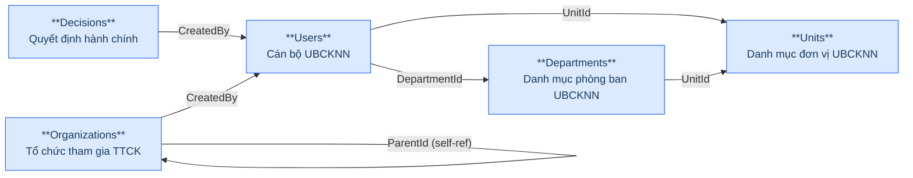

# NHNCK — HLD Tier 1: Reference Data (Main Entities)

> **Phụ thuộc:** Không phụ thuộc Tier nào — là nền tảng cho tất cả Tier sau.
>
> **Thiết kế theo:** [NHNCK_HLD_Overview.md](NHNCK_HLD_Overview.md)

---

## 6a. Bảng tổng quan BCV Concept

| BCV Core Object | BCV Concept | Category | Source Table | Mô tả bảng nguồn | Atomic Entity | BCV Term |
|---|---|---|---|---|---|---|
| Involved Party | [Involved Party] Organization | Organization | Units | Danh mục đơn vị thuộc UBCKNN | Regulatory Authority Organization Unit | Organization — cơ cấu tổ chức UBCKNN dạng cây self-referencing. Cấu trúc trường tương tự Departments (code, name, parent, status, sort order) → gộp 2 nguồn thành 1 Atomic entity, Classification Value phân biệt UNIT / DEPARTMENT. |
| Involved Party | [Involved Party] Organization | Organization | Departments | Danh mục phòng ban thuộc UBCKNN | Regulatory Authority Organization Unit | Organization — cùng Atomic entity với Units. Parent của Department trỏ đến Unit (UnitId). 2 attr file riêng biệt (attr_NHNCK_Units.csv + attr_NHNCK_Departments.csv) nhưng cùng 1 Atomic entity. |
| Involved Party | [Involved Party] Organization | Organization | Organizations | Thông tin các tổ chức tham gia TTCK (CTCK, QLQ, Ngân hàng...) | Securities Organization Reference | Organization — *"Identifies an Involved Party that may stand alone in an operational or legal context."* Cấu trúc trường: mã tổ chức, tên, loại hình, vốn điều lệ, trạng thái, self-ref Parent. Được FK từ Employment Status và Organization Employment Report. |
| Documentation | [Documentation] Gov. Registration Document | Government Registration Document | Decisions | Danh mục các quyết định hành chính do UBCKNN ban hành | Securities Practitioner License Decision Document | Government Registration Document — *"Identifies a Documentation Item that is issued by a principality or sovereignty."* Cấu trúc trường: số QĐ, tiêu đề, loại, ngày ký, người ký, trạng thái, file đính kèm. Được FK từ Certificate Document (×2), Certificate Group Document, Conduct Violation, Examination Assessment. |
| Involved Party | [Involved Party] Individual | Individual | Users | Thông tin cán bộ/chuyên viên UBCKNN có tài khoản trong hệ thống NHNCK | Regulatory Authority Officer | Individual — *"Identifies an Involved Party who is a natural person."* Cấu trúc trường: mã cán bộ, username, họ tên, email, điện thoại, FK đến Organization Unit (×2: đơn vị + phòng ban), chức vụ, trạng thái. Không lưu PasswordHash. |

---

## 6b. Diagram Source (Mermaid)

---

## 6c. Diagram Atomic (Mermaid)

```mermaid
graph TD
    classDef atomic fill:#dcfce7,stroke:#16a34a,color:#14532d
    classDef shared fill:#fae8ff,stroke:#9333ea,color:#4a044e

    ORGUNIT["**Regulatory Authority Organization Unit**\n[Involved Party] Organization\nUnits + Departments"]:::atomic
    SECORG["**Securities Organization Reference**\n[Involved Party] Organization\nOrganizations"]:::atomic
    DECISION["**Securities Practitioner License Decision Document**\n[Documentation] Gov. Registration Document\nDecisions"]:::atomic
    OFFICER["**Regulatory Authority Officer**\n[Involved Party] Individual\nUsers"]:::atomic

    ADDR["IP Postal Address"]:::shared
    EADDR["IP Electronic Address"]:::shared
    ALTID["IP Alt Identification"]:::shared

    ORGUNIT -->|"Parent Organization Unit FK (self-ref)"| ORGUNIT
    OFFICER -->|"Organization Unit FK (UnitId)"| ORGUNIT
    OFFICER -->|"Department Organization Unit FK (DepartmentId)"| ORGUNIT
    DECISION -->|"Created By Officer FK"| OFFICER
    SECORG -->|"Created By Officer FK"| OFFICER
    SECORG -->|"Parent Organization FK (self-ref)"| SECORG
    ADDR -.->|"shared"| SECORG
    EADDR -.->|"shared"| SECORG
    ALTID -.->|"shared"| SECORG
```

---

## 6d. Danh mục & Tham chiếu

| Source Table | Mô tả | Scheme Code dự kiến | Ghi chú |
|---|---|---|---|
| Positions | Danh mục chức vụ | POSITION | Chỉ có Code + Name → Classification Value (Employment Position Type). Không tạo Atomic entity. |
| EducationLevels | Danh mục trình độ học vấn | EDUCATION_LEVEL | Classification Value. |
| ApplicationStatuses | Định nghĩa trạng thái hồ sơ | APPLICATION_STATUS | Classification Value. |
| Certificates | Danh mục loại chứng chỉ hành nghề | CERTIFICATE_TYPE | Classification Value. |
| Specializations | Danh mục chuyên môn | SPECIALIZATION | Classification Value. |
| Documents | Danh mục loại tài liệu hồ sơ | DOCUMENT_TYPE | Classification Value. |
| ApplicationSources | Hình thức nộp hồ sơ | APPLICATION_SOURCE | Classification Value. |

---

## 6e. Bảng chờ thiết kế

Không có bảng nào trong Tier 1 chưa đủ thông tin cột.

---

## 6f. Điểm cần xác nhận

| # | Câu hỏi | Ảnh hưởng |
|---|---|---|
| 1 | `Decisions.CreatedBy` là FK thực đến Users hay chỉ là audit field? | Nếu là audit field kỹ thuật → không ảnh hưởng dependency giữa Decision và Officer. Thiết kế hiện tại giữ FK này trên Atomic entity. |
| 2 | Organizations có bao gồm cả UBCKNN (tự tham chiếu) hay chỉ là tổ chức tham gia TTCK? | Nếu UBCKNN cũng có trong bảng → cần xem xét quan hệ với Regulatory Authority Organization Unit. |

---

## Entities trong Tier 1

### 1. Regulatory Authority Organization Unit
**Source:** `Units` + `Departments` | **BCV Concept:** [Involved Party] Organization | **BCO:** Involved Party

**Grain:** 1 dòng = 1 đơn vị hoặc phòng ban thuộc UBCKNN. Cấu trúc cây self-referencing: Department → Unit → NULL.

**Attributes chính:** Organization Unit Code, Organization Unit Type Code (ETL-derived: UNIT / DEPARTMENT), Organization Unit Name, Parent Organization Unit Id/Code (self-ref — Units: NULL; Departments: UnitId), Organization Unit Status Code, Sort Order.

**Lưu ý thiết kế:** 2 attr file riêng (`attr_NHNCK_Units.csv` + `attr_NHNCK_Departments.csv`) nhưng cùng Atomic entity name. Organization Unit Type Code phân biệt loại — ETL-derived, không có trong nguồn.

---

### 2. Securities Organization Reference
**Source:** `Organizations` | **BCV Concept:** [Involved Party] Organization | **BCO:** Involved Party

**Grain:** 1 dòng = 1 tổ chức tham gia thị trường chứng khoán được UBCKNN quản lý.

**Attributes chính:** Organization Code, Organization Name, English Name, Abbreviation, Organization Type Code, Charter Capital Amount, Organization Status Code, Created By Officer FK, self-ref Parent Organization Id/Code.

**Shared entities:** IP Postal Address, IP Electronic Address, IP Alt Identification.

---

### 3. Securities Practitioner License Decision Document
**Source:** `Decisions` | **BCV Concept:** [Documentation] Gov. Registration Document | **BCO:** Documentation

**Grain:** 1 dòng = 1 quyết định hành chính do UBCKNN ban hành (cấp/thu hồi/hủy CCHN, công nhận kết quả thi...).

**Attributes chính:** Decision Number, Decision Title, Decision Type Code, Signed Date, Signatory Name, Decision Status Code, file đính kèm, Created By Officer FK.

**Được FK từ:** License Certificate Document (×2: cấp + thu hồi), License Certificate Group Document, Conduct Violation, Examination Assessment.

---

### 4. Regulatory Authority Officer
**Source:** `Users` | **BCV Concept:** [Involved Party] Individual | **BCO:** Involved Party

**Grain:** 1 dòng = 1 cán bộ/chuyên viên UBCKNN có tài khoản trong hệ thống NHNCK.

**Attributes chính:** Officer Code, Username, Full Name, Email, Phone Number, Individual Gender Code, Organization Unit Id/Code (FK → Unit), Department Organization Unit Id/Code (FK → Department), Position Code (Classification Value — không tạo FK entity riêng), Officer Status Code.

**Lưu ý:** Không lưu PasswordHash — loại bỏ thông tin bảo mật. Position Code → Classification Value scheme POSITION.

---

## Attribute Summary

| Atomic Entity | # Attributes | PK | Key FKs |
|---|---|---|---|
| Regulatory Authority Organization Unit | 10 × 2 sources | Organization Unit Id | self-ref Parent Organization Unit |
| Securities Organization Reference | 22 | Securities Organization Reference Id | self-ref Parent; Officer (CreatedBy) |
| Securities Practitioner License Decision Document | 16 | License Decision Document Id | Officer (CreatedBy) |
| Regulatory Authority Officer | 17 | Officer Id | Organization Unit (×2: Unit + Department) |
