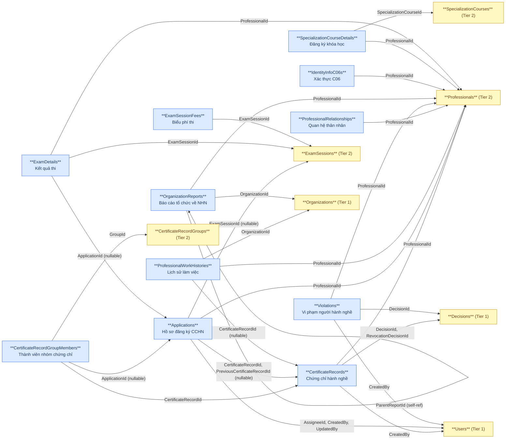

# NHNCK — HLD Tier 3: Phụ thuộc Tier 2

> **Phụ thuộc Tier 1:** Securities Practitioner License Decision Document, Regulatory Authority Officer, Securities Organization Reference
> **Phụ thuộc Tier 2:** Securities Practitioner, Securities Practitioner Professional Training Class, Securities Practitioner License Certificate Group Document, Securities Practitioner Qualification Examination Assessment
>
> **Thiết kế theo:** [NHNCK_HLD_Overview.md](NHNCK_HLD_Overview.md)

---

## 6a. Bảng tổng quan BCV Concept

| BCV Core Object | BCV Concept | Category | Source Table | Mô tả bảng nguồn | Atomic Entity | BCV Term |
|---|---|---|---|---|---|---|
| Documentation | [Documentation] Gov. Registration Document | Government Registration Document | CertificateRecords | Chứng chỉ hành nghề được cấp cho người hành nghề | Securities Practitioner License Certificate Document | Government Registration Document — cấu trúc trường: Certificate Type Code, Certificate Number, Certificate Issue Date, Certificate Status Code, Digital Signature Status Code, FK đến Practitioner, Decision (×2: cấp + thu hồi), Officer (CreatedBy). FK đến Tier 2 (Practitioner) và Tier 1 (Decision + Officer). |
| Documentation | [Documentation] Gov. Registration Document | Government Registration Document | CertificateRecordGroupMembers | Thành viên trong nhóm chứng chỉ — rich junction CertificateRecord ↔ CertificateRecordGroup | Securities Practitioner License Certificate Group Member | Junction (rich) — có thêm ApplicationId ngoài 2 FK chính → tạo Atomic entity riêng với surrogate key. FK đến Certificate Group Document (Tier 2), Certificate Document (Tier 3), License Application (Tier 3 — circular, ApplicationId nullable). |
| Documentation | [Documentation] Gov. Registration Document | Government Registration Document | Applications | Hồ sơ đăng ký chứng chỉ hành nghề chứng khoán | Securities Practitioner License Application | Government Registration Document — cấu trúc trường: mã hồ sơ, loại đăng ký, loại hồ sơ, trạng thái, loại chứng chỉ, ngày nộp, FK đến Practitioner (Tier 2), Certificate Document (Tier 3 — nullable), Examination Assessment (Tier 2), Verification Status (Tier 3 — circular), Officer (×3: Assignee + CreatedBy + UpdatedBy). |
| Involved Party | [Involved Party] Individual Employment Status | Employment Status | ProfessionalWorkHistories | Lịch sử làm việc của người hành nghề tại các tổ chức chứng khoán | Securities Practitioner Employment Status | Individual Employment Status — *"Identifies the current or past employment status of an Individual."* Cấu trúc trường: FK đến Practitioner (Tier 2), Organization (Tier 1), Certificate Document (Tier 3 — nullable), Position Name (text), Department Name (text), Employment Start/End Date. |
| Involved Party | [Involved Party] Involved Party Relationship | Relationship | ProfessionalRelationships | Thông tin quan hệ thân nhân của người hành nghề | Securities Practitioner Related Party | Involved Party Relationship — cấu trúc trường: FK đến Practitioner (Tier 2), tên thân nhân, quan hệ, thông tin liên lạc. |
| Business Activity | [Business Activity] Conduct Violation | Conduct Violation | Violations | Thông tin vi phạm của người hành nghề được ghi nhận kèm quyết định xử lý | Securities Practitioner Conduct Violation | Conduct Violation — *"Identifies a Business Activity that records a violation of conduct rules."* Cấu trúc trường: FK đến Practitioner (Tier 2), Decision (Tier 1), Officer (Tier 1 — CreatedBy), Violation Type Code, Violation Detail, Violation Status Code. |
| Documentation | [Documentation] Employer Registration | Employer Registration | OrganizationReports | Báo cáo của tổ chức về tình trạng làm việc của người hành nghề | Securities Practitioner Organization Employment Report | Employer Registration — cấu trúc trường: FK đến Practitioner (Tier 2), Organization (Tier 1), self-ref ParentReportId. |
| Communication | [Communication] Verification | Verification | IdentityInfoC06s | Lịch sử kiểm tra xác thực danh tính người hành nghề với hệ thống C06 (Bộ Công An) | Securities Practitioner Identity Verification Record | Verification — cấu trúc trường: FK đến Practitioner (Tier 2), timestamp, kết quả xác thực. |
| Business Activity | [Business Activity] Business Activity | Business Activity | SpecializationCourseDetails | Chi tiết người tham gia khóa học chuyên môn và kết quả | Securities Practitioner Professional Training Class Enrollment | Business Activity — cấu trúc trường: FK đến Training Class (Tier 2), FK đến Practitioner (Tier 2), kết quả học (điểm/trạng thái). |
| Communication | [Communication] Assessment | Assessment | ExamDetails | Kết quả thi sát hạch của từng thí sinh trong từng đợt thi | Securities Practitioner Qualification Examination Assessment Result | Assessment — cấu trúc trường: FK đến Examination Assessment (Tier 2), FK đến Practitioner (Tier 2), FK đến License Application (Tier 3 — nullable), điểm thi, kết quả (Đạt/Không đạt), trạng thái. |
| Condition | [Condition] Financial Charge | Financial Charge | ExamSessionFees | Biểu phí thi quy định cho từng loại chứng chỉ trong từng đợt thi | Securities Practitioner Qualification Examination Assessment Fee | Financial Charge — *"Identifies a Condition that is a charge for a service."* Phân biệt với License Application Fee (Transaction) — đây là biểu phí quy định, không phải phí thực tế thu từng thí sinh. Cấu trúc trường: FK đến Examination Assessment (Tier 2), Certificate Type Code, Examination Fee Amount, Review Fee Amount. |

---

## 6b. Diagram Source (Mermaid)

---

## 6c. Diagram Atomic (Mermaid)

```mermaid
graph TD
    classDef atomic fill:#dcfce7,stroke:#16a34a,color:#14532d
    classDef pattern fill:#e2e8f0,stroke:#64748b,color:#1e293b
    classDef outscope fill:#fef9c3,stroke:#ca8a04,color:#713f12

    CERTDOC["**License Certificate Document**\n[Documentation] Gov. Registration Document\nCertificateRecords"]:::atomic
    CERTMEM["**License Certificate Group Member**\nJunction (rich)\nCertificateRecordGroupMembers"]:::atomic
    APP["**License Application**\n[Documentation] Gov. Registration Document\nApplications"]:::atomic
    EMPST["**Employment Status**\n[Involved Party] Ind. Employment Status\nProfessionalWorkHistories"]:::atomic
    RELP["**Related Party**\n[Involved Party] IP Relationship\nProfessionalRelationships"]:::atomic
    VIO["**Conduct Violation**\n[Business Activity] Conduct Violation\nViolations"]:::atomic
    EMPRPT["**Organization Employment Report**\n[Documentation] Employer Registration\nOrganizationReports"]:::atomic
    IDVERIFY["**Identity Verification Record**\n[Communication] Verification\nIdentityInfoC06s"]:::atomic
    ENROLL["**Training Class Enrollment**\n[Business Activity] Business Activity\nSpecializationCourseDetails"]:::atomic
    EXAMRES["**Examination Assessment Result**\n[Communication] Assessment\nExamDetails"]:::atomic
    EXAMFEE["**Examination Assessment Fee**\n[Condition] Financial Charge\nExamSessionFees"]:::atomic

    PRAC["**Securities Practitioner** (Tier 2)"]:::outscope
    TRAINCLASS["**Professional Training Class** (Tier 2)"]:::outscope
    CERTGRP["**License Certificate Group Document** (Tier 2)"]:::outscope
    EXAM["**Qualification Examination Assessment** (Tier 2)"]:::outscope
    DECISION["**License Decision Document** (Tier 1)"]:::outscope
    OFFICER["**Regulatory Authority Officer** (Tier 1)"]:::outscope
    SECORG["**Securities Organization Reference** (Tier 1)"]:::outscope

    CERTDOC -->|"Practitioner FK"| PRAC
    CERTDOC -->|"Issuance Decision FK"| DECISION
    CERTDOC -->|"Revocation Decision FK"| DECISION
    CERTDOC -->|"Created By Officer FK"| OFFICER
    CERTMEM -->|"Certificate Group FK"| CERTGRP
    CERTMEM -->|"Certificate Document FK"| CERTDOC
    CERTMEM -->|"License Application FK (nullable)"| APP
    APP -->|"Practitioner FK"| PRAC
    APP -->|"Certificate Document FK (nullable)"| CERTDOC
    APP -->|"Examination Assessment FK (nullable)"| EXAM
    APP -->|"Assignee Officer FK"| OFFICER
    EMPST -->|"Practitioner FK"| PRAC
    EMPST -->|"Organization FK"| SECORG
    EMPST -->|"Certificate Document FK (nullable)"| CERTDOC
    RELP -->|"Practitioner FK"| PRAC
    VIO -->|"Practitioner FK"| PRAC
    VIO -->|"Decision FK"| DECISION
    VIO -->|"Created By Officer FK"| OFFICER
    EMPRPT -->|"Practitioner FK"| PRAC
    EMPRPT -->|"Organization FK"| SECORG
    EMPRPT -->|"self-ref Parent Report"| EMPRPT
    IDVERIFY -->|"Practitioner FK"| PRAC
    ENROLL -->|"Training Class FK"| TRAINCLASS
    ENROLL -->|"Practitioner FK"| PRAC
    EXAMRES -->|"Examination Assessment FK"| EXAM
    EXAMRES -->|"Practitioner FK"| PRAC
    EXAMRES -->|"License Application FK (nullable)"| APP
    EXAMFEE -->|"Examination Assessment FK"| EXAM
```

---

## 6d. Danh mục & Tham chiếu

Không có bảng mới nào trong Tier 3 thuộc dạng Classification Value — đã liệt kê đầy đủ ở Tier 1.

---

## 6e. Bảng chờ khảo sát

| Source Table | Mô tả bảng nguồn | Lý do pending |
|---|---|---|
| ProfessionalWorkHistories | Lịch sử công tác của người hành nghề | Cấu trúc bảng cập nhật: không còn ProfessionalId/OrganizationId/HireDate/TerminationDate — chỉ có CertificateId, Name, Reference, FilePath, SortOrder. Ý nghĩa nghiệp vụ vẫn là lịch sử công tác nhưng cơ chế lưu trữ thay đổi (dạng file đính kèm minh chứng). Cần khảo sát thêm để xác định grain, entity concept phù hợp và bảng nguồn nào lưu thông tin ai làm ở đâu từ ngày nào. |

## 6e-b. Bảng ngoài scope Atomic

| Source Table | Mô tả bảng nguồn | Lý do ngoài scope |
|---|---|---|
| ProfessionalHistories | Lịch sử thay đổi thông tin cá nhân người hành nghề | Audit Log nguồn — có cột FieldName, OldValue, NewValue, ChangedBy, ChangedAt. Cơ chế ghi lịch sử đặc thù source system, không phải sự kiện nghiệp vụ. |

---

## 6f. Điểm cần xác nhận

| # | Câu hỏi | Ảnh hưởng |
|---|---|---|
| 1 | `CertificateRecordGroupMembers.ApplicationId` nullable hay NOT NULL? | Nếu nullable → rich junction đúng. Nếu NOT NULL → dependency chặt hơn, cần xem lại grain. |
| 2 | `Applications.CertificateRecordId` và `PreviousCertificateRecordId` — cả 2 đều nullable? | Ảnh hưởng thiết kế FK: nếu CertificateRecordId nullable thì Application có thể tồn tại trước khi CCHN được cấp (hồ sơ đang xử lý). |
| 3 | `ExamDetails.ApplicationId` nullable — có trường hợp thí sinh thi không có hồ sơ đăng ký không? | Xác nhận business rule: có thể thi lại mà không cần hồ sơ mới. |
| 4 | `License Certificate Group Member` — ApplicationId trỏ đến Applications thuộc Tier 3 (circular với Certificate Document). Thiết kế có cần tách Tier thêm không? | Hiện tại giữ cả CertificateRecord, GroupMember, Application trong Tier 3 vì dependency chéo — không thể xếp độc lập. Chấp nhận circular reference trong cùng Tier. |
| 5 | `ProfessionalWorkHistories` — cấu trúc bảng thay đổi (không còn ProfessionalId). Bảng nào trong NHNCK lưu thông tin lịch sử làm việc (ai, ở tổ chức nào, từ ngày nào)? | Ảnh hưởng đến entity `Securities Practitioner Employment Status` — hiện đang pending khảo sát. |

---

## Entities trong Tier 3

### 1. Securities Practitioner License Certificate Document
**Source:** `CertificateRecords` | **BCV Concept:** [Documentation] Gov. Registration Document | **BCO:** Documentation

**Grain:** 1 dòng = 1 chứng chỉ hành nghề được cấp cho 1 người hành nghề.

**Attributes chính:** Certificate Type Code, Certificate Number, Certificate Issue Date, Certificate Status Code, Digital Signature Status Code, Practitioner FK (Id + Code), Issuance Decision FK (Id + Code), Revocation Decision FK (Id + Code — nullable), Created By Officer FK (Id + Code).

**Được FK từ:** License Application (×2), Certificate Group Member, Certificate Document Status History (Tier 4), Certificate Document Activity Log (Tier 4), Employment Status.

---

### 2. Securities Practitioner License Certificate Group Member
**Source:** `CertificateRecordGroupMembers` | **BCV Concept:** Junction (rich) | **BCO:** Documentation

**Grain:** 1 dòng = 1 chứng chỉ thuộc 1 nhóm quyết định. Rich junction — có thêm ApplicationId.

**FK đi ra:** Certificate Group Document (Tier 2), Certificate Document (Tier 3), License Application (Tier 3 — nullable).

---

### 3. Securities Practitioner License Application
**Source:** `Applications` | **BCV Concept:** [Documentation] Gov. Registration Document | **BCO:** Documentation

**Grain:** 1 dòng = 1 hồ sơ đăng ký chứng chỉ hành nghề chứng khoán.

**Attributes chính:** License Application Code, Application Code, Registration Type Code, Application Type Code, Application Status Code, Certificate Type Code, Submission Date, Certificate Number (denormalized), Certificate Issue Date, Certificate Receipt Method/Address/Phone/Status, Practitioner FK, Certificate Document FK (×2 — nullable), Examination Assessment FK (nullable), Verification Status FK (Tier 3 — circular), Officer FK (×3: Assignee + CreatedBy + UpdatedBy).

**Được FK từ:** Education Certificate Document (Tier 4), Document Attachment (Tier 4), Processing Activity Log (Tier 4), License Application Fee (Tier 4), License Application Verification Status (Tier 3 — circular), Certificate Group Member, Examination Assessment Result.

---

### 4. Securities Practitioner Employment Status
**Source:** `ProfessionalWorkHistories` | **BCV Concept:** [Involved Party] Individual Employment Status | **BCO:** Involved Party

**Grain:** 1 dòng = 1 giai đoạn làm việc của người hành nghề tại 1 tổ chức.

**Attributes chính:** Practitioner FK, Organization FK, Certificate Document FK (nullable), Position Name (text tự do), Department Name (text tự do), Employment Start Date, Employment End Date (NULL = đang làm).

---

### 5. Securities Practitioner Related Party
**Source:** `ProfessionalRelationships` | **BCV Concept:** [Involved Party] Involved Party Relationship | **BCO:** Involved Party

**Grain:** 1 dòng = 1 quan hệ thân nhân của người hành nghề.

**FK đi ra:** Securities Practitioner (Tier 2).

---

### 7. Securities Practitioner Conduct Violation
**Source:** `Violations` | **BCV Concept:** [Business Activity] Conduct Violation | **BCO:** Business Activity

**Grain:** 1 dòng = 1 vi phạm của người hành nghề được ghi nhận kèm quyết định xử lý.

**Attributes chính:** Conduct Violation Type Code, Violation Detail, Violation Status Code, Practitioner FK, Decision FK, Created By Officer FK.

---

### 8. Securities Practitioner Organization Employment Report
**Source:** `OrganizationReports` | **BCV Concept:** [Documentation] Employer Registration | **BCO:** Documentation

**Grain:** 1 dòng = 1 báo cáo của tổ chức về tình trạng làm việc của người hành nghề. Self-ref ParentReportId.

**FK đi ra:** Securities Practitioner (Tier 2), Securities Organization Reference (Tier 1), self-ref (ParentReportId).

---

### 9. Securities Practitioner Identity Verification Record
**Source:** `IdentityInfoC06s` | **BCV Concept:** [Communication] Verification | **BCO:** Communication

**Grain:** 1 dòng = 1 lần kiểm tra xác thực danh tính người hành nghề với hệ thống C06.

**FK đi ra:** Securities Practitioner (Tier 2).

---

### 10. Securities Practitioner Professional Training Class Enrollment
**Source:** `SpecializationCourseDetails` | **BCV Concept:** [Business Activity] Business Activity | **BCO:** Business Activity

**Grain:** 1 dòng = 1 người hành nghề đăng ký tham gia 1 khóa học + kết quả.

**Attributes chính:** Training Class FK, Practitioner FK, Enrollment Result (điểm/trạng thái).

---

### 11. Securities Practitioner Qualification Examination Assessment Result
**Source:** `ExamDetails` | **BCV Concept:** [Communication] Assessment | **BCO:** Communication

**Grain:** 1 dòng = 1 kết quả thi của 1 thí sinh trong 1 đợt thi.

**Attributes chính:** Examination Assessment FK, Practitioner FK, License Application FK (nullable), Examination Score, Result Code (Đạt/Không đạt), Result Status Code.

---

### 12. Securities Practitioner Qualification Examination Assessment Fee
**Source:** `ExamSessionFees` | **BCV Concept:** [Condition] Financial Charge | **BCO:** Condition

**Grain:** 1 dòng = 1 mức phí thi quy định cho 1 loại chứng chỉ trong 1 đợt thi. Biểu phí (Condition), không phải phí thực tế thu từng thí sinh.

**Attributes chính:** Examination Assessment FK, Certificate Type Code, Examination Fee Amount, Review Fee Amount.

---

## Attribute Summary

| Atomic Entity | # Attributes | PK | Key FKs |
|---|---|---|---|
| Securities Practitioner License Certificate Document | 19 | License Certificate Document Id | Practitioner, Decision (×2), Officer |
| Securities Practitioner License Certificate Group Member | 11 | License Certificate Group Member Id | Certificate Group (Tier 2), Certificate Document (Tier 3), License Application (Tier 3, nullable) |
| Securities Practitioner License Application | 46 | License Application Id | Practitioner, Certificate Document (×2), Exam Assessment, Verification Status, Officer (×3) |
| Securities Practitioner Employment Status | 15 | Employment Status Id | Practitioner, Organization, Certificate Document |
| Securities Practitioner Related Party | ~10 | Related Party Id | Practitioner |
| Securities Practitioner Conduct Violation | 15 | Conduct Violation Id | Practitioner, Decision, Officer |
| Securities Practitioner Organization Employment Report | ~12 | Organization Employment Report Id | Practitioner, Organization, self-ref |
| Securities Practitioner Identity Verification Record | ~8 | Identity Verification Record Id | Practitioner |
| Securities Practitioner Professional Training Class Enrollment | ~8 | Training Class Enrollment Id | Training Class (Tier 2), Practitioner (Tier 2) |
| Securities Practitioner Qualification Examination Assessment Result | ~10 | Examination Assessment Result Id | Examination Assessment (Tier 2), Practitioner (Tier 2), License Application (nullable) |
| Securities Practitioner Qualification Examination Assessment Fee | 9 | Examination Assessment Fee Id | Examination Assessment (Tier 2) |
