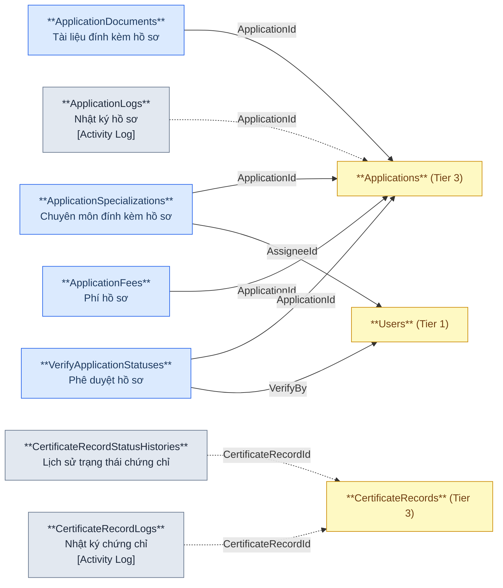

# NHNCK — HLD Tier 4: Phụ thuộc Tier 3

> **Phụ thuộc Tier 1:** Regulatory Authority Officer
> **Phụ thuộc Tier 3:** Securities Practitioner License Application, Securities Practitioner License Certificate Document, Securities Practitioner License Application Verification Status (circular)
>
> **Thiết kế theo:** [NHNCK_HLD_Overview.md](NHNCK_HLD_Overview.md)

---

## 6a. Bảng tổng quan BCV Concept

| BCV Core Object | BCV Concept | Category | Source Table | Mô tả bảng nguồn | Atomic Entity | BCV Term |
|---|---|---|---|---|---|---|
| Documentation | [Documentation] Education Certificate | Education Certificate | ApplicationSpecializations | Chứng chỉ/chuyên môn đào tạo đính kèm trong hồ sơ đăng ký | Securities Practitioner License Application Education Certificate Document | Education Certificate — cấu trúc trường: Specialization Type Code, file đính kèm (Name/Path/Format/Size), Appraisal Status Code, Appraised By Officer FK. FK đến License Application (Tier 3) và Officer (Tier 1). |
| Documentation | [Documentation] Supporting Documentation | Supporting Documentation | ApplicationDocuments | Tài liệu vật lý đính kèm trong hồ sơ đăng ký | Securities Practitioner License Application Document Attachment | Supporting Documentation — cấu trúc trường: tên file, đường dẫn, định dạng, kích thước. FK đến License Application (Tier 3). |
| Business Activity | ETL Pattern — Activity Log | Business Activity Log | ApplicationLogs | Nhật ký thay đổi trạng thái/nội dung hồ sơ — không có business key nghiệp vụ độc lập | Securities Practitioner License Application Processing Activity Log | ETL Pattern Activity Log — cấu trúc trường: FK đến License Application (Tier 3), action, timestamp, user. |
| Transaction | [Event] Transaction | Transaction | ApplicationFees | Phí thực tế phát sinh cho hồ sơ (phí nộp hồ sơ, phí cấp CCHN...) | Securities Practitioner License Application Fee | Transaction — *"Identifies an Event that is a transfer of value between parties."* Phân biệt với Examination Assessment Fee (Condition — biểu phí quy định). Đây là phí thực tế phát sinh từng hồ sơ. Cấu trúc trường: Fee Type Code, Fee Amount (Currency Amount), Payment Status Code. FK đến License Application (Tier 3). |
| Business Activity | [Business Activity] Approval Activity | Approval Activity | VerifyApplicationStatuses | Yêu cầu phê duyệt hồ sơ tại 1 cấp (LĐCM hoặc LĐUB) | Securities Practitioner License Application Verification Status | Approval Activity — cấu trúc trường: Verification Level Code (LĐCM/LĐUB), Verification Status Code, Verified By Officer FK, Verified Timestamp, Rejection Reason. FK đến License Application (Tier 3) và Officer (Tier 1). Được FK ngược lại từ License Application (InfoVerifyId — FK hai chiều để biết verification hiện tại). |
| Business Activity | ETL Pattern — Activity Log | Activity Log | CertificateRecordStatusHistories | Lịch sử thay đổi trạng thái chứng chỉ hành nghề | Securities Practitioner License Certificate Document Status History | ETL Pattern Activity Log — cấu trúc trường: FK đến Certificate Document (Tier 3), trạng thái cũ/mới, timestamp. |
| Business Activity | ETL Pattern — Activity Log | Activity Log | CertificateRecordLogs | Nhật ký hoạt động trên chứng chỉ hành nghề | Securities Practitioner License Certificate Document Activity Log | ETL Pattern Activity Log — cấu trúc trường: FK đến Certificate Document (Tier 3), action, timestamp, user. |

---

## 6b. Diagram Source (Mermaid)

---

## 6c. Diagram Atomic (Mermaid)

```mermaid
graph TD
    classDef atomic fill:#dcfce7,stroke:#16a34a,color:#14532d
    classDef pattern fill:#e2e8f0,stroke:#64748b,color:#1e293b
    classDef outscope fill:#fef9c3,stroke:#ca8a04,color:#713f12

    APPTRAIN["**License Application\nEducation Certificate Document**\n[Documentation] Education Certificate\nApplicationSpecializations"]:::atomic
    APPDOC["**License Application\nDocument Attachment**\n[Documentation] Supporting Documentation\nApplicationDocuments"]:::atomic
    APPLOG["**License Application\nProcessing Activity Log**\nActivity Log Pattern\nApplicationLogs"]:::pattern
    APPFEE["**License Application Fee**\n[Event] Transaction\nApplicationFees"]:::atomic
    VERIFY["**License Application\nVerification Status**\n[Business Activity] Approval Activity\nVerifyApplicationStatuses"]:::atomic
    CERTSTATH["**Certificate Document\nStatus History**\nActivity Log Pattern\nCertificateRecordStatusHistories"]:::pattern
    CERTLOG["**Certificate Document\nActivity Log**\nActivity Log Pattern\nCertificateRecordLogs"]:::pattern

    APP["**License Application** (Tier 3)"]:::outscope
    CERTDOC["**License Certificate Document** (Tier 3)"]:::outscope
    OFFICER["**Regulatory Authority Officer** (Tier 1)"]:::outscope

    APPTRAIN -->|"License Application FK"| APP
    APPTRAIN -->|"Appraised By Officer FK"| OFFICER
    APPDOC -->|"License Application FK"| APP
    APPLOG -.->|"Activity of"| APP
    APPFEE -->|"License Application FK"| APP
    VERIFY -->|"License Application FK"| APP
    VERIFY -->|"Verified By Officer FK"| OFFICER
    CERTSTATH -.->|"History of"| CERTDOC
    CERTLOG -.->|"Activity of"| CERTDOC
```

---

## 6d. Danh mục & Tham chiếu

Không có bảng mới nào trong Tier 4 thuộc dạng Classification Value.

---

## 6e. Bảng chờ thiết kế

Không có bảng nào trong Tier 4 chưa đủ thông tin cột.

---

## 6f. Điểm cần xác nhận

| # | Câu hỏi | Ảnh hưởng |
|---|---|---|
| 1 | `VerifyApplicationStatuses` — quan hệ 2 chiều với `Applications.InfoVerifyId`: Application trỏ đến Verification Status hiện tại, Verification Status trỏ ngược về Application. Có thể tách thành 2 entity không? | Hiện tại giữ FK 2 chiều. Nếu cần tránh circular → xóa InfoVerifyId trên Application, lấy Verification Status hiện tại qua ETL (MAX timestamp). |
| 2 | `ApplicationFees.FeeAmount` — có currency code đi kèm không? | Nếu luôn là VND → không cần currency code. Nếu có ngoại tệ → cần thêm Currency Code. |

---

## Entities trong Tier 4

### 1. Securities Practitioner License Application Education Certificate Document
**Source:** `ApplicationSpecializations` | **BCV Concept:** [Documentation] Education Certificate | **BCO:** Documentation

**Grain:** 1 dòng = 1 chứng chỉ/chuyên môn đào tạo đính kèm trong hồ sơ.

**Attributes chính:** License Application FK, Specialization Type Code, Documentation Item File (Name/Path/Format/Size), Appraisal Status Code, Appraised By Officer FK (Id + Code), Appraised Timestamp.

---

### 2. Securities Practitioner License Application Document Attachment
**Source:** `ApplicationDocuments` | **BCV Concept:** [Documentation] Supporting Documentation | **BCO:** Documentation

**Grain:** 1 dòng = 1 tài liệu vật lý đính kèm trong hồ sơ.

**FK đi ra:** Securities Practitioner License Application (Tier 3).

---

### 3. Securities Practitioner License Application Processing Activity Log
**Source:** `ApplicationLogs` | **BCV Concept:** ETL Pattern — Activity Log | **BCO:** Business Activity

**Grain:** 1 dòng = 1 sự kiện thay đổi trạng thái/nội dung hồ sơ. Không có business key nghiệp vụ độc lập.

**FK đi ra:** Securities Practitioner License Application (Tier 3).

---

### 4. Securities Practitioner License Application Fee
**Source:** `ApplicationFees` | **BCV Concept:** [Event] Transaction | **BCO:** Transaction

**Grain:** 1 dòng = 1 khoản phí thực tế phát sinh cho hồ sơ.

**Attributes chính:** Fee Type Code, Fee Amount (Currency Amount), Payment Status Code, License Application FK.

---

### 5. Securities Practitioner License Application Verification Status
**Source:** `VerifyApplicationStatuses` | **BCV Concept:** [Business Activity] Approval Activity | **BCO:** Business Activity

**Grain:** 1 dòng = 1 yêu cầu phê duyệt hồ sơ tại 1 cấp.

**Attributes chính:** License Application FK, Verification Level Code (LĐCM/LĐUB), Verification Status Code, Verified By Officer FK (Id + Code), Verified Timestamp, Rejection Reason Description.

---

### 6. Securities Practitioner License Certificate Document Status History
**Source:** `CertificateRecordStatusHistories` | **BCV Concept:** ETL Pattern — Activity Log | **BCO:** Business Activity

**Grain:** 1 dòng = 1 sự kiện thay đổi trạng thái chứng chỉ.

**FK đi ra:** Securities Practitioner License Certificate Document (Tier 3).

---

### 7. Securities Practitioner License Certificate Document Activity Log
**Source:** `CertificateRecordLogs` | **BCV Concept:** ETL Pattern — Activity Log | **BCO:** Business Activity

**Grain:** 1 dòng = 1 sự kiện hoạt động trên chứng chỉ.

**FK đi ra:** Securities Practitioner License Certificate Document (Tier 3).

---

## Attribute Summary

| Atomic Entity | # Attributes | PK | Key FKs |
|---|---|---|---|
| License Application Education Certificate Document | 16 | License Application Education Certificate Document Id | License Application (Tier 3), Officer (Tier 1) |
| License Application Document Attachment | ~8 | License Application Document Attachment Id | License Application (Tier 3) |
| License Application Processing Activity Log | ~6 | License Application Processing Activity Log Id | License Application (Tier 3) |
| License Application Fee | 11 | License Application Fee Id | License Application (Tier 3) |
| License Application Verification Status | 13 | License Application Verification Status Id | License Application (Tier 3), Officer (Tier 1) |
| License Certificate Document Status History | ~6 | License Certificate Document Status History Id | License Certificate Document (Tier 3) |
| License Certificate Document Activity Log | ~6 | License Certificate Document Activity Log Id | License Certificate Document (Tier 3) |
