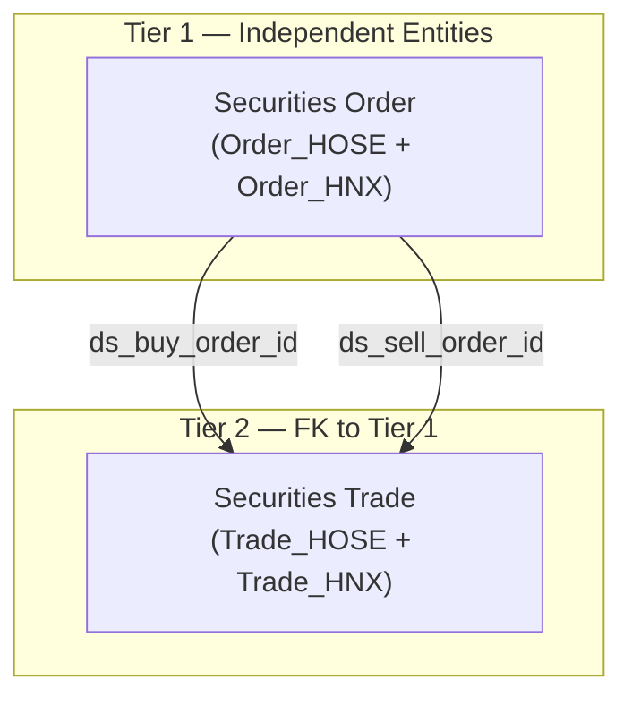
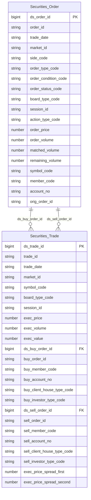

# OrderTrade HLD — Overview

**Source system:** OrderTrade (Dữ liệu lệnh giao dịch và khớp lệnh chứng khoán từ hệ thống KRX/Sở giao dịch)
**Mô tả:** Hệ thống ghi nhận toàn bộ lifecycle lệnh giao dịch (Order) và các lần khớp lệnh (Trade) trên 2 sàn HOSE và HNX. Nguồn dữ liệu cấp 1 từ hệ thống giao dịch KRX — cung cấp sự kiện lệnh mới/sửa/hủy và tick khớp lệnh theo thời gian thực.

---

## Tổng quan Atomic Entities

| Tier | Atomic Entity | BCV Core Object | BCV Concept | table_type | Source Table(s) | Ghi chú |
|---|---|---|---|---|---|---|
| T1 | Securities Order | Communication | [Communication] Financial Market Order | Fact Append | OrderTrade.Order_HOSE, OrderTrade.Order_HNX | Gộp 2 sàn — phân biệt bằng market_id |
| T2 | Securities Trade | Transaction | [Transaction] Financial Market Transaction | Fact Append | OrderTrade.Trade_HOSE, OrderTrade.Trade_HNX | Gộp 2 sàn; FK đến Securities Order (x2: mua + bán) |

**Tổng: 2 Atomic entities** (1 Tier 1, 1 Tier 2)

---

## Diagram Phân tầng Dependencies (Mermaid)

---

## Quyết định thiết kế chính

| # | Quyết định | Lý do |
|---|---|---|
| D-01 | Gộp Order_HOSE + Order_HNX thành 1 entity `Securities Order` | Cùng grain (1 event lệnh), cùng BCV concept, >80% trường trùng. Phân biệt sàn bằng market_id |
| D-02 | Gộp Trade_HOSE + Trade_HNX thành 1 entity `Securities Trade` | Cùng grain (1 lần khớp), cùng BCV concept. Trường đặc thù HNX (Spread legs) nullable |
| D-03 | `Securities Trade` có 2 FK đến `Securities Order` (mua + bán) | Trade mang thông tin đồng thời 2 bên; denormalize member_code + account_no bên mua/bán trực tiếp lên Trade |
| D-04 | Bỏ derived/estimated fields: Order Price-LTP, Matched Ratio, Buy Up/Sell Down, Expected execution price/volume, New High/Low Price | Có thể tính lại từ confirmed fields; không lưu intermediate calculation trên Atomic |
| D-05 | BCV Concept cho Securities Order = `[Communication] Financial Market Order` | BCV thiết kế 2 concept độc lập: Financial Market Order (Pending Instruction) và Financial Market Transaction (Execution Result). Order_HOSE/HNX lưu lifecycle của **instruction** nên dùng Financial Market Order; Trade_HOSE/HNX lưu khớp lệnh confirmed nên dùng Financial Market Transaction. Không có quan hệ trực tiếp giữa 2 concept trong BCV term_relationships. |

---

## 7a. Bảng tổng quan Atomic entities

| Tier | BCV Core Object | BCV Concept | Category | Source Table | Mô tả bảng nguồn | Atomic Entity | BCV Term |
|---|---|---|---|---|---|---|---|
| T1 | Communication | [Communication] Financial Market Order | Communication | OrderTrade.Order_HOSE | Sổ lệnh HOSE — lifecycle event của từng lệnh giao dịch (mới/sửa/hủy) trên sàn HOSE | Securities Order | Financial Market Order — Pending Instruction yêu cầu thực hiện giao dịch. BCV không có quan hệ trực tiếp với Financial Market Transaction; 2 concept độc lập. Chọn Financial Market Order vì đối tượng trung tâm là instruction (lệnh), không phải giao dịch khớp. |
| T1 | Communication | [Communication] Financial Market Order | Communication | OrderTrade.Order_HNX | Sổ lệnh HNX — tương đương Order_HOSE cho sàn HNX/UPCOM/phái sinh | Securities Order | Gộp chung với Order_HOSE — cùng BCV concept, cùng entity |
| T2 | Transaction | [Transaction] Financial Market Transaction | Transaction | OrderTrade.Trade_HOSE | Sổ khớp HOSE — từng lần khớp lệnh thành công, chứa thông tin bên mua và bên bán | Securities Trade | Financial Market Transaction — sự kiện khớp là điều chỉnh nắm giữ thực tế |
| T2 | Transaction | [Transaction] Financial Market Transaction | Transaction | OrderTrade.Trade_HNX | Sổ khớp HNX — tương đương Trade_HOSE, bổ sung Spread trade legs cho phái sinh/repo | Securities Trade | Gộp chung với Trade_HOSE — cùng BCV concept, cùng entity |

## 7b. Diagram Atomic tổng (Mermaid)

## 7c. Bảng Classification Value

| Source Table | Mô tả | BCV Term | Xử lý Atomic |
|---|---|---|---|
| Order_HOSE.Market ID / Order_HNX.Market ID | Mã thị trường KRX | Market Identifier | Classification Value scheme `ORDERTRADE_MARKET_ID` |
| Order_HOSE.Board Type / Order_HNX.Board ID | Loại bảng giao dịch | Board Type | Classification Value scheme `ORDERTRADE_BOARD_TYPE` |
| Order_HOSE.Session / Order_HNX.Session ID | Phiên giao dịch | Trading Session | Classification Value scheme `ORDERTRADE_SESSION` |
| Order_HOSE.Modify/Cancel / Order_HNX.Replace/cancel classification code | Loại action lệnh | Order Action Type | Classification Value scheme `ORDERTRADE_ORDER_ACTION_TYPE` |
| Order_HOSE.Order Type / Order_HNX.Order Type Code | Loại lệnh theo giá | Order Type | Classification Value scheme `ORDERTRADE_ORDER_TYPE` |
| Order_HOSE.Order Condition / Order_HNX.Order Condition Code | Điều kiện khớp lệnh | Order Condition | Classification Value scheme `ORDERTRADE_ORDER_CONDITION` |
| Order_HOSE.Order Status | Trạng thái lệnh | Order Status | Classification Value scheme `ORDERTRADE_ORDER_STATUS` |
| Order_HOSE.Client/House Classification Code | Phân loại giao dịch Client/House | Client House Classification | Classification Value scheme `ORDERTRADE_CLIENT_HOUSE_TYPE` |
| Order_HOSE.Invest Type / Order_HNX.Investor Classification Code | Loại hình nhà đầu tư | Investor Type | Classification Value scheme `ORDERTRADE_INVESTOR_TYPE` |
| Order_HOSE.Foreigner Investor type / Order_HNX.Foreign Investor Type Code | Phân loại NĐT nước ngoài | Foreign Investor Type | Classification Value scheme `ORDERTRADE_FOREIGN_INVESTOR_TYPE` |
| Order_HOSE.Short Sell Indicator | Phân loại lệnh bán khống | Short Sell Type | Classification Value scheme `ORDERTRADE_SHORT_SELL_TYPE` |
| Order_HNX.Automated Cancel Processing Classification | Lý do tự động hủy lệnh KRX | Auto Cancel Reason | Classification Value scheme `ORDERTRADE_AUTO_CANCEL_REASON` |
| Order_HNX.Quote Request Type | Loại yêu cầu báo giá RFQ | Quote Request Type | Classification Value scheme `ORDERTRADE_QUOTE_REQUEST_TYPE` |

## 7d. Junction Tables

*(Không có pure junction table trong scope OrderTrade)*

## 7e. Điểm cần xác nhận

| # | Tier | Câu hỏi | Ảnh hưởng |
|---|---|---|---|
| 1 | T1 | Order_HOSE và Order_HNX có được gộp thành 1 entity `Securities Order` không? | Nếu không gộp → tạo 2 entity riêng, tăng complexity join ở Gold |
| 2 | T1 | `Investor Type` HOSE (8000/7000...) và `Investor Classification Code` HNX (1000/2000...) — cùng hay khác bộ giá trị? | Nếu khác → cần 2 scheme code riêng hoặc 1 scheme với mapping |
| 3 | T1 | HNX không có trường `Order Status` tường minh — có ETL derive từ action code không? | Ảnh hưởng thiết kế cột `order_status_code` trên entity gộp |
| 4 | T1 | Các derived/estimated fields (Order Price-LTP, Matched Ratio, Expected execution) — có cần lên Atomic không? | Nếu cần → thêm vào LLD; đề xuất bỏ |
| 5 | T2 | FK `ds_buy_order_id`/`ds_sell_order_id` nullable khi Order không resolve được — có chấp nhận không? | Ảnh hưởng data quality rule và ETL logic |
| 6 | T2 | `exec_price_vs_ltp` (chênh lệch giá khớp vs LTP) có cần lên Atomic không? | Metric hữu ích cho giám sát thị trường — nếu có thì thêm vào LLD Securities Trade |

## 7f. Bảng ngoài scope

| Nhóm | Source Table | Mô tả bảng nguồn | Lý do ngoài scope |
|---|---|---|---|

*(Không có bảng nào ngoài scope — tất cả 4 bảng nguồn đều được thiết kế thành Atomic entity)*

<!--
GRAIN: 1 dòng = 1 bảng nguồn. KHÔNG gộp `table1, table2`.
GROUP: dùng từ danh sách chuẩn (xem reference/group_classification.md).
-->
