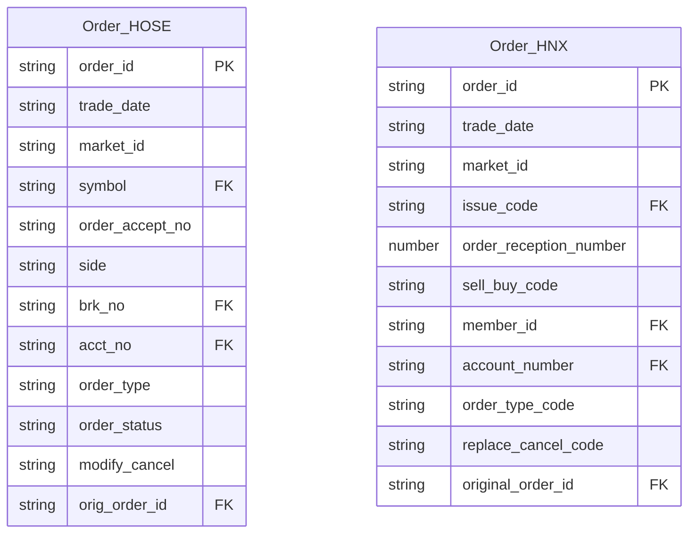
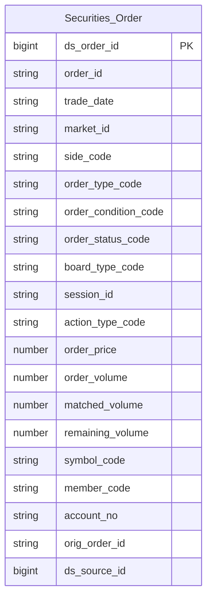

# OrderTrade HLD — Tier 1

**Source system:** OrderTrade (Dữ liệu lệnh giao dịch và khớp lệnh chứng khoán từ hệ thống KRX/Sở giao dịch)
**Tier 1:** Các entity độc lập — lệnh giao dịch chứng khoán trên HOSE và HNX. Không FK đến bảng nghiệp vụ nào trong scope OrderTrade.

---

## 6a. Bảng tổng quan BCV Concept

| BCV Core Object | BCV Concept | Category | Source Table | Mô tả bảng nguồn | Atomic Entity | table_type | BCV Term |
|---|---|---|---|---|---|---|---|
| Communication | [Communication] Financial Market Order | Communication | Order_HOSE | Sổ lệnh HOSE — ghi nhận toàn bộ lifecycle của từng lệnh giao dịch trên sàn HOSE (mới/sửa/hủy). Mỗi bản ghi là một event trong vòng đời lệnh. | Securities Order | Fact Append | (1) **Financial Market Order** (Communication): BCV định nghĩa là "Pending Instruction yêu cầu thực hiện giao dịch trong Financial Market Instrument khi điều kiện được đáp ứng". (2) Cấu trúc trường xác nhận: có Order Type (Market/Limit/Stop), Side (B/S), Order Price, Order VOL, Order Status, Modify/Cancel — đây là lifecycle event của lệnh đặt mua/bán. Bảng lưu cả trạng thái khớp tích lũy nhưng **đối tượng trung tâm vẫn là lệnh (instruction)**, không phải giao dịch khớp. (3) BCV không có quan hệ trực tiếp giữa Financial Market Order và Financial Market Transaction; mối liên hệ chỉ gián tiếp qua Financial Market Component Movement. Chọn **`[Communication] Financial Market Order`** vì Order_HOSE lưu lifecycle của **instruction** — từ pending → matched/cancelled/rejected. |
| Communication | [Communication] Financial Market Order | Communication | Order_HNX | Sổ lệnh HNX — tương đương Order_HOSE cho sàn HNX/UPCOM/phái sinh. Có thêm Iceberg order và Stop order theo chuẩn KRX. | Securities Order | Fact Append | Cùng BCV concept với Order_HOSE — gộp chung entity vì cùng grain (1 sự kiện lệnh), cùng concept, cấu trúc tương đồng. Phân biệt sàn bằng market_id. |

> **Quyết định gộp**: Order_HOSE và Order_HNX có cùng grain, cùng BCV concept, cấu trúc tương đồng (>80% trường trùng nhau). Gộp thành 1 entity **Securities Order** với `market_id` phân biệt sàn. Các trường đặc thù HNX (Iceberg: public_quantity; Stop order: condition_price; RFQ: quote_request_type_code) giữ lại trên entity, nullable khi không áp dụng.

---

## 6b. Diagram Source (Mermaid)

> Hai bảng không FK đến nhau — chỉ FK nội bộ (lệnh gốc khi sửa/hủy). FK outbound đến Instrument, Member, Account là FK suy luận đến entity ngoài scope OrderTrade.

---

## 6c. Diagram Atomic (Mermaid)

> `Securities Order` là Fact Append — mỗi dòng là 1 sự kiện (lệnh mới/sửa/hủy). Không có entity cha trong Tier 1.

---

## 6d. Mục Danh mục & Tham chiếu (Reference Data)

| Source Field / Bảng | Mô tả | Scheme Code | source_type | Ghi chú |
|---|---|---|---|---|
| Order_HOSE.Market ID / Order_HNX.Market ID | Mã thị trường: STO/BDO/RPO (HOSE), STX/UPX/BDX/DVX/HCX (HNX) | `ORDERTRADE_MARKET_ID` | source_table | Giá trị cố định theo KRX |
| Order_HOSE.Board Type / Order_HNX.Board ID | Loại bảng giao dịch: G1/G2/G3/G4/G7/G8/T1-T6/R1 | `ORDERTRADE_BOARD_TYPE` | source_table | Chuẩn KRX |
| Order_HOSE.Session / Order_HNX.Session ID | Phiên giao dịch: 00/10/20/30/40/80/90/99 | `ORDERTRADE_SESSION` | source_table | Chuẩn KRX |
| Order_HOSE.Modify/Cancel / Order_HNX.Replace/cancel classification code | Loại action lệnh: New/Replace/Cancel | `ORDERTRADE_ORDER_ACTION_TYPE` | source_table | HOSE: N/M/C; HNX: 1/2/3 — cần chuẩn hóa |
| Order_HOSE.Order Type / Order_HNX.Order Type Code | Loại lệnh theo giá: Market/Limit/Stop Market/Stop Limit | `ORDERTRADE_ORDER_TYPE` | source_table | HOSE có thêm các sub-type HNX: X=Same side limit, Y=Contrary side limit |
| Order_HOSE.Order Condition / Order_HNX.Order Condition Code | Điều kiện khớp: FAS/GTC/ATO/FAK/FOK/GTD/ATC/MTL | `ORDERTRADE_ORDER_CONDITION` | source_table | Chuẩn KRX, 2 sàn dùng cùng bộ giá trị |
| Order_HOSE.Order Status | Trạng thái lệnh: New/Partial Fill/Filled/Cancelled/Rejected/Expired/Pending Cancel/Replaced | `ORDERTRADE_ORDER_STATUS` | source_table | Chỉ có tường minh trên HOSE; HNX không có trường riêng |
| Order_HOSE.Client/House Classification Code / Order_HNX.Client/House Classification Code | Phân loại giao dịch: 10=Client/30=House | `ORDERTRADE_CLIENT_HOUSE_TYPE` | source_table | Dùng chung 2 sàn |
| Order_HOSE.Invest Type / Order_HNX.Investor Classification Code | Loại hình nhà đầu tư | `ORDERTRADE_INVESTOR_TYPE` | source_table | HOSE: 4 chữ số (8000/7000/3000...); HNX: 4 chữ số (1000/2000/3000...) — cần profile mapping |
| Order_HOSE.Foreigner Investor type / Order_HNX.Foreign Investor Type Code | Phân loại NĐT nước ngoài: 00/10/20 | `ORDERTRADE_FOREIGN_INVESTOR_TYPE` | source_table | Dùng chung 2 sàn |
| Order_HOSE.Short Sell Indicator | Phân loại bán khống: 00=Bình thường/10=Bán khống | `ORDERTRADE_SHORT_SELL_TYPE` | source_table | Chỉ có trên HOSE |
| Order_HNX.Automated Cancel Processing Classification | Lý do tự động hủy: 0/1/2/3/4/5 | `ORDERTRADE_AUTO_CANCEL_REASON` | source_table | Chỉ có trên HNX |
| Order_HNX.Quote Request Type | Loại yêu cầu báo giá RFQ: 1/2/3/4 | `ORDERTRADE_QUOTE_REQUEST_TYPE` | source_table | Chỉ có trên HNX — thị trường phái sinh/repo |

---

## 6e. Bảng chờ thiết kế

*(Để trống — tất cả 2 bảng Tier 1 đã có cột đầy đủ)*

---

## 6f. Điểm cần xác nhận

| # | Câu hỏi | Kết quả |
|---|---|---|
| T1-01 | Order_HOSE và Order_HNX có cấu trúc tương đồng nhưng không hoàn toàn giống nhau. Quyết định gộp thành 1 entity `Securities Order` có được chấp nhận không? | Chờ xác nhận — đề xuất gộp vì >80% trường trùng, phân biệt sàn bằng market_id |
| T1-02 | `Investor Type` (HOSE 4 chữ số: 8000/7000/3000...) và `Investor Classification Code` (HNX: 1000/2000/3000...) — 2 bộ giá trị khác nhau hay cùng bộ giá trị cần mapping? | Cần profile data — nếu 2 bộ khác nhau thì cần 2 scheme code riêng |
| T1-03 | `Order Status` chỉ tường minh trên HOSE (0-8). HNX không có trường Order Status riêng — trạng thái lệnh được suy ra từ replace/cancel_code và các trường khác. Có thiết kế thêm cột `order_status_code` cho HNX bằng ETL logic không? | Chờ xác nhận từ BA/nguồn — nếu có thể ETL derive thì giữ 1 trường chung |
| T1-04 | Các trường derived/estimated (Order Price-LTP, Matched Ratio, Buy Up/Sell Down Amt, Expected execution price/volume) — có map lên Atomic không? | Đề xuất bỏ các derived field (có thể tính lại từ field gốc); chỉ giữ Execution Price và Matched VOL là confirmed value |
| T1-05 | `Icd-Bug Qty` (HOSE) là khối lượng điều chỉnh lỗi operational — có nằm trong scope Atomic không? | Đề xuất ngoài scope — operational field |
