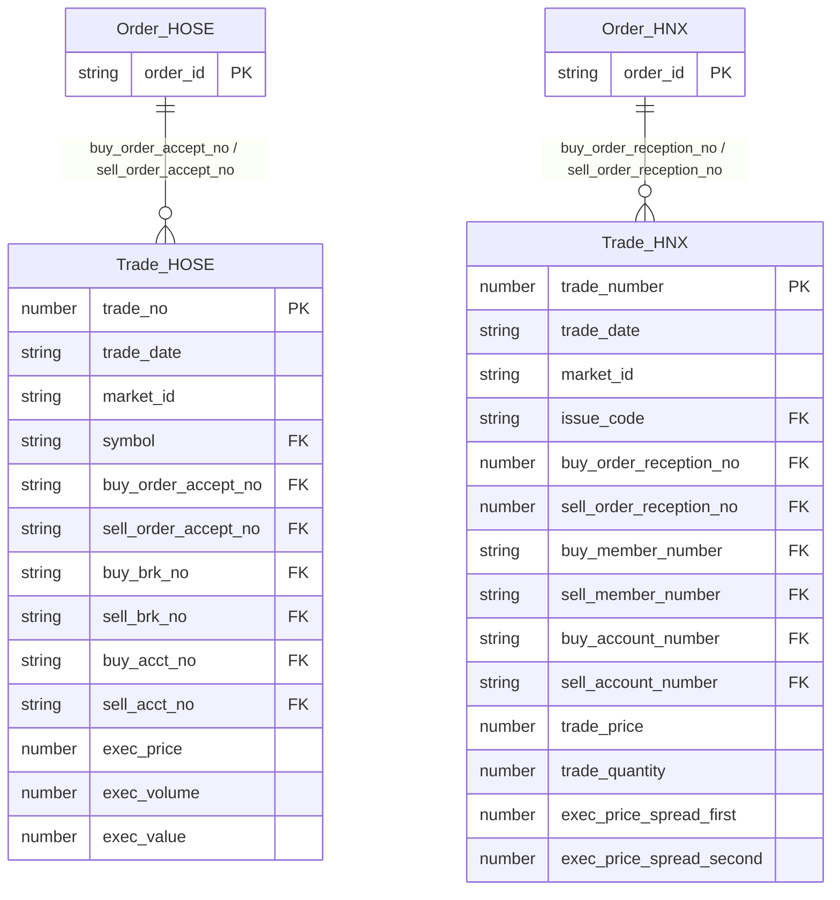
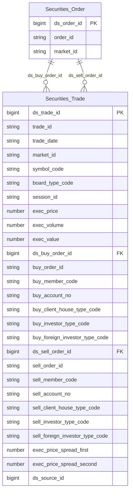

# OrderTrade HLD — Tier 2

**Source system:** OrderTrade (Dữ liệu lệnh giao dịch và khớp lệnh chứng khoán từ hệ thống KRX/Sở giao dịch)
**Tier 2:** Giao dịch khớp lệnh — FK đến Securities Order (Tier 1). Trade_HOSE và Trade_HNX.

---

## 6a. Bảng tổng quan BCV Concept

| BCV Core Object | BCV Concept | Category | Source Table | Mô tả bảng nguồn | Atomic Entity | table_type | BCV Term |
|---|---|---|---|---|---|---|---|
| Transaction | [Transaction] Financial Market Transaction | Transaction | Trade_HOSE | Sổ khớp HOSE — ghi nhận từng lần khớp lệnh thành công. Mỗi bản ghi chứa đồng thời thông tin bên mua và bên bán. 1 Order có thể tạo nhiều Trade. | Securities Trade | Fact Append | (1) **Financial Market Transaction** (Transaction): BCV định nghĩa là "giao dịch thể hiện việc điều chỉnh tỷ lệ nắm giữ trong Công cụ thị trường tài chính; ví dụ mua cổ phần". (2) Cấu trúc trường xác nhận: có Exec Price (giá khớp confirmed), Exec Volume, Value (giá trị tiền tệ thực tế), Buy/Sell Order Accept# (FK 2 chiều về lệnh mua/bán), Trade# (ID duy nhất từ KRX) — đây là sự kiện khớp thực tế, không phải instruction. (3) Chọn **`[Transaction] Financial Market Transaction`** — khớp hoàn toàn với grain "1 lần điều chỉnh nắm giữ CK". |
| Transaction | [Transaction] Financial Market Transaction | Transaction | Trade_HNX | Sổ khớp HNX — tương đương Trade_HOSE cho sàn HNX. Bổ sung Spread trade legs (giá Leg1/Leg2) cho giao dịch phái sinh/repo 2 vế. | Securities Trade | Fact Append | Cùng BCV concept với Trade_HOSE — gộp chung entity vì cùng grain (1 lần khớp), cùng concept, cấu trúc tương đồng. Trường đặc thù HNX (Spread First/Second) giữ lại, nullable khi không áp dụng. |

> **Quyết định gộp**: Trade_HOSE và Trade_HNX cùng grain (1 sự kiện khớp), cùng concept, cấu trúc tương đồng. Gộp thành 1 entity **Securities Trade**. Trường đặc thù HNX: `exec_price_spread_first`, `exec_price_spread_second`, `sell_quote_request_code`, `buy_quote_request_code`.

---

## 6b. Diagram Source (Mermaid)

---

## 6c. Diagram Atomic (Mermaid)

> `Securities Trade` có 2 FK đến `Securities Order` (bên mua và bên bán). Các trường thông tin NĐT bên mua/bán được denormalize trên Trade (snapshot tại thời điểm khớp — không join sang Account/Member).

---

## 6d. Mục Danh mục & Tham chiếu (Reference Data)

| Source Field / Bảng | Mô tả | Scheme Code | source_type | Ghi chú |
|---|---|---|---|---|
| Trade_HOSE.Market ID / Trade_HNX.Market ID | Mã thị trường | `ORDERTRADE_MARKET_ID` | source_table | Dùng chung scheme đã đăng ký Tier 1 |
| Trade_HOSE.Board Type / Trade_HNX.Board ID | Loại bảng giao dịch | `ORDERTRADE_BOARD_TYPE` | source_table | Dùng chung scheme đã đăng ký Tier 1 |
| Trade_HOSE.Session / Trade_HNX.Session ID | Phiên giao dịch | `ORDERTRADE_SESSION` | source_table | Dùng chung scheme đã đăng ký Tier 1 |
| Trade_HOSE.Buy/Sell - Client/House Classification Code | Phân loại Client/House bên mua và bán | `ORDERTRADE_CLIENT_HOUSE_TYPE` | source_table | Dùng chung scheme đã đăng ký Tier 1 |
| Trade_HOSE.Buy/Sell - Invest Type / Trade_HNX.Buy/Sell investor classification code | Loại hình NĐT bên mua và bán | `ORDERTRADE_INVESTOR_TYPE` | source_table | Dùng chung scheme đã đăng ký Tier 1 |
| Trade_HOSE.Buy/Sell - Foreigner Investor type / Trade_HNX.Buy/Sell Foreign Investor Type Code | Phân loại NĐT nước ngoài bên mua và bán | `ORDERTRADE_FOREIGN_INVESTOR_TYPE` | source_table | Dùng chung scheme đã đăng ký Tier 1 |
| Trade_HNX.Sell/Buy Quote Request Code | Loại yêu cầu báo giá RFQ bên bán/mua | `ORDERTRADE_QUOTE_REQUEST_TYPE` | source_table | Dùng chung scheme đã đăng ký Tier 1 |
| Trade_HNX.Sell/Buy Replace/cancel classification code | Loại action lệnh tại thời điểm khớp | `ORDERTRADE_ORDER_ACTION_TYPE` | source_table | Dùng chung scheme đã đăng ký Tier 1 |

---

## 6e. Bảng chờ thiết kế

*(Để trống — tất cả 2 bảng Tier 2 đã có cột đầy đủ)*

---

## 6f. Điểm cần xác nhận

| # | Câu hỏi | Kết quả |
|---|---|---|
| T2-01 | Trade có FK đến 2 Order (bên mua và bán). Trường hợp `ds_buy_order_id` hoặc `ds_sell_order_id` không tìm thấy trong Securities Order (ví dụ: lệnh không qua hệ thống UBCK) — xử lý thế nào? | Đề xuất: FK nullable, ghi `NULL` khi không resolve được; cột `buy_order_id` / `sell_order_id` vẫn giữ business key gốc |
| T2-02 | Thông tin NĐT bên mua/bán (Name, BRK, PIN, Account) có cần denormalize lên Securities Trade không? | Đề xuất denormalize `member_code` + `account_no` (đã có business key) — không cần Name vì có thể join từ Account/Member entity |
| T2-03 | Trade_HNX.Sell/Buy Replace/cancel classification code — đây là action của lệnh tại thời điểm khớp, không phải action của Trade. Có cần giữ trên Atomic không? | Chờ xác nhận nghiệp vụ — có thể dùng để xác định loại khớp (New match vs Modified match) |
| T2-04 | `Execution - Exec Price - LTP` và `Execution - New High/Low Price` (HOSE) — derived field tại thời điểm khớp. Có map lên Atomic không? | Đề xuất giữ `exec_price_vs_ltp` (chênh lệch giá khớp vs LTP) là metric hữu ích cho giám sát; bỏ New High/Low Price (derived) |
