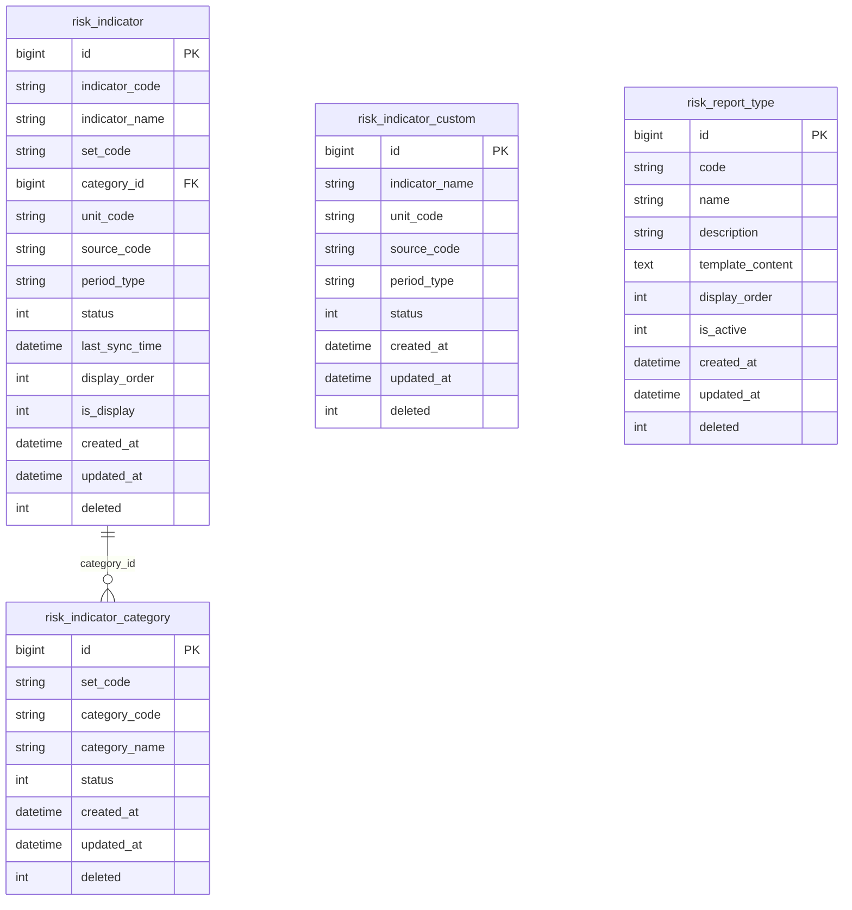
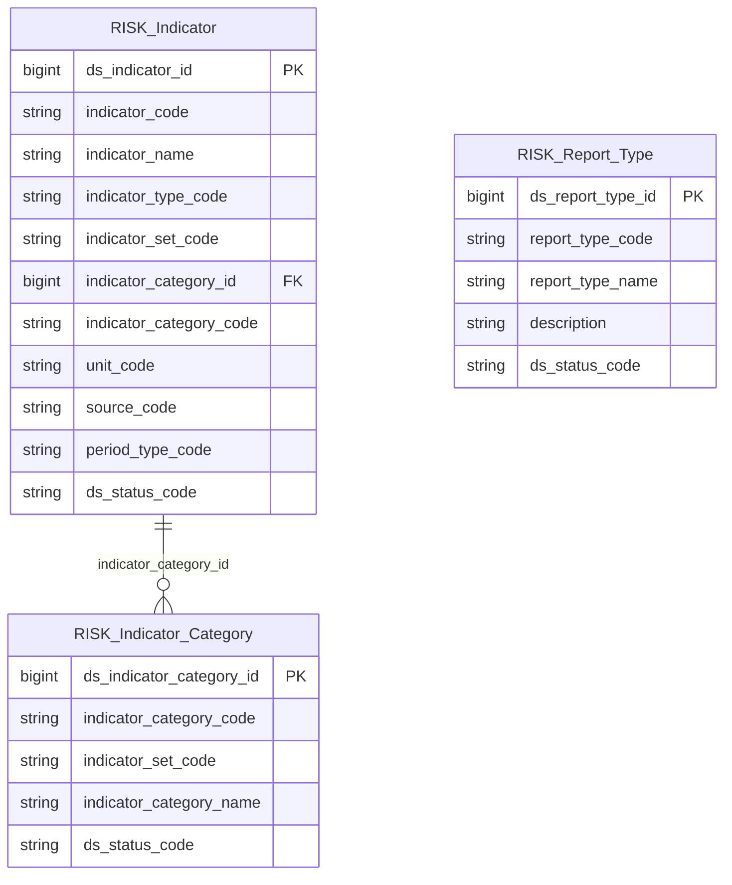

# Risk HLD — Tier 1

**Source system:** Risk (Quản lý Rủi ro)  
**Mô tả:** Hệ thống quản lý chỉ tiêu tài chính rủi ro (trong nước & quốc tế), cảnh báo tự động khi chỉ tiêu vượt ngưỡng, và báo cáo định kỳ của UBCKNN.  
**Tier 1:** Các entity độc lập — không FK đến bảng nghiệp vụ khác trong scope QLRR.

---

## 6a. Bảng tổng quan BCV Concept

| BCV Core Object | BCV Concept | Category | Source Table | Mô tả bảng nguồn | Atomic Entity | table_type | BCV Term |
|---|---|---|---|---|---|---|---|
| Common | [Common] Classification | Common | risk_indicator_category | Nhóm chỉ tiêu trong 1 bộ (Yếu tố vĩ mô, Yếu tố tiền tệ, Thị trường cổ phiếu, …) | Risk Indicator Category | Fundamental | BCV không có term riêng cho "indicator category" — đây là danh mục phân loại nhóm chỉ tiêu, chỉ có category_code + category_name + set_code, không có instance data nghiệp vụ. Về bản chất đây là **reference data set phân loại nhóm chỉ tiêu**. Tuy nhiên bảng này có lifecycle (status active/inactive) và là FK từ risk_indicator → có giá trị là entity độc lập Tier 1. BCV Core Object = Common (Classification). Đặt tên `Risk Indicator Category`. **Chốt T1-02:** category_code unique globally — không cần phân biệt theo set_code ở cấp entity. set_code chỉ là attribute bổ sung. |
| Common | [Common] Classification | Common | risk_indicator + risk_indicator_custom | Danh mục chỉ tiêu tài chính hệ thống và tự tạo | Risk Indicator | Fundamental | **Gộp 2 bảng** risk_indicator (chỉ tiêu hệ thống) và risk_indicator_custom (chỉ tiêu tự tạo). Cấu trúc tương đồng (indicator_name, unit_code, source_code, period_type, status). Khác biệt: chỉ tiêu hệ thống có indicator_code và category_id; chỉ tiêu tự tạo không có. Dùng Classification Value `indicator_type` (1=Hệ thống / 2=Tự tạo) phân biệt. indicator_category_id nullable (chỉ tiêu tự tạo không có category). BCV term: không có term chuyên biệt cho "financial risk indicator" — gần nhất là "Classification" trong Common vì đây là danh mục tham chiếu master. |
| Documentation | [Documentation] Regulatory Report | Documentation | risk_report_type | Danh mục loại báo cáo | Risk Report Type | Fundamental | BCV term **Regulatory Report**: "Identifies a Documentation that is created by a Financial Institution as part of the regulatory reporting or filing process." Bảng risk_report_type là danh mục loại báo cáo (code, name). **Chốt T1-01:** `template_content` không lưu trên Atomic — config kỹ thuật. Atomic chỉ lưu code, name, description, is_active. |

---

## 6b. Diagram Source (Mermaid)

---

## 6c. Diagram Atomic (Mermaid)

---

## 6d. Danh mục & Tham chiếu (Reference Data)

| Source Field / Bảng | Mô tả | Scheme Code | source_type | Ghi chú |
|---|---|---|---|---|
| risk_indicator.set_code (1=Trong nước, 2=Quốc tế) | Bộ chỉ tiêu trong nước / quốc tế | `RISK_INDICATOR_SET` | etl_derived | Chỉ có 2 giá trị cố định |
| risk_indicator.unit_code (1=%, 2=Điểm, …10) | Đơn vị đo lường chỉ tiêu | `RISK_UNIT` | source_table: risk_indicator.unit_code | Dùng chung cho indicator, alert_config, alert |
| risk_indicator.source_code (1=Investing, …6=VSDC) | Nguồn dữ liệu chỉ tiêu | `RISK_DATA_SOURCE` | source_table: risk_indicator.source_code | Dùng chung cho indicator và indicator_value |
| risk_indicator.period_type (1=Ngày, 2=Tháng, 3=Quý, 4=Năm) | Tần suất chỉ tiêu | `RISK_PERIOD_TYPE` | etl_derived | Dùng chung cho indicator, indicator_value, indicator_schedule |
| risk_indicator.indicator_type (derived: hệ thống/tự tạo) | Phân loại chỉ tiêu sau gộp | `RISK_INDICATOR_TYPE` | etl_derived | 1=Hệ thống (risk_indicator), 2=Tự tạo (risk_indicator_custom) |
| risk_indicator_category.set_code | Attribute bổ sung — không dùng làm phân biệt entity | *(dùng chung RISK_INDICATOR_SET)* | etl_derived | category_code unique globally, set_code chỉ là thông tin mô tả |
| risk_indicator_value.data_origin (1=API CSDL, 2=User chỉnh sửa) | Nguồn gốc giá trị chỉ tiêu | `RISK_DATA_ORIGIN` | etl_derived | |
| risk_report_type.is_active | *(trường Boolean, không cần scheme riêng)* | — | — | |

---

## 6e. Bảng chờ thiết kế

*(Không có bảng nào trong Tier 1 chưa có cấu trúc trường)*

---

## 6f. Điểm cần xác nhận

*(Tất cả điểm cần xác nhận Tier 1 đã được chốt.)*

| # | Câu hỏi | Kết quả |
|---|---|---|
| T1-01 | `risk_report_type.template_content` có lưu trên Atomic không? | **Không lưu** — config kỹ thuật. |
| T1-02 | `risk_indicator_category.category_code` unique globally hay chỉ trong set? | **Unique globally** — không cần phân biệt theo set_code. |
