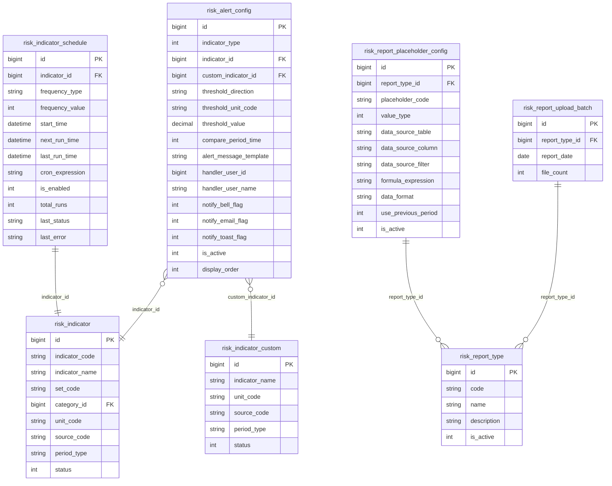
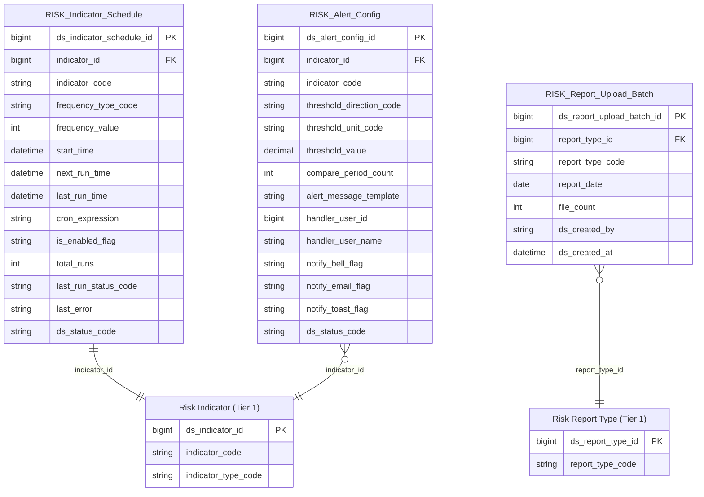

# Risk HLD — Tier 2

**Source system:** Risk (Quản lý Rủi ro)  
**Tier 2:** Entity phụ thuộc Tier 1 — có FK đến Risk Indicator hoặc Risk Report Type.

---

## 6a. Bảng tổng quan BCV Concept

| BCV Core Object | BCV Concept | Category | Source Table | Mô tả bảng nguồn | Atomic Entity | table_type | BCV Term |
|---|---|---|---|---|---|---|---|
| Condition | [Condition] Criterion | Condition | risk_indicator_schedule | Cấu hình job đồng bộ chỉ tiêu | Risk Indicator Schedule | Fundamental | BCV term **Criterion** (ID 8945): "Identifies a Condition that specifies a characteristic used as a basis of judgment." Bảng risk_indicator_schedule lưu cấu hình lịch chạy job (frequency_type, cron_expression, next_run_time) — đây là quy tắc/điều kiện chạy đồng bộ, không phải sự kiện phát sinh. Gần hơn với Criterion hơn là Arrangement vì không có 2 bên tham gia thoả thuận. Grain: 1 dòng = 1 chỉ tiêu (1-1 với Risk Indicator). table_type = Fundamental vì có lifecycle riêng (is_enabled, last_status). |
| Condition | [Condition] Criterion | Condition | risk_alert_config | Cấu hình ngưỡng cảnh báo và người xử lý theo từng chỉ tiêu | Risk Alert Config | Fundamental | BCV term **Criterion** (ID 8945): quy tắc/tiêu chí xác định ngưỡng cảnh báo (threshold_direction, threshold_value, compare_period_time). Đây là cấu hình nghiệp vụ — định nghĩa điều kiện kích hoạt alert. Không phải Condition Financial Charge (không phải biểu phí). Grain: 1 dòng = 1 cấu hình ngưỡng cho 1 chỉ tiêu. FK → Risk Indicator (sau gộp, chỉ còn 1 FK). |
| Documentation | [Documentation] Regulatory Report | Documentation | risk_report_placeholder_config | Cấu hình "đục lỗ" — mapping placeholder trong template báo cáo | *(Ngoài scope Atomic)* | — | Đây là cấu hình kỹ thuật (data_source_table, formula_expression) — không có giá trị nghiệp vụ độc lập. Chốt không lưu trên Atomic. |

---

## 6b. Diagram Source (Mermaid)

---

## 6c. Diagram Atomic (Mermaid)

---

## 6d. Danh mục & Tham chiếu (Reference Data)

| Source Field | Mô tả | Scheme Code | source_type |
|---|---|---|---|
| risk_indicator_schedule.frequency_type (1=Giờ, 2=Ngày, 3=Tháng, 4=Quý, 5=Năm) | Tần suất chạy job | `RISK_JOB_FREQUENCY_TYPE` | etl_derived |
| risk_indicator_schedule.last_status (SUCCESS/FAILED) | Kết quả lần chạy gần nhất | `RISK_JOB_RUN_STATUS` | etl_derived |
| risk_alert_config.threshold_direction (1=Tăng, 2=Giảm, 3=Tăng/Giảm) | Chiều ngưỡng cảnh báo | `RISK_ALERT_THRESHOLD_DIRECTION` | etl_derived |
| risk_report_upload_batch (Business Activity entity) | *(gộp vào 6a)* | — | — |

---

## 6e. Bảng ngoài scope

| Source Table | Mô tả bảng nguồn | Lý do ngoài scope |
|---|---|---|
| risk_report_placeholder_config | Cấu hình placeholder kỹ thuật trong template báo cáo | Operational/system data — không có giá trị nghiệp vụ |

---

## 6f. Điểm cần xác nhận

*(Tất cả điểm cần xác nhận Tier 2 đã được chốt.)*

| # | Câu hỏi | Kết quả |
|---|---|---|
| T2-01 | `risk_alert_config.handler_user_id` — có entity User riêng không? | **Không có** — lưu denormalized (handler_user_id + handler_user_name). |
| T2-02 | Mapping FK sau gộp Indicator: indicator_type=1 → indicator_id; indicator_type=2 → custom_indicator_id, cả 2 → ds_indicator_id. | **Đúng** — confirmed. |
| T2-03 | Risk Report Upload Batch đặt Tier 2 — phù hợp, không cần thêm attribute. | **Confirmed.** |
