# SCMS HLD — Overview

**Source system:** SCMS (Securities Company Management System — Hệ thống quản lý Công ty Chứng khoán)  
**Mục đích:** Quản lý hồ sơ CTCK, báo cáo định kỳ, công bố thông tin, giám sát tuân thủ và vi phạm.

---

## 7a. Bảng tổng quan Atomic Entities

| Tier | BCV Core Object | BCV Concept | Category | Source Table | Mô tả bảng nguồn | Atomic Entity |
|---|---|---|---|---|---|---|
| 1 | Involved Party | [Involved Party] Broker Dealer | Involved Party | CTCK_THONG_TIN | Thông tin CTCK | Securities Company |
| 1 | Involved Party | [Involved Party] Organization | Involved Party | CT_KIEM_TOAN | Danh sách công ty kiểm toán | Audit Firm |
| 1 | Documentation | [Documentation] Regulatory Report | Documentation | BM_BAO_CAO | Danh sách biểu mẫu báo cáo | Report Template |
| 1 | Location | [Location] Geographic Area | Location | DM_TINH_THANH, DM_QUOC_TICH | Danh mục tỉnh thành / quốc gia (shared entity) | Geographic Area |
| 1 | Involved Party | [Involved Party] Organization Unit | Involved Party | CTCK_VP_DAI_DIEN_NN | Văn phòng đại diện của công ty nước ngoài tại VN | Foreign Representative Office |
| 2 | Involved Party | [Involved Party] Organization Unit | Involved Party | CTCK_CHI_NHANH, CTCK_VP_DAI_DIEN, CTCK_PHONG_GIAO_DICH | Chi nhánh / VPĐD / PGD của CTCK | Securities Company Organization Unit |
| 2 | Involved Party | [Involved Party] Individual | Involved Party | CTCK_NGUOI_HANH_NGHE_CK | Người hành nghề chứng khoán tại CTCK | Securities Practitioner *(shared — bổ sung source)* |
| 2 | Involved Party | [Involved Party] Individual | Involved Party | CTCK_NHAN_SU_CAO_CAP | Nhân sự cao cấp CTCK | Securities Company Senior Personnel |
| 2 | Involved Party | [Involved Party] Individual/Organization | Involved Party | CTCK_CO_DONG | Cổ đông của CTCK | Securities Company Shareholder |
| 2 | Involved Party | [Involved Party] Individual | Involved Party | CT_KIEM_TOAN_VIEN | Kiểm toán viên của CT kiểm toán | Audit Firm Practitioner |
| 2 | Documentation | [Documentation] Regulatory Report | Documentation | BM_SHEET | Sheet của biểu mẫu báo cáo | Report Template Sheet |
| 2 | Documentation | [Documentation] Regulatory Report | Documentation | BM_BAO_CAO_HANG | Hàng của biểu mẫu báo cáo | Report Template Row |
| 2 | Documentation | [Documentation] Regulatory Report | Documentation | BM_BAO_CAO_COT | Cột của biểu mẫu báo cáo | Report Template Column |
| 2 | Condition | [Condition] | Condition | BM_BAO_CAO_DINH_KY | Định kỳ gửi của biểu mẫu | Report Submission Schedule |
| 2 | Documentation | [Documentation] Regulatory Report | Documentation | DM_CHI_TIEU | Danh mục chỉ tiêu báo cáo | Report Indicator |
| 3 | Documentation | [Documentation] Regulatory Report | Documentation | BM_BAO_CAO_CT | Chỉ tiêu được gán vào biểu mẫu tại vị trí cụ thể | Report Template Indicator |
| 3 | Condition | [Condition] | Condition | BM_BAO_CAO_DINH_KY_DON_VI | Nghĩa vụ gửi báo cáo theo định kỳ cho từng đơn vị | Report Submission Obligation |
| 3 | Communication | [Event] Communication | Communication | BC_THANH_VIEN | Báo cáo định kỳ mà đơn vị đã gửi | Member Periodic Report *(shared — bổ sung source FMS+SCMS)* |
| 3 | Business Activity | [Business Activity] Conduct Violation | Business Activity | BC_VI_PHAM | Vi phạm nộp báo cáo của đơn vị | Securities Company Report Violation |
| 3 | Business Activity | [Business Activity] Conduct Violation | Business Activity | CTCK_XU_LY_HANH_CHINH | Quyết định xử lý hành chính CTCK | Securities Company Administrative Penalty |
| 3 | Business Activity | [Business Activity] | Business Activity | CBTT_BAO_CAO | Báo cáo công bố thông tin | Disclosure Report Submission |
| 3 | Business Activity | [Business Activity] | Business Activity | CBTT_CHAO_BAN_CHUNG_KHOAN | Thông tin chào bán chứng khoán được công bố | Disclosure Securities Offering |
| 3 | Business Activity | [Business Activity] | Business Activity | CBTT_CO_DONG | Thông tin cổ đông được công bố | Disclosure Shareholder Change |
| 4 | Documentation | [Documentation] Reported Information | Documentation | BC_BAO_CAO_GT | Giá trị chỉ tiêu báo cáo đã nộp | Member Report Indicator Value |
| 4 | Transaction | [Event] Transaction | Transaction | CTCK_CD_CHUYEN_NHUONG | Giao dịch chuyển nhượng cổ phần | Securities Company Shareholder Transfer |
| 4 | Involved Party | [Involved Party] Involved Party Role | Involved Party | CTCK_CD_DAI_DIEN | Người đại diện được ủy quyền bởi cổ đông | Securities Company Shareholder Representative |
| 4 | Involved Party | [Involved Party] Involved Party Relationship | Involved Party | CTCK_CD_MOI_QUAN_HE | Người có quan hệ với cổ đông | Securities Company Shareholder Related Party |

---

## 7b. Diagram Atomic tổng (Mermaid)

```mermaid
erDiagram
    GeographicArea {
        bigint geographic_area_id PK
        string geographic_area_code
        string geographic_area_name
    }
    SecuritiesCompany {
        bigint securities_company_id PK
        string securities_company_code
        string short_name
        string full_name_vi
        string company_type_code
        bigint geographic_area_id FK
        decimal charter_capital
        string status_code
    }
    AuditFirm {
        bigint audit_firm_id PK
        string audit_firm_code
        string full_name_vi
        string business_license_no
        string status_code
    }
    ReportTemplate {
        bigint report_template_id PK
        string report_template_code
        string report_template_name
        string report_type_code
        string legal_basis
        string version
        string status_code
    }
    SecuritiesCompanyOrganizationUnit {
        bigint org_unit_id PK
        bigint securities_company_id FK
        string org_unit_type_code
        bigint parent_org_unit_id FK
        bigint geographic_area_id FK
        string status_code
    }
    SecuritiesPractitioner {
        bigint securities_practitioner_id PK
        bigint securities_company_id FK
        string license_no
        date start_date
        date end_date
        string status_code
    }
    SecuritiesCompanySeniorPersonnel {
        bigint senior_personnel_id PK
        bigint securities_company_id FK
        bigint org_unit_id FK
        string position_code
        string status_code
    }
    SecuritiesCompanyShareholder {
        bigint shareholder_id PK
        bigint securities_company_id FK
        string shareholder_type_code
        decimal share_ratio
        string status_code
    }
    AuditFirmPractitioner {
        bigint audit_firm_practitioner_id PK
        bigint audit_firm_id FK
        string certificate_no
        date approval_date
        string status_code
    }
    ReportTemplateSheet {
        bigint sheet_id PK
        bigint report_template_id FK
        string sheet_code
        string report_layout_type_code
    }
    ReportTemplateRow {
        bigint row_id PK
        bigint sheet_id FK
        string row_code
        boolean is_repeatable
    }
    ReportTemplateColumn {
        bigint column_id PK
        bigint sheet_id FK
        string column_code
        boolean is_key
    }
    ReportIndicator {
        bigint indicator_id PK
        string indicator_code
        string data_type_code
        string hierarchy_code
    }
    ReportSubmissionSchedule {
        bigint schedule_id PK
        bigint report_template_id FK
        string reporting_period_type_code
        int grace_period_days
    }
    ReportTemplateIndicator {
        bigint template_indicator_id PK
        bigint report_template_id FK
        bigint indicator_id FK
        bigint column_id FK
        bigint row_id FK
        bigint sheet_id FK
        bigint input_indicator_id FK
        string formula
    }
    ReportSubmissionObligation {
        bigint obligation_id PK
        bigint schedule_id FK
        bigint securities_company_id FK
        string status_code
    }
    MemberPeriodicReport {
        bigint submission_id PK
        bigint securities_company_id FK
        bigint report_template_id FK
        bigint schedule_id FK
        date reference_date
        timestamp submission_time
        string status_code
    }
    SecuritiesCompanyReportViolation {
        bigint violation_id PK
        bigint securities_company_id FK
        date violation_date
        string violation_type_codes
    }
    SecuritiesCompanyAdministrativePenalty {
        bigint penalty_id PK
        bigint securities_company_id FK
        decimal penalty_amount
        string decision_no
        date decision_date
    }
    DisclosureReportSubmission {
        bigint disclosure_id PK
        bigint securities_company_id FK
        string disclosure_type_code
        date disclosure_date
        string status_code
    }
    DisclosureSecuritiesOffering {
        bigint offering_id PK
        bigint securities_company_id FK
        date offering_start_date
        decimal offering_volume
    }
    DisclosureShareholderChange {
        bigint disclosure_sh_id PK
        bigint securities_company_id FK
        string transaction_type_code
        date disclosure_date
    }
    MemberReportIndicatorValue {
        bigint value_id PK
        bigint submission_id FK
        bigint template_indicator_id FK
        string value
        date reference_date
    }
    SecuritiesCompanyShareholderTransfer {
        bigint transfer_id PK
        bigint securities_company_id FK
        bigint from_shareholder_id FK
        bigint to_shareholder_id FK
        date transfer_date
        decimal transfer_quantity
    }
    SecuritiesCompanyShareholderRepresentative {
        bigint representative_id PK
        bigint shareholder_id FK
        bigint securities_company_id FK
        string representative_name
        string position
        string id_number
        decimal share_quantity
        string status_code
    }
    SecuritiesCompanyShareholderRelatedParty {
        bigint related_party_id PK
        bigint shareholder_id FK
        bigint securities_company_id FK
        string related_party_name
        string relationship_type_code
        string id_number
        string status_code
    }
    ForeignRepresentativeOffice {
        bigint foreign_rep_office_id PK
        string parent_company_name
        string office_name
        string head_name
        string status_code
    }

    SecuritiesCompany }o--|| GeographicArea : "geographic_area_id"
    SecuritiesCompanyOrganizationUnit }o--|| SecuritiesCompany : "securities_company_id"
    SecuritiesCompanyOrganizationUnit }o--o| SecuritiesCompanyOrganizationUnit : "parent_org_unit_id"
    SecuritiesCompanyOrganizationUnit }o--|| GeographicArea : "geographic_area_id"
    SecuritiesPractitioner }o--|| SecuritiesCompany : "securities_company_id"
    SecuritiesCompanySeniorPersonnel }o--|| SecuritiesCompany : "securities_company_id"
    SecuritiesCompanySeniorPersonnel }o--o| SecuritiesCompanyOrganizationUnit : "org_unit_id"
    SecuritiesCompanyShareholder }o--|| SecuritiesCompany : "securities_company_id"
    AuditFirmPractitioner }o--|| AuditFirm : "audit_firm_id"
    ReportTemplateSheet }o--|| ReportTemplate : "report_template_id"
    ReportTemplateRow }o--|| ReportTemplateSheet : "sheet_id"
    ReportTemplateColumn }o--|| ReportTemplateSheet : "sheet_id"
    ReportSubmissionSchedule }o--|| ReportTemplate : "report_template_id"
    ReportTemplateIndicator }o--|| ReportTemplate : "report_template_id"
    ReportTemplateIndicator }o--|| ReportIndicator : "indicator_id"
    ReportTemplateIndicator }o--o| ReportTemplateColumn : "column_id"
    ReportTemplateIndicator }o--o| ReportTemplateRow : "row_id"
    ReportTemplateIndicator }o--o| ReportTemplateSheet : "sheet_id"
    ReportTemplateIndicator }o--o| ReportTemplateIndicator : "input_indicator_id"
    ReportSubmissionObligation }o--|| ReportSubmissionSchedule : "schedule_id"
    ReportSubmissionObligation }o--|| SecuritiesCompany : "securities_company_id"
    MemberPeriodicReport }o--|| SecuritiesCompany : "securities_company_id"
    MemberPeriodicReport }o--|| ReportTemplate : "report_template_id"
    MemberPeriodicReport }o--|| ReportSubmissionSchedule : "schedule_id"
    SecuritiesCompanyReportViolation }o--|| SecuritiesCompany : "securities_company_id"
    SecuritiesCompanyAdministrativePenalty }o--|| SecuritiesCompany : "securities_company_id"
    DisclosureReportSubmission }o--|| SecuritiesCompany : "securities_company_id"
    DisclosureSecuritiesOffering }o--|| SecuritiesCompany : "securities_company_id"
    DisclosureShareholderChange }o--|| SecuritiesCompany : "securities_company_id"
    MemberReportIndicatorValue }o--|| MemberPeriodicReport : "submission_id"
    MemberReportIndicatorValue }o--|| ReportTemplateIndicator : "template_indicator_id"
    SecuritiesCompanyShareholderTransfer }o--|| SecuritiesCompany : "securities_company_id"
    SecuritiesCompanyShareholderTransfer }o--|| SecuritiesCompanyShareholder : "from_shareholder_id"
    SecuritiesCompanyShareholderTransfer }o--|| SecuritiesCompanyShareholder : "to_shareholder_id"
    SecuritiesCompanyShareholderRepresentative }o--|| SecuritiesCompanyShareholder : "shareholder_id"
    SecuritiesCompanyShareholderRepresentative }o--|| SecuritiesCompany : "securities_company_id"
    SecuritiesCompanyShareholderRelatedParty }o--|| SecuritiesCompanyShareholder : "shareholder_id"
    SecuritiesCompanyShareholderRelatedParty }o--|| SecuritiesCompany : "securities_company_id"
```

---

## 7c. Bảng Classification Value

| Source Table | Mô tả | BCV Term | Xử lý Atomic |
|---|---|---|---|
| DM_LOAI_CONG_TY | Danh mục loại công ty | Classification Value | `SCMS_COMPANY_TYPE` |
| DM_QUOC_TICH | Danh mục quốc tịch | [Location] Geographic Area | → **Atomic entity `Geographic Area`** (shared). Bổ sung source_table. FK inbound: CTCK_CO_DONG, CTCK_NHAN_SU_CAO_CAP, CTCK_THONG_TIN, CTCK_VP_DAI_DIEN_NN. |
| DM_DICH_VU | Danh mục dịch vụ CTCK | Classification Value | `SCMS_SERVICE_TYPE` |
| DM_CHUC_VU | Danh mục chức vụ | Classification Value | `SCMS_POSITION_TYPE` |
| DM_MOI_QUAN_HE | Danh mục mối quan hệ cổ đông | Classification Value | `SCMS_SHAREHOLDER_RELATION_TYPE` |
| DM_NGANH_NGHE_KD | Danh mục ngành nghề kinh doanh | Classification Value | `SCMS_BUSINESS_SECTOR` |
| DM_LOAI_GIAO_DICH_CD | Danh mục loại giao dịch cổ đông | Classification Value | `SCMS_SHAREHOLDER_TXN_TYPE` |
| DM_LOAI_VI_PHAM | Danh mục loại vi phạm | Classification Value | `SCMS_VIOLATION_TYPE` |
| DM_TRANG_THAI_CTCK | Danh mục trạng thái CTCK | Classification Value | `SCMS_COMPANY_STATUS` |
| DM_SU_VU | Danh mục sự vụ | Classification Value | `SCMS_INCIDENT_TYPE` |
| DM_CHI_TIEU_DM | Danh mục nhóm chỉ tiêu | Classification Value | `SCMS_INDICATOR_GROUP` |
| DM_THONG_KE | Danh mục mã thống kê | Classification Value | `SCMS_STATISTICAL_CODE` |
| DM_CANH_BAO | Danh sách cảnh báo báo cáo | Classification Value hoặc Atomic entity | `SCMS_REPORT_WARNING_RULE` *(cần xác nhận)* |

---

## 7d. Junction Tables

| Source Table | Mô tả | Entity chính | Xử lý trên Atomic |
|---|---|---|---|
| BM_BAO_CAO_TV | Đơn vị có nghĩa vụ gửi theo biểu mẫu (không theo định kỳ) | Report Template | Denormalize thành `obligated_companies ARRAY<STRUCT<securities_company_id BIGINT, securities_company_code STRING>>` |
| BC_VI_PHAM_LOAI_VP | Loại vi phạm kèm theo vi phạm | Securities Company Report Violation | Denormalize thành `violation_type_codes ARRAY<Classification Value Code>` |
| LK_CTCK_NGANH_NGHE_KD | Liên kết ngành nghề kinh doanh với CTCK | Securities Company | Denormalize thành `business_sector_codes ARRAY<Classification Value Code>` |

---

## 7e. Điểm cần xác nhận

| # | Tier | Câu hỏi | Quyết định |
|---|---|---|---|
| 1 | T1 | `DM_CANH_BAO` — Atomic entity hay out of scope? | ✅ **Ngoài scope.** Rule nhập liệu hệ thống, không phải dữ liệu được nhập. Chỉ `BC_CANH_BAO` (kết quả thực tế) mới lên Atomic. |
| 2 | T1 | `CTCK_THONG_TIN.CTCK_THONG_TIN_ID` — BK hay FK cha? | ✅ **Business Key (BK)** — mã nghiệp vụ dùng liên thông hệ thống. Map thành `securities_company_bk`. |
| 3 | T1 | `CT_KIEM_TOAN` — có entity liên kết bổ sung không? | ⚠️ **Note:** Vẫn thiết kế entity. Sẽ bổ sung entity liên kết CTCK→CT_KIEM_TOAN sau khi có yêu cầu. |
| 4 | T1 | `BM_BAO_CAO` vs FIMS.RPTTEMP — cùng hay tách? | ✅ **Cùng entity `Report Template`.** Bổ sung source_table. Không extend attribute. |
| 5 | T2 | `CTCK_VP_DAI_DIEN_NN` — độc lập hay liên kết CTCK? | ✅ **Entity độc lập → chuyển lên Tier 1.** Pháp nhân nước ngoài có VP tại VN, không FK đến CTCK trong nước. |
| 6 | T2 | `MA_NHAN_VIEN` trên CTCK_NGUOI_HANH_NGHE_CK — bổ sung hay tách? | ✅ **Bổ sung attribute vào `Securities Practitioner` đã approved.** Cùng ý nghĩa nghiệp vụ. |
| 7 | T2 | `BM_BAO_CAO_LS` — Audit Log nguồn hay ETL Status History? | ✅ **Audit Log nguồn, ngoài scope Atomic.** |
| 8 | T3 | `BC_THANH_VIEN` vs `Member Periodic Report` (FMS) — gộp hay tách? | ✅ **Gộp.** Bổ sung `SCMS.BC_THANH_VIEN` vào source_table. Entity Tier 4 FK đến `submission_id`. |
| 9 | T3 | `BC_VI_PHAM` và `CTCK_XU_LY_HANH_CHINH` có FK 1:N không? | ✅ **Không có FK.** Hai entity độc lập. |
| 10 | T4 | `BC_KHAI_THAC` + `BC_KHAI_THAC_GT` — Gold hay Atomic? | ✅ **Ngoài scope.** Dữ liệu khai thác tổng hợp nội bộ hệ thống. |
| 11 | T4 | `BC_GT_HDR` + `BC_GT_DTL` (draft) — cần Atomic không? | ✅ **Ngoài scope.** Dữ liệu nháp trung gian. |
| 12 | T4 | `CTCK_CD_DAI_DIEN` và `CTCK_CD_MOI_QUAN_HE` — entity riêng hay denormalize? | ✅ **Entity riêng.** `Securities Company Shareholder Representative` và `Securities Company Shareholder Related Party`. |

---

## 7f. Bảng ngoài scope

| Nhóm | Source Table | Mô tả bảng nguồn | Lý do ngoài scope |
|---|---|---|---|
| Operational/system | QT_NGUOI_DUNG | Danh sách người dùng hệ thống | Operational/system data — không có giá trị nghiệp vụ |
| Operational/system | QT_NHOM_NGUOI_DUNG | Danh sách nhóm người dùng | Operational/system data — không có giá trị nghiệp vụ |
| Operational/system | QT_CHUC_NANG | Danh mục chức năng hệ thống | Operational/system data — không có giá trị nghiệp vụ |
| Operational/system | QT_LICH_HE_THONG | Thông tin lịch hệ thống | Operational/system data — không có giá trị nghiệp vụ |
| Operational/system | QT_LOG_HE_THONG | Danh sách log hệ thống | Operational/system data — không có giá trị nghiệp vụ |
| Operational/system | QT_NGUOI_DUNG_IP | Thông tin quản lý IP đăng ký | Operational/system data — không có giá trị nghiệp vụ |
| Operational/system | QT_THAM_SO_HE_THONG | Quản trị cấu hình tham số hệ thống | Operational/system data — không có giá trị nghiệp vụ |
| Operational/system | LK_CHUC_NANG_NGUOI | Liên kết người dùng chức năng | Operational/system data — không có giá trị nghiệp vụ |
| Operational/system | LK_CHUC_NANG_NHOM_NGUOI | Liên kết nhóm người dùng chức năng | Operational/system data — không có giá trị nghiệp vụ |
| Operational/system | LK_NGUOI_DUNG_BAO_CAO | Liên kết phân quyền khai thác báo cáo | Operational/system data — không có giá trị nghiệp vụ |
| Operational/system | LK_NGUOI_DUNG_CTCK | Liên kết phân quyền cán bộ quản trị CTCK | Operational/system data — không có giá trị nghiệp vụ |
| Operational/system | LK_NGUOI_DUNG_NHOM | Liên kết người dùng nhóm người dùng | Operational/system data — không có giá trị nghiệp vụ |
| Operational/system | CHUNG_THU_SO | Danh sách chứng thư số | Operational/system data — không có giá trị nghiệp vụ |
| Audit Log nguồn | CTCK_LICH_SU_XOA | Lịch sử xóa của CTCK | Audit Log nguồn — cơ chế ghi lịch sử đặc thù source system, không phải sự kiện nghiệp vụ |
| Audit Log nguồn | CTCK_HS_LICH_SU | Hồ sơ lịch sử thay đổi của CTCK | Audit Log nguồn — ghi lịch sử dạng generic (BANG_LIEN_KET + CHI_TIET_ID), không phải sự kiện nghiệp vụ cụ thể |
| Audit Log nguồn | BC_THANH_VIEN_LS | Lịch sử các lần gửi báo cáo | Audit Log nguồn — snapshot từng phiên bản gửi, không phải entity nghiệp vụ Atomic |
| Audit Log nguồn | BM_BAO_CAO_LS | Lịch sử biểu mẫu báo cáo | Audit Log nguồn — cần xác nhận (xem Điểm #7) |
| UI metadata | BM_TIEUDE_HANG | Tiêu đề hàng thiết kế động | Operational/system data — metadata hiển thị UI, không có giá trị nghiệp vụ |
| UI metadata | BM_TIEUDE_HANG_COT | Tiêu đề thiết kế động | Operational/system data — cấu hình layout báo cáo, không có giá trị nghiệp vụ |
| Gold/intermediate | BC_KHAI_THAC | Dữ liệu khai thác tổng hợp | Operational/system data — pre-aggregated, cần xác nhận (xem Điểm #10) |
| Gold/intermediate | BC_KHAI_THAC_GT | Giá trị khai thác tổng hợp | Operational/system data — phụ thuộc BC_KHAI_THAC |
| Draft data | BC_GT_HDR | Báo cáo nháp header | Dữ liệu trạng thái trung gian — cần xác nhận (xem Điểm #11) |
| Draft data | BC_GT_DTL | Báo cáo nháp chi tiết | Dữ liệu trạng thái trung gian — phụ thuộc BC_GT_HDR |
| Metadata | DM_CHI_TIEU_THONG_KE | Chỉ tiêu – thống kê (mapping) | Operational/system data — metadata cross-reference giữa 2 scheme, dùng trong ETL |
