# SCMS HLD — Tier 3: Phụ thuộc Tier 2

**Source system:** SCMS  
**Phạm vi Tier 3:** Các entity có FK trực tiếp đến entity Tier 2.

---

## 6a. Bảng tổng quan BCV Concept

| BCV Core Object | BCV Concept | Category | Source Table | Mô tả bảng nguồn | Atomic Entity | BCV Term |
|---|---|---|---|---|---|---|
| Documentation | [Documentation] Regulatory Report | Documentation | BM_BAO_CAO_CT | Danh sách chỉ tiêu của biểu mẫu báo cáo | Report Template Indicator | **Term candidate:** `Reported Information` — chỉ tiêu được gán vào 1 biểu mẫu cụ thể tại 1 vị trí (hàng + cột + sheet). **Cấu trúc trường:** BM_BAO_CAO_ID, DM_CHI_TIEU_ID, BM_BAO_CAO_COT_ID, BM_BAO_CAO_HANG_ID, BM_SHEET_ID, CONG_THUC, BM_BAO_CAO_CT_VAO_ID (FK đến chính nó — chỉ tiêu đầu vào). Đây là ánh xạ Indicator vào vị trí cụ thể trong biểu mẫu — có thêm công thức tính toán. **Lý do chọn:** Atomic entity riêng `Report Template Indicator` — đây là entity định nghĩa cấu trúc nội dung báo cáo. |
| Condition | [Condition] | Condition | BM_BAO_CAO_DINH_KY_DON_VI | Danh sách đơn vị có nghĩa vụ gửi báo cáo theo biểu mẫu + định kỳ | Report Submission Obligation | **Term candidate:** `Condition` — ràng buộc nghĩa vụ nộp báo cáo cho từng đơn vị theo từng biểu mẫu + định kỳ. **Cấu trúc trường:** BM_BAO_CAO_DINH_KY_ID, CTCK_THONG_TIN_ID, BM_BAO_CAO_TV_ID — giao điểm giữa Report Submission Schedule, Securities Company và danh sách thành viên gửi. Có attribute PHIEN_BAN. **Lý do chọn:** Không phải pure junction vì BM_BAO_CAO_TV_ID là FK thứ 3 — đây là entity điều kiện nghĩa vụ. Entity = `Report Submission Obligation`. |
| Communication | [Event] Communication | Communication | BC_THANH_VIEN | Danh sách báo cáo mà đơn vị đã gửi theo định kỳ | **Member Periodic Report** *(shared — bổ sung source)* | **Quyết định:** Gộp vào entity `Member Periodic Report` đã approved từ FMS. Cùng nghiệp vụ "thành viên nộp báo cáo định kỳ lên UBCK". Bổ sung `SCMS.BC_THANH_VIEN` vào source_table. Các entity Tier 4 phụ thuộc (Member Report Indicator Value, Member Report Warning, Member Report Submission Processing) sẽ FK đến `Member Periodic Report.submission_id`. |
| Business Activity | [Business Activity] Conduct Violation | Business Activity | BC_VI_PHAM | Thông tin tình hình gửi báo cáo của đơn vị vi phạm | Securities Company Report Violation | **Term candidate:** `Conduct Violation` — vi phạm nghĩa vụ báo cáo định kỳ. **Cấu trúc trường:** CTCK_THONG_TIN_ID, LY_DO, NGAY_VI_PHAM + denormalize `BC_VI_PHAM_LOAI_VP` thành `violation_type_codes ARRAY<CV Code>`. **Không FK đến** `SecuritiesCompanyAdministrativePenalty` — hai entity độc lập về nguồn dữ liệu. **Lý do chọn:** Entity riêng cho SCMS vì ngữ cảnh nghiệp vụ khác với `Member Conduct Violation` (FIMS). |
| Business Activity | [Business Activity] Conduct Violation | Business Activity | CTCK_XU_LY_HANH_CHINH | Thông tin xử lý hành chính | Securities Company Administrative Penalty | **Term candidate:** `Conduct Violation` — quyết định xử lý hành chính. **Cấu trúc trường:** CTCK_THONG_TIN_ID, HINH_THUC (hình thức xử lý), NOI_DUNG, SO_TIEN (tiền phạt), QUYET_DINH, NGAY_QUYET_DINH — đây là kết quả xử lý vi phạm, có số quyết định và tiền phạt. Khác với BC_VI_PHAM (vi phạm cụ thể) — đây là penalty decision. **Lý do chọn:** Entity riêng = `Securities Company Administrative Penalty`. |
| Business Activity | [Business Activity] | Business Activity | CBTT_BAO_CAO | Danh sách các báo cáo khi công bố thông tin | Disclosure Report Submission | **Term candidate:** `Report Generation` (Business Activity) — hoạt động công bố thông tin ra thị trường. **Cấu trúc trường:** CTCK_THONG_TIN_ID, KIEU_CONG_BO, LOAI_CONG_BO, KY_BAO_CAO, NAM, TIEU_DE, NGAY_CBTT, TRANG_THAI, FILE_DINH_KEM — đây là lần công bố thông tin có tiêu đề, kỳ, năm, trạng thái. **Lý do chọn:** [Business Activity] — sự kiện công bố thông tin. Entity = `Disclosure Report Submission`. |
| Business Activity | [Business Activity] | Business Activity | CBTT_CHAO_BAN_CHUNG_KHOAN | Thông tin chào bán chứng khoán được công bố | Disclosure Securities Offering | **Cấu trúc trường:** CTCK_THONG_TIN_ID, SO_VAN_BAN, NGAY_HOP_LE, NGAY_CHAO_BAN, NGAY_KET_THUC, HINH_THUC_CHAO_BAN, DOI_TUONG_CHAO_BAN, KHOI_LUONG, GIA_TRI — thông tin đợt chào bán chứng khoán của CTCK được công bố. Entity = `Disclosure Securities Offering`. |
| Business Activity | [Business Activity] | Business Activity | CBTT_CO_DONG | Thông tin cổ đông được công bố | Disclosure Shareholder Change | **Cấu trúc trường:** CTCK_THONG_TIN_ID, LOAI_GIAO_DICH_ID, NGAY_CONG_BO, NOI_DUNG, FILE_DINH_KEM — công bố thay đổi cổ đông. Entity = `Disclosure Shareholder Change`. |

---

## 6b. Diagram Source (Mermaid)

```mermaid
erDiagram
    BM_BAO_CAO["BM_BAO_CAO [T1]"]{ int ID PK }
    BM_SHEET["BM_SHEET [T2]"]{ int ID PK }
    BM_BAO_CAO_HANG["BM_BAO_CAO_HANG [T2]"]{ int ID PK }
    BM_BAO_CAO_COT["BM_BAO_CAO_COT [T2]"]{ int ID PK }
    BM_BAO_CAO_DINH_KY["BM_BAO_CAO_DINH_KY [T2]"]{ int ID PK }
    BM_BAO_CAO_TV["BM_BAO_CAO_TV [T2 junction]"]{ int ID PK }
    DM_CHI_TIEU["DM_CHI_TIEU [T2]"]{ int ID PK }
    CTCK_THONG_TIN["CTCK_THONG_TIN [T1]"]{ int ID PK }

    BM_BAO_CAO_CT {
        int ID PK
        int BM_BAO_CAO_ID FK
        int DM_CHI_TIEU_ID FK
        int BM_BAO_CAO_COT_ID FK
        int BM_BAO_CAO_HANG_ID FK
        int BM_SHEET_ID FK
        int BM_BAO_CAO_CT_VAO_ID FK
        string CONG_THUC
    }
    BM_BAO_CAO_DINH_KY_DON_VI {
        int ID PK
        int BM_BAO_CAO_DINH_KY_ID FK
        int CTCK_THONG_TIN_ID FK
        int BM_BAO_CAO_TV_ID FK
    }
    BC_THANH_VIEN {
        int ID PK
        int CTCK_THONG_TIN_ID FK
        int BM_BAO_CAO_ID FK
        int BM_BAO_CAO_DINH_KY_ID FK
        string TRANG_THAI
        timestamp THOI_DIEM_GUI
        string TEP_DINH_KEM
    }
    BC_VI_PHAM {
        int ID PK
        int CTCK_THONG_TIN_ID FK
        date NGAY_VI_PHAM
        string LY_DO
    }
    CTCK_XU_LY_HANH_CHINH {
        int ID PK
        int CTCK_THONG_TIN_ID FK
        string HINH_THUC
        decimal SO_TIEN
        string QUYET_DINH
        date NGAY_QUYET_DINH
    }
    CBTT_BAO_CAO {
        int ID PK
        int CTCK_THONG_TIN_ID FK
        string LOAI_CONG_BO
        string TRANG_THAI
        date NGAY_CBTT
    }
    CBTT_CHAO_BAN_CHUNG_KHOAN {
        int ID PK
        int CTCK_THONG_TIN_ID FK
        date NGAY_CHAO_BAN
        decimal KHOI_LUONG
    }
    CBTT_CO_DONG {
        int ID PK
        int CTCK_THONG_TIN_ID FK
        int LOAI_GIAO_DICH_ID FK
        date NGAY_CONG_BO
    }

    BM_BAO_CAO_CT }o--|| BM_BAO_CAO : "BM_BAO_CAO_ID"
    BM_BAO_CAO_CT }o--|| DM_CHI_TIEU : "DM_CHI_TIEU_ID"
    BM_BAO_CAO_CT }o--|| BM_BAO_CAO_COT : "BM_BAO_CAO_COT_ID"
    BM_BAO_CAO_CT }o--|| BM_BAO_CAO_HANG : "BM_BAO_CAO_HANG_ID"
    BM_BAO_CAO_CT }o--|| BM_SHEET : "BM_SHEET_ID"
    BM_BAO_CAO_CT }o--o| BM_BAO_CAO_CT : "BM_BAO_CAO_CT_VAO_ID"
    BM_BAO_CAO_DINH_KY_DON_VI }o--|| BM_BAO_CAO_DINH_KY : "BM_BAO_CAO_DINH_KY_ID"
    BM_BAO_CAO_DINH_KY_DON_VI }o--|| CTCK_THONG_TIN : "CTCK_THONG_TIN_ID"
    BC_THANH_VIEN }o--|| CTCK_THONG_TIN : "CTCK_THONG_TIN_ID"
    BC_THANH_VIEN }o--|| BM_BAO_CAO : "BM_BAO_CAO_ID"
    BC_THANH_VIEN }o--|| BM_BAO_CAO_DINH_KY : "BM_BAO_CAO_DINH_KY_ID"
    BC_VI_PHAM }o--|| CTCK_THONG_TIN : "CTCK_THONG_TIN_ID"
    CTCK_XU_LY_HANH_CHINH }o--|| CTCK_THONG_TIN : "CTCK_THONG_TIN_ID"
    CBTT_BAO_CAO }o--|| CTCK_THONG_TIN : "CTCK_THONG_TIN_ID"
    CBTT_CHAO_BAN_CHUNG_KHOAN }o--|| CTCK_THONG_TIN : "CTCK_THONG_TIN_ID"
    CBTT_CO_DONG }o--|| CTCK_THONG_TIN : "CTCK_THONG_TIN_ID"
```

---

## 6c. Diagram Atomic (Mermaid)

```mermaid
erDiagram
    SecuritiesCompany["SecuritiesCompany [T1]"]{ bigint securities_company_id PK }
    ReportTemplate["ReportTemplate [T1]"]{ bigint report_template_id PK }
    ReportTemplateSheet["ReportTemplateSheet [T2]"]{ bigint sheet_id PK }
    ReportTemplateRow["ReportTemplateRow [T2]"]{ bigint row_id PK }
    ReportTemplateColumn["ReportTemplateColumn [T2]"]{ bigint column_id PK }
    ReportSubmissionSchedule["ReportSubmissionSchedule [T2]"]{ bigint schedule_id PK }
    ReportIndicator["ReportIndicator [T2]"]{ bigint indicator_id PK }

    ReportTemplateIndicator {
        bigint template_indicator_id PK
        bigint report_template_id FK
        string report_template_code
        bigint indicator_id FK
        string indicator_code
        bigint column_id FK
        string column_code
        bigint row_id FK
        string row_code
        bigint sheet_id FK
        string sheet_code
        bigint input_indicator_id FK
        string input_indicator_code
        string formula
        string aggregate_formula
        boolean is_active
        string version
    }
    ReportSubmissionObligation {
        bigint obligation_id PK
        bigint schedule_id FK
        string schedule_code
        bigint securities_company_id FK
        string securities_company_code
        string version
        string status_code
    }
    MemberPeriodicReport["MemberPeriodicReport *(shared — FMS+SCMS)*"] {
        bigint submission_id PK
        bigint securities_company_id FK
        string securities_company_code
        bigint report_template_id FK
        string report_template_code
        bigint schedule_id FK
        date reference_date
        timestamp submission_time
        string status_code
        string reason
        string re_submission_reason
        string version
    }
    SecuritiesCompanyReportViolation {
        bigint violation_id PK
        bigint securities_company_id FK
        string securities_company_code
        date violation_date
        string reason
        string violation_type_codes
        string status_code
    }
    SecuritiesCompanyAdministrativePenalty {
        bigint penalty_id PK
        bigint securities_company_id FK
        string securities_company_code
        string penalty_form
        string content
        decimal penalty_amount
        string additional_penalty
        date additional_penalty_date
        string decision_no
        date decision_date
        string status_code
    }
    DisclosureReportSubmission {
        bigint disclosure_id PK
        bigint securities_company_id FK
        string securities_company_code
        string disclosure_type_code
        string reporting_period_code
        int reporting_year
        string title
        string summary
        date disclosure_date
        date submission_date
        string status_code
    }
    DisclosureSecuritiesOffering {
        bigint offering_id PK
        bigint securities_company_id FK
        string securities_company_code
        string document_no
        date document_date
        date effective_date
        date offering_start_date
        date offering_end_date
        string offering_form_code
        string target_investor_code
        decimal offering_volume
        decimal offering_value
        date disclosure_date
        string status_code
    }
    DisclosureShareholderChange {
        bigint disclosure_sh_id PK
        bigint securities_company_id FK
        string securities_company_code
        string transaction_type_code
        date disclosure_date
        string content
        string status_code
    }

    ReportTemplateIndicator }o--|| ReportTemplate : "report_template_id"
    ReportTemplateIndicator }o--|| ReportIndicator : "indicator_id"
    ReportTemplateIndicator }o--o| ReportTemplateColumn : "column_id"
    ReportTemplateIndicator }o--o| ReportTemplateRow : "row_id"
    ReportTemplateIndicator }o--o| ReportTemplateSheet : "sheet_id"
    ReportTemplateIndicator }o--o| ReportTemplateIndicator : "input_indicator_id"
    ReportSubmissionObligation }o--|| ReportSubmissionSchedule : "schedule_id"
    ReportSubmissionObligation }o--|| SecuritiesCompany : "securities_company_id"
    MemberPeriodicReport }o--|| SecuritiesCompany : "securities_company_id"
    MemberPeriodicReport }o--|| ReportTemplate : "report_template_id"
    MemberPeriodicReport }o--|| ReportSubmissionSchedule : "schedule_id"
    SecuritiesCompanyReportViolation }o--|| SecuritiesCompany : "securities_company_id"
    SecuritiesCompanyAdministrativePenalty }o--|| SecuritiesCompany : "securities_company_id"
    DisclosureReportSubmission }o--|| SecuritiesCompany : "securities_company_id"
    DisclosureSecuritiesOffering }o--|| SecuritiesCompany : "securities_company_id"
    DisclosureShareholderChange }o--|| SecuritiesCompany : "securities_company_id"
```

---

## 6d. Danh mục & Tham chiếu (Reference Data)

*(Không có bảng danh mục mới ở Tier 3 — đã khai báo đầy đủ ở Tier 1/2)*

---

## 6e. Bảng chờ thiết kế

*(Tier 3 không có bảng nào thiếu cấu trúc trường)*

---

## 6f. Điểm cần xác nhận

| # | Câu hỏi | Quyết định |
|---|---|---|
| 1 | `BC_THANH_VIEN` vs `Member Periodic Report` (FMS) — gộp hay tách? | ✅ **Gộp.** Bổ sung `SCMS.BC_THANH_VIEN` vào source_table của `Member Periodic Report`. Các entity Tier 4 FK đến `submission_id`. |
| 2 | `BC_VI_PHAM` và `CTCK_XU_LY_HANH_CHINH` có quan hệ 1:N không? | ✅ **Không có FK.** Hai entity độc lập về nguồn dữ liệu. `SecuritiesCompanyAdministrativePenalty` không FK đến `SecuritiesCompanyReportViolation`. |
| 3 | `BC_VI_PHAM_LOAI_VP` xử lý ở đâu? | ✅ **Denormalize vào `SecuritiesCompanyReportViolation`** thành `violation_type_codes ARRAY<CV Code>`. Không cần entity riêng hay di chuyển tier. |
| 4 | `BC_BAO_CAO_GT` có giá trị Atomic không? | ✅ **Có.** Thiết kế `Member Report Indicator Value` ở Tier 4 (FK đến `Member Periodic Report`). `BC_GT_*` và `BC_KHAI_THAC*` → ngoài scope. |

---

## Bảng ngoài scope (Tier 3)

| Nhóm | Source Table | Mô tả bảng nguồn | Lý do ngoài scope |
|---|---|---|---|
| Audit Log nguồn | CTCK_LICH_SU_XOA | Thông tin lịch sử xóa của CTCK | Audit Log nguồn — ghi nhận sự kiện xóa object dạng generic (NOI_DUNG là text mô tả), không phải sự kiện nghiệp vụ cụ thể |
| Audit Log nguồn | CTCK_HS_LICH_SU | Danh sách hồ sơ lịch sử thay đổi | Audit Log nguồn — BANG_LIEN_KET + CHI_TIET_ID ghi lịch sử thay đổi dạng generic cho nhiều bảng khác nhau, không phải entity nghiệp vụ Atomic |
| Audit Log nguồn | BC_THANH_VIEN_LS | Lịch sử các lần gửi báo cáo | Audit Log nguồn — lưu lại snapshot từng phiên bản gửi. Nếu cần lịch sử → thiết kế job parsing từ BC_THANH_VIEN (dùng PHIEN_BAN để trace) |
