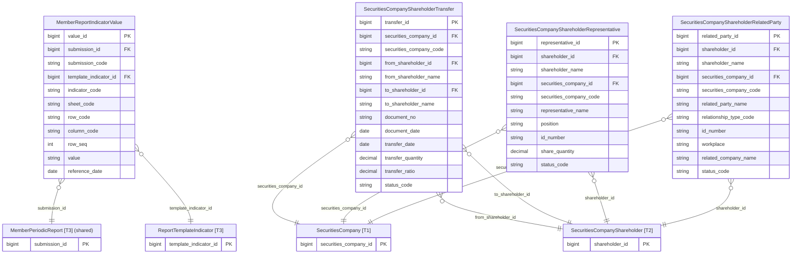

# SCMS HLD — Tier 4: Phụ thuộc Tier 3

**Source system:** SCMS  
**Phạm vi Tier 4:** Các entity có FK đến entity Tier 3 (MemberPeriodicReportSubmission, SecuritiesCompanyReportViolation...) + các entity giá trị báo cáo.

---

## 6a. Bảng tổng quan BCV Concept

| BCV Core Object | BCV Concept | Category | Source Table | Mô tả bảng nguồn | Atomic Entity | BCV Term |
|---|---|---|---|---|---|---|
| Documentation | [Documentation] Reported Information | Documentation | BC_BAO_CAO_GT | Lưu giá trị của chỉ tiêu báo cáo | Member Report Indicator Value | Giá trị từng chỉ tiêu trong một lần nộp báo cáo. Grain = 1 giá trị cell-level (submission × template_indicator × row). Fact Append. |
| Transaction | [Event] Transaction | Transaction | CTCK_CD_CHUYEN_NHUONG | Thông tin chuyển nhượng cổ phần | Securities Company Shareholder Transfer | Giao dịch chuyển nhượng cổ phần giữa 2 cổ đông. **Cấu trúc trường:** CTCK_THONG_TIN_ID, CTCK_CD_CHUYEN (từ cổ đông), CTCK_CD_NHAN (đến cổ đông), SO_VAN_BAN, NGAY_CHUYEN, SO_LUONG_CHUYEN, TY_LE_CHUYEN. **Lý do chọn:** [Event] Transaction — chuyển nhượng là giao dịch tài chính, không phải Involved Party. |
| Involved Party | [Involved Party] Involved Party Role | Involved Party | CTCK_CD_DAI_DIEN | Danh sách người đại diện cổ đông | Securities Company Shareholder Representative | **Cấu trúc trường:** CTCK_THONG_TIN_ID, CTCK_CO_DONG_ID, NGUOI_DAI_DIEN, CHUC_VU, SO_CMND, SO_LUONG_CP — người đại diện cho cổ đông (cá nhân đại diện quyền biểu quyết). FK chính: CTCK_CO_DONG_ID. **Lý do chọn:** Entity riêng — có lifecycle độc lập (bổ nhiệm/thay thế), không thể denormalize vào Shareholder. Tên chứa "Securities Company Shareholder" theo quy tắc entity con. |
| Involved Party | [Involved Party] Involved Party Relationship | Involved Party | CTCK_CD_MOI_QUAN_HE | Danh sách mối quan hệ cổ đông | Securities Company Shareholder Related Party | **Cấu trúc trường:** CTCK_THONG_TIN_ID, CTCK_CO_DONG_ID, HO_TEN, MOI_QUAN_HE (quan hệ gia đình/công tác), SO_CMND, NOI_LAM_VIEC, TEN_CTCK_CO_CP — người có quan hệ với cổ đông. FK chính: CTCK_CO_DONG_ID. **Lý do chọn:** Entity riêng — dữ liệu quan hệ liên kết có nhiều trường, không thể denormalize vào Shareholder. Tên chứa "Securities Company Shareholder" theo quy tắc entity con. |
| Business Activity | [Business Activity] Conduct Violation | Business Activity | BC_VI_PHAM_LOAI_VP | Phân loại vi phạm kèm vi phạm | — | Pure junction (BC_VI_PHAM_ID + DM_LOAI_VI_PHAM_ID). Denormalize thành `violation_type_codes ARRAY<CV Code>` trên `SecuritiesCompanyReportViolation`. |
| Involved Party | [Involved Party] Organization Unit | Involved Party | CTCK_VP_DAI_DIEN_NN | Văn phòng đại diện nước ngoài | **→ Tier 1** | Entity độc lập — không FK đến CTCK_THONG_TIN. Đã chuyển lên Tier 1. |
| — | — | — | BC_THANH_VIEN_XU_LY | Log tiếp nhận/xử lý báo cáo | **Ngoài scope** | Dữ liệu log xử lý nội bộ hệ thống — không có ý nghĩa nghiệp vụ. |
| — | — | — | BC_CANH_BAO | Cảnh báo trong quá trình thao tác | **Ngoài scope** | Thông tin cảnh báo phát sinh khi thao tác nhập liệu — không có ý nghĩa nghiệp vụ Atomic. |
| — | — | — | BC_KHAI_THAC | Dữ liệu khai thác tổng hợp | **Ngoài scope** | Pre-aggregated nội bộ hệ thống. |
| — | — | — | BC_KHAI_THAC_GT | Giá trị khai thác tổng hợp | **Ngoài scope** | Phụ thuộc BC_KHAI_THAC. |
| — | — | — | BC_GT_HDR | Báo cáo nháp header | **Ngoài scope** | Dữ liệu nháp trung gian chưa phải submission chính thức. |
| — | — | — | BC_GT_DTL | Báo cáo nháp chi tiết | **Ngoài scope** | Phụ thuộc BC_GT_HDR. |
| — | — | — | DM_CHI_TIEU_THONG_KE | Danh mục chỉ tiêu – thống kê | **Ngoài scope** | Metadata cross-reference ETL nội bộ. |

---

## 6b. Diagram Source (Mermaid)

```mermaid
erDiagram
    BC_THANH_VIEN["BC_THANH_VIEN [T3]"]{ int ID PK }
    BC_VI_PHAM["BC_VI_PHAM [T3]"]{ int ID PK }
    CTCK_CO_DONG["CTCK_CO_DONG [T2]"]{ int ID PK }
    CTCK_THONG_TIN["CTCK_THONG_TIN [T1]"]{ int ID PK }

    BC_BAO_CAO_GT {
        int ID PK
        int BC_THANH_VIEN_ID FK
        int BM_BAO_CAO_CT_ID FK
        int DM_CHI_TIEU_ID FK
        string GIA_TRI
        date NGAY_SO_LIEU
    }
    BC_THANH_VIEN_XU_LY {
        int ID PK
        int BC_THANH_VIEN_ID FK
        string NGUOI_XU_LY
        date NGAY_XU_LY
        string TRANG_THAI
    }
    BC_CANH_BAO {
        int ID PK
        int BC_THANH_VIEN_ID FK
        int DM_CANH_BAO_ID FK
        string LOAI_CANH_BAO
        string GIA_TRI
    }
    BC_VI_PHAM_LOAI_VP {
        int ID PK
        int BC_VI_PHAM_ID FK
        int DM_LOAI_VI_PHAM_ID FK
    }
    CTCK_CD_CHUYEN_NHUONG {
        int ID PK
        int CTCK_THONG_TIN_ID FK
        int CTCK_CD_CHUYEN FK
        int CTCK_CD_NHAN FK
        date NGAY_CHUYEN
        decimal SO_LUONG_CHUYEN
    }
    CTCK_CD_DAI_DIEN {
        int ID PK
        int CTCK_CO_DONG_ID FK
        int CTCK_THONG_TIN_ID FK
        string NGUOI_DAI_DIEN
        string SO_CMND
    }
    CTCK_CD_MOI_QUAN_HE {
        int ID PK
        int CTCK_CO_DONG_ID FK
        int CTCK_THONG_TIN_ID FK
        string HO_TEN
        string MOI_QUAN_HE
    }

    BC_BAO_CAO_GT }o--|| BC_THANH_VIEN : "BC_THANH_VIEN_ID"
    BC_THANH_VIEN_XU_LY }o--|| BC_THANH_VIEN : "BC_THANH_VIEN_ID"
    BC_CANH_BAO }o--|| BC_THANH_VIEN : "BC_THANH_VIEN_ID"
    BC_VI_PHAM_LOAI_VP }o--|| BC_VI_PHAM : "BC_VI_PHAM_ID"
    CTCK_CD_CHUYEN_NHUONG }o--|| CTCK_THONG_TIN : "CTCK_THONG_TIN_ID"
    CTCK_CD_CHUYEN_NHUONG }o--|| CTCK_CO_DONG : "CTCK_CD_CHUYEN"
    CTCK_CD_CHUYEN_NHUONG }o--|| CTCK_CO_DONG : "CTCK_CD_NHAN"
    CTCK_CD_DAI_DIEN }o--|| CTCK_CO_DONG : "CTCK_CO_DONG_ID"
    CTCK_CD_MOI_QUAN_HE }o--|| CTCK_CO_DONG : "CTCK_CO_DONG_ID"
```

---

## 6c. Diagram Atomic (Mermaid)

---

## 6d. Danh mục & Tham chiếu (Reference Data)

| Source Table | Mô tả | BCV Term | Xử lý Atomic | Scheme Code |
|---|---|---|---|---|
| BC_VI_PHAM_LOAI_VP | Loại vi phạm kèm vi phạm | Junction table | Pure junction (Violation + DM_LOAI_VI_PHAM) → denormalize thành `violation_type_codes ARRAY<Classification Value Code>` trên `SecuritiesCompanyReportViolation` | — |

---

## 6e. Bảng chờ thiết kế

*(Tier 4 không có bảng nào thiếu cấu trúc trường)*

---

## 6f. Điểm cần xác nhận

| # | Câu hỏi | Quyết định |
|---|---|---|
| 1 | `BC_KHAI_THAC` + `BC_KHAI_THAC_GT` — Gold pre-compute hay Fact Append? | ✅ **Ngoài scope.** Dữ liệu khai thác tổng hợp nội bộ hệ thống, không có giá trị nghiệp vụ Atomic. |
| 2 | `BC_GT_HDR` + `BC_GT_DTL` (draft) — có cần lên Atomic không? | ✅ **Ngoài scope.** Dữ liệu nháp trung gian, chưa phải submission chính thức. |
| 3 | `BC_BAO_CAO_GT` — có giá trị Atomic không? | ✅ **Có.** Thiết kế entity `Member Report Indicator Value` (Tier 4). FK đến `Member Periodic Report`. |
| 4 | `CTCK_CD_DAI_DIEN` và `CTCK_CD_MOI_QUAN_HE` — Atomic entity riêng hay denormalize? | ✅ **Entity riêng.** `Securities Company Shareholder Representative` và `Securities Company Shareholder Related Party`. FK đến `SecuritiesCompanyShareholder`. |

---

## Bảng ngoài scope (Tier 4)

| Nhóm | Source Table | Mô tả bảng nguồn | Lý do ngoài scope |
|---|---|---|---|
| System log | BC_THANH_VIEN_XU_LY | Log tiếp nhận/xử lý báo cáo | Dữ liệu log xử lý nội bộ hệ thống — không có ý nghĩa nghiệp vụ. |
| System log | BC_CANH_BAO | Cảnh báo trong quá trình thao tác nhập liệu | Thông tin cảnh báo phát sinh khi thao tác — không có ý nghĩa nghiệp vụ Atomic. |
| Gold derivative | BC_KHAI_THAC | Dữ liệu khai thác phục vụ báo cáo tổng hợp | Pre-aggregated nội bộ hệ thống SCMS — không có giá trị nghiệp vụ Atomic. |
| Gold derivative | BC_KHAI_THAC_GT | Giá trị khai thác tổng hợp | Phụ thuộc BC_KHAI_THAC. |
| Draft data | BC_GT_HDR | Dữ liệu báo cáo nháp header | Dữ liệu nháp trung gian — chưa phải submission chính thức. |
| Draft data | BC_GT_DTL | Dữ liệu báo cáo nháp chi tiết | Phụ thuộc BC_GT_HDR. |
| Metadata | DM_CHI_TIEU_THONG_KE | Danh mục chỉ tiêu – thống kê | Metadata cross-reference ETL nội bộ giữa 2 scheme. |
