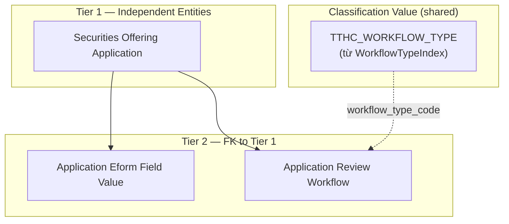
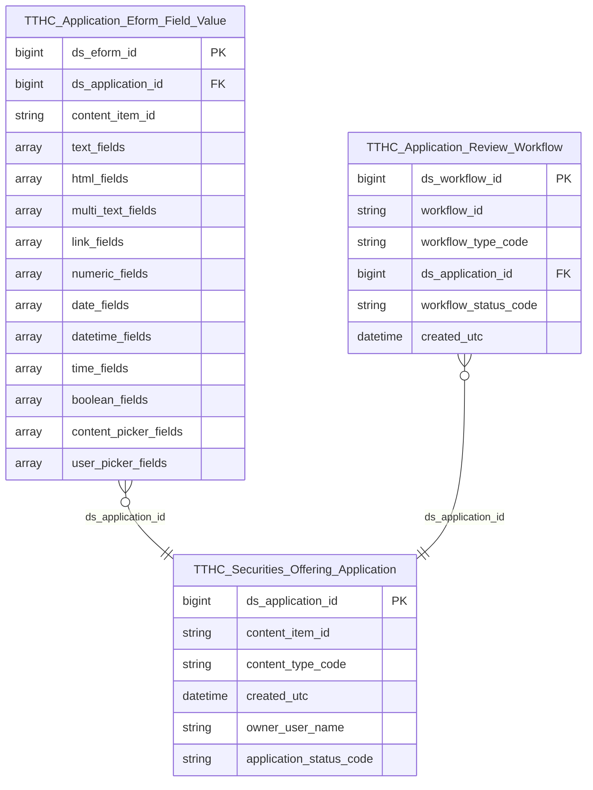

# TTHC HLD — Overview

**Source system:** TTHC (Quản lý thủ tục hành chính — Orchard Core EAV / SQLite)  
**Mô tả:** Hệ thống tiếp nhận và xử lý hồ sơ đăng ký chào bán / phát hành chứng khoán theo mô hình EAV. Tổ chức nộp hồ sơ Eform qua portal, cán bộ UBCK xét duyệt qua workflow, kết quả là GCN hoặc văn bản từ chối. Phục vụ 2 yêu cầu dashboard "Quản lý chào bán": (1) chi tiết tổ chức phát hành/tư vấn/kiểm toán/bảo lãnh/XHTN theo hồ sơ; (2) thống kê hồ sơ theo trạng thái và hình thức.

---

## Tổng quan Atomic Entities

| Tier | Atomic Entity | BCV Core Object | BCV Concept | table_type | Source Table(s) | Ghi chú |
|---|---|---|---|---|---|---|
| T1 | Securities Offering Application | Documentation | [Documentation] Regulatory Report | Fundamental | TTHC.ContentItemIndex | Hồ sơ + kết quả xét duyệt (Latest=1, Published=1) — phân biệt bởi content_type_code |
| T2 | Application Eform Field Value | Documentation | [Documentation] Reported Information | Fact Append | TTHC.TextFieldIndex, TTHC.HtmlFieldIndex, TTHC.MultiTextFieldIndex, TTHC.LinkFieldIndex, TTHC.NumericFieldIndex, TTHC.DateFieldIndex, TTHC.DateTimeFieldIndex, TTHC.TimeFieldIndex, TTHC.BooleanFieldIndex, TTHC.ContentPickerFieldIndex, TTHC.UserPickerFieldIndex | Grain = 1 ContentItem; mỗi loại field data type = 1 cột ARRAY<STRUCT> |
| T2 | Application Review Workflow | Business Activity | [Business Activity] Status Review | Fact Append | TTHC.WorkflowIndex | Workflow instance xét duyệt hồ sơ — trạng thái xác định từ WorkflowStatus |

**Tổng: 3 Atomic entities** (1 Tier 1, 2 Tier 2)  
**Classification Value thêm:** `WorkflowTypeIndex` → scheme `TTHC_WORKFLOW_TYPE` (không có entity riêng)

---

## Diagram Phân tầng Dependencies (Mermaid)

---

## Quyết định thiết kế chính

| # | Quyết định | Lý do |
|---|---|---|
| D-01 | Giữ cấu trúc EAV trên Atomic — không flatten Eform fields vào bảng wide | ~600 fields × 11 Eform, cấu trúc khác nhau per Eform. Tầng Gold pivot khi cần. |
| D-02 | Gộp hồ sơ đăng ký và kết quả xét duyệt (GCN / từ chối) thành 1 entity `Securities Offering Application` | Cùng 1 bảng vật lý `ContentItemIndex`. `content_type_code` phân biệt loại — `application_status_code` derive từ đây. |
| D-03 | `application_status_code` là ETL derived trên Securities Offering Application | Tổng hợp từ ContentType kết quả và WorkflowStatus. Gold không cần tính lại. |
| D-04 | Gộp 11 bảng `*FieldIndex` thành 1 entity `Application Eform Field Value` | Cùng grain (ContentItemId, ContentField), cùng 9 trường header, chỉ khác trường value. `string_value` lưu universal TEXT; `field_data_type_code` phân biệt loại; Gold tự cast. |
| D-05 | Bỏ `WorkflowBlockingActivitiesIndex` — dùng `WorkflowIndex.WorkflowStatus` để xác định trạng thái | Trạng thái xét duyệt xác định đủ từ bảng chính. Blocking step là chi tiết vận hành, không cần trên Atomic. |
| D-06 | Bỏ UserIndex / Orchard User khỏi scope Atomic | Không có yêu cầu báo cáo dùng thông tin người dùng — thông tin tác nghiệp hệ thống. |
| D-07 | `WorkflowTypeIndex` đẩy vào Classification Value (scheme `TTHC_WORKFLOW_TYPE`), không tạo entity riêng | Bảng chỉ có Code + Name + IsEnabled — đúng pattern danh mục thuần. `Application Review Workflow` tham chiếu qua `workflow_type_code` (Classification Value), không có FK surrogate. |
| D-08 | `Application Eform Field Value` grain = 1 ContentItem; mỗi loại field data type = 1 cột `ARRAY<STRUCT>` | Giữ nguyên tất cả cột giá trị nguồn (Value, BigValue, Url, BigUrl…) trong struct. Gold pivot khi cần truy vấn theo field cụ thể. |

---

## 7a. Bảng tổng quan Atomic entities

| Tier | BCV Core Object | BCV Concept | Category | Source Table | Mô tả bảng nguồn | Atomic Entity | BCV Term |
|---|---|---|---|---|---|---|---|
| T1 | Documentation | [Documentation] Regulatory Report | Documentation | ContentItemIndex | Hồ sơ đăng ký chào bán / phát hành chứng khoán và kết quả xét duyệt (GCN / từ chối) — phân biệt bởi ContentType (Latest=1, Published=1) | Securities Offering Application | [Documentation] Regulatory Report |
| CV | Common | [Common] Classification | Common | WorkflowTypeIndex | Danh mục loại workflow được cấu hình trong hệ thống — đẩy vào Classification Value | *(Classification Value)* scheme `TTHC_WORKFLOW_TYPE` | [Common] Classification |
| T2 | Documentation | [Documentation] Reported Information | Documentation | TextFieldIndex | Fields text của tờ khai Eform đã index | Application Eform Field Value | [Documentation] Reported Information |
| T2 | Documentation | [Documentation] Reported Information | Documentation | HtmlFieldIndex | Fields HTML của tờ khai Eform đã index | Application Eform Field Value | [Documentation] Reported Information |
| T2 | Documentation | [Documentation] Reported Information | Documentation | MultiTextFieldIndex | Fields văn bản nhiều giá trị của tờ khai Eform | Application Eform Field Value | [Documentation] Reported Information |
| T2 | Documentation | [Documentation] Reported Information | Documentation | LinkFieldIndex | Fields URL của tờ khai Eform đã index | Application Eform Field Value | [Documentation] Reported Information |
| T2 | Documentation | [Documentation] Reported Information | Documentation | NumericFieldIndex | Fields số của tờ khai Eform đã index | Application Eform Field Value | [Documentation] Reported Information |
| T2 | Documentation | [Documentation] Reported Information | Documentation | DateFieldIndex | Fields ngày của tờ khai Eform đã index | Application Eform Field Value | [Documentation] Reported Information |
| T2 | Documentation | [Documentation] Reported Information | Documentation | DateTimeFieldIndex | Fields ngày-giờ của tờ khai Eform đã index | Application Eform Field Value | [Documentation] Reported Information |
| T2 | Documentation | [Documentation] Reported Information | Documentation | TimeFieldIndex | Fields giờ của tờ khai Eform đã index | Application Eform Field Value | [Documentation] Reported Information |
| T2 | Documentation | [Documentation] Reported Information | Documentation | BooleanFieldIndex | Fields boolean của tờ khai Eform đã index | Application Eform Field Value | [Documentation] Reported Information |
| T2 | Documentation | [Documentation] Reported Information | Documentation | ContentPickerFieldIndex | Fields chọn ContentItem trong tờ khai Eform đã index | Application Eform Field Value | [Documentation] Reported Information |
| T2 | Documentation | [Documentation] Reported Information | Documentation | UserPickerFieldIndex | Fields chọn người dùng trong tờ khai Eform đã index | Application Eform Field Value | [Documentation] Reported Information |
| T2 | Business Activity | [Business Activity] Status Review | Business Activity | WorkflowIndex | Workflow instance gắn với hồ sơ — trạng thái quy trình xét duyệt (WorkflowStatus) | Application Review Workflow | [Business Activity] Status Review |

## 7b. Diagram Atomic tổng (Mermaid)

## 7c. Bảng Classification Value

| Source Table | Mô tả | BCV Term | Xử lý Atomic |
|---|---|---|---|
| WorkflowTypeIndex | Danh mục loại workflow (WorkflowTypeId, Name). ETL filter: IsEnabled=1. | [Common] Classification | Classification Value scheme `TTHC_WORKFLOW_TYPE` |
| ContentItemIndex.ContentType | Loại hình chào bán / phát hành (11 Eform) và loại kết quả (GCN / từ chối) | [Common] Classification | Classification Value scheme `TTHC_CONTENT_TYPE` |
| WorkflowIndex.WorkflowStatus | Trạng thái workflow instance (Idle/Executing/Faulted/Finished/Aborted) | [Common] Classification | Classification Value scheme `TTHC_WORKFLOW_STATUS` |
| application_status_code (ETL derived) | Trạng thái nghiệp vụ tổng hợp: Chờ xử lý / Đang xử lý / Đã cấp phép / Bị từ chối | [Common] Classification | Classification Value scheme `TTHC_APPLICATION_STATUS` |

## 7d. Junction Tables

*(TTHC không có pure junction table.)*

## 7e. Điểm cần xác nhận

| # | Tier | Câu hỏi | Ảnh hưởng |
|---|---|---|---|
| 1 | T1 | ContentType của GCN và văn bản từ chối trên DB thực tế là gì? Có tạo ContentItem riêng cho từ chối không? | Filter nhóm kết quả trong `Securities Offering Application` và logic `TTHC_APPLICATION_STATUS` |
| 2 | T1 | ContentType thực tế của 11 loại hồ sơ chào bán có khớp danh sách dự kiến không? | Filter `Securities Offering Application` — toàn bộ pipeline |
| 3 | T2 | `WorkflowIndex.CorrelationId` có đúng = ContentItemId hồ sơ gốc không? | FK `Application Review Workflow` → `Securities Offering Application` |
| 4 | T2 | WorkflowTypeId tương ứng với luồng xét duyệt chào bán là gì? | Filter `Application Review Workflow` — `workflow_type_code` (Classification Value) cần biết giá trị cụ thể để ETL filter đúng |
| 5 | T2 | `ContentField` thực tế trong `*FieldIndex` cho các pattern tên tổ chức và giá trị số? | ETL derive `TTHC_EFORM_FIELD_TYPE` — Yêu cầu 1 |
| 6 | T2 | Eform 16 (Bonus) và Eform 17 (ESOP) có qua workflow không? | Logic tính `application_status_code` cho 2 loại này |
| 7 | T2 | `ContentPickerFieldIndex` và `UserPickerFieldIndex` có được dùng trong Eform chào bán không? | Xác nhận scope UNION ALL 11 bảng cho `Application Eform Field Value` |

## 7f. Bảng ngoài scope

| Nhóm | Source Table | Mô tả bảng nguồn | Lý do ngoài scope |
|---|---|---|---|
| Operational / System | AliasPartIndex | Map alias URL đến ContentItem | Operational/system data — không có giá trị nghiệp vụ |
| Operational / System | AutoroutePartIndex | Index đường dẫn URL (slug) của ContentItem | Operational/system data — không có giá trị nghiệp vụ |
| Operational / System | ContainedPartIndex | Quan hệ cha-con giữa ContentItem (container-contained) | Operational/system data — không có giá trị nghiệp vụ |
| Operational / System | IndexingTask | Task đánh chỉ mục nội dung cho search engine | Operational/system data — không có giá trị nghiệp vụ |
| Operational / System | LayerMetadataIndex | Cấu hình layout và zone hiển thị giao diện | Operational/system data — không có giá trị nghiệp vụ |
| Operational / System | DeploymentPlanIndex | Kế hoạch triển khai nội dung và cấu hình hệ thống | Operational/system data — không có giá trị nghiệp vụ |
| Operational / System | Document | Raw JSON gốc của toàn bộ ContentItem | ETL không đọc Document.Content — dùng *FieldIndex thay thế |
| Operational / System | Audit_Document | Raw JSON chi tiết sự kiện audit | ETL không đọc Document.Content |
| Operational / System | Notification_Document | Raw JSON nội dung thông báo | ETL không đọc Document.Content |
| Operational / System | WorkflowTypeStartActivitiesIndex | Start activity của từng loại workflow | Operational/system data — không có giá trị nghiệp vụ |
| Operational / System | sqlite_master | Metadata schema SQLite | Operational/system data — không có giá trị nghiệp vụ |
| Operational / System | sqlite_sequence | Quản lý giá trị AUTOINCREMENT | Operational/system data — không có giá trị nghiệp vụ |
| Hệ thống / Phân quyền | UserIndex | Người dùng hệ thống TTHC | Thông tin tác nghiệp — không có yêu cầu báo cáo dùng thông tin người dùng |
| Hệ thống / Phân quyền | UserByLoginInfoIndex | Tra cứu người dùng theo login provider | Operational/system data — không có giá trị nghiệp vụ |
| Hệ thống / Phân quyền | UserByClaimIndex | Tra cứu người dùng theo Claim | Operational/system data — không có giá trị nghiệp vụ |
| Hệ thống / Phân quyền | UserByRoleNameIndex | Mapping người dùng theo vai trò | Operational/system data — không có giá trị nghiệp vụ |
| Hệ thống / Phân quyền | UserByRoleNameIndex_Document | Document JSON gốc của UserByRoleNameIndex | Cascade drop từ UserByRoleNameIndex |
| Hệ thống / Phân quyền | OpenId_Document | Document JSON các đối tượng OpenID Connect | Operational/system data — không có giá trị nghiệp vụ |
| Hệ thống / Phân quyền | OpenId_OpenIdApplicationIndex | Ứng dụng client OAuth2 đã đăng ký | Operational/system data — không có giá trị nghiệp vụ |
| Hệ thống / Phân quyền | OpenId_OpenIdAuthorizationIndex | Authorization grant OAuth2 | Operational/system data — không có giá trị nghiệp vụ |
| Hệ thống / Phân quyền | OpenId_OpenIdTokenIndex | Token OAuth2 đã cấp | Operational/system data — không có giá trị nghiệp vụ |
| Hệ thống / Phân quyền | OpenId_OpenIdScopeIndex | Phạm vi quyền truy cập OAuth2 | Operational/system data — không có giá trị nghiệp vụ |
| Hệ thống / Phân quyền | OpenId_OpenIdScopeByResourceIndex | Mapping scope theo resource | Operational/system data — không có giá trị nghiệp vụ |
| Hệ thống / Phân quyền | OpenId_OpenIdScopeByResourceIndex_OpenId_Document | Document gốc của scope-resource index | Cascade drop từ OpenId_OpenIdScopeByResourceIndex |
| Hệ thống / Phân quyền | OpenId_OpenIdAppByRedirectUriIndex | Index ứng dụng OpenID theo RedirectUri | Operational/system data — không có giá trị nghiệp vụ |
| Hệ thống / Phân quyền | OpenId_OpenIdAppByLogoutUriIndex | Index ứng dụng OpenID theo LogoutUri | Operational/system data — không có giá trị nghiệp vụ |
| Hệ thống / Phân quyền | OpenId_OpenIdAppByRoleNameIndex | Index ứng dụng OpenID theo RoleName | Operational/system data — không có giá trị nghiệp vụ |
| Hệ thống / Phân quyền | OpenId_OpenIdAppByRedirectUriIndex_OpenId_Document | Document gốc của RedirectUri index | Cascade drop từ OpenId_OpenIdAppByRedirectUriIndex |
| Hệ thống / Phân quyền | OpenId_OpenIdAppByLogoutUriIndex_OpenId_Document | Document gốc của LogoutUri index | Cascade drop từ OpenId_OpenIdAppByLogoutUriIndex |
| Hệ thống / Phân quyền | OpenId_OpenIdAppByRoleNameIndex_OpenId_Document | Document gốc của RoleName index | Cascade drop từ OpenId_OpenIdAppByRoleNameIndex |
| Form Metadata | TaxonomyIndex | Phân loại tag/category của nội dung CMS | Không có quan hệ FK đến bảng nghiệp vụ Eform chào bán |
| UI metadata | LayerMetadataIndex | Cấu hình layer hiển thị giao diện portal | Operational/system data — không có giá trị nghiệp vụ |
| Ngoài yêu cầu báo cáo | Audit_AuditTrailEventIndex | Log sự kiện audit — thao tác người dùng trên hồ sơ | Không xuất hiện trong 2 yêu cầu báo cáo hiện tại |
| Ngoài yêu cầu báo cáo | Notification_NotificationIndex | Thông báo hệ thống gửi đến người dùng | Không xuất hiện trong 2 yêu cầu báo cáo hiện tại |
| Ngoài yêu cầu báo cáo | WorkflowBlockingActivitiesIndex | Bước xử lý đang chờ trong workflow (chi tiết blocking step) | Trạng thái xét duyệt xác định đủ từ WorkflowIndex.WorkflowStatus — blocking step là chi tiết vận hành |

<!--
GRAIN: 1 dòng = 1 bảng nguồn. KHÔNG gộp `table1, table2`.
GROUP: dùng từ danh sách chuẩn (xem reference/group_classification.md).
-->
