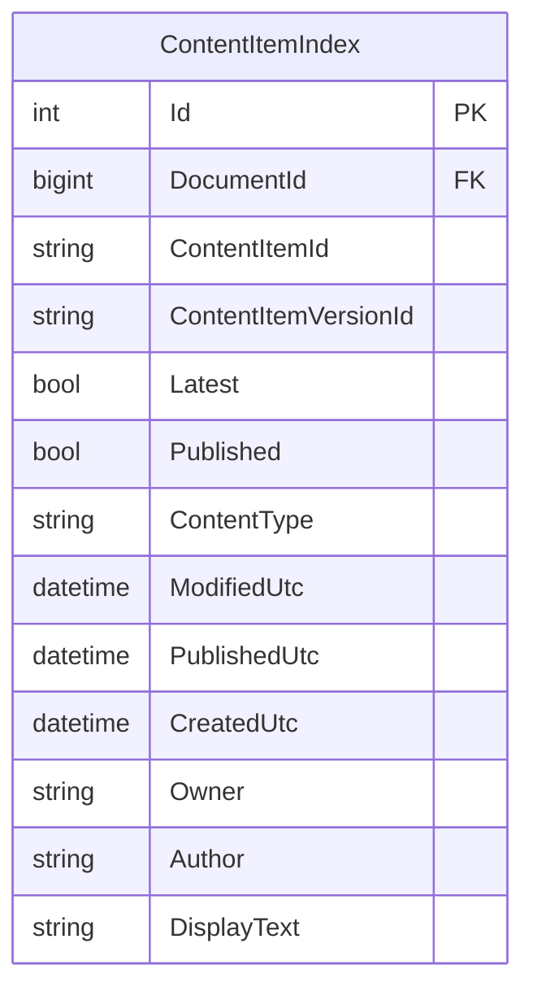
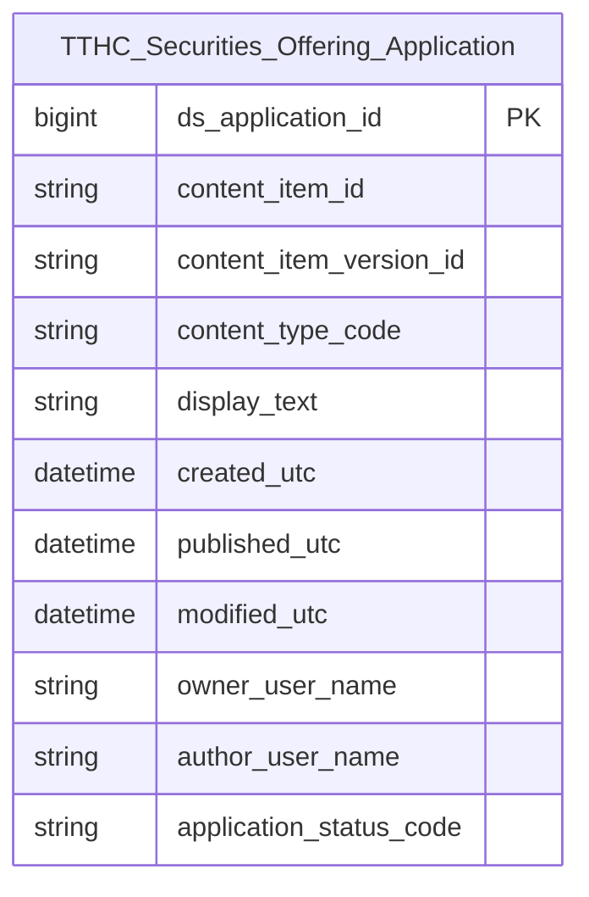

# TTHC HLD — Tier 1

**Source system:** TTHC (Quản lý thủ tục hành chính — Orchard Core EAV / SQLite)  
**Mô tả:** Hệ thống tiếp nhận và xử lý hồ sơ đăng ký chào bán / phát hành chứng khoán. Tổ chức nộp hồ sơ Eform qua portal, cán bộ UBCK xét duyệt qua workflow.  
**Tier 1:** Các entity độc lập — không FK đến bảng nghiệp vụ khác trong scope TTHC.

> **Lưu ý:** `WorkflowTypeIndex` không còn là Atomic entity riêng — đẩy vào Classification Value scheme `TTHC_WORKFLOW_TYPE` (quyết định D-07). Xem `TTHC_HLD_Overview.md` mục 7c.

---

## 6a. Bảng tổng quan BCV Concept

| BCV Core Object | BCV Concept | Category | Source Table | Mô tả bảng nguồn | Atomic Entity | table_type | BCV Term |
|---|---|---|---|---|---|---|---|
| Documentation | [Documentation] Regulatory Report | Documentation | ContentItemIndex | Hồ sơ đăng ký chào bán / phát hành chứng khoán và kết quả xét duyệt (GCN / văn bản từ chối) — toàn bộ lưu trong cùng bảng ContentItemIndex, phân biệt bởi ContentType | Securities Offering Application | Fundamental | BCV term **Regulatory Report**: "Identifies a Documentation that is created by a Financial Institution as part of the regulatory reporting or filing process." ContentItemIndex chứa cả hồ sơ do tổ chức nộp lẫn kết quả UBCK ban hành (GCN, từ chối) — `content_type_code` phân biệt loại. Đặt tên `Securities Offering Application`. |

---

## 6b. Diagram Source (Mermaid)

> `ContentItemIndex` là 1 bảng vật lý duy nhất. `ContentType` phân biệt 2 nhóm: (1) hồ sơ đăng ký chào bán (11 Eform), (2) kết quả xét duyệt (GCN / văn bản từ chối). Cả 2 nhóm được map vào cùng entity `Securities Offering Application` với `content_type_code` làm Classification Value phân loại.
> `WorkflowTypeIndex` không có trong diagram source — đẩy vào Classification Value, không có entity riêng (D-07).

---

## 6c. Diagram Atomic (Mermaid)

---

## 6d. Danh mục & Tham chiếu (Reference Data)

| Source Field / Bảng | Mô tả | Scheme Code | source_type | Ghi chú |
|---|---|---|---|---|
| WorkflowTypeIndex (toàn bảng) | Danh mục loại workflow. ETL filter: IsEnabled=1. Classification Code = WorkflowTypeId, Classification Name = Name. | `TTHC_WORKFLOW_TYPE` | source_table | WorkflowTypeIndex đẩy vào Classification Value thay vì entity riêng (D-07). Xem Tier 2 cho cách tham chiếu. |
| ContentItemIndex.ContentType | Loại hình chào bán / phát hành (11 Eform: 3/5/6/7/10/11/15/16/17/76A/100) và loại kết quả (GCN / từ chối) | `TTHC_CONTENT_TYPE` | source_table | ContentType thực tế cần profile trên DB trước khi chốt giá trị (xem 6f T1-01) |
| application_status_code (ETL derived) | Trạng thái nghiệp vụ tổng hợp: Chờ xử lý / Đang xử lý / Đã cấp phép / Bị từ chối | `TTHC_APPLICATION_STATUS` | etl_derived | Logic tổng hợp từ 3 nguồn: GCN (ContentType kết quả) > từ chối (ContentType kết quả) > WorkflowStatus > mặc định Chờ xử lý |

---

## 6e. Bảng chờ thiết kế

*(Không có bảng nào trong Tier 1 chưa có cấu trúc trường)*

---

## 6f. Điểm cần xác nhận

| # | Câu hỏi | Kết quả |
|---|---|---|
| T1-01 | ContentType của GCN và văn bản từ chối trên DB thực tế là gì? Có tạo ContentItem riêng cho từ chối không? | **Chưa xác nhận** — ảnh hưởng filter nhóm kết quả và logic `TTHC_APPLICATION_STATUS`. |
| T1-02 | ContentType thực tế của 11 loại hồ sơ chào bán có đúng như danh sách dự kiến (ChaobanCophieuIPO, ChaobanTraiphieu…) không? | **Chưa xác nhận** — cần `SELECT DISTINCT ContentType FROM ContentItemIndex WHERE Published=1`. |
