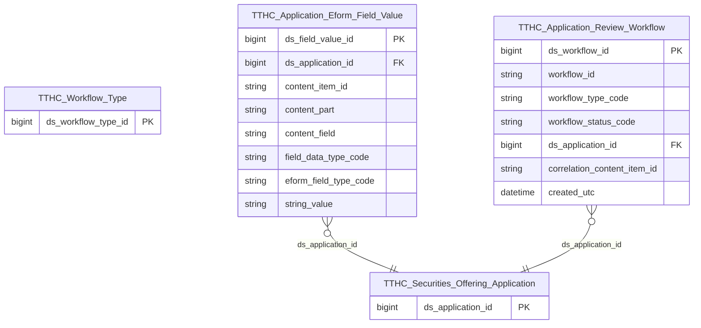

# TTHC HLD — Tier 2

**Source system:** TTHC (Quản lý thủ tục hành chính — Orchard Core EAV / SQLite)  
**Mô tả:** Hệ thống tiếp nhận và xử lý hồ sơ đăng ký chào bán / phát hành chứng khoán.  
**Tier 2:** Các entity phụ thuộc Tier 1 — FK đến Securities Offering Application.

> **Lưu ý:** `Workflow Type` không còn là entity Tier 1 — đẩy vào Classification Value scheme `TTHC_WORKFLOW_TYPE` (D-07). `Application Review Workflow` tham chiếu qua `workflow_type_code` (Classification Value).

---

## 6a. Bảng tổng quan BCV Concept

| BCV Core Object | BCV Concept | Category | Source Table | Mô tả bảng nguồn | Atomic Entity | table_type | BCV Term |
|---|---|---|---|---|---|---|---|
| Documentation | [Documentation] Reported Information | Documentation | TextFieldIndex, HtmlFieldIndex, MultiTextFieldIndex, LinkFieldIndex, NumericFieldIndex, DateFieldIndex, DateTimeFieldIndex, TimeFieldIndex, BooleanFieldIndex, ContentPickerFieldIndex, UserPickerFieldIndex (tất cả với ContentType IN danh sách Eform chào bán + kết quả, Latest=1, Published=1) | Toàn bộ giá trị field của tờ khai Eform đã index — text, số, ngày, boolean, picker, v.v. Mỗi row = 1 giá trị của 1 field thuộc 1 ContentItem | Application Eform Field Value | Fact Append | BCV term **Reported Information**: "Identifies Documentation that is created based on stored or gathered information that will be used for reporting purposes." 11 bảng `*FieldIndex` có cùng grain (ContentItemId, ContentField) = 1 giá trị field, chỉ khác kiểu dữ liệu value. Gộp thành 1 entity với `field_data_type_code` phân biệt loại và `string_value` lưu universal. Đặt tên `Application Eform Field Value`. |
| Business Activity | [Business Activity] Status Review | Business Activity | WorkflowIndex | Workflow instance gắn với hồ sơ — theo dõi trạng thái quy trình xét duyệt từ khi tiếp nhận đến kết thúc | Application Review Workflow | Fact Append | BCV term **Status Review**: "Identifies a Business Activity in which the status of an item is reviewed to determine if it is still valid." WorkflowIndex lưu từng instance chạy thực tế (WorkflowId, WorkflowStatus, CreatedUtc) và gắn với hồ sơ qua CorrelationId. Đây là hoạt động xét duyệt — khớp với Status Review. Đặt tên `Application Review Workflow`. |

---

## 6b. Diagram Source (Mermaid)

```mermaid
erDiagram
    TextFieldIndex {
        int Id PK
        bigint DocumentId FK
        string ContentItemId FK
        string ContentItemVersionId
        string ContentType
        string ContentPart
        string ContentField
        bool Published
        bool Latest
        string Text
        string BigText
    }

    HtmlFieldIndex {
        int Id PK
        bigint DocumentId FK
        string ContentItemId FK
        string ContentType
        string ContentPart
        string ContentField
        bool Published
        bool Latest
        string Html
    }

    MultiTextFieldIndex {
        int Id PK
        bigint DocumentId FK
        string ContentItemId FK
        string ContentType
        string ContentPart
        string ContentField
        bool Published
        bool Latest
        string Value
        string BigValue
    }

    LinkFieldIndex {
        int Id PK
        bigint DocumentId FK
        string ContentItemId FK
        string ContentType
        string ContentPart
        string ContentField
        bool Published
        bool Latest
        string Url
        string BigUrl
        string Text
        string BigText
    }

    NumericFieldIndex {
        int Id PK
        bigint DocumentId FK
        string ContentItemId FK
        string ContentType
        string ContentPart
        string ContentField
        bool Published
        bool Latest
        decimal Numeric
    }

    DateFieldIndex {
        int Id PK
        bigint DocumentId FK
        string ContentItemId FK
        string ContentType
        string ContentPart
        string ContentField
        bool Published
        bool Latest
        datetime Date
    }

    DateTimeFieldIndex {
        int Id PK
        bigint DocumentId FK
        string ContentItemId FK
        string ContentType
        string ContentPart
        string ContentField
        bool Published
        bool Latest
        datetime DateTime
    }

    TimeFieldIndex {
        int Id PK
        bigint DocumentId FK
        string ContentItemId FK
        string ContentType
        string ContentPart
        string ContentField
        bool Published
        bool Latest
        time Time
    }

    BooleanFieldIndex {
        int Id PK
        bigint DocumentId FK
        string ContentItemId FK
        string ContentType
        string ContentPart
        string ContentField
        bool Published
        bool Latest
        bool Boolean
    }

    ContentPickerFieldIndex {
        int Id PK
        bigint DocumentId FK
        string ContentItemId FK
        string ContentType
        string ContentPart
        string ContentField
        bool Published
        bool Latest
        string SelectedContentItemId
    }

    UserPickerFieldIndex {
        int Id PK
        bigint DocumentId FK
        string ContentItemId FK
        string ContentType
        string ContentPart
        string ContentField
        bool Published
        bool Latest
        string SelectedUserId
    }

    WorkflowIndex {
        int Id PK
        bigint DocumentId FK
        string WorkflowTypeId FK
        string WorkflowId
        string WorkflowStatus
        datetime CreatedUtc
    }
```

> Tất cả 11 bảng `*FieldIndex` có cùng 9 trường header (Id, DocumentId, ContentItemId, ContentItemVersionId, ContentType, ContentPart, ContentField, Published, Latest) — chỉ khác trường value cuối. ETL UNION ALL 11 bảng, serialize value thành `string_value`, thêm `field_data_type_code` để phân biệt loại.  
> `ContentItemIndex` (Tier 1) là nguồn FK cho tất cả `*FieldIndex` qua `ContentItemId`.  
> `WorkflowBlockingActivitiesIndex` ngoài scope — trạng thái xét duyệt xác định từ `WorkflowIndex.WorkflowStatus`, không cần chi tiết blocking step.

---

## 6c. Diagram Atomic (Mermaid)

---

## 6d. Danh mục & Tham chiếu (Reference Data)

| Source Field / Bảng | Mô tả | Scheme Code | source_type | Ghi chú |
|---|---|---|---|---|
| field_data_type_code (ETL derived từ tên bảng nguồn) | Loại dữ liệu field Eform: TEXT / HTML / MULTI_TEXT / LINK / NUMERIC / DATE / DATETIME / TIME / BOOLEAN / CONTENT_PICKER / USER_PICKER | `TTHC_EFORM_FIELD_DATA_TYPE` | etl_derived | ETL derive từ bảng nguồn khi UNION ALL — cố định 11 giá trị, không cần profile DB |
| WorkflowIndex.WorkflowStatus (Idle/Executing/Faulted/Finished/Aborted) | Trạng thái workflow instance | `TTHC_WORKFLOW_STATUS` | source_table | 5 giá trị cố định của Orchard Core |
| eform_field_type_code (ETL derived từ ContentField pattern) | Nhãn nghĩa của field Eform đã chuẩn hóa — ISSUER_NAME / ADVISOR_NAME / AUDITOR_NAME / UNDERWRITER_NAME / RATING_AGENCY_NAME / QUANTITY / PAR_VALUE / … | `TTHC_EFORM_FIELD_TYPE` | etl_derived | ETL derive từ ContentField pattern — chỉ map được các field đã khảo sát, null cho field khác |

---

## 6e. Bảng chờ thiết kế

*(Không có bảng nào trong Tier 2 chưa có cấu trúc trường)*

---

## 6f. Điểm cần xác nhận

| # | Câu hỏi | Kết quả |
|---|---|---|
| T2-01 | `WorkflowIndex.CorrelationId` có đúng = ContentItemId hồ sơ gốc? | **Chưa xác nhận** — giả định theo tài liệu Orchard Core. |
| T2-02 | WorkflowTypeId tương ứng với luồng xét duyệt chào bán là gì? | **Chưa xác nhận** — cần `SELECT WorkflowTypeId, Name FROM WorkflowTypeIndex WHERE IsEnabled=1`. Ảnh hưởng ETL filter `workflow_type_code` trong `Application Review Workflow` và logic `DANG_XU_LY` của `application_status_code`. |
| T2-03 | `ContentField` thực tế trong `*FieldIndex` cho các pattern tên tổ chức và giá trị số? | **Chưa xác nhận** — cần profile DB thực tế trước LLD. |
| T2-04 | Eform 16 (Bonus) và Eform 17 (ESOP) có qua workflow không? | **Chưa xác nhận** — ảnh hưởng logic tính trạng thái `TTHC_APPLICATION_STATUS` cho 2 loại này. |
| T2-05 | `ContentPickerFieldIndex` và `UserPickerFieldIndex` có được dùng trong Eform chào bán không? | **Chưa xác nhận** — cần `SELECT DISTINCT ContentType FROM ContentPickerFieldIndex WHERE Latest=1`. |
