# ThanhTra HLD — Tier 1

**Source system:** ThanhTra  
**Mô tả:** Hệ thống quản lý hoạt động thanh tra, kiểm tra, xử lý vi phạm và phòng chống tham nhũng / rửa tiền của UBCKNN.  
**Tier 1:** Các entity độc lập — không FK đến bảng nghiệp vụ khác.

---

## 6a. Bảng tổng quan BCV Concept

| BCV Core Object | BCV Concept | Source Table | Mô tả bảng nguồn | Atomic Entity | table_type | Ghi chú / BCV Term |
|---|---|---|---|---|---|---|
| Involved Party | [Involved Party] Individual | DM_CAN_BO | Danh mục cán bộ thanh tra | Inspection Officer | Fundamental | Chọn `Individual` — bảng lưu thông tin từng cán bộ cụ thể (HO_VA_TEN, NGAY_SINH, GIOI_TINH, DIEN_THOAI, EMAIL, DIA_CHI), không phải định nghĩa vị trí tổ chức. |
| Involved Party | [Involved Party] Organization | DM_CONG_TY_CK | Công ty chứng khoán (danh mục ThanhTra) | ~~entity mới~~ → **Reuse `Securities Company`** | — | DM_CONG_TY_CK trùng với entity `Securities Company` (FIMS.SECURITIESCOMPANY, SCMS.CTCK_THONG_TIN). Không tạo entity mới — thêm ThanhTra.DM_CONG_TY_CK vào source_table của `Securities Company`. |
| Involved Party | [Involved Party] Portfolio Fund Management Company | DM_CONG_TY_QLQ | Công ty quản lý quỹ (danh mục ThanhTra) | ~~entity mới~~ → **Reuse `Fund Management Company`** | — | DM_CONG_TY_QLQ trùng với entity `Fund Management Company` (FMS.SECURITIES, FIMS.FUNDCOMPANY). Không tạo entity mới — thêm ThanhTra.DM_CONG_TY_QLQ vào source_table của `Fund Management Company`. |
| Involved Party | [Involved Party] Organization | DM_CONG_TY_DC | Công ty đại chúng (danh mục ThanhTra) | **Public Company** | Fundamental | Chưa có entity Atomic nào cover "công ty đại chúng". ThanhTra.DM_CONG_TY_DC là nguồn duy nhất hiện tại → tạo entity mới. Cấu trúc: TEN_TIENG_VIET, TEN_TIENG_ANH, VON_DIEU_LE, TRANG_THAI_HOAT_DONG, DIA_CHI, GIAY_PHEP_KINH_DOANH. |
| Involved Party | [Involved Party] Individual/Organization | DM_DOI_TUONG_KHAC | Danh mục đối tượng thanh tra khác | Inspection Subject Other Party | Fundamental | Chứa cả cá nhân và tổ chức (LOAI_DOI_TUONG = CA_NHAN / TO_CHUC). Grain: 1 Involved Party, loại phân biệt qua `party_type_code`. |
| Business Activity | [Business Activity] Audit Investigation | TT_KE_HOACH | Kế hoạch thanh tra, kiểm tra hàng năm | Inspection Annual Plan | Fundamental | Chọn `Audit Investigation` — kế hoạch là phần khởi đầu quy trình thanh tra. Không có BCV term đặc thù hơn cho "annual plan" → dùng Audit Investigation, tên entity làm rõ grain. |
| Business Activity | [Business Activity] Conduct Violation | GS_HO_SO | Hồ sơ xử lý vi phạm từ kết quả giám sát | Surveillance Enforcement Case | Fundamental | Chọn `Conduct Violation` — hồ sơ theo dõi vi phạm có trạng thái lifecycle (MA_HO_SO, TEN_DOI_TUONG, MANG_NGHIEP_VU_ID, TRANG_THAI_ID). |
| Business Activity | [Business Activity] Conduct Violation | DT_DON_THU | Đơn thư KNTC, phản ánh kiến nghị | Complaint Petition | Fundamental | Chọn `Conduct Violation` — đơn thư tố cáo vi phạm (LOAI_DON = KHIEU_NAI/TO_CAO/PHAN_ANH/KIEN_NGHI). BCV không có term riêng cho "petition to regulator". |
| Business Activity | [Business Activity] Conduct Violation | PCRT_HO_SO | Hồ sơ phòng chống rửa tiền | AML Enforcement Case | Fundamental | Chọn `Conduct Violation` — cùng cấu trúc hồ sơ vi phạm, chuyên ngành PCRT. |
| Business Activity | [Business Activity] Audit Investigation | PCTN_BAO_CAO | Báo cáo phòng chống tham nhũng | Anti-Corruption Report | Fact Append | Báo cáo tổng hợp định kỳ, append theo kỳ, không có lifecycle upsert. |
| Business Activity | [Business Activity] Audit Investigation | PCRT_BAO_CAO | Báo cáo phòng chống rửa tiền | AML Periodic Report | Fact Append | Báo cáo định kỳ độc lập, tương tự PCTN_BAO_CAO. Append theo kỳ. |

---

## 6b. Diagram Source (Mermaid)

```mermaid
erDiagram
    DM_CAN_BO {
        int ID PK
        string TEN_DANG_NHAP
        string HO_VA_TEN
        date NGAY_SINH
        string DIEN_THOAI
        string EMAIL
        string DIA_CHI
        string TRANG_THAI
    }

    DM_CONG_TY_CK {
        int ID PK
        string LOAI_HINH_CONG_TY
        string TEN_TIENG_VIET
        string VON_DIEU_LE
        string TRANG_THAI_HOAT_DONG
        string DIA_CHI
        string GIAY_PHEP_KINH_DOANH
    }

    DM_CONG_TY_QLQ {
        int ID PK
        string LOAI_HINH_CONG_TY
        string TEN_TIENG_VIET
        string LOAI_QUY
        string TRANG_THAI_HOAT_DONG
        string DIA_CHI
    }

    DM_CONG_TY_DC {
        int ID PK
        string LOAI_HINH_CONG_TY
        string TEN_TIENG_VIET
        string VON_DIEU_LE
        string TRANG_THAI_HOAT_DONG
        string DIA_CHI
    }

    DM_DOI_TUONG_KHAC {
        int ID PK
        string LOAI_DOI_TUONG
        string TEN_DOI_TUONG
        string SO_GPKD
        int QUOC_GIA_ID FK
    }

    DM_QUOC_GIA {
        int ID PK
        string TEN_QUOC_GIA
    }

    TT_KE_HOACH {
        int ID PK
        string LOAI_KE_HOACH
        string TEN_KE_HOACH
        string SO_QD_PHE_DUYET
        date NGAY_KY_QUYET_DINH
        int NAM_KE_HOACH
        string TRANG_THAI
    }

    GS_HO_SO {
        int ID PK
        string MA_HO_SO
        string TEN_HO_SO
        string TEN_DOI_TUONG
        int MANG_NGHIEP_VU_ID FK
        int TRANG_THAI_ID FK
        int LANH_DAO_PHU_TRACH FK
        int CHUYEN_VIEN_XU_LY FK
    }

    DT_DON_THU {
        int ID PK
        string LOAI_DOI_TUONG
        string TEN_TO_CHUC_CA_NHAN
        string LOAI_DON
        date NGAY_TIEP_NHAN
        string TRANG_THAI
    }

    PCRT_HO_SO {
        int ID PK
        string MA_HO_SO
        string LOAI_DOI_TUONG
        string TEN_DOI_TUONG
        int MANG_NGHIEP_VU_ID FK
        int TRANG_THAI_ID FK
        int LANH_DAO_PHU_TRACH FK
        int CHUYEN_VIEN_XU_LY FK
    }

    PCTN_BAO_CAO {
        int ID PK
        string TEN_BAO_CAO
        date NGAY_LAP_BAO_CAO
        date TU_NGAY_TONG_HOP
        date DEN_NGAY_TONG_HOP
    }

    DM_DOI_TUONG_KHAC ||--o{ DM_QUOC_GIA : "QUOC_GIA_ID"
    GS_HO_SO ||--o{ DM_CAN_BO : "LANH_DAO/CHUYEN_VIEN"
    PCRT_HO_SO ||--o{ DM_CAN_BO : "LANH_DAO/CHUYEN_VIEN"
```



---

## 6c. Diagram Atomic (Mermaid)

```mermaid
erDiagram
    InspectionOfficer["Inspection Officer"] {
        bigint inspection_officer_id PK
        string inspection_officer_code BK
        string full_name
        date date_of_birth
        string gender_code
        string officer_status_code
    }

    SecuritiesCompany["Securities Company (reuse — ThanhTra.DM_CONG_TY_CK)"] {
        bigint securities_company_id PK
        string securities_company_code BK
        string name_vi
        string activity_status_code
    }

    FundManagementCompany["Fund Management Company (reuse — ThanhTra.DM_CONG_TY_QLQ)"] {
        bigint fund_management_company_id PK
        string fund_management_company_code BK
        string name_vi
        string activity_status_code
    }

    PublicCompany["Public Company (ThanhTra.DM_CONG_TY_DC)"] {
        bigint public_company_id PK
        string public_company_code BK
        string name_vi
        string name_en
        currency_amount charter_capital_amount
        string activity_status_code
        string business_license_number
    }

    InspectionSubjectOtherParty["Inspection Subject Other Party"] {
        bigint inspection_subject_other_party_id PK
        string inspection_subject_other_party_code BK
        string source_system_code BK
        string party_type_code
        string name
        string country_of_registration_id FK
    }

    InspectionAnnualPlan["Inspection Annual Plan"] {
        bigint inspection_annual_plan_id PK
        string inspection_annual_plan_code BK
        string plan_type_code
        string plan_name
        string approval_decision_number
        date approval_date
        int plan_year
        string plan_status_code
    }

    SurveillanceEnforcementCase["Surveillance Enforcement Case"] {
        bigint surveillance_enforcement_case_id PK
        string surveillance_enforcement_case_code BK
        string case_name
        string subject_name
        string business_sector_code
        string case_status_code
    }

    ComplaintPetition["Complaint Petition"] {
        bigint complaint_petition_id PK
        string complaint_petition_code BK
        string complainant_type_code
        string complainant_name
        string petition_type_code
        date submission_date
        string petition_status_code
    }

    AMLEnforcementCase["AML Enforcement Case"] {
        bigint aml_enforcement_case_id PK
        string aml_enforcement_case_code BK
        string subject_type_code
        string subject_name
        string business_sector_code
        string case_status_code
    }

    AntiCorruptionReport["Anti-Corruption Report"] {
        bigint anti_corruption_report_id PK
        string report_name
        date report_date
        date period_from_date
        date period_to_date
    }

    GeographicArea["Geographic Area (ref)"] {
        bigint geographic_area_id PK
        string geographic_area_code
    }

    InspectionSubjectOtherParty ||--o{ GeographicArea : "country_of_registration"
    SurveillanceEnforcementCase ||--o{ InspectionOfficer : "responsible_officer"
    AMLEnforcementCase ||--o{ InspectionOfficer : "responsible_officer"
```

---

## 6d. Danh mục & Tham chiếu (Reference Data)

| Source Table | Mô tả | BCV Term | Xử lý Atomic | Scheme Code |
|---|---|---|---|---|
| DM_BIEU_MAU | Danh mục biểu mẫu | Classification | Classification Value | `TT_FORM_TYPE` |
| DM_CHUC_VU | Danh mục chức vụ (trong đoàn thanh tra) | Classification | Classification Value | `TT_POSITION_TYPE` |
| DM_DON_VI | Danh mục đơn vị UBCKNN | Classification | Classification Value | `TT_UNIT_TYPE` |
| DM_HO_SO | Danh mục loại hồ sơ | Classification | Classification Value | `TT_CASE_TYPE` |
| DM_TRANG_THAI_HO_SO | Danh mục trạng thái hồ sơ | Classification | Classification Value | `TT_CASE_STATUS` |
| DM_LINH_VUC | Danh mục lĩnh vực thanh tra | Classification | Classification Value | `TT_INSPECTION_SECTOR` |
| DM_QUOC_GIA | Danh mục quốc gia | [Location] Geographic Area | **Atomic entity Geographic Area** (COUNTRY) — dùng chung với SCMS.DM_QUOC_GIA | — |
| DM_TINH_THANH | Danh mục tỉnh thành | [Location] Geographic Area | **Atomic entity Geographic Area** (PROVINCE) — dùng chung với SCMS.DM_TINH_THANH | — |
| DM_HANH_VI_VI_PHAM | Danh mục hành vi vi phạm | Classification | Classification Value | `TT_VIOLATION_TYPE` |
| DM_HINH_THUC_PHAT | Danh mục hình thức phạt | Classification | Classification Value | `TT_PENALTY_TYPE` |
| DM_HINH_THUC_VAN_BAN | Danh mục hình thức văn bản | Classification | Classification Value | `TT_DOCUMENT_FORM_TYPE` |
| DM_MANG_NGHIEP_VU | Danh mục mảng nghiệp vụ | Classification | Classification Value | `TT_BUSINESS_SECTOR` |
| DM_MUC_DO_BAO_MAT | Danh mục mức độ bảo mật | Classification | Classification Value | `TT_SECURITY_LEVEL` |
| DM_CAN_CU_THANH_TRA | Danh mục căn cứ thanh tra (văn bản pháp lý nền) | Classification | Classification Value | `TT_LEGAL_BASIS_TYPE` |
| DM_DANH_MUC_KHAC | Danh mục dùng chung (phân loại nội bộ) | Classification | Classification Value | `TT_MISC_CATEGORY` |

---

## 6e. Bảng chờ thiết kế

Không có bảng nào trong scope nghiệp vụ chưa có cấu trúc cột.

---

## 6f. Kết quả xác nhận (đã resolved)

| # | Câu hỏi | Quyết định |
|---|---|---|
| 1 | DM_CONG_TY_CK/QLQ/DC có trùng với entity gốc? | **Trùng.** DM_CONG_TY_CK → reuse `Securities Company`; DM_CONG_TY_QLQ → reuse `Fund Management Company`; DM_CONG_TY_DC → tạo entity mới `Public Company`. Bỏ `Inspection Subject Organization`. |
| 2 | DM_CAN_BO có reuse `Regulatory Authority Organization Unit` được không? | **Không.** DM_CAN_BO là nhân viên cá nhân (Individual), khác với org unit. Giữ `Inspection Officer` entity riêng cho hệ thống ThanhTra. |
| 3 | GS/DT/PCRT có cross-FK vào TT_ không? | **Không.** Ba luồng hoàn toàn độc lập. Thiết kế Tier hiện tại đã đúng. |
| 4 | TT_HO_SO denormalized IP info — tách hay giữ? | **Giữ denormalized.** Grain là hồ sơ thanh tra, không phải Involved Party. Thông tin cá nhân là snapshot tại thời điểm thanh tra. |
| 5 | PCTN_BAO_CAO độc lập hay FK? | **Độc lập.** Giữ Tier 1 Fact Append. |
| 6 | SYS_NGUOI_DUNG — đưa lên Atomic hay bỏ? | **Out-of-scope.** Tất cả 9 bảng SYS_ không thiết kế Atomic. Thêm vào `pending_design.csv`. |
