# ThanhTra HLD — Tier 3

**Source system:** ThanhTra  
**Tier 3:** Các entity có FK đến Tier 2 (hoặc Tier 1 + Tier 2 đồng thời).

---

## 6a. Bảng tổng quan BCV Concept

| BCV Core Object | BCV Concept | Source Table | Mô tả bảng nguồn | Atomic Entity | table_type | Ghi chú |
|---|---|---|---|---|---|---|
| Business Activity | [Business Activity] Audit Investigation | TT_QUYET_DINH_DOI_TUONG | Đối tượng cụ thể được thanh tra theo một quyết định thanh tra | Inspection Decision Subject | Fundamental | FK → Inspection Decision (T2). Grain: 1 đối tượng × 1 quyết định. |
| Business Activity | [Business Activity] Audit Investigation | TT_QUYET_DINH_THANH_PHAN | Thành viên đoàn thanh tra được chỉ định theo quyết định | Inspection Decision Team Member | Fundamental | FK → Inspection Decision (T2) + FK → Inspection Officer (T1). Grain: 1 cán bộ × 1 quyết định. |
| Documentation | [Documentation] Supporting Documentation | TT_QUYET_DINH_VAN_BAN | Văn bản đính kèm quyết định thanh tra | Inspection Decision Document Attachment | Fundamental | FK → Inspection Decision (T2). Grain: 1 văn bản. |
| Business Activity | [Business Activity] Audit Investigation | TT_HO_SO | Hồ sơ thanh tra — tập hợp tài liệu và kết quả của 1 cuộc thanh tra cụ thể | Inspection Case | Fundamental | FK → Inspection Decision (T2). Grain: 1 hồ sơ = 1 cuộc thanh tra. Có trường denormalized về đối tượng (xem D1). |
| Documentation | [Documentation] Supporting Documentation | DT_HO_SO_VAN_BAN | Văn bản đính kèm hồ sơ giải quyết đơn thư | Complaint Processing Case Document Attachment | Fundamental | FK → Complaint Processing Case (T2). |
| Business Activity | [Business Activity] Conduct Violation | DT_KET_LUAN | Kết luận giải quyết đơn thư | Complaint Processing Conclusion | Fundamental | FK → Complaint Processing Case (T2). Grain: 1 kết luận cho 1 hồ sơ đơn thư. |
| Business Activity | [Business Activity] Conduct Violation | DT_VAN_BAN_XU_LY | Văn bản xử lý / quyết định xử phạt từ đơn thư | Complaint Enforcement Decision | Fundamental | FK → Complaint Processing Case (T2). Có thể phát sinh sau DT_KET_LUAN. Grain: 1 văn bản xử lý. |
| Documentation | [Documentation] Supporting Documentation | GS_VAN_BAN_XU_LY_FILE | File đính kèm văn bản xử lý giám sát | Surveillance Enforcement Decision File Attachment | Fundamental | FK → Surveillance Enforcement Decision (T2). Grain: 1 file đính kèm. |
| Business Activity | [Business Activity] Conduct Violation | GS_CONG_BO_XU_PHAT | Công bố quyết định xử phạt từ giám sát | Surveillance Penalty Announcement | Fundamental | FK → Surveillance Enforcement Decision (T2). Grain: 1 lần công bố. |

> **Lưu ý phân tier `TT_HO_SO`:** Dù grain của TT_HO_SO là 1 cuộc thanh tra cụ thể (Audit Investigation cấp operation), entity này là **Tier 3** vì nó phụ thuộc vào TT_QUYET_DINH (Tier 2). Các bảng con TT_HO_SO_CAN_BO và TT_HO_SO_VAN_BAN FK vào TT_HO_SO → thuộc Tier 4.

---

## 6b. Diagram Source (Mermaid)

```mermaid
erDiagram
    TT_QUYET_DINH {
        int ID PK
        int KE_HOACH_ID FK
        string SO_QUYET_DINH
    }

    TT_QUYET_DINH_DOI_TUONG {
        int ID PK
        int QUYET_DINH_ID FK
        int DOI_TUONG_ID FK
        string LOAI_DOI_TUONG
        string TEN_DOI_TUONG
        string LINH_VUC_ID FK
    }

    TT_QUYET_DINH_THANH_PHAN {
        int ID PK
        int QUYET_DINH_ID FK
        int CAN_BO_ID FK
        int CHUC_VU_ID FK
        string VAI_TRO_TRUONG_DOAN
    }

    TT_QUYET_DINH_VAN_BAN {
        int ID PK
        int QUYET_DINH_ID FK
        string TEN_VAN_BAN
        string SO_HIEU_VAN_BAN
        date NGAY_BAN_HANH
        string FILE_DINH_KEM
    }

    TT_HO_SO {
        int ID PK
        int QUYET_DINH_ID FK
        string MA_HO_SO
        string TEN_HO_SO
        string HO_TEN_DOI_TUONG
        string SO_CMND_DOI_TUONG
        string DIA_CHI_DOI_TUONG
        int TRANG_THAI_ID FK
        int LANH_DAO_PHU_TRACH FK
        int CHUYEN_VIEN_XU_LY FK
    }

    DT_HO_SO {
        int ID PK
        int DON_THU_ID FK
    }

    DT_HO_SO_VAN_BAN {
        int ID PK
        int HO_SO_ID FK
        string TEN_VAN_BAN
        string SO_HIEU_VAN_BAN
        date NGAY_BAN_HANH
        string FILE_DINH_KEM
    }

    DT_KET_LUAN {
        int ID PK
        int HO_SO_ID FK
        string SO_VAN_BAN
        string NOI_DUNG_KET_LUAN
        date NGAY_KY
        int NGUOI_KY FK
        string TRANG_THAI
    }

    DT_VAN_BAN_XU_LY {
        int ID PK
        int HO_SO_ID FK
        string SO_VAN_BAN
        string TEN_VAN_BAN
        date NGAY_BAN_HANH
        string LOAI_VAN_BAN
        string TRANG_THAI
    }

    GS_VAN_BAN_XU_LY {
        int ID PK
        int HO_SO_ID FK
    }

    GS_VAN_BAN_XU_LY_FILE {
        int ID PK
        int VAN_BAN_XU_LY_ID FK
        string TEN_FILE
        string DUONG_DAN_FILE
        date NGAY_UPLOAD
    }

    GS_CONG_BO_XU_PHAT {
        int ID PK
        int VAN_BAN_XU_LY_ID FK
        date NGAY_CONG_BO
        string KENH_CONG_BO
        string TRANG_THAI_CONG_BO
    }

    TT_QUYET_DINH ||--o{ TT_QUYET_DINH_DOI_TUONG : "QUYET_DINH_ID"
    TT_QUYET_DINH ||--o{ TT_QUYET_DINH_THANH_PHAN : "QUYET_DINH_ID"
    TT_QUYET_DINH ||--o{ TT_QUYET_DINH_VAN_BAN : "QUYET_DINH_ID"
    TT_QUYET_DINH ||--o{ TT_HO_SO : "QUYET_DINH_ID"
    DT_HO_SO ||--o{ DT_HO_SO_VAN_BAN : "HO_SO_ID"
    DT_HO_SO ||--o{ DT_KET_LUAN : "HO_SO_ID"
    DT_HO_SO ||--o{ DT_VAN_BAN_XU_LY : "HO_SO_ID"
    GS_VAN_BAN_XU_LY ||--o{ GS_VAN_BAN_XU_LY_FILE : "VAN_BAN_XU_LY_ID"
    GS_VAN_BAN_XU_LY ||--o{ GS_CONG_BO_XU_PHAT : "VAN_BAN_XU_LY_ID"
```



---

## 6c. Diagram Atomic (Mermaid)

```mermaid
erDiagram
    InspectionDecision["Inspection Decision (T2)"] {
        bigint inspection_decision_id PK
    }

    InspectionDecisionSubject["Inspection Decision Subject"] {
        bigint inspection_decision_subject_id PK
        bigint inspection_decision_id FK
        string subject_type_code
        string subject_name
        string inspection_sector_code
    }

    InspectionDecisionTeamMember["Inspection Decision Team Member"] {
        bigint inspection_decision_team_member_id PK
        bigint inspection_decision_id FK
        bigint inspection_officer_id FK
        string position_type_code
        boolean is_team_leader
    }

    InspectionDecisionDocAttachment["Inspection Decision Document Attachment"] {
        bigint inspection_decision_doc_attachment_id PK
        bigint inspection_decision_id FK
        string document_name
        string document_number
        date issue_date
        string security_level_code
        string attachment_url
    }

    InspectionCase["Inspection Case"] {
        bigint inspection_case_id PK
        string inspection_case_code BK
        bigint inspection_decision_id FK
        string case_name
        string subject_name
        string case_status_code
        bigint responsible_officer_id FK
        bigint handling_officer_id FK
    }

    ComplaintProcessingCase["Complaint Processing Case (T2)"] {
        bigint complaint_processing_case_id PK
    }

    ComplaintProcessingCaseDocAttachment["Complaint Processing Case Document Attachment"] {
        bigint complaint_processing_case_doc_id PK
        bigint complaint_processing_case_id FK
        string document_name
        string document_number
        date issue_date
        string attachment_url
    }

    ComplaintProcessingConclusion["Complaint Processing Conclusion"] {
        bigint complaint_processing_conclusion_id PK
        bigint complaint_processing_case_id FK
        string document_number
        string conclusion_summary
        date signing_date
        bigint signing_officer_id FK
        string conclusion_status_code
    }

    ComplaintEnforcementDecision["Complaint Enforcement Decision"] {
        bigint complaint_enforcement_decision_id PK
        bigint complaint_processing_case_id FK
        string document_number
        string document_name
        date issue_date
        string document_type_code
        string decision_status_code
    }

    SurveillanceEnforcementDecision["Surveillance Enforcement Decision (T2)"] {
        bigint surveillance_enforcement_decision_id PK
    }

    SurveillanceEnforcementDecisionFileAttachment["Surveillance Enforcement Decision File Attachment"] {
        bigint surveillance_enforcement_decision_file_id PK
        bigint surveillance_enforcement_decision_id FK
        string file_name
        string file_url
        date upload_date
    }

    SurveillancePenaltyAnnouncement["Surveillance Penalty Announcement"] {
        bigint surveillance_penalty_announcement_id PK
        bigint surveillance_enforcement_decision_id FK
        date announcement_date
        string announcement_channel
        string announcement_status_code
    }

    InspectionOfficer["Inspection Officer (T1)"] {
        bigint inspection_officer_id PK
    }

    InspectionDecision ||--o{ InspectionDecisionSubject : "inspection_decision_id"
    InspectionDecision ||--o{ InspectionDecisionTeamMember : "inspection_decision_id"
    InspectionDecision ||--o{ InspectionDecisionDocAttachment : "inspection_decision_id"
    InspectionDecision ||--o{ InspectionCase : "inspection_decision_id"
    InspectionDecisionTeamMember ||--o{ InspectionOfficer : "inspection_officer_id"
    InspectionCase ||--o{ InspectionOfficer : "responsible_officer_id"
    ComplaintProcessingCase ||--o{ ComplaintProcessingCaseDocAttachment : "complaint_processing_case_id"
    ComplaintProcessingCase ||--o{ ComplaintProcessingConclusion : "complaint_processing_case_id"
    ComplaintProcessingCase ||--o{ ComplaintEnforcementDecision : "complaint_processing_case_id"
    SurveillanceEnforcementDecision ||--o{ SurveillanceEnforcementDecisionFileAttachment : "surveillance_enforcement_decision_id"
    SurveillanceEnforcementDecision ||--o{ SurveillancePenaltyAnnouncement : "surveillance_enforcement_decision_id"
```

---

## 6d. Quyết định thiết kế quan trọng

### D1 — TT_HO_SO: denormalized vs. tách Involved Party

`TT_HO_SO` chứa `HO_TEN_DOI_TUONG`, `SO_CMND_DOI_TUONG`, `DIA_CHI_DOI_TUONG`, v.v. — thông tin cá nhân đối tượng gắn thẳng vào hồ sơ.

**Quyết định: Giữ denormalized trong Inspection Case** — vì:
1. Grain của `TT_HO_SO` là **hồ sơ**, không phải Involved Party
2. Đối tượng thanh tra có thể là cá nhân/tổ chức đã có FK trong Atomic (qua `Inspection Decision Subject`) hoặc chưa có
3. Tách Involved Party cần thêm resolution logic (matching với `Inspection Subject Organization` / `Other Party`) — phức tạp, để Gold xử lý
4. Các trường nhận dạng (SO_CMND) trong hồ sơ là **snapshot tại thời điểm thanh tra**, không phải master data → giữ nguyên trong Inspection Case

### D2 — TT_QUYET_DINH_THANH_PHAN.CHUC_VU_ID

FK đến `DM_CHUC_VU` → Classification Value `TT_POSITION_TYPE`. Lưu `position_type_code` (CV) thay vì FK entity. Thêm `is_team_leader` boolean để đánh dấu trưởng đoàn.

### D3 — DT_KET_LUAN vs. DT_VAN_BAN_XU_LY

Hai bảng có quan hệ tuần tự:
- `DT_KET_LUAN`: kết luận nội dung giải quyết đơn thư
- `DT_VAN_BAN_XU_LY`: văn bản hành chính / quyết định xử phạt phát sinh từ kết luận

Cả 2 đều FK đến `DT_HO_SO` (không có FK từ `DT_VAN_BAN_XU_LY` → `DT_KET_LUAN` theo danh sách bảng). Thiết kế cả 2 entity cùng Tier 3, FK cùng về `Complaint Processing Case`.

### D4 — GS_VAN_BAN_XU_LY_FILE là file lưu trữ vật lý

Grain: 1 file = 1 đính kèm cho 1 văn bản xử lý giám sát. BCV concept = Documentation (Supporting Documentation) nhưng entity này cực kỳ operational — chỉ lưu đường dẫn file và ngày upload. Không cần BCV concept phức tạp; đặt tên rõ `Surveillance Enforcement Decision File Attachment`.

---

## 6e. Bảng chờ thiết kế (Pending → Tier 4)

| Bảng nguồn | Lý do | Atomic Entity (dự kiến) |
|---|---|---|
| `TT_HO_SO_CAN_BO` | FK → TT_HO_SO (T3) → Tier 4 | `Inspection Case Officer Assignment` |
| `TT_HO_SO_VAN_BAN` | FK → TT_HO_SO (T3) → Tier 4 | `Inspection Case Document Attachment` |
| `TT_KET_LUAN` | FK → TT_HO_SO (T3) → Tier 4 | `Inspection Case Conclusion` |
| `TT_CONG_BO_XU_PHAT` (TT) | FK → TT_KET_LUAN (T4) → Tier 5 | `Inspection Penalty Announcement` |
| `DT_CONG_BO_XU_PHAT` (DT) | FK → DT_VAN_BAN_XU_LY (T3) → Tier 4 | `Complaint Penalty Announcement` |
| `PCRT_BAO_CAO` | Cần xác nhận: độc lập (T1) hay FK → PCRT_HO_SO (T2)? | `AML Periodic Report` |

---

## 6f. Điểm cần xác nhận

| # | Câu hỏi | Ảnh hưởng |
|---|---|---|
| 1 | **TT_HO_SO** có chứa thêm các trường tổ chức (TEN_CONG_TY, LOAI_HINH_KINH_DOANH...) ngoài thông tin cá nhân không? | Cần đọc cột thực tế để xác nhận danh sách attr. |
| 2 | **DT_VAN_BAN_XU_LY** FK đến `DT_HO_SO` hay đến `DT_KET_LUAN`? | Nếu FK → DT_KET_LUAN → chuyển sang Tier 4. |
| 3 | **PCRT_BAO_CAO** có FK đến PCRT_HO_SO không? Hay báo cáo tổng hợp độc lập như PCTN_BAO_CAO? | Nếu độc lập → Tier 1 Fact Append; nếu có FK → Tier 2. |
| 4 | **GS_CONG_BO_XU_PHAT** có trường nào liên kết đến quyết định xử phạt cụ thể (số quyết định, số tiền phạt) không? | Ảnh hưởng danh sách attr và BCV concept assignment. |
