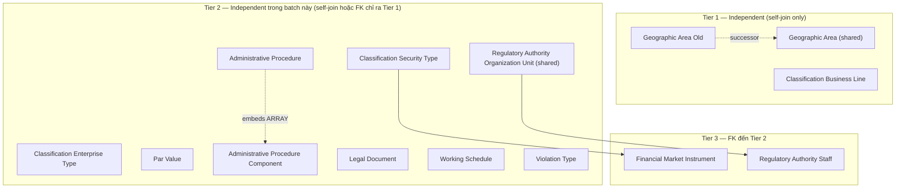

# ECAT HLD — Overview

**Source system:** ECAT (Dịch vụ đồng bộ danh mục dùng chung từ HTTT)
**Mô tả:** Hệ thống danh mục điện tử dùng chung (Electronic Catalogue) của Ủy ban Chứng khoán Nhà nước (UBCKNN) — quản lý các danh mục nền tảng dùng xuyên suốt các hệ thống nghiệp vụ khác của UBCKNN: danh mục địa lý hành chính, tổ chức & nhân sự nội bộ, tiền tệ, chứng khoán & thị trường, loại hình doanh nghiệp/nghiệp vụ, đối tượng tham gia thị trường, hành nghề & trình độ, thủ tục hành chính, vi phạm & xử phạt, thanh tra, văn bản pháp lý.

> **Phạm vi tài liệu này:** 53 bảng trong "ECAT in scope.txt" (Tier 1–3). ECAT còn nhiều bảng khác (Currency Company info, Security Company, Investment Fund, Violation Behavior, Inspection Content, đồng bộ dữ liệu liên thông, bảng kỹ thuật hệ thống...) **chưa thuộc phạm vi thiết kế** — sẽ bổ sung Tier tiếp theo khi có yêu cầu.

---

## Tổng quan Atomic Entities

| Tier | Atomic Entity | BCV Core Object | BCV Concept | table_type | Source Table(s) | Ghi chú |
|---|---|---|---|---|---|---|
| T1 | Geographic Area | Location | [Location] Geographic Area | Fundamental | ECAT.COUNTRY, ECAT.REGION, ECAT.PROVINCE_NEW, ECAT.WARD_NEW (+ NHNCK, FMS đã approved) | Shared entity đã approved — bổ sung nguồn ECAT. |
| T1 | Geographic Area Old | Location | [Location] Geographic Area | Fundamental | ECAT.PROVINCE_OLD, ECAT.DISTRICT_OLD, ECAT.WARD_OLD | Entity mới — dữ liệu lịch sử pre-2025 (3 cấp), tách riêng khỏi Geographic Area hiện hành. |
| T1 | Classification Business Line | Common | [Common] Industry Classification | Relative | ECAT.BUSINESS_LINE_LEVEL_1, ECAT.BUSINESS_LINE_LEVEL_2 | Entity mới — self-referencing 2 cấp, promote từ Classification Value theo quyết định modeler (T1-07). |
| T2 | Classification Enterprise Type | Involved Party | [Involved Party] Organization Type | Relative | ECAT.ENTERPRISE_TYPE | Entity mới — self-referencing hierarchy, mirror tiền lệ Classification Business Line. |
| T2 | Classification Security Type | Product | [Product] Financial Market Instrument Type (suy diễn) | Relative | ECAT.SECURITY_TYPE | Entity mới — self-referencing hierarchy. |
| T2 | Par Value | Condition | [Condition] Face Value | Fundamental | ECAT.PAR_VALUE | Entity mới — có Currency Amount thực (VALUE_AMOUNT), không phải Classification Value thuần. |
| T2 | Administrative Procedure | Business Direction | [Business Direction] Business Process (gần đúng) | Fundamental | ECAT.ADMINISTRATIVE_PROCEDURE | Entity mới — TTHC, embeds required_components (từ junction). |
| T2 | Administrative Procedure Component | Business Direction | [Business Direction] Business Process Component (suy diễn) | Fundamental | ECAT.ADMINISTRATIVE_PROCEDURE_COMPONENT | Entity mới — thành phần hồ sơ TTHC. |
| T2 | Legal Document | Documentation | [Documentation] Legal Document | Fundamental | ECAT.LEGAL_DOCUMENT | Entity mới. |
| T2 | Working Schedule | Business Direction | [Business Direction] Business Calendar (suy diễn) | Fundamental | ECAT.WORKING_SCHEDULE | Entity mới — BCV term chưa xác nhận (T2-04). |
| T2 | Violation Type | Condition | [Condition] Financial Charge (suy diễn) | Fundamental | ECAT.VIOLATION_TYPE | Entity mới — có FINE_AMOUNT thực, embeds applicable_penalty_form_codes (từ junction). |
| T2 | Regulatory Authority Organization Unit | Involved Party | [Involved Party] Organization Type | Fundamental | ECAT.DEPARTMENT (+ NHNCK.UNITS, NHNCK.DEPARTMENTS đã approved) | Shared entity đã approved — bổ sung nguồn ECAT. |
| T3 | Financial Market Instrument | Product | [Product] Financial Market Instrument | Relative | ECAT.SECURITY | Entity mới — phụ thuộc Classification Security Type (T2). |
| T3 | Regulatory Authority Staff | Involved Party | [Involved Party] Employee | Relative | ECAT.UBCK_STAFF | Entity mới — phụ thuộc Regulatory Authority Organization Unit (T2), cùng domain_prefix. |

**Tổng: 14 Atomic entities** (3 Tier 1, 9 Tier 2, 2 Tier 3)
*(Trong đó: 2 shared entities extend source_table — Geographic Area, Regulatory Authority Organization Unit — không tạo mới. 12 entity mới thực sự.)*

---

## Diagram Phân tầng Dependencies (Mermaid)

---

## Quyết định thiết kế chính

| # | Quyết định | Lý do |
|---|---|---|
| D-01 | Audit FK `CREATED_BY_ID`/`UPDATED_BY_ID` (→ UBCK_STAFF.ID) trên mọi bảng ECAT không tính là business dependency khi phân Tier. | Đây là audit trail chuẩn (INPUTTER/AUTHORISER pattern, CLAUDE.md), không phải quan hệ nghiệp vụ — nếu tính vào sẽ đẩy toàn bộ 44 bảng lên Tier phụ thuộc UBCK_STAFF sai bản chất. |
| D-02 | Đa số bảng "Danh mục X" (Code + Name + cờ trạng thái, không self-referencing, không instance data thực) → Classification Value, không tạo Atomic entity riêng. | Theo rule mặc định CLAUDE.md #11 (reference data set vs entity concept) và tiền lệ dự án (Classification Value scheme, xem `classification_schemes.yaml`). |
| D-03 | Bảng self-referencing hierarchy (ENTERPRISE_TYPE, SECURITY_TYPE) → promote thành Atomic entity riêng (domain_prefix `Classification`), mirror tiền lệ `Classification Business Line` ở Tier 1. | Classification Value là bảng phẳng dùng chung — không phù hợp lưu self-reference cha-con cần surrogate key điều hướng. |
| D-04 | Bảng có Currency Amount/instance data thực (PAR_VALUE, VIOLATION_TYPE) → promote thành Atomic entity Condition, dù tên gọi nguồn là "Danh mục X". | CLAUDE.md rule #9 — biểu phí/quy định = Condition, khác Classification Value thuần. |
| D-05 | CURRENCY xử lý như Classification Value (1 field Code, không cặp Id+Code), không tạo Atomic entity `Currency`. | CLAUDE.md rule #4 "Tương tự cho Currency" — Currency Code là data domain dùng chung, không phải entity độc lập trong dự án này. |
| D-06 | DEPARTMENT (ECAT) và UBCK_STAFF không tạo entity hoàn toàn mới mà DEPARTMENT tái sử dụng `Regulatory Authority Organization Unit` đã approved (từ NHNCK); UBCK_STAFF tạo entity mới cùng domain_prefix `Regulatory Authority`. | Cùng bản chất nghiệp vụ (tổ chức/nhân sự nội bộ UBCKNN) với entity NHNCK đã approved — tránh trùng lặp entity cho cùng 1 khái niệm. |
| D-07 | 5 bảng junction thuần túy (BUSINESS_EVENT_ENTERPRISE_TYPE, OPERATIONAL_STATUS_TYPE_ENTERPRISE_TYPE, ADMINISTRATIVE_PROCEDURE_COMPONENT_MAPPING, ORGANIZATION_TYPE_USER_TYPE, PENALTY_FORM_VIOLATION_TYPE) không tạo Atomic entity — denormalize thành ARRAY trên entity/Classification Value chính. | Đúng quy tắc "Pure junction table" trong SKILL — cơ chế lưu trữ chi tiết (STRUCT/mảng mã) quyết định tại LLD. |

---

#### 7a. Bảng tổng quan Atomic entities

| Tier | BCV Core Object | BCV Concept | Category | Source Table | Source Table Change Mode | Mô tả bảng nguồn | Atomic Entity | Table Type | BCV Term |
|---|---|---|---|---|---|---|---|---|---|
| T1 | Location | [Location] Geographic Area | Location | COUNTRY | Update | Danh mục Quốc gia | Geographic Area | Fundamental | Xem ECAT_HLD_Tier1.md mục 6a. |
| T1 | Location | [Location] Geographic Area | Location | REGION | Update | Danh mục Vùng/miền | Geographic Area | Fundamental | Xem ECAT_HLD_Tier1.md mục 6a. |
| T1 | Location | [Location] Geographic Area | Location | PROVINCE_NEW | Update | Danh mục Tỉnh/Thành phố (mới) | Geographic Area | Fundamental | Xem ECAT_HLD_Tier1.md mục 6a. |
| T1 | Location | [Location] Geographic Area | Location | WARD_NEW | Update | Danh mục Phường/Xã/Thị trấn (mới) | Geographic Area | Fundamental | Xem ECAT_HLD_Tier1.md mục 6a. |
| T1 | Location | [Location] Geographic Area | Location | PROVINCE_OLD | Update | Danh mục Tỉnh/Thành phố (cũ) | Geographic Area Old | Fundamental | Xem ECAT_HLD_Tier1.md mục 6a. |
| T1 | Location | [Location] Geographic Area | Location | DISTRICT_OLD | Update | Danh mục Quận/Huyện (cũ) | Geographic Area Old | Fundamental | Xem ECAT_HLD_Tier1.md mục 6a. |
| T1 | Location | [Location] Geographic Area | Location | WARD_OLD | Update | Danh mục Phường/Xã/Thị trấn (cũ) | Geographic Area Old | Fundamental | Xem ECAT_HLD_Tier1.md mục 6a. |
| T1 | Common | [Common] Industry Classification | Common | BUSINESS_LINE_LEVEL_1, BUSINESS_LINE_LEVEL_2 | Update | Danh mục ngành nghề cấp 1 + cấp 2 | Classification Business Line | Relative | Xem ECAT_HLD_Tier1.md mục 6a. |
| T2 | Involved Party | [Involved Party] Organization Type | Involved Party | ENTERPRISE_TYPE | Update | Danh mục Loại hình doanh nghiệp | Classification Enterprise Type | Relative | Xem ECAT_HLD_Tier2.md mục 6a. |
| T2 | Product | [Product] Financial Market Instrument Type (suy diễn) | Product | SECURITY_TYPE | Update | Danh mục Loại chứng khoán | Classification Security Type | Relative | Xem ECAT_HLD_Tier2.md mục 6a. |
| T2 | Condition | [Condition] Face Value | Condition | PAR_VALUE | Update | Danh mục Mệnh giá chứng khoán | Par Value | Fundamental | Xem ECAT_HLD_Tier2.md mục 6a. |
| T2 | Business Direction | [Business Direction] Business Process (gần đúng) | Business Direction | ADMINISTRATIVE_PROCEDURE | Update | Danh mục Thủ tục hành chính | Administrative Procedure | Fundamental | Xem ECAT_HLD_Tier2.md mục 6a. |
| T2 | Business Direction | [Business Direction] Business Process Component (suy diễn) | Business Direction | ADMINISTRATIVE_PROCEDURE_COMPONENT | Update | Thành phần hồ sơ TTHC | Administrative Procedure Component | Fundamental | Xem ECAT_HLD_Tier2.md mục 6a. |
| T2 | Documentation | [Documentation] Legal Document | Documentation | LEGAL_DOCUMENT | Update | Bảng thông tin văn bản pháp lý | Legal Document | Fundamental | Xem ECAT_HLD_Tier2.md mục 6a. |
| T2 | Business Direction | [Business Direction] Business Calendar (suy diễn) | Business Direction | WORKING_SCHEDULE | Update | Danh mục Lịch làm việc | Working Schedule | Fundamental | Xem ECAT_HLD_Tier2.md mục 6a. |
| T2 | Condition | [Condition] Financial Charge (suy diễn) | Condition | VIOLATION_TYPE | Update | Danh mục loại vi phạm | Violation Type | Fundamental | Xem ECAT_HLD_Tier2.md mục 6a. |
| T2 | Involved Party | [Involved Party] Organization Type | Involved Party | DEPARTMENT | Update | Danh mục Phòng ban (UBCKNN) | Regulatory Authority Organization Unit | Fundamental | Xem ECAT_HLD_Tier2.md mục 6a. |
| T3 | Product | [Product] Financial Market Instrument | Product | SECURITY | Update | Danh mục Chứng khoán | Financial Market Instrument | Relative | Xem ECAT_HLD_Tier3.md mục 6a. |
| T3 | Involved Party | [Involved Party] Employee | Involved Party | UBCK_STAFF | Update | Danh mục nhân sự UBCKNN | Regulatory Authority Staff | Relative | Xem ECAT_HLD_Tier3.md mục 6a. |

#### 7b. Diagram Atomic tổng (Mermaid)

```mermaid
erDiagram
    GeographicArea {
        bigint geo_id PK
        string geo_code
    }
    GeographicAreaOld {
        bigint geo_old_id PK
        string geo_old_code
    }
    ClassificationBusinessLine {
        bigint biz_line_id PK
        string biz_line_code
    }
    ClassificationEnterpriseType {
        bigint enterprise_type_id PK
        string enterprise_type_code
    }
    ClassificationSecurityType {
        bigint security_type_id PK
        string security_type_code
    }
    ParValue {
        bigint par_value_id PK
    }
    AdministrativeProcedure {
        bigint administrative_procedure_id PK
    }
    AdministrativeProcedureComponent {
        bigint administrative_procedure_component_id PK
    }
    LegalDocument {
        bigint legal_document_id PK
    }
    WorkingSchedule {
        bigint working_schedule_id PK
    }
    ViolationType {
        bigint violation_type_id PK
    }
    RegulatoryAuthorityOrganizationUnit {
        bigint ra_organization_unit_id PK
    }
    FinancialMarketInstrument {
        bigint financial_market_instrument_id PK
        bigint security_type_id FK
    }
    RegulatoryAuthorityStaff {
        bigint ra_staff_id PK
        bigint ra_organization_unit_id FK
    }

    GeographicArea ||--o{ GeographicArea : "self-join"
    GeographicAreaOld ||--o{ GeographicAreaOld : "self-join"
    GeographicArea ||--o{ GeographicAreaOld : "anchor / successor"
    ClassificationBusinessLine ||--o{ ClassificationBusinessLine : "self-join"
    ClassificationEnterpriseType ||--o{ ClassificationEnterpriseType : "self-join"
    ClassificationSecurityType ||--o{ ClassificationSecurityType : "self-join"
    RegulatoryAuthorityOrganizationUnit ||--o{ RegulatoryAuthorityOrganizationUnit : "self-join"
    ClassificationSecurityType ||--o{ FinancialMarketInstrument : "security_type_id"
    RegulatoryAuthorityOrganizationUnit ||--o{ RegulatoryAuthorityStaff : "ra_organization_unit_id"
    AdministrativeProcedure ||--o{ AdministrativeProcedureComponent : "denormalized ARRAY (required_components)"
```

#### 7c. Bảng Classification Value

| Source Table | Mô tả | BCV Term | Xử lý Atomic |
|---|---|---|---|
| CURRENCY | Danh mục Tiền tệ | [Common] Currency | Scheme `ECAT_CURRENCY`. Xử lý như data domain 1-field theo CLAUDE.md rule #4, không tạo entity. |
| MARKET | Danh mục Thị trường | Classification Value | Scheme `ECAT_MARKET`. |
| FINANCIAL_INDICATOR | Danh mục Chỉ tiêu tài chính | Classification Value | Scheme `ECAT_FINANCIAL_INDICATOR`. |
| FINANCIAL_REPORT_TYPE | Danh mục Loại báo cáo tài chính | Classification Value | Scheme `ECAT_FINANCIAL_REPORT_TYPE`. |
| INVESTOR_CATEGORY | Danh mục loại nhà đầu tư/cổ đông | Classification Value | Scheme `ECAT_INVESTOR_CATEGORY`. |
| INVESTOR_TYPE | Loại hình nhà đầu tư/cổ đông | Classification Value | Scheme `ECAT_INVESTOR_TYPE`. |
| FUND_TYPE | Danh mục loại hình quỹ | Classification Value | Scheme `ECAT_FUND_TYPE`. |
| APPLIED_SUBJECT | Danh mục Đối tượng áp dụng | Classification Value | Scheme `ECAT_APPLIED_SUBJECT`. |
| FREQUENCY_REPORT | Danh mục Kỳ báo cáo | Classification Value | Scheme `ECAT_FREQUENCY_REPORT`. |
| RELATIONSHIP_CATEGORY | Danh mục Quan hệ | Classification Value | Scheme `ECAT_RELATIONSHIP_CATEGORY`. |
| QUALIFICATION_CATEGORY | Danh mục Trình độ | Classification Value | Scheme `ECAT_QUALIFICATION_CATEGORY`. |
| PRACTICE_CERTIFICATE_TYPE | Danh mục Loại chứng chỉ hành nghề | Classification Value | Scheme `ECAT_PRACTICE_CERTIFICATE_TYPE`. |
| PRACTICE_CERTIFICATE | Danh mục Chứng chỉ hành nghề | Classification Value | Scheme `ECAT_PRACTICE_CERTIFICATE`. |
| ORGANIZATION_TYPE | Danh mục loại tổ chức | [Involved Party] Organization Type | Scheme `ECAT_ORGANIZATION_TYPE`. |
| FOREIGN_INVESTOR_TYPE | Danh mục loại nhà đầu tư nước ngoài | Classification Value | Scheme `ECAT_FOREIGN_INVESTOR_TYPE`. |
| ACTIVITY_STATUS | Danh mục tình trạng hoạt động | Classification Value | Scheme `ECAT_ACTIVITY_STATUS`. |
| ACTIVE_STATUS | Bảng trạng thái hoạt động | Classification Value | Scheme `ECAT_ACTIVE_STATUS`. Chỉ ID+NAME. |
| PENALTY_FORM | Danh mục Hình thức xử phạt | Classification Value | Scheme `ECAT_PENALTY_FORM`. |
| INSPECTION_TARGET | Danh mục Đối tượng thanh tra | Classification Value | Scheme `ECAT_INSPECTION_TARGET`. |
| ENTERPRISE_POSITION_TYPE | Danh mục Loại chức vụ doanh nghiệp | Classification Value | Scheme `ECAT_ENTERPRISE_POSITION_TYPE`. |
| ENTERPRISE_POSITION | Danh mục Chức vụ doanh nghiệp | Classification Value | Scheme `ECAT_ENTERPRISE_POSITION`. |
| POSITION_TYPE | Danh mục Loại chức danh | Classification Value | Scheme `ECAT_POSITION_TYPE`. |
| POSITION | Danh mục Chức danh | Classification Value | Scheme `ECAT_POSITION`. FK từ Regulatory Authority Staff (T3). |
| AGENT_TYPE | Danh mục loại đại lý | Classification Value | Scheme `ECAT_AGENT_TYPE`. |
| BUSINESS_SERVICE | Danh mục Dịch vụ kinh doanh | Classification Value | Scheme `ECAT_BUSINESS_SERVICE`. |
| BUSINESS_EVENT | Danh mục Sự vụ | Classification Value | Scheme `ECAT_BUSINESS_EVENT`. |
| OPERATIONAL_STATUS_TYPE | Danh mục Loại trạng thái hoạt động | Classification Value | Scheme `ECAT_OPERATIONAL_STATUS_TYPE`. |

#### 7d. Junction Tables

| Source Table | Mô tả | Entity chính | Xử lý trên Atomic |
|---|---|---|---|
| BUSINESS_EVENT_ENTERPRISE_TYPE | N-N: Sự vụ - Loại hình doanh nghiệp | Classification Enterprise Type | Denormalize `applicable_business_event_codes ARRAY<STRING>` lên Classification Enterprise Type (BUSINESS_EVENT là Classification Value phẳng). |
| OPERATIONAL_STATUS_TYPE_ENTERPRISE_TYPE | N-N: Loại trạng thái hoạt động - Loại hình doanh nghiệp | Classification Enterprise Type | Denormalize `applicable_operational_status_codes ARRAY<STRING>` lên Classification Enterprise Type. |
| ADMINISTRATIVE_PROCEDURE_COMPONENT_MAPPING | N-N: TTHC - Thành phần TTHC | Administrative Procedure | Denormalize `required_components ARRAY<STRUCT<administrative_procedure_component_id, administrative_procedure_component_code>>` lên Administrative Procedure. |
| ORGANIZATION_TYPE_USER_TYPE | N-N: Loại tổ chức - Loại đối tượng (USER_TYPE) | ORGANIZATION_TYPE (Classification Value) | Junction giữa Classification Value và coded value — cơ chế denormalize xác nhận tại LLD (xem Tier2 6f-05). |
| PENALTY_FORM_VIOLATION_TYPE | N-N: Hình thức xử phạt - Loại vi phạm | Violation Type | Denormalize `applicable_penalty_form_codes ARRAY<STRING>` lên Violation Type (PENALTY_FORM là Classification Value phẳng). |

#### 7e. Điểm cần xác nhận

| # | Tier | Câu hỏi | Ảnh hưởng |
|---|---|---|---|
| 1 | T2 | `Classification Enterprise Type`/`Classification Security Type` promote từ self-referencing hierarchy, mirror tiền lệ Tier 1 — cần Data Modeler xác nhận cách xử lý. | Ảnh hưởng domain_prefix + table_type của 2 entity, và toàn bộ FK từ Tier 3/tier sau. |
| 2 | T2 | BCV Term suy diễn (không tìm được match chính xác) cho: Classification Security Type, Administrative Procedure, Administrative Procedure Component, Working Schedule, Violation Type. | Có thể cần đổi tên/category khi rà soát BCV sâu hơn — chưa ảnh hưởng cấu trúc bảng. |
| 3 | T2 | Cơ chế denormalize chính xác cho 5 junction table (7d) — mảng STRUCT/STRING trên entity thật thì rõ ràng, nhưng junction có 1 bên là Classification Value phẳng (dùng chung 1 bảng cho mọi scheme) cần xác nhận tại LLD có hỗ trợ thuộc tính mảng riêng theo scheme hay không. | Ảnh hưởng thiết kế LLD của ORGANIZATION_TYPE_USER_TYPE, BUSINESS_EVENT_ENTERPRISE_TYPE, OPERATIONAL_STATUS_TYPE_ENTERPRISE_TYPE. |
| 4 | T2 | `INSPECTION_TARGET` — `table_meaning` trong `brd_ECAT.yaml` ("Danh mục Tổ chức kiểm toán được chấp thuận") không khớp nội dung cột thực tế (danh mục đối tượng thanh tra) — nghi copy-paste error từ APPROVED_AUDIT_FIRM. | Không ảnh hưởng thiết kế Atomic (đã xử lý theo nội dung cột thực tế) — chỉ cần sửa tài liệu nguồn. |
| 5 | T1 | (Kế thừa từ Tier 1) 7 vấn đề T1-01 đến T1-08 — xem `ECAT_HLD_Tier1.md` mục 6f, chưa có thay đổi. | Không ảnh hưởng Tier 2/3. |

#### 7f. Bảng ngoài scope

*(Chưa phát sinh bảng ngoài scope trong 53 bảng "ECAT in scope.txt" — toàn bộ đã map vào Atomic entity hoặc Classification Value. Các bảng ECAT khác ngoài danh sách 53 bảng — VD: FUND_MANAGEMENT_COMPANY, SECURITY_COMPANY, INVESTMENT_FUND, VIOLATION_BEHAVIOR, DISCLOSURE_REPORT, bảng đồng bộ BTC/DVCQG, bảng kỹ thuật QRTZ_*/DATABASECHANGELOG* — chưa được đánh giá scope trong tài liệu này, sẽ xử lý ở tier sau khi có yêu cầu thiết kế.)*

---

## Entities

> Single source of truth cho metadata entity. `aggregate_atomic.py` parse section này để sinh `atomic_entities.yaml`.
> Format bắt buộc: heading `### N.` + dòng `**Description:**` trong 500 ký tự đầu tiên sau heading.

### 1. Geographic Area
**Tier:** 1 | **Source:** `ECAT.COUNTRY, ECAT.REGION, ECAT.PROVINCE_NEW, ECAT.WARD_NEW` | **BCV Concept:** [Location] Geographic Area | **BCO:** Location | **Table Type:** Fundamental
**Domain Prefix:** (none)
**Description:** Khu vực địa lý hành chính hiện hành (Quốc gia/Vùng/Tỉnh/Phường-Xã), self-referencing qua Geographic Area Type Code. Entity đã approved (NHNCK, FMS) — ECAT bổ sung nguồn cho 4 cấp Quốc gia/Vùng/Tỉnh/Phường hiện hành.

### 2. Geographic Area Old
**Tier:** 1 | **Source:** `ECAT.PROVINCE_OLD, ECAT.DISTRICT_OLD, ECAT.WARD_OLD` | **BCV Concept:** [Location] Geographic Area | **BCO:** Location | **Table Type:** Fundamental
**Domain Prefix:** (none)
**Description:** Khu vực địa lý hành chính lịch sử (pre-2025, 3 cấp Tỉnh/Quận-Huyện/Phường-Xã cũ), self-referencing riêng biệt với Geographic Area hiện hành, có liên kết successor sang tỉnh/phường mới tương ứng.

### 3. Classification Business Line
**Tier:** 1 | **Source:** `ECAT.BUSINESS_LINE_LEVEL_1, ECAT.BUSINESS_LINE_LEVEL_2` | **BCV Concept:** [Common] Industry Classification | **BCO:** Common | **Table Type:** Relative
**Domain Prefix:** Classification
**Description:** Danh mục ngành nghề kinh doanh 2 cấp (cấp 1/cấp 2), self-referencing qua Parent Business Line, promote từ Classification Value theo quyết định modeler.

### 4. Classification Enterprise Type
**Tier:** 2 | **Source:** `ECAT.ENTERPRISE_TYPE` | **BCV Concept:** [Involved Party] Organization Type | **BCO:** Involved Party | **Table Type:** Relative
**Domain Prefix:** Classification
**Description:** Danh mục loại hình doanh nghiệp (TNHH, Cổ phần...), self-referencing hierarchy, promote từ Classification Value mirror tiền lệ Classification Business Line. Đồng thời mang thuộc tính denormalized từ 2 junction (Business Event, Operational Status Type áp dụng).

### 5. Classification Security Type
**Tier:** 2 | **Source:** `ECAT.SECURITY_TYPE` | **BCV Concept:** [Product] Financial Market Instrument Type (suy diễn) | **BCO:** Product | **Table Type:** Relative
**Domain Prefix:** Classification
**Description:** Danh mục loại chứng khoán (cổ phiếu/trái phiếu...), self-referencing hierarchy, promote từ Classification Value do có cấu trúc phân cấp cha-con.

### 6. Par Value
**Tier:** 2 | **Source:** `ECAT.PAR_VALUE` | **BCV Concept:** [Condition] Face Value | **BCO:** Condition | **Table Type:** Fundamental
**Domain Prefix:** (none)
**Description:** Mệnh giá chuẩn của chứng khoán theo loại áp dụng (cổ phiếu/trái phiếu) và đơn vị tiền tệ — mang giá trị Currency Amount thực, không phải danh mục phân loại thuần túy.

### 7. Administrative Procedure
**Tier:** 2 | **Source:** `ECAT.ADMINISTRATIVE_PROCEDURE` | **BCV Concept:** [Business Direction] Business Process (gần đúng) | **BCO:** Business Direction | **Table Type:** Fundamental
**Domain Prefix:** Administrative Procedure
**Description:** Thủ tục hành chính (TTHC) do UBCKNN quản lý — bao gồm lệ phí, thời gian xử lý, cơ quan có thẩm quyền, căn cứ pháp lý; embeds danh sách thành phần hồ sơ bắt buộc (denormalized từ junction).

### 8. Administrative Procedure Component
**Tier:** 2 | **Source:** `ECAT.ADMINISTRATIVE_PROCEDURE_COMPONENT` | **BCV Concept:** [Business Direction] Business Process Component (suy diễn) | **BCO:** Business Direction | **Table Type:** Fundamental
**Domain Prefix:** Administrative Procedure
**Description:** Thành phần hồ sơ của thủ tục hành chính — số lượng bản chính/bản sao, cờ bắt buộc, hỗ trợ e-form.

### 9. Legal Document
**Tier:** 2 | **Source:** `ECAT.LEGAL_DOCUMENT` | **BCV Concept:** [Documentation] Legal Document | **BCO:** Documentation | **Table Type:** Fundamental
**Domain Prefix:** (none)
**Description:** Văn bản pháp lý do UBCKNN quản lý — cơ quan ban hành, ngày ban hành/hiệu lực, tình trạng hiệu lực.

### 10. Working Schedule
**Tier:** 2 | **Source:** `ECAT.WORKING_SCHEDULE` | **BCV Concept:** [Business Direction] Business Calendar (suy diễn) | **BCO:** Business Direction | **Table Type:** Fundamental
**Domain Prefix:** (none)
**Description:** Lịch làm việc áp dụng theo khoảng thời gian cụ thể (ngày bắt đầu/kết thúc) — BCV term chưa xác nhận chính xác, cần rà soát ý nghĩa nghiệp vụ ở LLD.

### 11. Violation Type
**Tier:** 2 | **Source:** `ECAT.VIOLATION_TYPE` | **BCV Concept:** [Condition] Financial Charge (suy diễn) | **BCO:** Condition | **Table Type:** Fundamental
**Domain Prefix:** (none)
**Description:** Loại vi phạm và mức tiền phạt tương ứng (Currency Amount thực) — embeds danh sách hình thức xử phạt áp dụng (denormalized từ junction với Classification Value Penalty Form).

### 12. Regulatory Authority Organization Unit
**Tier:** 2 | **Source:** `ECAT.DEPARTMENT` (+ NHNCK.UNITS, NHNCK.DEPARTMENTS) | **BCV Concept:** [Involved Party] Organization Type | **BCO:** Involved Party | **Table Type:** Fundamental
**Domain Prefix:** Regulatory Authority
**Description:** Đơn vị/phòng ban thuộc UBCKNN — cấu trúc cây self-referencing. Entity đã approved từ NHNCK — ECAT bổ sung nguồn ECAT.DEPARTMENT (cùng bản chất "Danh mục Phòng ban" UBCKNN).

### 13. Financial Market Instrument
**Tier:** 3 | **Source:** `ECAT.SECURITY` | **BCV Concept:** [Product] Financial Market Instrument | **BCO:** Product | **Table Type:** Relative
**Domain Prefix:** (none)
**Description:** Chứng khoán cụ thể được niêm yết/giao dịch trên thị trường — mỗi dòng là 1 chứng khoán, phân loại theo Classification Security Type, giao dịch tại Market (Classification Value).

### 14. Regulatory Authority Staff
**Tier:** 3 | **Source:** `ECAT.UBCK_STAFF` | **BCV Concept:** [Involved Party] Employee | **BCO:** Involved Party | **Table Type:** Relative
**Domain Prefix:** Regulatory Authority
**Description:** Cán bộ, nhân sự của UBCKNN — thuộc 1 đơn vị (Regulatory Authority Organization Unit), giữ 1 chức danh và loại tổ chức (Classification Value).
