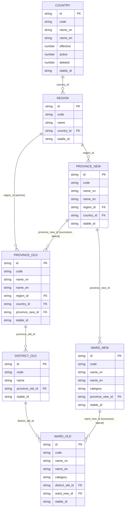
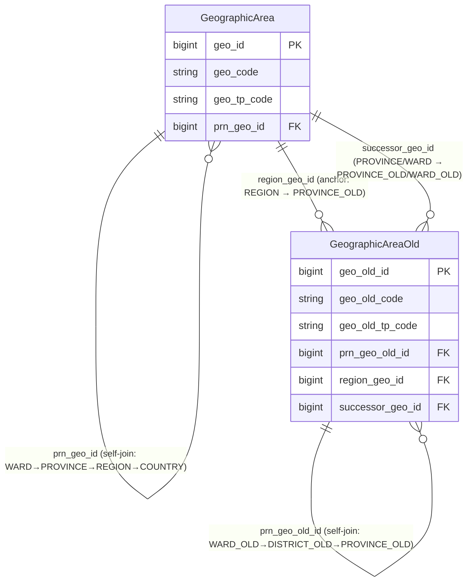

# ECAT HLD — Tier 1

**Source system:** ECAT (Dịch vụ đồng bộ danh mục dùng chung từ HTTT)
**Tier 1:** Nhóm danh mục địa lý hành chính (Geographic Area) — Fundamental, chỉ tự tham chiếu (self-join), không FK đến entity nghiệp vụ nào khác. Phạm vi tier này: 7 bảng COUNTRY, REGION, PROVINCE_NEW, PROVINCE_OLD, DISTRICT_OLD, WARD_NEW, WARD_OLD. Các bảng ECAT khác (Currency, Security, 36 Classification Value) chưa thiết kế trong tier này — xem mục 6e.

> **Lưu ý nguồn:** `brd_ECAT.yaml` đặt tên 7 bảng này theo quy ước `ECAT_0N_TenBang` (VD `ECAT_01_Country`), nhưng khảo sát CSDL thực tế (`Source/ECAT_Tables.csv`, `Source/ECAT_Columns.csv`) dùng tên bảng thực `COUNTRY`, `REGION`, `PROVINCE_NEW`, `PROVINCE_OLD`, `DISTRICT_OLD`, `WARD_NEW`, `WARD_OLD` — khớp với tên user cung cấp. Tier này dùng tên bảng thực từ `Source/ECAT_Columns.csv` làm chuẩn (xem mục 6f-01).

---

## 6a. Bảng tổng quan BCV Concept

| BCV Core Object | BCV Concept | Category | Source Table | Source Table Change Mode | Mô tả bảng nguồn | Atomic Entity | Table Type | BCV Term |
|---|---|---|---|---|---|---|---|---|
| Location | [Location] Geographic Area | Location | COUNTRY | Update | Danh mục Quốc gia | Geographic Area | Fundamental | (1) Term "Geographic Area" (BCV id 11736, category Location): "nơi/khu vực giới hạn được xác định theo bản chất, cơ quan bên ngoài, hoặc mục đích kinh doanh nội bộ". (2) Cấu trúc trường COUNTRY chỉ có CODE + NAME_VN/NAME_EN (+ cờ EFFECTIVE/ACTIVE/DELETED) — nếu theo quy tắc chung đây sẽ là Classification Value, nhưng thuộc **ngoại lệ Geographic Area** của dự án (entity địa lý luôn là Atomic entity Fundamental dù chỉ Code+Name, vì có Data Concept riêng = Location, dùng làm FK nền tảng toàn dự án). (3) Chọn Geographic Area — entity đã **approved** (nguồn hiện có: NHNCK.COUNTRIES, FMS.NATIONAL...). ECAT bổ sung COUNTRY là source mới, `geographic_area_type_code = COUNTRY`. |
| Location | [Location] Geographic Area | Location | REGION | Update | Danh mục Vùng/miền | Geographic Area | Fundamental | (1) Cùng Geographic Area term như COUNTRY. (2) REGION có FK `COUNTRY_ID` → COUNTRY.ID — xác nhận Region là con trực tiếp của Country trong phân cấp hành chính (khác với `brd_ECAT.yaml`/`ECAT_Source_Analysis.md` v2 ghi nhận "không có FK giữa Country và Region" — bản khảo sát CSDL thực tế mới hơn cho thấy có FK). (3) Chọn Geographic Area, `geographic_area_type_code = REGION`, `parent_geographic_area_id` trỏ lên COUNTRY. |
| Location | [Location] Geographic Area | Location | PROVINCE_NEW | Update | Danh mục Tỉnh/Thành phố (mới, hiện hành post-sáp nhập 2025) | Geographic Area | Fundamental | (1) Cùng Geographic Area term. (2) PROVINCE_NEW có FK `REGION_ID` → REGION.ID (parent trực tiếp) và `COUNTRY_ID` → COUNTRY.ID (denormalized, suy ra được qua REGION nên không lưu lại trên Atomic). (3) Chọn Geographic Area, `geographic_area_type_code = PROVINCE` (giữ nguyên code đã dùng cho FIMS.LOCATION/SCMS.DM_TINH_THANH — cùng ý nghĩa "tỉnh/thành phố hiện hành"), `parent_geographic_area_id` trỏ lên REGION. |
| Location | [Location] Geographic Area | Location | WARD_NEW | Update | Danh mục Phường/Xã/Thị trấn (mới, hiện hành post-sáp nhập 2025) | Geographic Area | Fundamental | (1) Cùng Geographic Area term. (2) WARD_NEW có FK `PROVINCE_NEW_ID` → PROVINCE_NEW.ID — cấp quận/huyện bị bỏ hoàn toàn trong hiện hành (Ward là con trực tiếp của Province, không qua District). (3) Chọn Geographic Area, `geographic_area_type_code = WARD`, `parent_geographic_area_id` trỏ lên PROVINCE_NEW. |
| Location | [Location] Geographic Area | Location | PROVINCE_OLD | Update | Danh mục Tỉnh/Thành phố (cũ, pre-2025) | **Geographic Area Old** | Fundamental | (1) Cùng term Geographic Area — không có term BCV riêng cho khái niệm "danh mục lịch sử". (2) Cấu trúc trường **khác PROVINCE_NEW**: ngoài REGION_ID/COUNTRY_ID (anchor lên Geographic Area hiện hành), PROVINCE_OLD còn có `PROVINCE_NEW_ID` — FK **successor** trỏ sang tỉnh/thành phố hiện hành tương ứng sau sáp nhập. Cấp bậc phân cấp cũ (3 cấp: Tỉnh cũ → Quận/huyện cũ → Phường/xã cũ) khác cấu trúc mới (2 cấp: Tỉnh mới → Phường/xã mới) — không thể gộp chung 1 entity với cùng field `parent_geographic_area_id` mà không mất thông tin cấp bậc. (3) Theo yêu cầu Data Modeler, **tách riêng entity "Geographic Area Old"** cho toàn bộ dữ liệu lịch sử pre-2025 — giữ nguyên concept `[Location] Geographic Area` nhưng entity riêng để phản ánh đúng cấu trúc 3 cấp và mục đích "chỉ tra cứu lịch sử, không phát sinh instance mới". |
| Location | [Location] Geographic Area | Location | DISTRICT_OLD | Update | Danh mục Quận/Huyện (cũ, pre-2025 — cấp bị bỏ sau sáp nhập) | **Geographic Area Old** | Fundamental | (1) Cùng term Geographic Area. (2) DISTRICT_OLD chỉ có FK `PROVINCE_OLD_ID` — không có field successor (khác PROVINCE_OLD/WARD_OLD) vì cấp quận/huyện bị loại bỏ hoàn toàn trong cấu trúc mới, không có "district mới" tương ứng. (3) Geographic Area Old, `geographic_area_old_type_code = DISTRICT_OLD`, `parent_geographic_area_old_id` trỏ lên PROVINCE_OLD. |
| Location | [Location] Geographic Area | Location | WARD_OLD | Update | Danh mục Phường/Xã/Thị trấn (cũ, pre-2025) | **Geographic Area Old** | Fundamental | (1) Cùng term Geographic Area. (2) WARD_OLD có FK `DISTRICT_OLD_ID` (parent trực tiếp) và `WARD_NEW_ID` — FK successor trỏ sang phường/xã hiện hành tương ứng. (3) Geographic Area Old, `geographic_area_old_type_code = WARD_OLD`, `parent_geographic_area_old_id` trỏ lên DISTRICT_OLD; đồng thời giữ successor link sang Geographic Area (WARD_NEW) — xem mục 6f-02. |

---

## 6b. Diagram Source (Mermaid)

> `country_id` trên `PROVINCE_NEW`/`PROVINCE_OLD` là denormalized (suy ra được qua `region_id` → `REGION.country_id`) — không vẽ riêng để tránh rối diagram. Quan hệ `province_new_id` trên `PROVINCE_OLD` và `ward_new_id` trên `WARD_OLD` là **successor mapping** (tỉnh/phường cũ → tỉnh/phường mới sau sáp nhập 2025), không phải quan hệ cha-con — vẽ riêng để phân biệt với FK phân cấp (`region_id`, `province_old_id`, `district_old_id`).

---

## 6c. Diagram Atomic (Mermaid)

> `GeographicArea` là entity **đã approved** (nguồn hiện có: NHNCK.COUNTRIES/PROVINCES/DISTRICTS, FMS.NATIONAL) — tier này chỉ bổ sung ECAT làm source mới cho 4 loại COUNTRY/REGION/PROVINCE/WARD hiện hành, không đổi tên/cấu trúc entity. `GeographicAreaOld` là entity **mới** theo yêu cầu Data Modeler.

---

## 6d. Mục Danh mục & Tham chiếu (Reference Data)

| Source Field / Bảng | Mô tả | Scheme Code | source_type | Ghi chú |
|---|---|---|---|---|
| ETL derive từ tên bảng nguồn (COUNTRY/REGION/PROVINCE_NEW/WARD_NEW) | Phân biệt cấp hành chính hiện hành trên entity Geographic Area | `GEOGRAPHIC_AREA_TYPE` | etl_derived | Đã có từ trước (NHNCK/FMS/SCMS: COUNTRY, PROVINCE). Bổ sung code `REGION`, `WARD`; source_table của `COUNTRY`/`PROVINCE` bổ sung `ECAT.COUNTRY`/`ECAT.PROVINCE_NEW`. |
| ETL derive từ tên bảng nguồn (PROVINCE_OLD/DISTRICT_OLD/WARD_OLD) | Phân biệt cấp hành chính lịch sử (pre-2025) trên entity Geographic Area Old | `GEOGRAPHIC_AREA_OLD_TYPE` | etl_derived | Scheme mới — tách khỏi `GEOGRAPHIC_AREA_TYPE` (3 code `PROVINCE_OLD`/`DISTRICT_OLD`/`WARD_OLD` chuyển từ scheme cũ sang scheme này). |
| `EFFECTIVE` + `ACTIVE` + `DELETED` (cả 7 bảng) | 3 cờ trạng thái nguồn (hiệu lực / đang dùng / xóa mềm) — Atomic gộp thành 1 status code duy nhất | `GEOGRAPHIC_AREA_STATUS` | etl_derived | Scheme đã có sẵn (dùng chung cho `Geographic Area`); bổ sung `Geographic Area Old` vào `used_in_entities`. Logic gộp 3 cờ → 1 status: để LLD xác nhận (mục 6f-04). |

---

## 6e. Bảng chờ thiết kế

*(Không có — 7/7 bảng trong phạm vi tier này đã có đủ cấu trúc cột từ `Source/ECAT_Columns.csv` để thiết kế.)*

Các bảng ECAT khác (Currency, Security + 3 CV liên quan, Calendar Date, 36 bảng Classification Value còn lại) **chưa thuộc phạm vi tier này** — chờ thiết kế ở tier/lần làm việc tiếp theo.

---

## 6f. Điểm cần xác nhận

| # | Câu hỏi | Kết quả |
|---|---|---|
| T1-01 | `brd_ECAT.yaml` đặt tên 7 bảng theo quy ước `ECAT_0N_TenBang` (VD `ECAT_01_Country`), không khớp tên bảng thực trong `Source/ECAT_Tables.csv`/`ECAT_Columns.csv` (`COUNTRY`, `REGION`, `PROVINCE_NEW`...). Tương tự, `ECAT_Source_Analysis.md` (v2, working doc) ghi "không có FK giữa Country và Region trong ECAT" — khảo sát CSDL thực tế cho thấy `REGION.COUNTRY_ID` là FK thật. | Chưa xác nhận. Tier này ưu tiên dùng `Source/ECAT_Columns.csv` (khảo sát CSDL thực tế) làm chuẩn. Đề xuất: chạy lại `source-survey` cho ECAT để regenerate `brd_ECAT.yaml` + per-table BRD yaml khớp tên bảng thực, thay vì để 2 nguồn tài liệu lệch nhau. |
| T1-02 | `PROVINCE_OLD.PROVINCE_NEW_ID` và `WARD_OLD.WARD_NEW_ID` là FK "successor" (tỉnh/phường cũ → tỉnh/phường mới tương ứng sau sáp nhập 2025) — cross-entity từ Geographic Area Old sang Geographic Area, khác bản chất với FK phân cấp cha-con (`parent_geographic_area_old_id`). Đặt tên attribute nào cho field này ở LLD? (Đề xuất: `Successor Geographic Area Id` + `Successor Geographic Area Code`.) | Chưa xác nhận — quyết định tại LLD. |
| T1-03 | `PROVINCE_OLD.REGION_ID`/`COUNTRY_ID` là FK "anchor" trỏ từ Geographic Area Old lên Geographic Area (Region/Country dùng chung cho cả 2 hệ phân cấp cũ/mới, không có bản "_OLD" riêng). Đặt tên attribute nào cho field cross-entity này ở LLD? (Đề xuất: `Region Geographic Area Id` + `Region Geographic Area Code`; không lưu `Country Geographic Area Id` riêng vì suy ra được qua Region.) | Chưa xác nhận — quyết định tại LLD. |
| T1-04 | Nguồn có 3 cờ trạng thái riêng biệt trên mỗi bảng: `EFFECTIVE` (hiệu lực/hết hiệu lực), `ACTIVE` (đang dùng/không dùng), `DELETED` (xóa mềm). Atomic có nên gộp cả 3 vào 1 `geographic_area_status_code` (scheme `GEOGRAPHIC_AREA_STATUS`), hay giữ 3 field boolean riêng? | Chưa xác nhận — quyết định tại LLD. |
| T1-05 | Nguồn có cơ chế versioning riêng: `VERSION`, `EFFECTIVE_START_DATE`/`EFFECTIVE_END_DATE`, `STABLE_ID`, `OLD_ID` — gợi ý `ID` là surrogate **theo từng version** (đổi khi record được sửa), còn `STABLE_ID` mới là định danh bền vững xuyên suốt các version. Business Key (BK) cho ETL nên dùng `STABLE_ID` hay `CODE`, không nên dùng `ID`? | Chưa xác nhận — quyết định tại LLD (ảnh hưởng đến cách resolve `parent_code`/FK giữa các version). |
| T1-06 | Entity `Geographic Area` hiện đã **approved** với nguồn NHNCK.COUNTRIES/PROVINCES/DISTRICTS (banking clearing system) — các bảng này nhiều khả năng phản ánh cấu trúc hành chính **tại thời điểm NHNCK triển khai** (có thể là cấu trúc cũ 3 cấp, trước khi ECAT giới thiệu khái niệm "old/new" song song). Cần review liệu NHNCK.PROVINCES/DISTRICTS nên map vào `Geographic Area` (hiện hành) hay `Geographic Area Old` (lịch sử) — **không tự sửa mapping NHNCK đã approved trong tier này**, chỉ ghi nhận để review riêng. | Chưa xác nhận — cần review riêng ngoài phạm vi ECAT. |
