# ECAT HLD — Tier 2

**Source system:** ECAT (Dịch vụ đồng bộ danh mục dùng chung từ HTTT)
**Tier 2:** Nhóm bảng danh mục không FK đến bảng nghiệp vụ nào khác trong scope hiện tại (ngoại trừ self-reference hoặc FK sang entity đã approved ở Tier 1). Phạm vi: 30 bảng trong danh sách "ECAT in scope.txt" (mục 8–34, 37–53, trừ 7 bảng địa lý + 2 bảng Business Line đã thiết kế ở Tier 1). Đa số các bảng "Danh mục X" chỉ có Code + Name + cờ trạng thái → xử lý thành **Classification Value** (mục 6d), không tạo Atomic entity riêng. 8 bảng có instance data thực sự hoặc self-referencing hierarchy → promote thành Atomic entity mới (mục 6a). 1 bảng (DEPARTMENT) tái sử dụng entity đã approved từ NHNCK.

> **Lưu ý phạm vi:** Đây là tier đầu tiên xử lý phần còn lại của "ECAT in scope.txt" (44/53 bảng chưa thiết kế). Các bảng KHÔNG có trong danh sách 53 bảng này (VD: FUND_MANAGEMENT_COMPANY, SECURITY_COMPANY, PUBLIC_COMPANY, INVESTMENT_FUND, VIOLATION_BEHAVIOR, INSPECTION_CONTENT, DISCLOSURE_REPORT...) — dù được `UBCK_STAFF`/bảng khác trong tier này reference — **không thuộc phạm vi thiết kế lần này**, chờ tier sau.
>
> **Lưu ý FK audit:** Toàn bộ cột `CREATED_BY_ID`/`CREATED_BY_NAME`/`UPDATED_BY_ID`/`UPDATED_BY_NAME` (FK → UBCK_STAFF.ID) trên mọi bảng ECAT là **audit trail** (người tạo/cập nhật bản ghi) theo đúng pattern audit fields trong CLAUDE.md — KHÔNG tính là business dependency cho việc phân Tier. Việc phân Tier trong tài liệu này chỉ dựa trên FK nghiệp vụ thực sự (loại trừ audit).

---

## 6a. Bảng tổng quan BCV Concept

| BCV Core Object | BCV Concept | Category | Source Table | Source Table Change Mode | Mô tả bảng nguồn | Atomic Entity | Table Type | BCV Term |
|---|---|---|---|---|---|---|---|---|
| Involved Party | [Involved Party] Organization Type | Involved Party | ENTERPRISE_TYPE | Update | Danh mục Loại hình doanh nghiệp | **Classification Enterprise Type** | Relative | (1) Term "Organization Type" (BCV id 11321, category Involved Party): "Distinguishes between Organizations according to their inherent characteristics and structure" — khớp ý nghĩa "loại hình doanh nghiệp" (TNHH, CP, DNTN...). (2) Cấu trúc trường: NAME + DISPLAY_LABEL + **PARENT_ID (self-referencing hierarchy)** + DESCRIPTION + EFFECTIVE + APPLIED_SUBJECT — có phân cấp cha-con, vượt quá khuôn khổ Classification Value phẳng (Code+Name). (3) Áp dụng tiền lệ đã có ở Tier 1 (`Classification Business Line`, xem T1-07): bảng danh mục self-referencing → promote thành Atomic entity riêng để có surrogate key điều hướng cha-con, thay vì mặc định gộp vào Classification Value. Domain Prefix = `Classification` (bảng thật, promote từ danh mục — theo rule domain prefix cho Entity Classification). Đây là **quyết định thiết kế tường minh**, không phải suy luận theo rule mặc định Common/Involved Party → Classification — xem 6f-01. |
| Product | [Product] Financial Market Instrument Type (suy diễn) | Product | SECURITY_TYPE | Update | Danh mục Loại chứng khoán | **Classification Security Type** | Relative | (1) Không tìm được BCV term khớp chính xác "Security Type"; term gần nhất "Marketable Security Type" (BCV, category Group) mô tả phân biệt theo nhà cung cấp — không khớp ý nghĩa "loại chứng khoán" (cổ phiếu/trái phiếu/...). Suy diễn từ term "Financial Market Instrument" (BCV id 12059, category Product) — SECURITY_TYPE là taxonomy phân loại Financial Market Instrument. (2) Cấu trúc trường: NAME + **PARENT_ID (self-referencing hierarchy)** — tương tự ENTERPRISE_TYPE. (3) Promote thành Atomic entity theo cùng tiền lệ self-referencing (xem cột trên) — domain_prefix `Classification`. BCV Term suy diễn cần xác nhận thêm — xem 6f-02. |
| Condition | [Condition] Face Value | Condition | PAR_VALUE | Update | Danh mục Mệnh giá chứng khoán | **Par Value** | Fundamental | (1) Term "Face Value" (BCV id 8966, category Condition): "specifies the nominal value of an instrument in a given context" — khớp chính xác ý nghĩa "mệnh giá". (2) Cấu trúc trường: VALUE_AMOUNT (số tiền thực) + APPLIED_TYPE (STOCK/BOND) + CURRENCY_ID — có Currency Amount thực sự, không chỉ Code+Name → đúng bản chất [Condition] theo CLAUDE.md rule #9 (biểu phí/quy định = Condition), không phải Classification Value thuần. (3) Chọn promote thành Atomic entity `Par Value`, Table Type Fundamental (FK duy nhất là CURRENCY — nay xử lý là Classification Value 1-code, không phải entity, nên không tạo dependency Tier). Domain Prefix rỗng (chưa có sibling). |
| Business Direction | [Business Direction] Business Process (gần đúng) | Business Direction | ADMINISTRATIVE_PROCEDURE | Update | Danh mục Thủ tục hành chính (TTHC) | **Administrative Procedure** | Fundamental | (1) Term "Business Process" (BCV id 8181, category Business Direction): "defines the series of actions necessary to carry out functional responsibilities" — gần đúng nhưng BCV vốn hướng tới quy trình nội bộ tổ chức tài chính, không đặc thù cho TTHC (thủ tục hành chính nhà nước Việt Nam). Không tìm được term BCV chuyên biệt cho "Government Administrative Procedure". (2) Cấu trúc trường rất phong phú: FIELD_GROUP, PROCEDURE_LEVEL, IMPLEMENTATION_METHOD, PROCESSING_TIME, FEE_AMOUNT/FEE_UNIT_CURRENCY_ID, COMPETENT_AUTHORITY, LEGAL_BASIS — rõ ràng là entity nghiệp vụ độc lập, không phải reference data. (3) Chọn Atomic entity mới `Administrative Procedure`, giữ nguyên tên tiếng Anh sát nghĩa. BCV Term cần xác nhận thêm ở LLD hoặc từ đội nghiệp vụ UBCKNN — xem 6f-03. |
| Business Direction | [Business Direction] Business Process Component (suy diễn) | Business Direction | ADMINISTRATIVE_PROCEDURE_COMPONENT | Update | Thành phần hồ sơ của Thủ tục hành chính (số bản chính/bản sao, bắt buộc, e-form...) | **Administrative Procedure Component** | Fundamental | (1) Suy diễn từ "Business Process Component" (BCV id 7999, category Business Direction) — không có term chuyên biệt cho "thành phần hồ sơ TTHC". (2) Cấu trúc trường: PROCEDURE_TYPE, ORIGINAL_QUANTITY, COPY_QUANTITY, REQUIRED, E_FORM, DISPLAY_ORDER — có instance data thực (số lượng, cờ bắt buộc), không phải Classification Value thuần. (3) Atomic entity mới `Administrative Procedure Component` — tên chứa trọn "Administrative Procedure" (rule #8, entity con chứa tên entity cha). Domain Prefix = `Administrative Procedure` (không có trong curated abbreviation list → giữ nguyên full word ở physical_name). Quan hệ N-N với Administrative Procedure qua `ADMINISTRATIVE_PROCEDURE_COMPONENT_MAPPING` — pure junction giữa 2 Atomic entity, denormalize `ARRAY<STRUCT>` lên Administrative Procedure (xem 6d). |
| Documentation | [Documentation] Legal Document | Documentation | LEGAL_DOCUMENT | Update | Bảng thông tin văn bản pháp lý | **Legal Document** | Fundamental | (1) Term "Legal Document" (BCV id 9306, category Documentation): "Identifies a Documentation Item that represents a binding legal agreement" — khớp chính xác. (2) Cấu trúc trường: ISSUING_AUTHORITY, ISSUE_DATE, EFFECTIVE_DATE, EFFECTIVE_TYPE, STATUS — entity nghiệp vụ độc lập (mỗi dòng = 1 văn bản pháp lý cụ thể), không phải danh mục phân loại. (3) Atomic entity mới `Legal Document`, Table Type Fundamental, domain_prefix rỗng. |
| Business Direction | [Business Direction] Business Calendar (suy diễn) | Business Direction | WORKING_SCHEDULE | Update | Danh mục Lịch làm việc | **Working Schedule** | Fundamental | (1) Không tìm được term BCV khớp trực tiếp "Working Schedule"/"Business Calendar" trong knowledge base. (2) Cấu trúc trường: WORKING_SCHEDULE_TYPE + START_DATE + END_DATE — có instance data thực (khoảng ngày cụ thể áp dụng lịch làm việc), khác với danh mục Code+Name thuần túy → không phù hợp Classification Value. (3) Atomic entity mới `Working Schedule`, Table Type Fundamental, domain_prefix rỗng. BCV Term chưa xác nhận — xem 6f-04. |
| Condition | [Condition] Financial Charge (suy diễn) | Condition | VIOLATION_TYPE | Update | Danh mục loại vi phạm | **Violation Type** | Fundamental | (1) Suy diễn từ khái niệm "Financial Charge" (đã dùng cho entity khác trong dự án, xem `atomic_entities.yaml`) — mỗi loại vi phạm có FINE_AMOUNT (mức tiền phạt) cụ thể. (2) Cấu trúc trường: NAME + FINE_AMOUNT + CURRENCY_ID — có Currency Amount thực sự → đúng bản chất [Condition] (biểu phí/quy định, CLAUDE.md rule #9), khác PENALTY_FORM (hình thức xử phạt, chỉ Code+Name+mô tả, giữ Classification Value — xem 6d). (3) Atomic entity mới `Violation Type`, Fundamental, domain_prefix rỗng. Quan hệ N-N với PENALTY_FORM qua `PENALTY_FORM_VIOLATION_TYPE` — pure junction giữa entity và Classification Value, denormalize `ARRAY<STRING>` mã PENALTY_FORM lên Violation Type (xem 6d). |
| Involved Party | [Involved Party] Organization Type (dùng chung) | Involved Party | DEPARTMENT | Update | Danh mục Phòng ban (UBCKNN) | **Regulatory Authority Organization Unit** (existing, approved) | Fundamental | (1)(2)(3) Cấu trúc trường DEPARTMENT (ID/CODE/NAME/PARENT_ID self-referencing/PHONE/EMAIL) **giống hệt bản chất** entity `Regulatory Authority Organization Unit` đã approved (nguồn hiện có: NHNCK.UNITS, NHNCK.DEPARTMENTS — cũng là "Danh mục Phòng ban" của UBCKNN, cùng cấu trúc self-referencing DEPARTMENT → UNIT). Đây là **shared entity, không tạo entity mới** — bổ sung `ECAT.DEPARTMENT` vào `source_table` của entity đã có. Không đổi domain_prefix (`Regulatory Authority`, đã LOCKED do status approved). |

---

## 6b. Diagram Source (Mermaid)

```mermaid
erDiagram
    ENTERPRISE_TYPE {
        string id PK
        string name
        string parent_id FK
        string applied_subject
    }

    SECURITY_TYPE {
        string id PK
        string name
        string parent_id FK
    }

    PAR_VALUE {
        string id PK
        string value_amount
        string applied_type
        string currency_id FK
    }

    ADMINISTRATIVE_PROCEDURE {
        string id PK
        string name
        string fee_amount
        string fee_unit_currency_id FK
    }

    ADMINISTRATIVE_PROCEDURE_COMPONENT {
        string id PK
        string name
        string procedure_type
        string required
    }

    ADMINISTRATIVE_PROCEDURE_COMPONENT_MAPPING {
        string administrative_procedure_id FK
        string component_id FK
    }

    LEGAL_DOCUMENT {
        string id PK
        string name
        string issuing_authority
    }

    WORKING_SCHEDULE {
        string id PK
        string name
        string start_date
        string end_date
    }

    VIOLATION_TYPE {
        string id PK
        string name
        string fine_amount
        string currency_id FK
    }

    PENALTY_FORM_VIOLATION_TYPE {
        string penalty_form_id FK
        string violation_type_id FK
    }

    DEPARTMENT {
        string id PK
        string name
        string parent_id FK
    }

    ENTERPRISE_TYPE ||--o{ ENTERPRISE_TYPE : "parent_id (self-join)"
    SECURITY_TYPE ||--o{ SECURITY_TYPE : "parent_id (self-join)"
    ADMINISTRATIVE_PROCEDURE ||--o{ ADMINISTRATIVE_PROCEDURE_COMPONENT_MAPPING : "administrative_procedure_id"
    ADMINISTRATIVE_PROCEDURE_COMPONENT ||--o{ ADMINISTRATIVE_PROCEDURE_COMPONENT_MAPPING : "component_id"
    PENALTY_FORM_VIOLATION_TYPE }o--|| VIOLATION_TYPE : "violation_type_id"
    DEPARTMENT ||--o{ DEPARTMENT : "parent_id (self-join)"
```

> Không vẽ 24 bảng Classification Value (MARKET, FUND_TYPE, POSITION, ORGANIZATION_TYPE...) theo quy tắc chuẩn. `CURRENCY` cũng không vẽ — xử lý là Classification Value (Common data domain, xem 6d), không phải entity FK target. `PENALTY_FORM` không vẽ (Classification Value); chỉ vẽ bảng junction `PENALTY_FORM_VIOLATION_TYPE` để thể hiện quan hệ N-N sẽ denormalize lên `VIOLATION_TYPE`.

---

## 6c. Diagram Atomic (Mermaid)

```mermaid
erDiagram
    ClassificationEnterpriseType {
        bigint enterprise_type_id PK
        string enterprise_type_code
        bigint prn_enterprise_type_id FK
        array applicable_business_event_codes
        array applicable_operational_status_codes
    }

    ClassificationSecurityType {
        bigint security_type_id PK
        string security_type_code
        bigint prn_security_type_id FK
    }

    ParValue {
        bigint par_value_id PK
        string par_value_code
        decimal value_amount
        string currency_code
        string applied_type_code
    }

    AdministrativeProcedure {
        bigint administrative_procedure_id PK
        string administrative_procedure_code
        decimal fee_amount
        string fee_currency_code
        array required_components
    }

    AdministrativeProcedureComponent {
        bigint administrative_procedure_component_id PK
        string administrative_procedure_component_code
    }

    LegalDocument {
        bigint legal_document_id PK
        string legal_document_code
        string issuing_authority
    }

    WorkingSchedule {
        bigint working_schedule_id PK
        string working_schedule_code
        date start_date
        date end_date
    }

    ViolationType {
        bigint violation_type_id PK
        string violation_type_code
        decimal fine_amount
        string currency_code
        array applicable_penalty_form_codes
    }

    RegulatoryAuthorityOrganizationUnit {
        bigint ra_organization_unit_id PK
        string ra_organization_unit_code
    }

    ClassificationEnterpriseType ||--o{ ClassificationEnterpriseType : "prn_enterprise_type_id (self-join)"
    ClassificationSecurityType ||--o{ ClassificationSecurityType : "prn_security_type_id (self-join)"
    AdministrativeProcedure ||--o{ AdministrativeProcedureComponent : "required_components (denormalized ARRAY<STRUCT>)"
    RegulatoryAuthorityOrganizationUnit ||--o{ RegulatoryAuthorityOrganizationUnit : "parent (self-join, existing)"
```

> `RegulatoryAuthorityOrganizationUnit` là entity **đã approved** — hiện chỉ dạng node tham chiếu (bổ sung nguồn `ECAT.DEPARTMENT`, không đổi cấu trúc). `ParValue`/`AdministrativeProcedure`/`ViolationType` dùng `currency_code`/`fee_currency_code` (1 field, không cặp Id+Code) vì Currency xử lý là Classification Value (CLAUDE.md rule #4 "Tương tự cho Currency"). `required_components`/`applicable_*_codes` là kết quả denormalize junction — cấu trúc STRUCT/ARRAY chi tiết quyết định ở LLD.

---

## 6d. Mục Danh mục & Tham chiếu (Reference Data)

| Source Field / Bảng | Mô tả | Scheme Code | source_type | Ghi chú |
|---|---|---|---|---|
| MARKET | Danh mục Thị trường (chỉ CODE + NAME) | `ECAT_MARKET` | source_table | FK từ SECURITY (Tier 3) — chỉ cần `market_code` (1 field), không cặp Id+Code. |
| FINANCIAL_INDICATOR | Danh mục Chỉ tiêu tài chính | `ECAT_FINANCIAL_INDICATOR` | source_table | Chỉ NAME, không FK nào khác. |
| FINANCIAL_REPORT_TYPE | Danh mục Loại báo cáo tài chính | `ECAT_FINANCIAL_REPORT_TYPE` | source_table | Chỉ NAME. |
| INVESTOR_CATEGORY | Danh mục loại nhà đầu tư/cổ đông | `ECAT_INVESTOR_CATEGORY` | source_table | Chỉ NAME. |
| INVESTOR_TYPE | Loại hình nhà đầu tư/cổ đông | `ECAT_INVESTOR_TYPE` | source_table | Có thêm `APPLICABLE_TYPE` (phân loại áp dụng) — LLD xác nhận có cần tách value riêng không. |
| FUND_TYPE | Danh mục loại hình quỹ | `ECAT_FUND_TYPE` | source_table | FK từ AGENT_TYPE (Classification Value khác) — fold `fund_type_code`. |
| APPLIED_SUBJECT | Danh mục Đối tượng áp dụng | `ECAT_APPLIED_SUBJECT` | source_table | Chỉ NAME. |
| FREQUENCY_REPORT | Danh mục Kỳ báo cáo | `ECAT_FREQUENCY_REPORT` | source_table | Chỉ NAME. |
| RELATIONSHIP_CATEGORY | Danh mục Quan hệ | `ECAT_RELATIONSHIP_CATEGORY` | source_table | Có `APPLIED_TO` — thuộc tính mô tả phạm vi áp dụng của category. |
| QUALIFICATION_CATEGORY | Danh mục Trình độ | `ECAT_QUALIFICATION_CATEGORY` | source_table | NAME + DESCRIPTION + DISPLAY_LABEL. |
| PRACTICE_CERTIFICATE_TYPE | Danh mục Loại chứng chỉ hành nghề | `ECAT_PRACTICE_CERTIFICATE_TYPE` | source_table | Có `DOSSIER_COMPONENTS` (text mô tả thành phần hồ sơ) — giữ như attribute mô tả của scheme value. |
| PRACTICE_CERTIFICATE | Danh mục Chứng chỉ hành nghề | `ECAT_PRACTICE_CERTIFICATE` | source_table | Chỉ NAME — độc lập với PRACTICE_CERTIFICATE_TYPE (không có FK giữa 2 bảng theo khảo sát cột). |
| ORGANIZATION_TYPE | Danh mục loại tổ chức (nội bộ/tổ chức ngoài/cá nhân ngoài) | `ECAT_ORGANIZATION_TYPE` | source_table | BCV: "[Involved Party] Organization Type" (id 11321) — reference data, khớp chính xác. FK từ UBCK_STAFF → Regulatory Authority Staff (Tier 3). |
| — (N:N ORGANIZATION_TYPE × USER_TYPE) | `ORGANIZATION_TYPE_USER_TYPE` — bảng trung gian cho phép 1 loại tổ chức áp dụng nhiều `USER_TYPE` | `ECAT_ORGANIZATION_USER_TYPE` | etl_derived | Pure junction giữa Classification Value (`ORGANIZATION_TYPE`) và coded value (`USER_TYPE`: 1=Nội bộ/3=Tổ chức ngoài/4=Cá nhân ngoài — trùng domain với cột `ORGANIZATION_TYPE.USER_TYPE`). Cơ chế denormalize (mảng mã trên scheme value hay giữ bảng riêng) — quyết định tại LLD, xem 6f-05. |
| FOREIGN_INVESTOR_TYPE | Danh mục loại nhà đầu tư nước ngoài | `ECAT_FOREIGN_INVESTOR_TYPE` | source_table | CODE + NAME + DESCRIPTION. |
| ACTIVITY_STATUS | Danh mục tình trạng hoạt động | `ECAT_ACTIVITY_STATUS` | source_table | NAME + DESCRIPTION. |
| ACTIVE_STATUS | Bảng trạng thái hoạt động | `ECAT_ACTIVE_STATUS` | source_table | Chỉ ID + NAME — reference data thuần túy nhất trong tier này. |
| PENALTY_FORM | Danh mục Hình thức xử phạt | `ECAT_PENALTY_FORM` | source_table | NAME + CATEGORY + LEGAL_BASE + STATUS — vẫn giữ Classification Value (không có amount riêng, khác VIOLATION_TYPE). |
| — (N:N PENALTY_FORM × VIOLATION_TYPE) | `PENALTY_FORM_VIOLATION_TYPE` — bảng trung gian | (fold vào Violation Type) | etl_derived | Pure junction giữa Classification Value (PENALTY_FORM) và Atomic entity (Violation Type) → denormalize `applicable_penalty_form_codes ARRAY<STRING>` lên `Violation Type` (rule "Pure junction giữa entity và Classification Value"). |
| INSPECTION_TARGET | Danh mục Đối tượng thanh tra | `ECAT_INSPECTION_TARGET` | source_table | NAME + DESCRIPTION (mô tả bảng nguồn "Tổ chức kiểm toán được chấp thuận" trong `brd_ECAT.yaml` là lỗi copy-paste — nội dung cột thực tế là danh mục đối tượng thanh tra). |
| ENTERPRISE_POSITION_TYPE | Danh mục Loại chức vụ doanh nghiệp | `ECAT_ENTERPRISE_POSITION_TYPE` | source_table | NAME + 2 cờ (INFORMATION_DISCLOSURE, BOARD_MEMBER) mô tả đặc tính loại chức vụ. |
| ENTERPRISE_POSITION | Danh mục Chức vụ doanh nghiệp | `ECAT_ENTERPRISE_POSITION` | source_table | FK → ENTERPRISE_POSITION_TYPE (CV khác) — fold `enterprise_position_type_code`. |
| POSITION_TYPE | Danh mục Loại chức danh | `ECAT_POSITION_TYPE` | source_table | Cấu trúc giống hệt ENTERPRISE_POSITION_TYPE (NAME + INFORMATION_DISCLOSURE + BOARD_MEMBER) nhưng khác bảng nguồn, giữ scheme riêng theo đúng tên nguồn. |
| POSITION | Danh mục Chức danh | `ECAT_POSITION` | source_table | FK → POSITION_TYPE (CV) + ENTERPRISE_TYPE (nay là **Atomic entity** `Classification Enterprise Type`) — fold `position_type_code` (1 field) + `enterprise_type_id`/`enterprise_type_code` (cặp Id+Code, vì trỏ Fundamental thật). |
| AGENT_TYPE | Danh mục loại đại lý | `ECAT_AGENT_TYPE` | source_table | FK → FUND_TYPE (CV) — fold `fund_type_code`. |
| BUSINESS_SERVICE | Danh mục Dịch vụ kinh doanh | `ECAT_BUSINESS_SERVICE` | source_table | FK → ENTERPRISE_TYPE (nay là entity) — fold `enterprise_type_id`/`code` (cặp). |
| BUSINESS_EVENT | Danh mục Sự vụ | `ECAT_BUSINESS_EVENT` | source_table | NAME + ADJUSTMENT_DECLARATION (cờ). N:N với ENTERPRISE_TYPE qua `BUSINESS_EVENT_ENTERPRISE_TYPE` — junction giữa Classification Value và Atomic entity → denormalize `applicable_business_event_codes ARRAY<STRING>` lên `Classification Enterprise Type` (không phải ngược lại, vì BUSINESS_EVENT là bên CV phẳng). |
| OPERATIONAL_STATUS_TYPE | Danh mục Loại trạng thái hoạt động | `ECAT_OPERATIONAL_STATUS_TYPE` | source_table | NAME + REPORTING_REQUIRED (cờ). N:N với ENTERPRISE_TYPE qua `OPERATIONAL_STATUS_TYPE_ENTERPRISE_TYPE` → denormalize `applicable_operational_status_codes ARRAY<STRING>` lên `Classification Enterprise Type` (cùng lý do như BUSINESS_EVENT). |
| CURRENCY | Danh mục Tiền tệ | `ECAT_CURRENCY` | source_table | BCV: "[Common] Currency" — theo CLAUDE.md rule #4 ("Tương tự cho Currency"), xử lý như Classification Value (1 field Code, không cặp Id+Code) dù có FK riêng đến COUNTRY (Geographic Area, Tier 1) — FK đó không tạo Atomic entity cho CURRENCY. |

---

## 6e. Bảng chờ thiết kế

*(Không có — toàn bộ 30 bảng trong phạm vi tier này đã có đủ cấu trúc cột từ `BRD/Source/ECAT/brd_ECAT_*.yaml`.)*

---

## 6f. Điểm cần xác nhận

| # | Câu hỏi | Kết quả |
|---|---|---|
| T2-01 | `Classification Enterprise Type` (từ ENTERPRISE_TYPE) được promote thành Atomic entity do self-referencing hierarchy (PARENT_ID), theo đúng tiền lệ `Classification Business Line` ở Tier 1 (T1-07). Đây là quyết định mirror tiền lệ, không phải rule mặc định (BCV core object Involved Party thường không tự động promote). Data Modeler xác nhận cách xử lý này có phù hợp không? | Chưa xác nhận — đề xuất theo tiền lệ Tier 1. |
| T2-02 | BCV Term cho `Classification Security Type` (SECURITY_TYPE) suy diễn từ "Financial Market Instrument" ([Product], id 12059) do không tìm được term khớp trực tiếp "Security Type"/"Instrument Type" trong knowledge base. Cần Data Modeler xác nhận lại category/concept chính xác hơn nếu có. | Chưa xác nhận. |
| T2-03 | `Administrative Procedure`/`Administrative Procedure Component` không có BCV term chuyên biệt cho "Thủ tục hành chính" (khái niệm hành chính công Việt Nam, không có trong BCV gốc dành cho tổ chức tài chính tư nhân). Đã dùng term gần đúng "Business Process"/"Business Process Component" ([Business Direction]). Cần xác nhận có nguồn BCV nào khác phù hợp hơn không, hoặc chấp nhận đây là customization ngoài BCV chuẩn. | Chưa xác nhận. |
| T2-04 | `Working Schedule` (WORKING_SCHEDULE) không tìm được BCV term khớp ("Business Calendar", "Working Day" không có trong knowledge base). Tạm dùng category suy diễn `[Business Direction]`. Cần Data Modeler xác nhận ý nghĩa nghiệp vụ chính xác của bảng này (lịch làm việc nội bộ UBCKNN hay lịch giao dịch thị trường?) trước khi thiết kế LLD. | Chưa xác nhận. |
| T2-05 | `ORGANIZATION_TYPE_USER_TYPE` là junction N:N giữa Classification Value (`ORGANIZATION_TYPE`) và coded value `USER_TYPE` (1/3/4) — cùng domain với cột `ORGANIZATION_TYPE.USER_TYPE` sẵn có. Cơ chế denormalize chính xác (mảng mã trên scheme value, hay giữ nguyên bảng mapping riêng vì Classification Value dùng chung 1 bảng phẳng cho mọi scheme) — quyết định tại LLD. | Chưa xác nhận — quyết định tại LLD. |
| T2-06 | `BUSINESS_EVENT_ENTERPRISE_TYPE` và `OPERATIONAL_STATUS_TYPE_ENTERPRISE_TYPE` denormalize thành `ARRAY<STRING>` trên `Classification Enterprise Type` — cùng câu hỏi cơ chế lưu trữ như T2-05 (Classification Value là bảng phẳng dùng chung, nhưng Atomic entity như Classification Enterprise Type có thể mang thuộc tính ARRAY riêng vì đã là bảng thật). Xác nhận tại LLD. | Chưa xác nhận — quyết định tại LLD. |
| T2-07 | `PRACTICE_CERTIFICATE_TYPE` và `PRACTICE_CERTIFICATE` là 2 bảng danh mục riêng biệt, không có FK giữa 2 bảng theo khảo sát cột nguồn (khác kỳ vọng ban đầu là TYPE cha của CERTIFICATE). Xác nhận đây có đúng là 2 danh mục độc lập trong nghiệp vụ, không phải lỗi thiếu FK ở nguồn. | Chưa xác nhận. |
| T2-08 | `INSPECTION_TARGET`: mô tả bảng trong `brd_ECAT.yaml` ghi "Danh mục Tổ chức kiểm toán được chấp thuận" — nhiều khả năng là lỗi copy-paste từ APPROVED_AUDIT_FIRM (bảng khác, ngoài phạm vi tier này). Nội dung cột thực tế (NAME "Tên đối tượng thanh tra") cho thấy đây là danh mục đối tượng thanh tra thuộc UID-14. Đề xuất sửa `table_meaning` trong `brd_ECAT.yaml` khi có dịp. | Đã xử lý theo nội dung cột thực tế trong tier này — chưa sửa `brd_ECAT.yaml`. |
