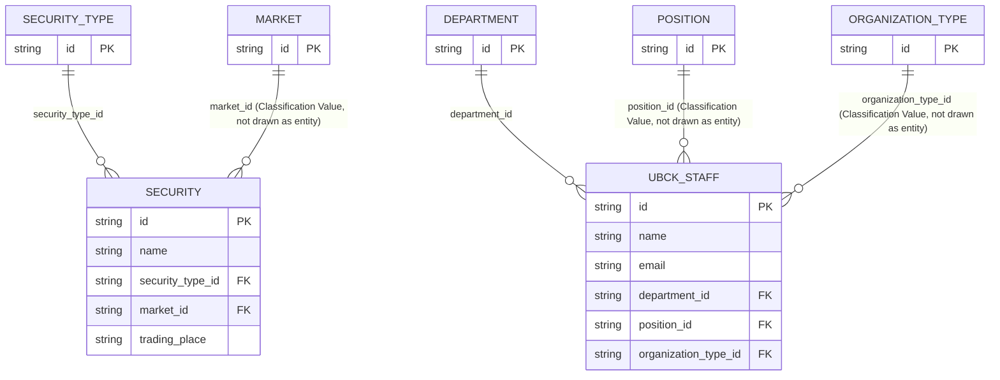
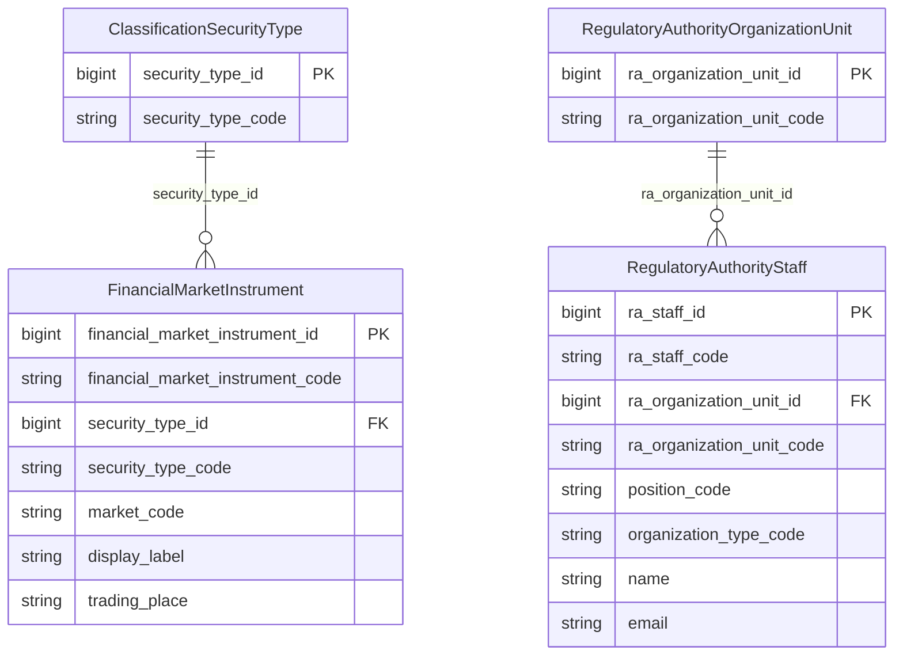

# ECAT HLD — Tier 3

**Source system:** ECAT (Dịch vụ đồng bộ danh mục dùng chung từ HTTT)
**Tier 3:** 2 bảng có FK nghiệp vụ trực tiếp đến Atomic entity mới của Tier 2 (`Classification Security Type`, `Regulatory Authority Organization Unit`): SECURITY (chứng khoán, FK → SECURITY_TYPE) và UBCK_STAFF (nhân sự UBCKNN, FK → DEPARTMENT).

---

## 6a. Bảng tổng quan BCV Concept

| BCV Core Object | BCV Concept | Category | Source Table | Source Table Change Mode | Mô tả bảng nguồn | Atomic Entity | Table Type | BCV Term |
|---|---|---|---|---|---|---|---|---|
| Product | [Product] Financial Market Instrument | Product | SECURITY | Update | Danh mục Chứng khoán | **Financial Market Instrument** | Relative | (1) Term "Financial Market Instrument" (BCV id 12059, category Product): "Identifies a Product that is any financial instrument... available in the financial marketplace... includes currencies, commodities, stocks, bonds" — khớp chính xác ý nghĩa "chứng khoán niêm yết/giao dịch". (2) Cấu trúc trường: NAME + DISPLAY_LABEL + SECURITY_TYPE_ID (FK → `Classification Security Type`, Tier 2) + MARKET_ID (FK → Classification Value `ECAT_MARKET`) + EFFECTIVE + TRADING_PLACE — mỗi dòng là 1 chứng khoán cụ thể (instance thực), không phải danh mục phân loại → đúng bản chất entity Product. (3) Atomic entity mới `Financial Market Instrument` — dùng nguyên BCV Term làm tên entity (không rút gọn), domain_prefix rỗng (chưa có sibling khác trong dự án dùng tên này). Table Type = Relative (phụ thuộc `Classification Security Type` — Fundamental/Relative promoted ở Tier 2). |
| Involved Party | [Involved Party] Employee | Involved Party | UBCK_STAFF | Update | Danh mục nhân sự Ủy ban Chứng khoán Nhà nước | **Regulatory Authority Staff** | Relative | (1) Term "Employee" (BCV id 11518, category Involved Party): "Identifies an Individual who is currently, potentially or previously employed by an Organization" — khớp ý nghĩa "cán bộ UBCKNN". (2) Cấu trúc trường: EMAIL, NAME, PERSONAL_IDENTIFICATION, PHONE_NUMBER, DEPARTMENT_ID (FK → `Regulatory Authority Organization Unit`, Tier 2), POSITION_ID (FK → Classification Value `ECAT_POSITION`), ORGANIZATION_TYPE_ID (FK → Classification Value `ECAT_ORGANIZATION_TYPE`) — entity Involved Party thực (mỗi dòng = 1 cán bộ cụ thể), không phải danh mục. (3) Atomic entity mới `Regulatory Authority Staff` — dùng domain_prefix `Regulatory Authority` (cùng nhóm với entity đã approved `Regulatory Authority Organization Unit`, theo rule #7 "tất cả entity cùng nhóm nghiệp vụ phải chung prefix"). Table Type = Relative (phụ thuộc `Regulatory Authority Organization Unit` — Fundamental). Lưu ý: UBCK_STAFF có audit FK tự tham chiếu (CREATED_BY_ID/UPDATED_BY_ID → UBCK_STAFF.ID chính nó) — đây vẫn là audit trail thông thường, không phải business self-reference. |

---

## 6b. Diagram Source (Mermaid)

> `MARKET`, `POSITION`, `ORGANIZATION_TYPE` chỉ vẽ tối thiểu để thể hiện hướng FK — bản thân là Classification Value (Tier 2, mục 6d), không phải Atomic entity. `SECURITY_TYPE`/`DEPARTMENT` là entity thật (Tier 2).

---

## 6c. Diagram Atomic (Mermaid)

> `market_code`/`position_code`/`organization_type_code` chỉ 1 field (Classification Value, rule #4) — không cặp Id+Code. `security_type_id`/`code` và `ra_organization_unit_id`/`code` là cặp đầy đủ (rule #3, FK đến Fundamental/Relative thật).

---

## 6d. Mục Danh mục & Tham chiếu (Reference Data)

*(Không phát sinh scheme mới ở tier này — SECURITY và UBCK_STAFF chỉ tham chiếu các scheme đã đăng ký ở Tier 2: `ECAT_MARKET`, `ECAT_POSITION`, `ECAT_ORGANIZATION_TYPE`.)*

---

## 6e. Bảng chờ thiết kế

*(Không có.)*

---

## 6f. Điểm cần xác nhận

| # | Câu hỏi | Kết quả |
|---|---|---|
| T3-01 | `SECURITY.TRADING_PLACE` — cột mới theo DDL UAT, ghi chú "thay thế APPLIED_SUBJECT đã loại bỏ". Ý nghĩa nghiệp vụ chính xác của `TRADING_PLACE` (địa điểm giao dịch cụ thể, khác với MARKET đã có FK riêng) cần xác nhận ở LLD. | Chưa xác nhận — quyết định tại LLD. |
| T3-02 | `UBCK_STAFF` chỉ có FK trực tiếp đến DEPARTMENT/POSITION/ORGANIZATION_TYPE trong phạm vi tier này. Các bảng khác trong `brd_ECAT.yaml` có 1-N đến UBCK_STAFF (APPROVED_AUDITORS, FOREIGN_BRANCH, CUSTODIAN_BANK...) đều **ngoài phạm vi "ECAT in scope.txt"** — không ảnh hưởng thiết kế `Regulatory Authority Staff` ở tier này, nhưng cần rà soát lại khi các bảng đó được thiết kế ở tier sau (có thể phát sinh thêm inbound reference, không đổi cấu trúc entity đã có). | Ghi nhận — không cần xử lý ở tier này. |
