# FIMS — HLD Overview: Toàn cảnh thiết kế Atomic Layer

> **Nguồn:** Hệ thống FIMS — Quản lý giám sát và công bố thông tin thành viên thị trường (Oracle)
>
> **Phạm vi:** Đăng ký và theo dõi thành viên thị trường chứng khoán (Công ty QLQ, Công ty CK, Ngân hàng lưu ký, VSDC, Sở GD, CN QLQ NN), nhà đầu tư nước ngoài, người hành nghề chứng khoán, báo cáo định kỳ và sự vụ CBTT, cảnh báo giám sát và vi phạm, ủy quyền CBTT/giao dịch.
>
> **File chi tiết theo tầng:**
> - [FIMS_HLD_Tier1.md](FIMS_HLD_Tier1.md) — Independent Entities: Market Participant Organization, Geographic Area (shared), Foreign Investor, Reporting Template, Reporting Period, Reporting Obligation Type, Warning Parameter
> - [FIMS_HLD_Tier2.md](FIMS_HLD_Tier2.md) — FK đến Tier 1: Foreign FM Branch Organization, Info Disclosure Representative, Market Participant Key Person, Member Periodic Report, Warning Condition
> - [FIMS_HLD_Tier3.md](FIMS_HLD_Tier3.md) — FK đến Tier 2: Foreign Investor Securities Account, Report Import Value, Report Processing Activity Log, Market Participant Conduct Violation, Info Disclosure Authorization, Trading Authorization

---

#### 7a. Bảng tổng quan Atomic entities

| Tier | BCV Core Object | BCV Concept | Category | Source Table | Source Table Change Mode | Mô tả bảng nguồn | Atomic Entity | Table Type | BCV Term |
|---|---|---|---|---|---|---|---|---|---|
| 1 | Involved Party | [Involved Party] Organization | Organization | FUNDCOMPANY | Update | Danh sách công ty quản lý quỹ — đối tượng thành viên thị trường gửi báo cáo | Market Participant Organization | Fundamental | Organization — 7 loại thành viên thị trường (QLQ, CTCK, NHLK, VSDC, Sở GD) có cấu trúc cột tương đồng (tên VN/EN/viết tắt, địa chỉ, phone, email, giấy phép, vốn, trạng thái). Gộp vào 1 entity phân biệt bằng Organization Type Code (ETL-derived). FK đến NATIONAL (Geographic Area). Tách IP Postal Address + IP Electronic Address. |
| 1 | Involved Party | [Involved Party] Organization | Organization | SECURITIESCOMPANY | Update | Danh sách công ty chứng khoán — đối tượng thành viên thị trường | Market Participant Organization | Fundamental | Organization — cùng entity với FUNDCOMPANY, BANKMONI, DEPOSITORYCENTER, STOCKEXCHANGE. Organization Type Code = SECURITIES_COMPANY. |
| 1 | Involved Party | [Involved Party] Organization | Organization | BANKMONI | Update | Danh sách ngân hàng lưu ký giám sát | Market Participant Organization | Fundamental | Organization — cùng entity với FUNDCOMPANY. Organization Type Code = CUSTODIAN_BANK. |
| 1 | Involved Party | [Involved Party] Organization | Organization | DEPOSITORYCENTER | Update | Danh sách Trung tâm lưu ký chứng khoán (VSDC) | Market Participant Organization | Fundamental | Organization — cùng entity với FUNDCOMPANY. Organization Type Code = DEPOSITORY_CENTER. |
| 1 | Involved Party | [Involved Party] Organization | Organization | STOCKEXCHANGE | Update | Danh sách sở giao dịch chứng khoán | Market Participant Organization | Fundamental | Organization — cùng entity với FUNDCOMPANY. Organization Type Code = STOCK_EXCHANGE. |
| 1 | Location | [Location] Geographic Area | Geographic Area | NATIONAL | Update | Danh sách quốc gia/quốc tịch | Geographic Area | Fundamental | Geographic Area — shared entity đã approved từ NHNCK. FIMS.NATIONAL bổ sung source quốc gia (COUNTRY type). Không tạo entity mới — bổ sung source_table vào entry hiện có. |
| 1 | Location | [Location] Geographic Area | Geographic Area | LOCATION | Update | Danh sách tỉnh/thành phố Việt Nam | Geographic Area | Fundamental | Geographic Area — shared entity. FIMS.LOCATION bổ sung source tỉnh/thành phố (PROVINCE type). Không tạo entity mới — bổ sung source_table. |
| 1 | Involved Party | [Involved Party] Individual | Individual | INVESTOR | Update | Danh sách nhà đầu tư nước ngoài (cá nhân và tổ chức) tại Việt Nam | Foreign Investor | Fundamental | Individual — NĐT nước ngoài cá nhân (ObjectType=1) và tổ chức (ObjectType=2) đăng ký hoạt động tại VN theo quy định UBCKNN. Có trường nhận dạng (IdNo/IdDate/IdAdd), địa chỉ, liên lạc. Tách IP Alt Identification. FK đến NATIONAL, SECURITIESCOMPANY, BANKMONI (Classification Value). |
| 1 | Business Activity | [Business Activity] Business Activity | Business Activity | RPTTEMP | Update | Danh sách biểu mẫu báo cáo đầu vào do UBCKNN ban hành | Reporting Template | Fundamental | Business Activity — template biểu mẫu báo cáo định kỳ mà UBCKNN yêu cầu thành viên nộp. Master entity được FK từ RPTMEMBER. Cấu trúc trường: mã biểu mẫu, tên, loại báo cáo, trạng thái, phiên bản. |
| 1 | Business Activity | [Business Activity] Assessment Period | Period | RPTPERIOD | Update | Danh sách kỳ của báo cáo đầu vào (kỳ tháng/quý/năm) | Reporting Period | Fundamental | Assessment Period — kỳ báo cáo định kỳ của biểu mẫu. Mỗi kỳ có ngày bắt đầu, ngày kết thúc, hạn nộp. FK đến RPTTEMP. |
| 1 | Business Activity | [Business Activity] Business Activity | Business Activity | RPT_EVENT_TYPE | Update | Danh sách loại sự vụ/nghĩa vụ báo cáo (CBTT, hồ sơ, báo cáo định kỳ) | Reporting Obligation Type | Fundamental | Business Activity — danh mục loại nghĩa vụ mà thành viên thị trường phải thực hiện theo quy định pháp luật. Ghi nhận mã sự vụ, tên, phân loại, loại nghĩa vụ, căn cứ pháp lý và cờ cho phép tự thiết lập kỳ báo cáo. |
| 1 | Condition | [Condition] Scoring Criterion | Scoring Criterion | PARAWARN | Update | Danh sách tham số cảnh báo giám sát thành viên thị trường | Warning Parameter | Fundamental | Scoring Criterion — tham số cảnh báo giám sát định nghĩa chỉ tiêu theo dõi (có công thức tính cho từng loại thành viên). Là nền tảng cho Warning Condition (Tier 2) và Conduct Violation (Tier 3). |
| 2 | Involved Party | [Involved Party] Organization | Organization | BRANCHS | Update | Danh sách chi nhánh/VPĐD của công ty QLQ nước ngoài tại Việt Nam | Foreign FM Branch Organization | Fundamental | Organization — VPĐD hoặc chi nhánh của công ty QLQ nước ngoài tại VN. Không FK đến FUNDCOMPANY (entity độc lập với thông tin giấy phép riêng, công ty mẹ nước ngoài). Tách IP Postal Address + IP Electronic Address. |
| 2 | Involved Party | [Involved Party] Organization | Organization | INFODISCREPRES | Update | Danh sách đối tượng ủy quyền CBTT/giao dịch (cá nhân và tổ chức) | Info Disclosure Representative | Fundamental | Organization — đại diện CBTT/giao dịch được thành viên thị trường ủy quyền. Cấu trúc cây self-referencing (RepresentedInfodiscrepresId). ProfileKind phân biệt 10 loại đối tượng. FK đến NATIONAL, STATUS. |
| 2 | Involved Party | [Involved Party] Individual Employment Status | Employment Status | TLPROFILES | Update | Danh sách nhân sự chủ chốt tại các tổ chức thành viên thị trường | Market Participant Key Person | Fundamental | Individual Employment Status — nhân sự giữ vị trí quan trọng tại thành viên thị trường (cán bộ chủ chốt, đại diện pháp luật, người hành nghề). FK đa hướng đến FUNDCOMPANY / SECURITIESCOMPANY / BANKMONI / DEPOSITORYCENTER / STOCKEXCHANGE / INFODISCREPRES. Tách IP Alt Identification. |
| 2 | Documentation | [Documentation] Gov. Registration Document | Government Registration Document | RPTMEMBER | Update | Hồ sơ kỳ báo cáo thành viên thị trường — 1 bản ghi per thành viên per kỳ | Member Periodic Report | Fundamental | Gov. Registration Document — báo cáo định kỳ pháp lý của thành viên thị trường gửi UBCKNN. FK đa hướng đến 7 loại thành viên + RPTTEMP + RPTPERIOD + RPT_EVENT_TYPE. Grain = 1 thành viên × 1 kỳ × 1 biểu mẫu. |
| 2 | Condition | [Condition] Scoring Criterion | Scoring Criterion | CDTWARN | Update | Danh sách điều kiện cảnh báo giám sát (ngưỡng min/max cho từng tham số) | Warning Condition | Fundamental | Scoring Criterion — điều kiện cảnh báo cụ thể (ngưỡng FromValue/ToValue, tham số so sánh kép). FK đến Warning Parameter. Là nền tảng cho Conduct Violation (Tier 3). |
| 3 | Arrangement | [Arrangement] Investment Account | Investment Account | SECURITIESACCOUNT | Update | Danh sách tài khoản giao dịch chứng khoán của NĐT nước ngoài | Foreign Investor Securities Account | Relative | Investment Account — tài khoản chứng khoán của NĐT NN mở tại công ty CK. FK đến Foreign Investor + Market Participant Organization (SECURITIESCOMPANY). SCD2. |
| 3 | Documentation | [Documentation] Gov. Registration Document | Government Registration Document | RPTVALUES | Update | Dữ liệu giá trị từng ô trong báo cáo thành viên (bảng phân vùng theo năm) | Report Import Value | Fact Append | Gov. Registration Document — giá trị chi tiết từng cell trong báo cáo định kỳ. FK đến Member Periodic Report + Sheet + Period. Grain = 1 field per báo cáo. ETL: bảng phân vùng năm RPTVALUES_YYYY → consolidate. |
| 3 | Business Activity | [Business Activity] Status Log | Status Log | RPTPROCESS | Update | Lịch sử xử lý báo cáo của chuyên viên UBCKNN (duyệt/từ chối/yêu cầu gửi lại) | Report Processing Activity Log | Fact Append | Business Activity — ETL Pattern Status Log ghi nhận sự kiện xử lý báo cáo của cán bộ UBCKNN. FK đến Member Periodic Report + USERS. Mỗi hành động là 1 sự kiện insert-only. |
| 3 | Business Activity | [Business Activity] Conduct Violation | Conduct Violation | VIOLT | Append | Danh sách vi phạm điều kiện cảnh báo của thành viên thị trường | Market Participant Conduct Violation | Fact Append | Conduct Violation — vi phạm tham số giám sát của thành viên thị trường (QLQ, CTCK, NHLK, VSDC, Sở GD, CN QLQ NN). FK đa hướng đến Market Participant Organization + Warning Parameter + Warning Condition. Source Mode=Append → Fact Append. |
| 3 | Documentation | [Documentation] Gov. Registration Document | Government Registration Document | AUTHOANNOUNCE | Update | Danh sách ủy quyền CBTT — thành viên thị trường ủy quyền cho đại diện CBTT | Info Disclosure Authorization | Fundamental | Gov. Registration Document — giấy ủy quyền CBTT của thành viên thị trường cho Info Disclosure Representative. FK đa hướng đến Market Participant Organization + Info Disclosure Representative. |
| 3 | Documentation | [Documentation] Gov. Registration Document | Government Registration Document | TRADINGAUTHORIZATION | Update | Danh sách ủy quyền giao dịch cho đại diện giao dịch | Trading Authorization | Fundamental | Gov. Registration Document — giấy ủy quyền giao dịch của NĐT NN ủy quyền cho đại diện giao dịch. FK đến Foreign Investor + Market Participant Organization. |

---

#### 7b. Diagram Atomic tổng (Mermaid)

```mermaid
graph TD
    classDef atomic fill:#dcfce7,stroke:#16a34a,color:#14532d
    classDef shared fill:#fae8ff,stroke:#9333ea,color:#4a044e
    classDef pattern fill:#e2e8f0,stroke:#64748b,color:#1e293b

    %% Tier 1
    MKT["**Market Participant Organization**\n(FUNDCOMPANY/SECURITIESCOMPANY/\nBANKMONI/DEPOSITORYCENTER/STOCKEXCHANGE)\n(T1)"]:::atomic
    GEOAREA["**Geographic Area**\n(NATIONAL/LOCATION)\n(T1 — shared)"]:::shared
    FINV["**Foreign Investor**\n(INVESTOR)\n(T1)"]:::atomic
    RTPL["**Reporting Template**\n(RPTTEMP)\n(T1)"]:::atomic
    RPRD["**Reporting Period**\n(RPTPERIOD)\n(T1)"]:::atomic
    ROBTYPE["**Reporting Obligation Type**\n(RPT_EVENT_TYPE)\n(T1)"]:::atomic
    WARN["**Warning Parameter**\n(PARAWARN)\n(T1)"]:::atomic

    %% Shared entities
    ADDR["IP Postal Address"]:::shared
    EADDR["IP Electronic Address"]:::shared
    ALTID["IP Alt Identification"]:::shared

    %% Tier 2
    FBRANCH["**Foreign FM Branch Organization**\n(BRANCHS)\n(T2)"]:::atomic
    IDREP["**Info Disclosure Representative**\n(INFODISCREPRES)\n(T2)"]:::atomic
    KEYP["**Market Participant Key Person**\n(TLPROFILES)\n(T2)"]:::atomic
    RPTMB["**Member Periodic Report**\n(RPTMEMBER)\n(T2)"]:::atomic
    WARNC["**Warning Condition**\n(CDTWARN)\n(T2)"]:::atomic

    %% Tier 3
    INVACC["**Foreign Investor Securities Account**\n(SECURITIESACCOUNT)\n(T3)"]:::atomic
    RPTVAL["**Report Import Value**\n(RPTVALUES)\n(T3)"]:::pattern
    RPTPROC["**Report Processing Activity Log**\n(RPTPROCESS)\n(T3)"]:::pattern
    VIOLT["**Market Participant Conduct Violation**\n(VIOLT)\n(T3)"]:::pattern
    AUTHANN["**Info Disclosure Authorization**\n(AUTHOANNOUNCE)\n(T3)"]:::atomic
    TRADAUTH["**Trading Authorization**\n(TRADINGAUTHORIZATION)\n(T3)"]:::atomic

    %% Tier 1 relationships
    MKT -->|Geographic Area FK| GEOAREA
    FINV -->|Geographic Area FK| GEOAREA
    ADDR -.->|shared| MKT
    EADDR -.->|shared| MKT
    ALTID -.->|shared| FINV

    %% Tier 2
    IDREP -->|self-ref Represented FK| IDREP
    KEYP -->|Market Participant FK| MKT
    RPTMB -->|Reporting Template FK| RTPL
    RPTMB -->|Reporting Period FK| RPRD
    RPTMB -->|Reporting Obligation Type FK| ROBTYPE
    RPTMB -->|Market Participant FK| MKT
    WARNC -->|Warning Parameter FK| WARN
    WARNC -->|Warning Parameter 2 FK| WARN
    ADDR -.->|shared| FBRANCH
    EADDR -.->|shared| FBRANCH

    %% Tier 3
    INVACC -->|Foreign Investor FK| FINV
    INVACC -->|Securities Company FK| MKT
    RPTVAL -->|Member Periodic Report FK| RPTMB
    RPTPROC -->|Member Periodic Report FK| RPTMB
    VIOLT -->|Market Participant FK| MKT
    VIOLT -->|Warning Parameter FK| WARN
    VIOLT -->|Warning Condition FK| WARNC
    AUTHANN -->|Market Participant FK| MKT
    AUTHANN -->|Info Disclosure Representative FK| IDREP
    TRADAUTH -->|Foreign Investor FK| FINV
    TRADAUTH -->|Market Participant FK| MKT
```

---

#### 7c. Bảng Classification Value

| Source Table | Mô tả | BCV Term | Xử lý Atomic |
|---|---|---|---|
| STATUS | Danh mục tình trạng hoạt động của đối tượng (thành viên/NĐT) | Classification Value | Scheme: `FIMS_ACTIVITY_STATUS`. |
| INVESTORTYPE | Danh mục loại nhà đầu tư nước ngoài | Classification Value | Scheme: `FIMS_INVESTOR_TYPE`. |
| COMPANYTYPE | Danh mục loại hình doanh nghiệp | Classification Value | Scheme: `FIMS_COMPANY_TYPE`. |
| STOCKHOLDERTYPE | Danh mục loại cổ đông | Classification Value | Scheme: `FIMS_STOCKHOLDER_TYPE`. |
| SECURITIESTYPE | Danh mục loại chứng khoán | Classification Value | Scheme: `FIMS_SECURITIES_TYPE`. |
| SECURITIES | Danh mục chứng khoán (mã + tên) | Classification Value | Scheme: `FIMS_SECURITIES_CODE`. FK đến SECURITIESTYPE → denormalize. |
| BUSINESS | Danh mục nghiệp vụ kinh doanh | Classification Value | Scheme: `FIMS_BUSINESS_TYPE`. |
| CURRENCY | Danh mục tiền tệ | Classification Value | Scheme: `FIMS_CURRENCY`. |
| DEGREE | Danh mục trình độ học vấn | Classification Value | Scheme: `FIMS_DEGREE`. |
| VIOLATIONTYPE | Danh mục loại vi phạm | Classification Value | Scheme: `FIMS_VIOLATION_TYPE`. |
| REPORTTYPE | Danh mục loại báo cáo | Classification Value | Scheme: `FIMS_REPORT_TYPE`. |
| ANNOUNCETYPE | Danh mục loại CBTT | Classification Value | Scheme: `FIMS_ANNOUNCEMENT_TYPE`. |
| RELATEDPROPERTIES | Danh mục hình thức liên quan (quan hệ ủy quyền) | Classification Value | Scheme: `FIMS_RELATED_PROPERTY`. |
| RELATIONSHIP | Danh mục loại quan hệ | Classification Value | Scheme: `FIMS_RELATIONSHIP_TYPE`. |
| JOBTYPE | Danh mục chức vụ/loại công việc của nhân sự | Classification Value | Scheme: `FIMS_JOB_TYPE`. Dùng trong Market Participant Key Person (denormalize từ TLPROJOB). |
| UNIT | Danh mục đơn vị nội bộ FIMS (phân quyền người dùng) | Classification Value | Scheme: `FIMS_ORG_UNIT`. Chỉ phục vụ phân quyền hệ thống — không có giá trị nghiệp vụ ra ngoài. |

---

#### 7d. Junction Tables

| Source Table | Mô tả | Entity chính | Xử lý trên Atomic |
|---|---|---|---|
| FUNDCOMBUSINES | Liên kết FUNDCOMPANY ↔ BUSINESS (nghiệp vụ KD của QLQ) | Market Participant Organization | Denormalize thành `ARRAY<Classification Value Code>` trên entity cha (business_type_codes). |
| SECCOMBUSINES | Liên kết SECURITIESCOMPANY ↔ BUSINESS (nghiệp vụ KD của CTCK) | Market Participant Organization | Cùng xử lý với FUNDCOMBUSINES — gộp vào cùng trường `business_type_codes`. |
| BRANCHSBUSINES | Liên kết BRANCHS ↔ BUSINESS (nghiệp vụ KD của CN QLQ NN) | Foreign FM Branch Organization | Denormalize thành `ARRAY<Classification Value Code>` trên entity cha. |
| INDIREBUSINESS | Liên kết INFODISCREPRES ↔ BUSINESS (nghiệp vụ KD của người hành nghề) | Info Disclosure Representative | Denormalize thành `ARRAY<Classification Value Code>` trên entity cha. |
| FUNDCOMTYPE | Liên kết FUNDCOMPANY ↔ loại hình công ty | Market Participant Organization | Denormalize thành `ARRAY<Classification Value Code>` — fund_company_type_codes. |
| SECCOMTYPE | Liên kết SECURITIESCOMPANY ↔ loại hình công ty | Market Participant Organization | Cùng trường fund_company_type_codes (sec_company_type_codes). |
| TLPROJOB | Liên kết TLPROFILES ↔ JOBTYPE (chức vụ của nhân sự) | Market Participant Key Person | Denormalize thành `ARRAY<Classification Value Code>` — job_type_codes. |
| TLPROSTOCKH | Liên kết TLPROFILES ↔ STOCKEXCHANGE (loại cổ đông) | Market Participant Key Person | Denormalize thành `ARRAY<STRUCT<stock_exchange_id BIGINT, stock_exchange_code STRING>>`. |
| ANNOUNCEINVES | Liên kết AUTHOANNOUNCE ↔ INVESTOR (NĐT NN ủy quyền) | Info Disclosure Authorization | Denormalize thành `ARRAY<STRUCT<investor_id BIGINT, investor_code STRING>>` trên Info Disclosure Authorization. |
| TRADINGAUTHORIZATIONINVES | Liên kết TRADINGAUTHORIZATION ↔ INVESTOR (NĐT NN trong ủy quyền GD) | Trading Authorization | Denormalize thành `ARRAY<STRUCT<investor_id BIGINT, investor_code STRING>>` trên Trading Authorization. |
| RPTPDSHT | Bảng trung gian RPTPERIOD ↔ SHEET (sheet nào thuộc kỳ nào) | Reporting Period | Denormalize thành `ARRAY<STRUCT<sheet_id BIGINT, sheet_code STRING>>` trên Reporting Period. |

---

#### 7e. Điểm cần xác nhận

| # | Tier | Câu hỏi | Ảnh hưởng |
|---|---|---|---|
| 1 | T1 | `FUNDCOMPANY`, `SECURITIESCOMPANY`, `BANKMONI`, `DEPOSITORYCENTER`, `STOCKEXCHANGE` có cấu trúc cột gần như đồng nhất. Xác nhận gộp 5 bảng thành 1 entity `Market Participant Organization` phân biệt bằng Organization Type Code (ETL-derived). | Quyết định này ảnh hưởng toàn bộ FK downstream (TLPROFILES, RPTMEMBER, VIOLT, AUTHOANNOUNCE). |
| 2 | T1 | `RPTTEMP` + `RPTPERIOD` + `SHEET` — xác nhận đây là template/kỳ nghiệp vụ (không phải config IT). `SHEET` có nên là entity Atomic độc lập (Tier 2, FK đến RPTTEMP) hay denormalize vào RPTTEMP? | Ảnh hưởng RPTPDSHT (junction table) và RPTVALUES (FK đến SHEET). |
| 3 | T2 | `RPTMEMBER.Status` (1=Chưa gửi, 2=Đã gửi, 3=Gửi muộn, 4=Bị hủy, 5=Đã gửi lại) — Change Mode = `Update`. Nhưng nếu cần lịch sử trạng thái → `RPTPROCESS` đã capture; xác nhận grain `RPTMEMBER` là trạng thái hiện tại (SCD4A), không phải Fact Append. | Quyết định Table Type: Fundamental (SCD4A) vs Fact Snapshot. |
| 4 | T2 | `INFODISCREPRES.ProfileKind` = 10 loại khác nhau (Sở GDCK, VSDC, QLQ NN, CTCK, NHLK, đại diện GD, đại diện CBTT, CN, tổ chức khác, cá nhân). Xác nhận gộp vào 1 entity `Info Disclosure Representative` phân biệt bằng Profile Kind Code. | Nếu tách → nhiều entity riêng cho từng loại. Gộp đơn giản hơn nhưng cần xác nhận các loại đủ thuần nhất. |
| 5 | T3 | `RPTVALUES` — Change Mode = `Update` nhưng nghiệp vụ ghi giá trị báo cáo (cell value). Xác nhận: khi thành viên gửi lại → row được update hay insert new? ETL pattern cần làm rõ. | Ảnh hưởng Table Type: Fact Append (immutable) vs Fundamental (SCD4A nếu update). |
| 6 | T3 | `TRADINGAUTHORIZATION` — FK đến `LO` (bảng loại hình quỹ — chưa xác định rõ). Xác nhận LO là Classification Value hay entity ngoài scope. | Nếu LO là entity nghiệp vụ → Trading Authorization cần review tier. |
| 7 | T1 | `RPT_EVENT_TYPE_LEGAL_BASIS`, `RPT_EVENT_TYPE_SCHEDULE`, `RPT_EVENT_TYPE_STATUS_LINK` đều FK đến `BC_SU_VU` (alias RPT_EVENT_TYPE). Xác nhận 3 bảng con này có attribute nghiệp vụ đủ để tạo entity riêng hay chỉ là config metadata của sự vụ. | Nếu chỉ là config → ngoài scope. Nếu có giá trị phân tích (lịch nộp báo cáo) → Tier 2. |
| 8 | T1 | `CLOSING_PRICE_SECURITIES` (giá đóng cửa chứng khoán — Change Mode: Append) — FIMS hay nguồn chuyên biệt khác (HNX/HOSE)? Xác nhận FIMS có phải source gốc của giá chứng khoán không. | Nếu FIMS chỉ nhận data từ sàn → ngoài scope (dữ liệu gốc tại nguồn khác). |

---

#### 7f. Bảng ngoài scope

| Nhóm | Source Table | Mô tả bảng nguồn | Lý do ngoài scope |
|---|---|---|---|
| Operational / System | USERS | Tài khoản người dùng đăng nhập hệ thống FIMS | Operational/system data — không có giá trị nghiệp vụ. |
| Operational / System | USERSMENUS | Phân quyền menu cho từng người dùng | Operational/system data — không có giá trị nghiệp vụ. |
| Operational / System | USERSMENUS_CLONE | Bản sao phân quyền menu người dùng | Operational/system data — không có giá trị nghiệp vụ. |
| Operational / System | USERRPTI | Phân quyền sử dụng biểu mẫu báo cáo đầu vào | Operational/system data — không có giá trị nghiệp vụ. |
| Operational / System | USERRPTO | Phân quyền sử dụng biểu mẫu báo cáo đầu ra | Operational/system data — không có giá trị nghiệp vụ. |
| Operational / System | REFRESHTOKEN | Phiên làm việc (session) của người dùng | Operational/system data — không có giá trị nghiệp vụ. |
| Operational / System | GROUPS | Nhóm người dùng trong hệ thống | Operational/system data — không có giá trị nghiệp vụ. |
| Operational / System | GROUPUSERS | Liên kết người dùng vào nhóm | Operational/system data — không có giá trị nghiệp vụ. |
| Operational / System | GROUPROLES | Phân quyền nhóm theo vai trò | Operational/system data — không có giá trị nghiệp vụ. |
| Operational / System | ROLES | Danh mục vai trò trong hệ thống | Operational/system data — không có giá trị nghiệp vụ. |
| Operational / System | ROLESMENUS | Liên kết vai trò với menu quyền | Operational/system data — không có giá trị nghiệp vụ. |
| Operational / System | MENUS | Danh sách menu/quyền trong hệ thống | Operational/system data — không có giá trị nghiệp vụ. |
| Operational / System | MENUS_BU | Danh sách menu theo đơn vị | Operational/system data — không có giá trị nghiệp vụ. |
| Operational / System | MENU_CLONE | Bản sao danh sách menu | Operational/system data — không có giá trị nghiệp vụ. |
| Operational / System | MODULES | Danh sách module hệ thống | Operational/system data — không có giá trị nghiệp vụ. |
| Operational / System | PERMISSIONS | Danh sách phân quyền chi tiết | Operational/system data — không có giá trị nghiệp vụ. |
| Operational / System | CERTFCATE | Chứng thư số PKI của người dùng | Operational/system data — chứng thư số xác thực, không phải CCHN. |
| Operational / System | USERSESSIONS | Theo dõi tài khoản đang truy cập | Operational/system data — không có giá trị nghiệp vụ. |
| Operational / System | USER_DATA_PERMISSION | Phân quyền dữ liệu của người dùng | Operational/system data — không có giá trị nghiệp vụ. |
| Operational / System | API_MAPPINGS | Cấu hình ánh xạ API | Operational/system data — không có giá trị nghiệp vụ. |
| Operational / System | SHEDLOCK | Bảng khóa lịch tác vụ phân tán | Operational/system data — không có giá trị nghiệp vụ. |
| Audit Log nguồn | AUDIT_LOGS | Nhật ký kiểm toán hệ thống | Audit Log nguồn — cơ chế ghi lịch sử đặc thù source system, không phải sự kiện nghiệp vụ. |
| Audit Log nguồn | ERRORLOG | Lịch sử lỗi hệ thống | Audit Log nguồn — log kỹ thuật, không phải sự kiện nghiệp vụ. |
| Operational / System | DYNAMICCOLUMNS | Cấu hình cột động | Operational/system data — hạ tầng cấu hình biểu mẫu động. |
| Operational / System | DYNAMICCONNECTIONS | Cấu hình kết nối động | Operational/system data — hạ tầng cấu hình biểu mẫu động. |
| Operational / System | DYNAMICTABLES | Cấu hình bảng động | Operational/system data — hạ tầng cấu hình biểu mẫu động. |
| Form Metadata | RPTTEMP | *(xem mục 7a — in scope)* | *(in scope)* |
| Form Metadata | SHEET | Danh sách các sheet trong biểu mẫu báo cáo đầu vào | Cần xác nhận: có thể là Tier 2 entity hoặc denormalize vào Reporting Template. Chờ kết luận mục 7e-2. |
| Form Metadata | RPTPDSHT | Bảng trung gian SHEET ↔ RPTPERIOD | Junction Table — xử lý thành ARRAY trên Reporting Period (xem 7d). |
| Form Metadata | RPTHTORY | Lịch sử thay đổi biểu mẫu báo cáo đầu vào | Audit Log nguồn — lịch sử phiên bản biểu mẫu. Chưa xác định entity Atomic tương ứng. |
| Form Metadata | REPORT_TEMPLATES | Mẫu báo cáo (template file) | Form Metadata — template xuất file báo cáo, không phải entity nghiệp vụ. |
| Form Metadata | FORM_SCHEMAS | Schema biểu mẫu động | Form Metadata — cấu hình biểu mẫu eform, không phải instance data. |
| Form Metadata | FORM_SCHEMA_VERSIONS | Lịch sử phiên bản schema biểu mẫu động | Form Metadata — version control biểu mẫu. |
| Form Metadata | RPT_FIELD_CATALOG | Danh mục trường báo cáo | Form Metadata — cấu hình field biểu mẫu. |
| Form Metadata | RPT_FIELD_CATALOG_USAGE | Thông tin sử dụng trường báo cáo | Form Metadata — usage log của field catalog. |
| Form Metadata | RPT_VALUE_CATALOG | Danh mục giá trị báo cáo | Form Metadata — danh mục giá trị cho dropdown trong biểu mẫu. |
| Form Metadata | SELFSETPD | Cấu hình kỳ báo cáo do cán bộ UB tự thiết lập | Form Metadata — cấu hình kỳ đặc biệt gắn với biểu mẫu. |
| Form Metadata | RPTTPOUT | Danh sách biểu mẫu báo cáo đầu ra | Form Metadata — template báo cáo đầu ra UBCK tự xuất. |
| Form Metadata | SHEETOUT | Danh sách sheet của báo cáo đầu ra | Form Metadata — cấu hình sheet output. |
| Form Metadata | TPOUTHTORY | Lịch sử thay đổi biểu mẫu báo cáo đầu ra | Form Metadata — version control biểu mẫu output. |
| Operational / System | RPTOUTMANAGEMENT | Cấu hình gen file thống kê tự động | Operational/system data — config tác vụ sinh file tự động. |
| Operational / System | RPTOUTFILESAVE | Danh sách file thống kê đã gen tự động | Operational/system data — danh sách file output. |
| Operational / System | RPTVALUESMANAGERMENT | Quản lý bảng phân vùng lưu giá trị báo cáo | Operational/system data — metadata quản lý partition. |
| Reference Data | SYSVAR | Tham số cấu hình hệ thống | Operational/system data — config hệ thống. |
| Reference Data | CALENDAR | Lịch hệ thống | Operational/system data — lịch ngày làm việc phục vụ tính hạn nộp. |
| Reference Data | CALENDARMANAGERMENT | Thay đổi lịch hệ thống | Operational/system data — log thay đổi lịch. |
| Audit Log nguồn | INVESTORHIS | Lịch sử thông tin nhà đầu tư nước ngoài | Audit Log nguồn — bảng snapshot lịch sử thông tin NĐT; thông tin hiện tại lấy từ INVESTOR. Nếu cần lịch sử → ETL parsing từ INVESTORHIS vào cột tường minh của entity. |
| Audit Log nguồn | SECURITIESACCOUNTHIS | Lịch sử tài khoản chứng khoán NĐT NN | Audit Log nguồn — snapshot lịch sử tài khoản. |
| Audit Log nguồn | CATEGORIESSTOCKHIS | Lịch sử sở hữu chứng khoán NĐT NN | Audit Log nguồn — snapshot lịch sử danh mục. |
| Audit Log nguồn | AUTHOANNOUNCEHIS | Lịch sử ủy quyền CBTT | Audit Log nguồn — snapshot lịch sử ủy quyền CBTT. |
| Audit Log nguồn | ANNOUNCEINVESHIS | Lịch sử NĐT NN trong ủy quyền CBTT | Audit Log nguồn — snapshot lịch sử thành viên ủy quyền. |
| Audit Log nguồn | TRADINGAUTHORIZATIONHIS | Lịch sử ủy quyền giao dịch | Audit Log nguồn — snapshot lịch sử ủy quyền giao dịch. |
| Audit Log nguồn | TRADINGAUTHORIZATIONINVESHIS | Lịch sử NĐT NN trong ủy quyền giao dịch | Audit Log nguồn — snapshot lịch sử thành viên ủy quyền giao dịch. |
| Cascade drop | CATEGORIESSTOCK | Danh mục chứng khoán của NĐT NN (sở hữu hiện tại) | Cascade drop từ INVESTOR — thông tin danh mục chứng khoán gắn với NĐT NN; cần xác nhận thêm trước khi quyết định scope. |
| Cascade drop | ANNOUNCEINVES | Danh sách NĐT NN trong ủy quyền CBTT | Cascade drop từ AUTHOANNOUNCE — denormalize thành ARRAY trên Info Disclosure Authorization (xem 7d). |
| Cascade drop | TRADINGAUTHORIZATIONINVES | Danh sách NĐT NN trong ủy quyền giao dịch | Cascade drop từ TRADINGAUTHORIZATION — denormalize thành ARRAY trên Trading Authorization (xem 7d). |
| Operational / System | NOTIFICATION | Thông báo trong hệ thống FIMS | Operational/system data — thông báo UI, không phải nghiệp vụ. |
| Operational / System | DOCUMENT | Tài liệu hệ thống | Operational/system data — lưu trữ tài liệu hạ tầng. |
| Operational / System | EMAILSENTSYSTEM | Danh sách email trao đổi thông tin | Operational/system data — log giao tiếp email. |
| Operational / System | SYSEMAIL | Danh sách trao đổi thông tin qua mail | Operational/system data — log email nội bộ. |
| Operational / System | SYSTEMINTEGRATIONCONFIG | Cấu hình kết nối tích hợp hệ thống | Operational/system data — config kết nối MSS/ngoài. |
| Operational / System | SYSTEMINTEGRATIONDATA | Dữ liệu kết nối MSS | Operational/system data — log giao tiếp tích hợp. |
| Chưa có cột | RPT_EVENT_TYPE_LEGAL_BASIS | Danh sách căn cứ pháp lý của loại sự vụ | Chưa có thông tin cột đầy đủ — xem điểm 7e-7 để xác nhận scope. |
| Chưa có cột | RPT_EVENT_TYPE_SCHEDULE | Lịch nộp báo cáo theo loại sự vụ | Chưa có thông tin cột đầy đủ — xem điểm 7e-7 để xác nhận scope. |
| Chưa có cột | RPT_EVENT_TYPE_STATUS_LINK | Liên kết trạng thái loại sự vụ | Chưa có thông tin cột đầy đủ — xem điểm 7e-7 để xác nhận scope. |
| Isolated | CLOSING_PRICE_SECURITIES | Giá đóng cửa chứng khoán | Xem điểm 7e-8 — xác nhận nguồn gốc dữ liệu trước khi quyết định scope. |
| Isolated | ANNOUNCE | Tin CBTT của thành viên thị trường | Cần đánh giá lại — FK đến nhiều loại thành viên và RPT_EVENT_TYPE. Xem điểm 7e sau khi xác nhận. |
| Reference Data | DEPARTMENT | Danh mục phòng ban nội bộ FIMS (phân quyền) | Không có quan hệ FK đến bảng nghiệp vụ nào — phục vụ phân quyền người dùng hệ thống FIMS, không phải thành viên thị trường. |

<!--
GRAIN: 1 dòng = 1 bảng nguồn. KHÔNG gộp `table1, table2`.
GROUP: dùng từ danh sách chuẩn (xem reference/group_classification.md).
-->

---

## Entities

> Single source of truth cho metadata entity. `aggregate_atomic.py` parse section này để sinh `atomic_entities.yaml`.
> Format bắt buộc: heading `### N.` + dòng `**Description:**` trong 500 ký tự đầu tiên sau heading.

### 1. Market Participant Organization
**Tier:** 1 | **Source:** `FUNDCOMPANY, SECURITIESCOMPANY, BANKMONI, DEPOSITORYCENTER, STOCKEXCHANGE` | **BCV Concept:** [Involved Party] Organization | **BCO:** Involved Party | **Table Type:** Fundamental
**Description:** Tổ chức thành viên thị trường chứng khoán được UBCKNN giám sát — công ty quản lý quỹ, công ty chứng khoán, ngân hàng lưu ký, Trung tâm lưu ký (VSDC) và sở giao dịch chứng khoán. Phân biệt bằng Organization Type Code (ETL-derived). Ghi nhận tên, địa chỉ, giấy phép hoạt động, vốn điều lệ và trạng thái.

### 2. Geographic Area
**Tier:** 1 | **Source:** `NATIONAL, LOCATION` | **BCV Concept:** [Location] Geographic Area | **BCO:** Location | **Table Type:** Fundamental
**Description:** Đơn vị địa lý dùng làm FK tham chiếu — quốc gia/quốc tịch (NATIONAL) và tỉnh/thành phố Việt Nam (LOCATION). Shared entity từ NHNCK; FIMS bổ sung source_table vào entry hiện có, không tạo entity mới.

### 3. Foreign Investor
**Tier:** 1 | **Source:** `INVESTOR` | **BCV Concept:** [Involved Party] Individual | **BCO:** Involved Party | **Table Type:** Fundamental
**Description:** Nhà đầu tư nước ngoài (cá nhân và tổ chức) được UBCKNN quản lý tại Việt Nam. Ghi nhận loại đối tượng (cá nhân/tổ chức), mã giao dịch VSDC, thông tin nhân thân/doanh nghiệp, tài khoản lưu ký và trạng thái hoạt động.

### 4. Reporting Template
**Tier:** 1 | **Source:** `RPTTEMP` | **BCV Concept:** [Business Activity] Business Activity | **BCO:** Business Activity | **Table Type:** Fundamental
**Description:** Biểu mẫu báo cáo định kỳ do UBCKNN ban hành mà các thành viên thị trường có nghĩa vụ nộp. Ghi nhận mã biểu mẫu, tên, loại báo cáo, trạng thái và phiên bản áp dụng.

### 5. Reporting Period
**Tier:** 1 | **Source:** `RPTPERIOD` | **BCV Concept:** [Business Activity] Assessment Period | **BCO:** Business Activity | **Table Type:** Fundamental
**Description:** Kỳ báo cáo định kỳ gắn với biểu mẫu — xác định ngày bắt đầu, ngày kết thúc và hạn nộp. FK đến Reporting Template. Mỗi kỳ có thể có nhiều sheet hoặc cấu hình sheet riêng.

### 6. Reporting Obligation Type
**Tier:** 1 | **Source:** `RPT_EVENT_TYPE` | **BCV Concept:** [Business Activity] Business Activity | **BCO:** Business Activity | **Table Type:** Fundamental
**Description:** Loại sự vụ/nghĩa vụ báo cáo mà thành viên thị trường phải thực hiện theo quy định pháp luật (định kỳ, bất thường, theo yêu cầu). Ghi nhận mã sự vụ, tên, phân loại nghĩa vụ (báo cáo/CBTT/hồ sơ), căn cứ pháp lý và quy tắc tính hạn nộp.

### 7. Warning Parameter
**Tier:** 1 | **Source:** `PARAWARN` | **BCV Concept:** [Condition] Scoring Criterion | **BCO:** Condition | **Table Type:** Fundamental
**Description:** Tham số cảnh báo giám sát thành viên thị trường theo quy định pháp luật — định nghĩa chỉ tiêu theo dõi cùng công thức tính cho từng loại đối tượng. Là nền tảng cho Warning Condition và Conduct Violation.

### 8. Foreign FM Branch Organization
**Tier:** 2 | **Source:** `BRANCHS` | **BCV Concept:** [Involved Party] Organization | **BCO:** Involved Party | **Table Type:** Fundamental
**Description:** Chi nhánh hoặc văn phòng đại diện của công ty quản lý quỹ nước ngoài tại Việt Nam. Entity độc lập (không FK đến Market Participant Organization) — có giấy phép riêng, thông tin công ty mẹ nước ngoài và nghiệp vụ kinh doanh đăng ký.

### 9. Info Disclosure Representative
**Tier:** 2 | **Source:** `INFODISCREPRES` | **BCV Concept:** [Involved Party] Organization | **BCO:** Involved Party | **Table Type:** Fundamental
**Description:** Đại diện công bố thông tin hoặc đại diện giao dịch được thành viên thị trường ủy quyền. Phân biệt bằng Profile Kind Code (10 loại: Sở GD, VSDC, QLQ NN, CTCK, NHLK, đại diện GD, đại diện CBTT, chi nhánh, tổ chức khác, cá nhân). Cấu trúc self-referencing.

### 10. Market Participant Key Person
**Tier:** 2 | **Source:** `TLPROFILES` | **BCV Concept:** [Involved Party] Individual Employment Status | **BCO:** Involved Party | **Table Type:** Fundamental
**Description:** Nhân sự chủ chốt tại tổ chức thành viên thị trường chứng khoán — cán bộ đăng ký với UBCKNN, ghi nhận thông tin nhân thân, ngày làm việc, chức vụ và chứng chỉ hành nghề. FK đa hướng đến Market Participant Organization.

### 11. Member Periodic Report
**Tier:** 2 | **Source:** `RPTMEMBER` | **BCV Concept:** [Documentation] Gov. Registration Document | **BCO:** Documentation | **Table Type:** Fundamental
**Description:** Hồ sơ kỳ báo cáo định kỳ của thành viên thị trường nộp lên UBCKNN. Grain = 1 thành viên × 1 kỳ × 1 biểu mẫu. Ghi nhận trạng thái nộp, ngày nộp thực tế, hạn nộp và loại sự vụ liên quan. FK đa hướng đến 7 loại thành viên.

### 12. Warning Condition
**Tier:** 2 | **Source:** `CDTWARN` | **BCV Concept:** [Condition] Scoring Criterion | **BCO:** Condition | **Table Type:** Fundamental
**Description:** Điều kiện cảnh báo cụ thể xác định ngưỡng vi phạm cho từng tham số giám sát — ngưỡng tối thiểu/tối đa, điều kiện kép và số ngày vi phạm liên tiếp. FK đến Warning Parameter.

### 13. Foreign Investor Securities Account
**Tier:** 3 | **Source:** `SECURITIESACCOUNT` | **BCV Concept:** [Arrangement] Investment Account | **BCO:** Arrangement | **Table Type:** Relative
**Description:** Tài khoản giao dịch chứng khoán của nhà đầu tư nước ngoài mở tại công ty chứng khoán. Ghi nhận số tài khoản và nơi mở. FK đến Foreign Investor và Market Participant Organization (SECURITIESCOMPANY).

### 14. Report Import Value
**Tier:** 3 | **Source:** `RPTVALUES` | **BCV Concept:** [Documentation] Gov. Registration Document | **BCO:** Documentation | **Table Type:** Fact Append
**Description:** Giá trị chi tiết từng ô (cell) trong báo cáo định kỳ thành viên. Grain = 1 field × 1 báo cáo thành viên. Nguồn phân vùng theo năm (RPTVALUES_YYYY) — ETL consolidate toàn bộ vào entity đơn nhất.

### 15. Report Processing Activity Log
**Tier:** 3 | **Source:** `RPTPROCESS` | **BCV Concept:** [Business Activity] Status Log | **BCO:** Business Activity | **Table Type:** Fact Append
**Description:** Nhật ký xử lý báo cáo của chuyên viên UBCKNN — ghi nhận từng hành động duyệt/từ chối/yêu cầu gửi lại kèm ghi chú. Mỗi dòng là 1 sự kiện insert-only. FK đến Member Periodic Report.

### 16. Market Participant Conduct Violation
**Tier:** 3 | **Source:** `VIOLT` | **BCV Concept:** [Business Activity] Conduct Violation | **BCO:** Business Activity | **Table Type:** Fact Append
**Description:** Vi phạm điều kiện cảnh báo giám sát của thành viên thị trường chứng khoán được UBCKNN ghi nhận. FK đa hướng đến Market Participant Organization, Warning Parameter và Warning Condition. Mỗi dòng là 1 sự kiện vi phạm.

### 17. Info Disclosure Authorization
**Tier:** 3 | **Source:** `AUTHOANNOUNCE` | **BCV Concept:** [Documentation] Gov. Registration Document | **BCO:** Documentation | **Table Type:** Fundamental
**Description:** Giấy ủy quyền công bố thông tin của thành viên thị trường cho Info Disclosure Representative. Ghi nhận thời hạn ủy quyền, phạm vi và hình thức liên quan. FK đến Market Participant Organization và Info Disclosure Representative.

### 18. Trading Authorization
**Tier:** 3 | **Source:** `TRADINGAUTHORIZATION` | **BCV Concept:** [Documentation] Gov. Registration Document | **BCO:** Documentation | **Table Type:** Fundamental
**Description:** Giấy ủy quyền giao dịch của nhà đầu tư nước ngoài cho đại diện giao dịch tại thành viên thị trường. Ghi nhận phạm vi ủy quyền và thời hạn. FK đến Foreign Investor và Market Participant Organization.
